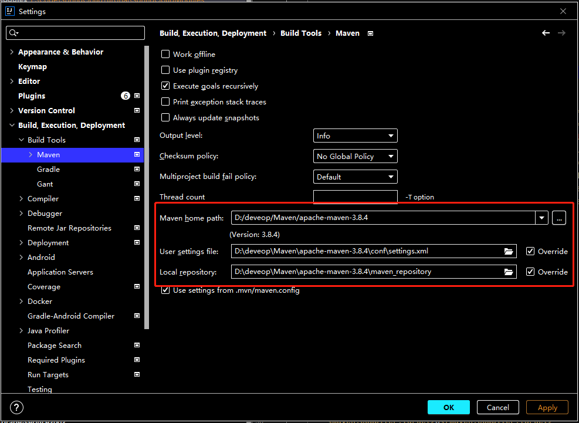

## SpringBoot和SpringCloud版本关系

参考：https://spring.io/projects/spring-cloud


## SpringBoot和spring-cloud-alibaba版本关系

参考：https://github.com/alibaba/spring-cloud-alibaba/wiki/%E7%89%88%E6%9C%AC%E8%AF%B4%E6%98%8E


## 详细版本对应信息查看

参考https://start.spring.io/actuator/info

格式化后的json如下：

```json
{
	"git": {
		"branch": "ecd91085149b857e79c1e7ed058975e161485378",
		"commit": {
			"id": "ecd9108",
			"time": "2022-03-25T09:37:50Z"
		}
	},
	"build": {
		"version": "0.0.1-SNAPSHOT",
		"artifact": "start-site",
		"versions": {
			"spring-boot": "2.6.5",
			"initializr": "0.13.0-SNAPSHOT"
		},
		"name": "start.spring.io website",
		"time": "2022-03-25T09:39:45.761Z",
		"group": "io.spring.start"
	},
	"bom-ranges": {
		"azure": {
			"3.2.0": "Spring Boot >=2.3.0.M1 and <2.4.0-M1",
			"3.5.0": "Spring Boot >=2.4.0.M1 and <2.5.0-M1",
			"3.14.0": "Spring Boot >=2.5.0.M1 and <2.7.0-M1"
		},
		"codecentric-spring-boot-admin": {
			"2.4.3": "Spring Boot >=2.3.0.M1 and <2.5.0-M1",
			"2.5.5": "Spring Boot >=2.5.0.M1 and <2.6.0-M1",
			"2.6.2": "Spring Boot >=2.6.0.M1 and <2.7.0-M1"
		},
		"solace-spring-boot": {
			"1.1.0": "Spring Boot >=2.3.0.M1 and <2.6.0-M1"
		},
		"solace-spring-cloud": {
			"1.1.1": "Spring Boot >=2.3.0.M1 and <2.4.0-M1",
			"2.1.0": "Spring Boot >=2.4.0.M1 and <2.6.0-M1"
		},
        <!--spring-cloud相关-->
		"spring-cloud": {
			"Hoxton.SR12": "Spring Boot >=2.2.0.RELEASE and <2.4.0.M1",
			"2020.0.5": "Spring Boot >=2.4.0.M1 and <2.6.0-M1",
			"2021.0.0-M1": "Spring Boot >=2.6.0-M1 and <2.6.0-M3",
			"2021.0.0-M3": "Spring Boot >=2.6.0-M3 and <2.6.0-RC1",
			"2021.0.0-RC1": "Spring Boot >=2.6.0-RC1 and <2.6.1",
			"2021.0.1": "Spring Boot >=2.6.1 and <2.6.6-SNAPSHOT",
			"2021.0.2-SNAPSHOT": "Spring Boot >=2.6.6-SNAPSHOT and <3.0.0-M1",
			"2022.0.0-M1": "Spring Boot >=3.0.0-M1 and <3.1.0-M1"
		},
		"spring-cloud-gcp": {
			"2.0.8": "Spring Boot >=2.4.0-M1 and <2.6.0-M1",
			"3.1.0": "Spring Boot >=2.6.0-M1 and <2.7.0-M1"
		},
		"spring-cloud-services": {
			"2.3.0.RELEASE": "Spring Boot >=2.3.0.RELEASE and <2.4.0-M1",
			"2.4.1": "Spring Boot >=2.4.0-M1 and <2.5.0-M1",
			"3.3.0": "Spring Boot >=2.5.0-M1 and <2.6.0-M1",
			"3.4.0": "Spring Boot >=2.6.0-M1 and <2.7.0-M1"
		},
		"spring-geode": {
			"1.3.12.RELEASE": "Spring Boot >=2.3.0.M1 and <2.4.0-M1",
			"1.4.13": "Spring Boot >=2.4.0-M1 and <2.5.0-M1",
			"1.5.11": "Spring Boot >=2.5.0-M1 and <2.6.0-M1",
			"1.6.5": "Spring Boot >=2.6.0-M1 and <2.7.0-M1",
			"1.7.0-M3": "Spring Boot >=2.7.0-M1 and <3.0.0-M1",
			"2.0.0-M2": "Spring Boot >=3.0.0-M1 and <3.1.0-M1"
		},
		"vaadin": {
			"14.8.6": "Spring Boot >=2.1.0.RELEASE and <2.6.0-M1",
			"23.0.2": "Spring Boot >=2.6.0-M1 and <2.8.0-M1"
		},
		"wavefront": {
			"2.0.2": "Spring Boot >=2.1.0.RELEASE and <2.4.0-M1",
			"2.1.1": "Spring Boot >=2.4.0-M1 and <2.5.0-M1",
			"2.2.2": "Spring Boot >=2.5.0-M1 and <2.7.0-M1"
		}
	},
	"dependency-ranges": {
		"native": {
			"0.9.0": "Spring Boot >=2.4.3 and <2.4.4",
			"0.9.1": "Spring Boot >=2.4.4 and <2.4.5",
			"0.9.2": "Spring Boot >=2.4.5 and <2.5.0-M1",
			"0.10.0": "Spring Boot >=2.5.0-M1 and <2.5.2",
			"0.10.1": "Spring Boot >=2.5.2 and <2.5.3",
			"0.10.2": "Spring Boot >=2.5.3 and <2.5.4",
			"0.10.3": "Spring Boot >=2.5.4 and <2.5.5",
			"0.10.4": "Spring Boot >=2.5.5 and <2.5.6",
			"0.10.5": "Spring Boot >=2.5.6 and <2.5.9",
			"0.10.6": "Spring Boot >=2.5.9 and <2.6.0-M1",
			"0.11.0-M1": "Spring Boot >=2.6.0-M1 and <2.6.0-RC1",
			"0.11.0-M2": "Spring Boot >=2.6.0-RC1 and <2.6.0",
			"0.11.0-RC1": "Spring Boot >=2.6.0 and <2.6.1",
			"0.11.0": "Spring Boot >=2.6.1 and <2.6.2",
			"0.11.1": "Spring Boot >=2.6.2 and <2.6.3",
			"0.11.2": "Spring Boot >=2.6.3 and <2.6.4",
			"0.11.3": "Spring Boot >=2.6.4 and <2.6.6-SNAPSHOT",
			"0.11.4-SNAPSHOT": "Spring Boot >=2.6.6-SNAPSHOT and <2.7.0-M1"
		},
		"okta": {
			"1.4.0": "Spring Boot >=2.2.0.RELEASE and <2.4.0-M1",
			"1.5.1": "Spring Boot >=2.4.0-M1 and <2.4.1",
			"2.0.1": "Spring Boot >=2.4.1 and <2.5.0-M1",
			"2.1.5": "Spring Boot >=2.5.0-M1 and <2.7.0-M1"
		},
		"mybatis": {
			"2.1.4": "Spring Boot >=2.1.0.RELEASE and <2.5.0-M1",
			"2.2.2": "Spring Boot >=2.5.0-M1"
		},
		"camel": {
			"3.5.0": "Spring Boot >=2.3.0.M1 and <2.4.0-M1",
			"3.10.0": "Spring Boot >=2.4.0.M1 and <2.5.0-M1",
			"3.13.0": "Spring Boot >=2.5.0.M1 and <2.6.0-M1",
			"3.15.0": "Spring Boot >=2.6.0.M1 and <2.7.0-M1"
		},
		"picocli": {
			"4.6.3": "Spring Boot >=2.4.0.RELEASE and <3.0.0-M1"
		},
		"open-service-broker": {
			"3.2.0": "Spring Boot >=2.3.0.M1 and <2.4.0-M1",
			"3.3.1": "Spring Boot >=2.4.0-M1 and <2.5.0-M1",
			"3.4.0-M2": "Spring Boot >=2.5.0-M1 and <2.6.0-M1"
		}
	}
}
```

## SpringCloud官方参考文档

Spring Cloud总览:https://spring.io/projects/spring-cloud#learn

Spring Cloud Hoxton.SR9版本:https://docs.spring.io/spring-cloud/docs/Hoxton.SR9/reference/html/

Spring Cloud中文文档:https://www.bookstack.cn/read/spring-cloud-docs/docs-index.md

## 配置父工程SpringCloudParent


> 本系列使用的版本是spring boot 2.3.2.RELEASE,Spring Cloud Hoxton.SR9,spring cloud alibaba 2.2.6.RELEASE,nacos1.4.2,Seata 1.3.0,rabbitmq_server-3.9.14。

使用pom.xml 中的dependencyManagement 元素能让所有在子项目中引用一个依赖而不用显式的列出版本号。Maven 会沿着父子层次向上走，直到找到一个拥有dependencyManagement 元素的项目，然后它就会使用这个dependencyManagement 元素中指定的版本号。


这样做的好处就是：如果有多个子项目都引用同一样依赖，则可以避免在每个使用的子项目里都声明一个版本号，这样当想升级或切换到另一个版本时，只需要在顶层父容器里更新，而不需要一个一个子项目的修改 ；另外如果某个子项目需要另外的一个版本，只需要声明version就可。

**注意:**

*     **dependencyManagement里只是声明依赖，并不实现引入，因此子项目需要显示的声明需要用的依赖**
*     **如果不在子项目中声明依赖，是不会从父项目中继承下来的；只有在子项目中写了该依赖项，并且没有指定具体版本，才会从父项目中继承该项，并且version和scope都读取自父pom**
*     **如果子项目中指定了版本号，那么会使用子项目中指定的jar版本**

1. 新建maven工程并配置pom.xml

```xml
<?xml version="1.0" encoding="UTF-8"?>
<project xmlns="http://maven.apache.org/POM/4.0.0"
         xmlns:xsi="http://www.w3.org/2001/XMLSchema-instance"
         xsi:schemaLocation="http://maven.apache.org/POM/4.0.0 http://maven.apache.org/xsd/maven-4.0.0.xsd">
    <modelVersion>4.0.0</modelVersion>

    <groupId>com.hashnode</groupId>
    <artifactId>SpringCloudParent</artifactId>
    <version>1.0-SNAPSHOT</version>
    <packaging>pom</packaging>

    <properties>
        <maven.compiler.source>8</maven.compiler.source>
        <maven.compiler.target>8</maven.compiler.target>
        <project.build.sourceEncoding>UTF-8</project.build.sourceEncoding>
        <junit.version>4.12</junit.version>
        <log4j.version>1.2.17</log4j.version>
        <lombok.version>1.16.18</lombok.version>
        <mysql.version>5.1.47</mysql.version>
        <druid.version>1.1.16</druid.version>
        <mybatis.spring.boot.version>2.1.4</mybatis.spring.boot.version>
        <bootstrap.version>4.5.3</bootstrap.version>
        <lombok.version>1.18.20</lombok.version>
    </properties>

    <!--给子工程使用，使子项目中引用一个依赖不用显示的列出版本号，Maven会沿着层次向上走，直到找到一个拥有dependencyManagement
    元素的项目，然后使用dependencyManagement元素中指定的版本号，注意此标签不会使下面的dependency自动导入-->
    <dependencyManagement>
        <dependencies>
            <!--spring boot 2.3.2.RELEASE-->
            <dependency>
                <groupId>org.springframework.boot</groupId>
                <artifactId>spring-boot-dependencies</artifactId>
                <version>2.3.2.RELEASE</version>
                <type>pom</type>
                <scope>import</scope>
            </dependency>

            <!--spring cloud Hoxton.SR9-->
            <dependency>
                <groupId>org.springframework.cloud</groupId>
                <artifactId>spring-cloud-dependencies</artifactId>
                <version>Hoxton.SR9</version>
                <type>pom</type>
                <scope>import</scope>
            </dependency>

            <!--spring cloud alibaba 2.2.6.RELEASE-->
            <dependency>
                <groupId>com.alibaba.cloud</groupId>
                <artifactId>spring-cloud-alibaba-dependencies</artifactId>
                <version>2.2.6.RELEASE</version>
                <type>pom</type>
                <scope>import</scope>
            </dependency>

            <!--mysql-->
            <dependency>
                <groupId>mysql</groupId>
                <artifactId>mysql-connector-java</artifactId>
                <version>${mysql.version}</version>
                <scope>runtime</scope>
            </dependency>
            <!-- druid-->
            <dependency>
                <groupId>com.alibaba</groupId>
                <artifactId>druid</artifactId>
                <version>${druid.version}</version>
            </dependency>
            <!-- mybatis-->
            <dependency>
                <groupId>org.mybatis.spring.boot</groupId>
                <artifactId>mybatis-spring-boot-starter</artifactId>
                <version>${mybatis.spring.boot.version}</version>
            </dependency>
            <!--junit-->
            <dependency>
                <groupId>junit</groupId>
                <artifactId>junit</artifactId>
                <version>${junit.version}</version>
            </dependency>
            <!--log4j-->
            <dependency>
                <groupId>log4j</groupId>
                <artifactId>log4j</artifactId>
                <version>${log4j.version}</version>
            </dependency>

            <!--        添加Bootstrap WarJar的依赖-->
            <dependency>
                <groupId>org.webjars</groupId>
                <artifactId>bootstrap</artifactId>
                <version>${bootstrap.version}</version>
            </dependency>

            <!-- https://mvnrepository.com/artifact/org.projectlombok/lombok -->
            <dependency>
                <groupId>org.projectlombok</groupId>
                <artifactId>lombok</artifactId>
                <version>${lombok.version}</version>
                <scope>provided</scope>
            </dependency>


        </dependencies>

    </dependencyManagement>


    <build>
        <plugins>
            <!--mybatis逆向工程插件-->
            <plugin>
                <groupId>org.mybatis.generator</groupId>
                <artifactId>mybatis-generator-maven-plugin</artifactId>
                <version>1.3.6</version>
                <configuration>
                    <!--配置文件的位置-->
                    <configurationFile>GeneratorMapper.xml</configurationFile>
                    <verbose>true</verbose>
                    <overwrite>true</overwrite>
                </configuration>
            </plugin>
        </plugins>
    </build>


</project>
```

**注意:**

+ **com.mysql.jdbc.Driver和mysql-connector-java 5一起用。**
+ **com.mysql.cj.jdbc.Driver和mysql-connector-java 6 一起用。**

2. 安装


此时maven仓库中会有刚刚生成的pom组件：


在子工程可以这样使用:

```java
    <parent>
        <groupId>com.hashnode</groupId>
        <artifactId>SpringCloudParent</artifactId>
        <version>1.0-SNAPSHOT</version>
    </parent>
```

## IDEA新建空项目SpringCloudModules用于存放微服务模块

为了便于管理,以后所有的子模块都放在工作空间SpringCloudModules中,SpringCloudModules的Gitee地址:https://gitee.com/codinginn/SpringCloudTurorial/tree/master/SpringCloudModules

1. New Project


2. 总父工程名字


3. Maven版本选择



3. 设置字符编码


4. java编译版本选1.8


5. 设置pom

   将SpringCloudModules的父pom设置为刚刚新建的SpringCloudParent,便于版本管理:

```xml
<?xml version="1.0" encoding="UTF-8"?>
<project xmlns="http://maven.apache.org/POM/4.0.0"
         xmlns:xsi="http://www.w3.org/2001/XMLSchema-instance"
         xsi:schemaLocation="http://maven.apache.org/POM/4.0.0 http://maven.apache.org/xsd/maven-4.0.0.xsd">
    <modelVersion>4.0.0</modelVersion>
    <packaging>pom</packaging>
    <modules>
    </modules>

    <parent>
        <groupId>com.hashnode</groupId>
        <artifactId>SpringCloudParent</artifactId>
        <version>1.0-SNAPSHOT</version>
    </parent>

    <artifactId>SpringCloudModules</artifactId>

    <properties>
        <maven.compiler.source>8</maven.compiler.source>
        <maven.compiler.target>8</maven.compiler.target>
    </properties>


</project>
```

## Rest微服务工程构建

### payment模块

#### 1. 新建001-cloud-provider-payment-eureka-8001模块


#### 2. 改POM

```XML
<?xml version="1.0" encoding="UTF-8"?>
<project xmlns="http://maven.apache.org/POM/4.0.0"
         xmlns:xsi="http://www.w3.org/2001/XMLSchema-instance"
         xsi:schemaLocation="http://maven.apache.org/POM/4.0.0 http://maven.apache.org/xsd/maven-4.0.0.xsd">
    <parent>
        <artifactId>SpringCloudModules</artifactId>
        <groupId>com.hashnode</groupId>
        <version>1.0-SNAPSHOT</version>
    </parent>
    <modelVersion>4.0.0</modelVersion>

    <artifactId>001-cloud-provider-payment-eureka-8001</artifactId>

    <properties>
        <maven.compiler.source>8</maven.compiler.source>
        <maven.compiler.target>8</maven.compiler.target>
    </properties>


    <dependencies>
        <dependency>
            <groupId>org.springframework.boot</groupId>
            <artifactId>spring-boot-starter-web</artifactId>
        </dependency>

        <dependency>
            <groupId>org.springframework.boot</groupId>
            <artifactId>spring-boot-starter-actuator</artifactId>
        </dependency>

        <dependency>
            <groupId>org.springframework.boot</groupId>
            <artifactId>spring-boot-starter-test</artifactId>
            <scope>test</scope>
            <exclusions>
                <exclusion>
                    <groupId>org.junit.vintage</groupId>
                    <artifactId>junit-vintage-engine</artifactId>
                </exclusion>
            </exclusions>
        </dependency>

        <!--mysql-->
        <dependency>
            <groupId>mysql</groupId>
            <artifactId>mysql-connector-java</artifactId>
        </dependency>
        <!-- druid-->
        <dependency>
            <groupId>com.alibaba</groupId>
            <artifactId>druid</artifactId>
        </dependency>
        <!-- mybatis-->
        <dependency>
            <groupId>org.mybatis.spring.boot</groupId>
            <artifactId>mybatis-spring-boot-starter</artifactId>
        </dependency>
        <!--junit-->
        <dependency>
            <groupId>junit</groupId>
            <artifactId>junit</artifactId>
        </dependency>
        <!--log4j-->
        <dependency>
            <groupId>log4j</groupId>
            <artifactId>log4j</artifactId>
        </dependency>
        <!--SpringBoot Thymeleaf依赖-->
        <dependency>
            <groupId>org.springframework.boot</groupId>
            <artifactId>spring-boot-starter-thymeleaf</artifactId>
        </dependency>
        <!--添加Bootstrap WarJar的依赖-->
        <dependency>
            <groupId>org.webjars</groupId>
            <artifactId>bootstrap</artifactId>
        </dependency>

        <dependency>
            <groupId>org.projectlombok</groupId>
            <artifactId>lombok</artifactId>
        </dependency>


    </dependencies>


</project>
```

#### 3. 写YML

+ application.yml

```yml
server:
  port: 8001

spring:
  application:
    name: cloud-payment-service

  datasource:
    type: com.alibaba.druid.pool.DruidDataSource    #当前数据源操作类型
    driver-class-name: org.gjt.mm.mysql.Driver      #mysql驱动包
    url: jdbc:mysql://localhost:3306/springboot?useUnicode=true&characterEncoding=UTF-8&useJDBCCompliantTimezoneShift=true&useLegacyDateTimeCode=false&serverTimezone=GMT%2B8
    username: root
    password: root

mybatis:
  mapper-locations:
    - classpath:mapper/*.xml
  type-aliases-package: com.hashnode.model      #所有model所在包
```

#### 4. 主启动

```java
package com.hashnode;

import org.mybatis.spring.annotation.MapperScan;
import org.springframework.boot.SpringApplication;
import org.springframework.boot.autoconfigure.SpringBootApplication;
import org.springframework.context.ConfigurableApplicationContext;

@SpringBootApplication
@MapperScan("com.hashnode.mapper")
public class PaymentMainEureka8001 {
    public static void main(String[] args) {
        ConfigurableApplicationContext run = SpringApplication.run(PaymentMainEureka8001.class, args);
    }
}
```

#### 5. 业务类

1. 建表SQL

```sql
create database springboot;

DROP TABLE IF EXISTS t_payment;
create table t_payment(
    id bigint(20) auto_increment,
    serial varchar(200) default '',
    primary key (id)
)engine=InnoDB auto_increment=1 default charset=utf8;
```

这里使用的是MyBatis逆向从SQL自动映射到实体类和业务类,以及xml映射文件,MyBatis的逆向操作参考:https://blog.csdn.net/qq_21898647/article/details/123688319?spm=1001.2014.3001.5501

由于SpringCloudParent中配置了逆向插件mybatis-generator-maven-plugin,所以可以看到模块中有相应的插件:


2. 配置GeneratorMapper.xml:


+ GeneratorMapper.xml

```xml
<?xml version="1.0" encoding="UTF-8"?>
<!DOCTYPE generatorConfiguration
        PUBLIC "-//mybatis.org//DTD MyBatis Generator Configuration 1.0//EN"
        "http://mybatis.org/dtd/mybatis-generator-config_1_0.dtd">
<generatorConfiguration>
    <!-- 指定连接数据库的 JDBC 驱动包所在位置，此处的路径为maven的存储仓库 -->
    <classPathEntry location="D:\deveop\Maven\apache-maven-3.8.4\maven_repository\mysql\mysql-connector-java\8.0.28\mysql-connector-java-8.0.28.jar"/>
    <!-- 配置 table 表信息内容体，targetRuntime 指定采用 MyBatis3 的版本 -->
    <context id="tables" targetRuntime="MyBatis3">
        <!-- 抑制生成注释，由于生成的注释都是英文的，可以不让它生成 -->
        <commentGenerator>
            <property name="suppressAllComments" value="true" />
        </commentGenerator>
        <!-- 配置数据库连接信息 -->
        <jdbcConnection driverClass="com.mysql.cj.jdbc.Driver"
                        connectionURL="jdbc:mysql://localhost:3306/springboot"
                        userId="root"
                        password="root">
        </jdbcConnection>
        <!-- 生成 model 类-->
        <javaModelGenerator targetPackage="com.hashnode.model"
                            targetProject="src/main/java">
            <property name="enableSubPackages" value="false" />
            <property name="trimStrings" value="false" />
        </javaModelGenerator>
        <!-- 生成  Mapper.xml 文件,推荐配置文件存储的路径在resources路径下的mapper文件夹中，然后在yml中配置mapper-locations:
		mybatis:
  			mapper-locations:
    			- classpath:mapper/*.xml
  			type-aliases-package: com.hashnode.model      #所有model所在包
	-->
        <sqlMapGenerator targetPackage="mapper"
                         targetProject="src/main/resources">
            <property name="enableSubPackages" value="false" />
        </sqlMapGenerator>
        <!-- 生成 Mapper 接口类文件-->
        <javaClientGenerator type="XMLMAPPER"
                             targetPackage="com.hashnode.mapper"
                             targetProject="src/main/java">
            <property name="enableSubPackages" value="false" />
        </javaClientGenerator>
        <!-- 数据库表名及对应的 Java 模型类名 -->
        <table tableName="t_payment" domainObjectName="Payment"
               enableCountByExample="false"
               enableUpdateByExample="false"
               enableDeleteByExample="false"
               enableSelectByExample="false"
               selectByExampleQueryId="false"/>
    </context>
</generatorConfiguration>
```

双击生成：


生成的文件如下：


+ Payment.java

```java
package com.hashnode.model;

public class Payment {
    private Long id;

    private String serial;

    public Long getId() {
        return id;
    }

    public void setId(Long id) {
        this.id = id;
    }

    public String getSerial() {
        return serial;
    }

    public void setSerial(String serial) {
        this.serial = serial;
    }
}
```

+ PaymentMapper.java

```java
package com.hashnode.mapper;

import com.hashnode.model.Payment;

public interface PaymentMapper {
    int deleteByPrimaryKey(Long id);

    int insert(Payment record);

    int insertSelective(Payment record);

    Payment selectByPrimaryKey(Long id);

    int updateByPrimaryKeySelective(Payment record);

    int updateByPrimaryKey(Payment record);
    
    //此处为新增，查询所有的Payment
    public List<Payment> getAllPayment();
}
```

+ PaymentMapper.xml

```xml
<?xml version="1.0" encoding="UTF-8"?>
<!DOCTYPE mapper PUBLIC "-//mybatis.org//DTD Mapper 3.0//EN" "http://mybatis.org/dtd/mybatis-3-mapper.dtd">
<mapper namespace="com.hashnode.mapper.PaymentMapper">
  <resultMap id="BaseResultMap" type="com.hashnode.model.Payment">
    <id column="id" jdbcType="BIGINT" property="id" />
    <result column="serial" jdbcType="VARCHAR" property="serial" />
  </resultMap>
  <sql id="Base_Column_List">
    id, serial
  </sql>
    
    <!--此处为新增，查询所有的Payment begin-->
  <select id="getAllPayment" resultType="com.hashnode.model.Payment">
    select * from t_payment
  </select>
    <!--此处为新增，查询所有的Payment end-->

  <select id="selectByPrimaryKey" parameterType="java.lang.Long" resultMap="BaseResultMap">
    select 
    <include refid="Base_Column_List" />
    from t_payment
    where id = #{id,jdbcType=BIGINT}
  </select>
  <delete id="deleteByPrimaryKey" parameterType="java.lang.Long">
    delete from t_payment
    where id = #{id,jdbcType=BIGINT}
  </delete>
  <insert id="insert" parameterType="com.hashnode.model.Payment">
    insert into t_payment (id, serial)
    values (#{id,jdbcType=BIGINT}, #{serial,jdbcType=VARCHAR})
  </insert>
  <insert id="insertSelective" parameterType="com.hashnode.model.Payment">
    insert into t_payment
    <trim prefix="(" suffix=")" suffixOverrides=",">
      <if test="id != null">
        id,
      </if>
      <if test="serial != null">
        serial,
      </if>
    </trim>
    <trim prefix="values (" suffix=")" suffixOverrides=",">
      <if test="id != null">
        #{id,jdbcType=BIGINT},
      </if>
      <if test="serial != null">
        #{serial,jdbcType=VARCHAR},
      </if>
    </trim>
  </insert>
  <update id="updateByPrimaryKeySelective" parameterType="com.hashnode.model.Payment">
    update t_payment
    <set>
      <if test="serial != null">
        serial = #{serial,jdbcType=VARCHAR},
      </if>
    </set>
    where id = #{id,jdbcType=BIGINT}
  </update>
  <update id="updateByPrimaryKey" parameterType="com.hashnode.model.Payment">
    update t_payment
    set serial = #{serial,jdbcType=VARCHAR}
    where id = #{id,jdbcType=BIGINT}
  </update>
</mapper>
```

3. Json封装体CommonResult

```java
package com.hashnode.model;

import lombok.AllArgsConstructor;
import lombok.Data;
import lombok.NoArgsConstructor;

@Data
@AllArgsConstructor
@NoArgsConstructor
public class CommonResult<T> {
    private Integer code;
    private String message;
    private T data;

    public CommonResult(Integer code, String message) {
        this(code,message,null);
    }
}
```

4. PaymentService

+ PaymentService.java

```java
package com.hashnode.service;

import com.hashnode.model.Payment;

import java.util.List;

public interface PaymentService {
    public List<Payment> getAllPayment();

    public Payment getPaymentById(Long id);

    public int createPayment(Payment payment);

    public int createPaymentSelective(Payment payment);
}
```

+ PaymentServiceImpl.java

```java
package com.hashnode.service.imp;

import com.hashnode.mapper.PaymentMapper;
import com.hashnode.model.Payment;
import com.hashnode.service.PaymentService;
import org.springframework.beans.factory.annotation.Autowired;
import org.springframework.stereotype.Service;
import org.springframework.transaction.annotation.Propagation;
import org.springframework.transaction.annotation.Transactional;

import java.util.List;

@Service
@Transactional(propagation = Propagation.REQUIRED,timeout = 5)
public class PaymentServiceImpl implements PaymentService {
    @Autowired
    private PaymentMapper paymentMapper;

    @Override
    public List<Payment> getAllPayment() {
        return paymentMapper.getAllPayment();
    }

    @Override
    public Payment getPaymentById(Long id) {
        return paymentMapper.selectByPrimaryKey(id);
    }

    @Override
    public int createPayment(Payment payment) {
        return paymentMapper.insert(payment);
    }

    @Override
    public int createPaymentSelective(Payment payment) {

        return paymentMapper.insertSelective(payment);
    }
}
```

5. controller

+ PaymentController.java

```java
package com.hashnode.controller;

import com.hashnode.model.CommonResult;
import com.hashnode.model.Payment;
import com.hashnode.service.PaymentService;
import lombok.extern.slf4j.Slf4j;
import org.springframework.beans.factory.annotation.Value;
import org.springframework.web.bind.annotation.*;

import javax.annotation.Resource;
import java.util.concurrent.TimeUnit;

@RestController
@Slf4j
public class PaymentController {
    @Resource
    private PaymentService paymentService;

    @Value("${server.port}")
    private String serverPort;


    @PostMapping(value = "/payment/create")
    public CommonResult create(@RequestBody Payment payment){
        int result = paymentService.createPaymentSelective(payment);
        log.info("插入结果"+result);

        if(result > 0){
            return new CommonResult(200,"插入数据库成功",payment);
        }else{
            return new CommonResult(444,"插入数据库失败",null);
        }
    }

    @GetMapping(value = "/payment/get/{id}")
    public CommonResult<Payment> getPaymentById(@PathVariable("id") Long id){
        System.out.println(111);
        Payment result = paymentService.getPaymentById(id);
        log.info("查询结果"+result);

        if(result != null){
            return new CommonResult(200,"查询成功 port:"+serverPort,result);
        }else {
            return new CommonResult(444,"没有对应记录,查询ID:"+id);
        }

    }

    @GetMapping(value = "/payment/feign/timeout")
    public String paymentFeignTimeout(){
        try {
            TimeUnit.SECONDS.sleep(3);
        }catch (Exception e){
            e.printStackTrace();
        }
        return serverPort;
    }
}
```

#### 6. 测试


### order模块

#### 新建002-cloud-provider-order-eureka80模块

#### 改POM

```xml
<?xml version="1.0" encoding="UTF-8"?>
<project xmlns="http://maven.apache.org/POM/4.0.0"
         xmlns:xsi="http://www.w3.org/2001/XMLSchema-instance"
         xsi:schemaLocation="http://maven.apache.org/POM/4.0.0 http://maven.apache.org/xsd/maven-4.0.0.xsd">
    <parent>
        <artifactId>SpringCloudModules</artifactId>
        <groupId>com.hashnode</groupId>
        <version>1.0-SNAPSHOT</version>
    </parent>
    <modelVersion>4.0.0</modelVersion>

    <artifactId>002-cloud-provider-order-eureka80</artifactId>

    <properties>
        <maven.compiler.source>8</maven.compiler.source>
        <maven.compiler.target>8</maven.compiler.target>
    </properties>

    <dependencies>
        <dependency>
            <groupId>org.springframework.boot</groupId>
            <artifactId>spring-boot-starter-web</artifactId>
        </dependency>

        <dependency>
            <groupId>org.springframework.boot</groupId>
            <artifactId>spring-boot-starter-actuator</artifactId>
        </dependency>

        <dependency>
            <groupId>org.springframework.boot</groupId>
            <artifactId>spring-boot-starter-test</artifactId>
            <scope>test</scope>
            <exclusions>
                <exclusion>
                    <groupId>org.junit.vintage</groupId>
                    <artifactId>junit-vintage-engine</artifactId>
                </exclusion>
            </exclusions>
        </dependency>

        <!--        引入自定义的api通用包，包括各种实体类-->
        <dependency>
            <groupId>com.hashnode</groupId>
            <artifactId>003-cloud-api-commons</artifactId>
            <version>1.0-SNAPSHOT</version>
        </dependency>

        <!--mysql-->
        <dependency>
            <groupId>mysql</groupId>
            <artifactId>mysql-connector-java</artifactId>
        </dependency>
        <!-- druid-->
        <dependency>
            <groupId>com.alibaba</groupId>
            <artifactId>druid</artifactId>
        </dependency>
        <!-- mybatis,引入mybatis-spring-boot-starter必须配置数据库-->
<!--        <dependency>-->
<!--            <groupId>org.mybatis.spring.boot</groupId>-->
<!--            <artifactId>mybatis-spring-boot-starter</artifactId>-->
<!--        </dependency>-->
        <!--junit-->
        <dependency>
            <groupId>junit</groupId>
            <artifactId>junit</artifactId>
        </dependency>
        <!--log4j-->
        <dependency>
            <groupId>log4j</groupId>
            <artifactId>log4j</artifactId>
        </dependency>
        <!--SpringBoot Thymeleaf依赖-->
        <dependency>
            <groupId>org.springframework.boot</groupId>
            <artifactId>spring-boot-starter-thymeleaf</artifactId>
        </dependency>
        <!--添加Bootstrap WarJar的依赖-->
        <dependency>
            <groupId>org.webjars</groupId>
            <artifactId>bootstrap</artifactId>
        </dependency>

        <dependency>
            <groupId>org.projectlombok</groupId>
            <artifactId>lombok</artifactId>
        </dependency>

    </dependencies>


</project>
```

#### 写YML

```yml
server:
  port: 80

spring:
  application:
    name: cloud-order-service

```

#### 主启动

```java
package com.hashnode;

import org.springframework.boot.SpringApplication;
import org.springframework.boot.autoconfigure.SpringBootApplication;
import org.springframework.context.ConfigurableApplicationContext;

@SpringBootApplication
public class OrderMainEureka80 {
    public static void main(String[] args) {
        ConfigurableApplicationContext run = SpringApplication.run(OrderMainEureka80.class, args);
    }
}

```

#### 业务类

1. 主实体Payment

+ Payment.java

```java
package com.hashnode.model;

public class Payment {
    private Long id;

    private String serial;

    public Long getId() {
        return id;
    }

    public void setId(Long id) {
        this.id = id;
    }

    public String getSerial() {
        return serial;
    }

    public void setSerial(String serial) {
        this.serial = serial;
    }
}
```

2. Json封装体CommonResult

+ CommonResult.java

```java
package com.hashnode.model;

import lombok.AllArgsConstructor;
import lombok.Data;
import lombok.NoArgsConstructor;

@Data
@AllArgsConstructor
@NoArgsConstructor
public class CommonResult<T> {
    private Integer code;
    private String message;
    private T data;

    public CommonResult(Integer code, String message) {
        this(code,message,null);
    }
}
```

3. config配置类

**介绍RestTemplate**

RestTemplate提供了多种便捷访问远程Http服务的方法，是一种简单便捷的访问restful服务模板类，是Spring提供的用于访问Rest服务的客户端模板工具集。

官网地址：https://docs.spring.io/spring-framework/docs/5.2.2.RELEASE/javadoc-api/org/springframework/web/client/RestTemplate.html

使用restTemplate访问restful接口非常的简单粗暴无脑。(url, requestMap, ResponseBean.class)这三个参数分别代表 REST请求地址、请求参数、HTTP响应转换被转换成的对象类型。

+ ApplicationContextConfig.java

```java
package com.hashnode.config;

import com.hashnode.model.Payment;
import org.springframework.context.annotation.Bean;
import org.springframework.context.annotation.Configuration;
import org.springframework.web.client.RestTemplate;

@Configuration
public class ApplicationContextConfig {

    @Bean
    public Payment getPayment(){
        return new Payment(0L,"000");
    }

}

```

4.controller类

```java
package com.hashnode.controller;

import com.hashnode.model.CommonResult;
import com.hashnode.model.Payment;
import lombok.extern.slf4j.Slf4j;
import org.springframework.beans.factory.annotation.Autowired;
import org.springframework.web.bind.annotation.GetMapping;
import org.springframework.web.bind.annotation.PathVariable;
import org.springframework.web.bind.annotation.RestController;
import org.springframework.web.client.RestTemplate;

import javax.annotation.Resource;
import java.net.URI;
import java.util.List;

@RestController
@Slf4j
public class OrderController {

    public static final String PAYMENT_URL = "http://localhost:8001";

    @Autowired
    private RestTemplate restTemplate;

    @GetMapping("/consumer/payment/create")
    public CommonResult<Payment> create(Payment payment){
        return restTemplate.postForObject(PAYMENT_URL+"/payment/create",payment,CommonResult.class);
    }

    @GetMapping("/consumer/payment/get/{id}")
    public CommonResult<Payment> getPayment(@PathVariable("id")Long id){
        return restTemplate.getForObject(PAYMENT_URL+"/payment/get/"+id,CommonResult.class);
    }

}

```

#### 测试


### 工程重构

在payment模块和order模块中都有CommonResult和Payment实体类，所以可以将通用的实体类抽离出来，进行重构。

1. 新建模块003-cloud-api-commons

POM文件：

```xml
<?xml version="1.0" encoding="UTF-8"?>
<project xmlns="http://maven.apache.org/POM/4.0.0"
         xmlns:xsi="http://www.w3.org/2001/XMLSchema-instance"
         xsi:schemaLocation="http://maven.apache.org/POM/4.0.0 http://maven.apache.org/xsd/maven-4.0.0.xsd">
    <parent>
        <artifactId>SpringCloudModules</artifactId>
        <groupId>com.hashnode</groupId>
        <version>1.0-SNAPSHOT</version>
    </parent>
    <modelVersion>4.0.0</modelVersion>

    <artifactId>003-cloud-api-commons</artifactId>

    <properties>
        <maven.compiler.source>8</maven.compiler.source>
        <maven.compiler.target>8</maven.compiler.target>
    </properties>

    <dependencies>
        <dependency>
            <groupId>org.springframework.boot</groupId>
            <artifactId>spring-boot-starter-web</artifactId>
        </dependency>

        <dependency>
            <groupId>org.springframework.boot</groupId>
            <artifactId>spring-boot-starter-actuator</artifactId>
        </dependency>

        <dependency>
            <groupId>org.springframework.boot</groupId>
            <artifactId>spring-boot-starter-test</artifactId>
            <scope>test</scope>
            <exclusions>
                <exclusion>
                    <groupId>org.junit.vintage</groupId>
                    <artifactId>junit-vintage-engine</artifactId>
                </exclusion>
            </exclusions>
        </dependency>
        

        <dependency>
            <groupId>cn.hutool</groupId>
            <artifactId>hutool-all</artifactId>
            <version>5.1.0</version>
        </dependency>

        <dependency>
            <groupId>org.projectlombok</groupId>
            <artifactId>lombok</artifactId>
        </dependency>
    </dependencies>

</project>
```

2. 新建公共的实体类：


+ Payment.java

```java
package com.hashnode.model;

import lombok.AllArgsConstructor;
import lombok.Data;
import lombok.NoArgsConstructor;

import java.io.Serializable;

@Data
@AllArgsConstructor
@NoArgsConstructor
public class Payment implements Serializable {
    private Long id;

    private String serial;

    public Payment(String serial) {
        this.serial = serial;
    }

    public Long getId() {
        return id;
    }

    public void setId(Long id) {
        this.id = id;
    }

    public String getSerial() {
        return serial;
    }

    public void setSerial(String serial) {
        this.serial = serial;
    }

}
```

+ CommonResult.java

```java
package com.hashnode.model;

import lombok.AllArgsConstructor;
import lombok.Data;
import lombok.NoArgsConstructor;

@Data
@AllArgsConstructor
@NoArgsConstructor
public class CommonResult<T> {
    private Integer code;
    private String message;
    private T data;

    public CommonResult(Integer code, String message) {
        this(code,message,null);
    }
}
```

3. 使用clean install放入maven本地仓库中：


4. 工程重构

删除各自原先所有的公用实体类，并在POM中添加依赖：

```xml
<!--        引入自定义的api通用包，包括各种实体类-->
<dependency>
    <groupId>com.hashnode</groupId>
    <artifactId>003-cloud-api-commons</artifactId>
    <version>1.0-SNAPSHOT</version>
</dependency>
```


