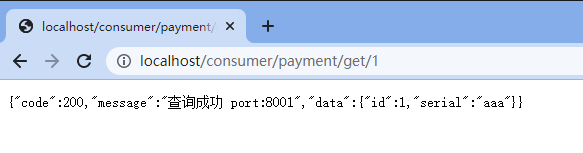

## Eureka基础知识

### 什么是服务治理　　

​      Spring Cloud 封装了 Netflix 公司开发的 Eureka 模块来实现服务治理在传统的RPC远程调用框架中，每个服务与服务之间依赖关系比较复杂，所以需要使用服务治理，管理服务与服务之间的依赖关系，可以实现服务调用、负载均衡、容错等，实现服务发现与注册。

###   什么是服务注册与发现

Eureka采用了CS的设计架构，Eureka Server 作为服务注册功能的服务器，它是服务注册中心，而系统中的其他微服务，使用 Eureka的客户端连接到 Eureka Server并维持心跳连接，这样系统的维护人员就可以通过 Eureka Server 来监控系统中各个微服务是否正常运行。

在服务注册与发现中，有一个注册中心。当服务器启动的时候，会把当前自己服务器的信息 比如 服务地址通讯地址等以别名方式注册到注册中心上。另一方（消费者|服务提供者），以该别名的方式去注册中心上获取到实际的服务通讯地址。在任何rpc远程框架中，都会有一个注册中心(存放服务地址相关信息(接口地址))
下图是Eureka系统架构：


 

 

## 单机Eureka构建步骤

### 新建模块004-eureka-server7001

+ pom.xml

```xml
<?xml version="1.0" encoding="UTF-8"?>
<project xmlns="http://maven.apache.org/POM/4.0.0"
         xmlns:xsi="http://www.w3.org/2001/XMLSchema-instance"
         xsi:schemaLocation="http://maven.apache.org/POM/4.0.0 http://maven.apache.org/xsd/maven-4.0.0.xsd">
    <parent>
        <artifactId>SpringCloudModules</artifactId>
        <groupId>com.hashnode</groupId>
        <version>1.0-SNAPSHOT</version>
    </parent>
    <modelVersion>4.0.0</modelVersion>

    <artifactId>004-eureka-server7001</artifactId>

    <properties>
        <maven.compiler.source>8</maven.compiler.source>
        <maven.compiler.target>8</maven.compiler.target>
    </properties>

    <dependencies>
        <dependency>
            <groupId>org.springframework.boot</groupId>
            <artifactId>spring-boot-starter-web</artifactId>
        </dependency>

        <dependency>
            <groupId>org.springframework.boot</groupId>
            <artifactId>spring-boot-starter-actuator</artifactId>
        </dependency>

        <dependency>
            <groupId>org.springframework.boot</groupId>
            <artifactId>spring-boot-starter-test</artifactId>
            <scope>test</scope>
            <exclusions>
                <exclusion>
                    <groupId>org.junit.vintage</groupId>
                    <artifactId>junit-vintage-engine</artifactId>
                </exclusion>
            </exclusions>
        </dependency>

        <!--        引入自定义的api通用包，包括各种实体类-->
        <dependency>
            <groupId>com.hashnode</groupId>
            <artifactId>003-cloud-api-commons</artifactId>
            <version>1.0-SNAPSHOT</version>
        </dependency>


        <!--eureka-server-->
        <dependency>
            <groupId>org.springframework.cloud</groupId>
            <artifactId>spring-cloud-starter-netflix-eureka-server</artifactId>
        </dependency>

        <!--mysql-->
        <dependency>
            <groupId>mysql</groupId>
            <artifactId>mysql-connector-java</artifactId>
        </dependency>
        <!-- druid-->
        <dependency>
            <groupId>com.alibaba</groupId>
            <artifactId>druid</artifactId>
        </dependency>
        <!-- mybatis 如果引入此依赖，springboot在启动的时候会在application.**中寻找数据库连接信息，如果找不到，则报错-->
        <!--        <dependency>-->
        <!--            <groupId>org.mybatis.spring.boot</groupId>-->
        <!--            <artifactId>mybatis-spring-boot-starter</artifactId>-->
        <!--        </dependency>-->
        <!--junit-->
        <dependency>
            <groupId>junit</groupId>
            <artifactId>junit</artifactId>
        </dependency>
        <!--log4j-->
        <dependency>
            <groupId>log4j</groupId>
            <artifactId>log4j</artifactId>
        </dependency>
        <!--SpringBoot Thymeleaf依赖-->
        <dependency>
            <groupId>org.springframework.boot</groupId>
            <artifactId>spring-boot-starter-thymeleaf</artifactId>
        </dependency>
        <!--添加Bootstrap WarJar的依赖-->
        <dependency>
            <groupId>org.webjars</groupId>
            <artifactId>bootstrap</artifactId>
        </dependency>

        <dependency>
            <groupId>org.projectlombok</groupId>
            <artifactId>lombok</artifactId>
        </dependency>

    </dependencies>

</project>
```

+ applicaiton.yml

```yml
server:
  port: 7001


eureka:
  instance:
    #单点配置
    hostname: localhost #eureka服务端的实例名称

  client:
    #false表示不向注册中心注册自己
    register-with-eureka: false
    #false表示自己就是注册中心，职责是维护服务实例，不需要检索服务
    fetch-registry: false
    service-url:
      #设置与Eureka Server交互的地址查询服务和注册服务都需要依赖这个地址
    defaultZone: http://${eureka.instance.hostname}:${server.port}/eureka/
```

### 主启动

```java
package com.hashnode;

import org.springframework.boot.SpringApplication;
import org.springframework.boot.autoconfigure.SpringBootApplication;
import org.springframework.cloud.netflix.eureka.server.EnableEurekaServer;

@SpringBootApplication
@EnableEurekaServer
public class EurekaMain7001 {
    public static void main(String[] args) {
        SpringApplication.run(EurekaMain7001.class,args);
    }
}
```

### 测试 


### 将001-cloud-provider-payment-eureka-8001注册进Eureka

未注册进Eureka的模块001-cloud-provider-payment-eureka-8001参考：[https://blog.csdn.net/qq_21898647/article/details/124225600](https://blog.csdn.net/qq_21898647/article/details/124225600)

+ 修改POM:

```XML
<?xml version="1.0" encoding="UTF-8"?>
<project xmlns="http://maven.apache.org/POM/4.0.0"
         xmlns:xsi="http://www.w3.org/2001/XMLSchema-instance"
         xsi:schemaLocation="http://maven.apache.org/POM/4.0.0 http://maven.apache.org/xsd/maven-4.0.0.xsd">
    <parent>
        <artifactId>SpringCloudModules</artifactId>
        <groupId>com.hashnode</groupId>
        <version>1.0-SNAPSHOT</version>
    </parent>
    <modelVersion>4.0.0</modelVersion>

    <artifactId>001-cloud-provider-payment-eureka-8001</artifactId>

    <properties>
        <maven.compiler.source>8</maven.compiler.source>
        <maven.compiler.target>8</maven.compiler.target>
    </properties>


    <dependencies>
        <dependency>
            <groupId>org.springframework.boot</groupId>
            <artifactId>spring-boot-starter-web</artifactId>
        </dependency>

        <dependency>
            <groupId>org.springframework.boot</groupId>
            <artifactId>spring-boot-starter-actuator</artifactId>
        </dependency>

        <dependency>
            <groupId>org.springframework.boot</groupId>
            <artifactId>spring-boot-starter-test</artifactId>
            <scope>test</scope>
            <exclusions>
                <exclusion>
                    <groupId>org.junit.vintage</groupId>
                    <artifactId>junit-vintage-engine</artifactId>
                </exclusion>
            </exclusions>
        </dependency>

        <!--eureka-client-->
        <dependency>
            <groupId>org.springframework.cloud</groupId>
            <artifactId>spring-cloud-starter-netflix-eureka-client</artifactId>
        </dependency>

        <!--        引入自定义的api通用包，包括各种实体类-->
        <dependency>
            <groupId>com.hashnode</groupId>
            <artifactId>003-cloud-api-commons</artifactId>
            <version>1.0-SNAPSHOT</version>
        </dependency>

        <!--mysql-->
        <dependency>
            <groupId>mysql</groupId>
            <artifactId>mysql-connector-java</artifactId>
        </dependency>
        <!-- druid-->
        <dependency>
            <groupId>com.alibaba</groupId>
            <artifactId>druid</artifactId>
        </dependency>
        <!-- mybatis-->
        <dependency>
            <groupId>org.mybatis.spring.boot</groupId>
            <artifactId>mybatis-spring-boot-starter</artifactId>
        </dependency>
        <!--junit-->
        <dependency>
            <groupId>junit</groupId>
            <artifactId>junit</artifactId>
        </dependency>
        <!--log4j-->
        <dependency>
            <groupId>log4j</groupId>
            <artifactId>log4j</artifactId>
        </dependency>
        <!--SpringBoot Thymeleaf依赖-->
        <dependency>
            <groupId>org.springframework.boot</groupId>
            <artifactId>spring-boot-starter-thymeleaf</artifactId>
        </dependency>
        <!--添加Bootstrap WarJar的依赖-->
        <dependency>
            <groupId>org.webjars</groupId>
            <artifactId>bootstrap</artifactId>
        </dependency>

        <dependency>
            <groupId>org.projectlombok</groupId>
            <artifactId>lombok</artifactId>
        </dependency>


    </dependencies>


</project>
```

+ 改YML

```yml
server:
  port: 8001

spring:
  application:
    name: cloud-payment-service

  datasource:
    type: com.alibaba.druid.pool.DruidDataSource    #当前数据源操作类型
    driver-class-name: org.gjt.mm.mysql.Driver      #mysql驱动包
    url: jdbc:mysql://localhost:3306/springboot?useUnicode=true&characterEncoding=UTF-8&useJDBCCompliantTimezoneShift=true&useLegacyDateTimeCode=false&serverTimezone=GMT%2B8
    username: root
    password: root

eureka:
  client:
    #表示是否将自己注册进EurekaServer默认为true
    register-with-eureka: true
    #是否从EurekaServer抓取已有的注册信息，默认为true,单节点无所谓，集群必须设置为true才能配合ribbon使用负载均衡
    fetch-registry: true
    service-url:
      defaultZone: http://localhost:7001/eureka
  instance:
    instance-id: payment8001
    prefer-ip-address: true   #访问路径可以显示IP地址

mybatis:
  mapper-locations:
    - classpath:mapper/*.xml
  type-aliases-package: com.hashnode.model      #所有model所在包
```

+ 主启动类

```java
package com.hashnode;

import org.mybatis.spring.annotation.MapperScan;
import org.springframework.boot.SpringApplication;
import org.springframework.boot.autoconfigure.SpringBootApplication;
import org.springframework.cloud.netflix.eureka.EnableEurekaClient;
import org.springframework.context.ConfigurableApplicationContext;

@SpringBootApplication
@MapperScan("com.hashnode.mapper")
@EnableEurekaClient
public class PaymentMainEureka8001 {
    public static void main(String[] args) {
        ConfigurableApplicationContext run = SpringApplication.run(PaymentMainEureka8001.class, args);
    }
}
```

#### 测试

先要启动004-eureka-server7001，然后启动001-cloud-provider-payment-eureka-8001，访问http://localhost:7001/：


微服务的名字对应于：


### 将002-cloud-provider-order-eureka80注册进Eureka

未注册进Eureka的模块002-cloud-provider-order-eureka80参考：[https://blog.csdn.net/qq_21898647/article/details/124225600](https://blog.csdn.net/qq_21898647/article/details/124225600)

修改pom

```xml
<?xml version="1.0" encoding="UTF-8"?>
<project xmlns="http://maven.apache.org/POM/4.0.0"
         xmlns:xsi="http://www.w3.org/2001/XMLSchema-instance"
         xsi:schemaLocation="http://maven.apache.org/POM/4.0.0 http://maven.apache.org/xsd/maven-4.0.0.xsd">
    <parent>
        <artifactId>SpringCloudModules</artifactId>
        <groupId>com.hashnode</groupId>
        <version>1.0-SNAPSHOT</version>
    </parent>
    <modelVersion>4.0.0</modelVersion>

    <artifactId>002-cloud-provider-order-eureka80</artifactId>

    <properties>
        <maven.compiler.source>8</maven.compiler.source>
        <maven.compiler.target>8</maven.compiler.target>
    </properties>

    <dependencies>
        <dependency>
            <groupId>org.springframework.boot</groupId>
            <artifactId>spring-boot-starter-web</artifactId>
        </dependency>

        <dependency>
            <groupId>org.springframework.boot</groupId>
            <artifactId>spring-boot-starter-actuator</artifactId>
        </dependency>

        <dependency>
            <groupId>org.springframework.boot</groupId>
            <artifactId>spring-boot-starter-test</artifactId>
            <scope>test</scope>
            <exclusions>
                <exclusion>
                    <groupId>org.junit.vintage</groupId>
                    <artifactId>junit-vintage-engine</artifactId>
                </exclusion>
            </exclusions>
        </dependency>

        <!--eureka-client-->
        <dependency>
            <groupId>org.springframework.cloud</groupId>
            <artifactId>spring-cloud-starter-netflix-eureka-client</artifactId>
        </dependency>

        <!--        引入自定义的api通用包，包括各种实体类-->
        <dependency>
            <groupId>com.hashnode</groupId>
            <artifactId>003-cloud-api-commons</artifactId>
            <version>1.0-SNAPSHOT</version>
        </dependency>

        <!--mysql-->
        <dependency>
            <groupId>mysql</groupId>
            <artifactId>mysql-connector-java</artifactId>
        </dependency>
        <!-- druid-->
        <dependency>
            <groupId>com.alibaba</groupId>
            <artifactId>druid</artifactId>
        </dependency>
        <!-- mybatis,引入mybatis-spring-boot-starter必须配置数据库-->
        <!--        <dependency>-->
        <!--            <groupId>org.mybatis.spring.boot</groupId>-->
        <!--            <artifactId>mybatis-spring-boot-starter</artifactId>-->
        <!--        </dependency>-->
        <!--junit-->
        <dependency>
            <groupId>junit</groupId>
            <artifactId>junit</artifactId>
        </dependency>
        <!--log4j-->
        <dependency>
            <groupId>log4j</groupId>
            <artifactId>log4j</artifactId>
        </dependency>
        <!--SpringBoot Thymeleaf依赖-->
        <dependency>
            <groupId>org.springframework.boot</groupId>
            <artifactId>spring-boot-starter-thymeleaf</artifactId>
        </dependency>
        <!--添加Bootstrap WarJar的依赖-->
        <dependency>
            <groupId>org.webjars</groupId>
            <artifactId>bootstrap</artifactId>
        </dependency>

        <dependency>
            <groupId>org.projectlombok</groupId>
            <artifactId>lombok</artifactId>
        </dependency>


    </dependencies>


</project>
```

修改yml

```yml
server:
  port: 80

spring:
  application:
    name: cloud-order-service


eureka:
  client:
    #表示是否将自己注册进EurekaServer默认为true
    register-with-eureka: true
    #是否从EurekaServer抓取已有的注册信息，默认为true,单节点无所谓，集群必须设置为true才能配合ribbon使用负载均衡
    fetch-registry: true
    service-url:
      defaultZone: http://localhost:7001/eureka
```

修改主启动类

```java
package com.hashnode;

import com.hashnode.myrule.MySelfRule;
import org.springframework.boot.SpringApplication;
import org.springframework.boot.autoconfigure.SpringBootApplication;
import org.springframework.cloud.netflix.eureka.EnableEurekaClient;
import org.springframework.cloud.netflix.ribbon.RibbonClient;
import org.springframework.context.ConfigurableApplicationContext;

@SpringBootApplication
@EnableEurekaClient
public class OrderMainEureka80 {
    public static void main(String[] args) {
        ConfigurableApplicationContext run = SpringApplication.run(OrderMainEureka80.class, args);
    }
}
```

修改ApplicaitonContextConfig.java,使RestTemplate可以通过服务名调用远程服务，并且具有负载均衡的能力：

```java
package com.hashnode.config;

import com.hashnode.model.Payment;
import org.springframework.cloud.client.loadbalancer.LoadBalanced;
import org.springframework.context.annotation.Bean;
import org.springframework.context.annotation.Configuration;
import org.springframework.web.client.RestTemplate;

@Configuration
public class ApplicationContextConfig {

    @Bean
    @LoadBalanced //负载均衡使用，从eureka寻找服务所在的域名      如果使用自定义的负载均衡，则不能使用此注解
    public RestTemplate getRestTemplate(){
        return new RestTemplate();
    }

    @Bean
    public Payment getPayment(){
        return new Payment(0L,"000");
    }

}
```

修改OrderController.java,不适用绝对ip，而使用服务名：

```java
package com.hashnode.controller;

import com.hashnode.lb.LoadBalancer;
import com.hashnode.model.CommonResult;
import com.hashnode.model.Payment;
import lombok.extern.slf4j.Slf4j;
import org.springframework.beans.factory.annotation.Autowired;
import org.springframework.cloud.client.ServiceInstance;
import org.springframework.cloud.client.discovery.DiscoveryClient;
import org.springframework.web.bind.annotation.GetMapping;
import org.springframework.web.bind.annotation.PathVariable;
import org.springframework.web.bind.annotation.RestController;
import org.springframework.web.client.RestTemplate;

import javax.annotation.Resource;
import java.net.URI;
import java.util.List;

@RestController
@Slf4j
public class OrderController {

    public static final String PAYMENT_URL = "http://CLOUD-PAYMENT-SERVICE";

    @Autowired
    private RestTemplate restTemplate;

    @Autowired
    private DiscoveryClient discoveryClient;

    @Resource
    private LoadBalancer loadBalancer;

    @GetMapping("/consumer/payment/create")
    public CommonResult<Payment> create(Payment payment){
        return restTemplate.postForObject(PAYMENT_URL+"/payment/create",payment,CommonResult.class);
    }

    @GetMapping("/consumer/payment/get/{id}")
    public CommonResult<Payment> getPayment(@PathVariable("id")Long id){
        return restTemplate.getForObject(PAYMENT_URL+"/payment/get/"+id,CommonResult.class);
    }
}
```

#### 测试


服务调用：


## 集群Eureka构建步骤

**问题：微服务RPC远程服务调用最核心的是什么** 
      答：高可用，试想你的注册中心只有一个， 如果注册中心出现，会导致整个为服务环境不可用。解决办法：搭建Eureka注册中心集群 ，实现负载均衡+故障容错


详细代码参考:[https://gitee.com/codinginn/SpringCloudTurorial/tree/master/SpringCloudModules](https://gitee.com/codinginn/SpringCloudTurorial/tree/master/SpringCloudModules)

### 集群环境搭建步骤

参考004-eureka-server7001新建004-eureka-server7002,004-eureka-server7003。·

pom.xml

```xml
<?xml version="1.0" encoding="UTF-8"?>
<project xmlns="http://maven.apache.org/POM/4.0.0"
         xmlns:xsi="http://www.w3.org/2001/XMLSchema-instance"
         xsi:schemaLocation="http://maven.apache.org/POM/4.0.0 http://maven.apache.org/xsd/maven-4.0.0.xsd">
    <parent>
        <artifactId>SpringCloudModules</artifactId>
        <groupId>com.hashnode</groupId>
        <version>1.0-SNAPSHOT</version>
    </parent>
    <modelVersion>4.0.0</modelVersion>

    <artifactId>004-eureka-server7002</artifactId>

    <properties>
        <maven.compiler.source>8</maven.compiler.source>
        <maven.compiler.target>8</maven.compiler.target>
    </properties>

    <dependencies>
        <dependency>
            <groupId>org.springframework.boot</groupId>
            <artifactId>spring-boot-starter-web</artifactId>
        </dependency>

        <dependency>
            <groupId>org.springframework.boot</groupId>
            <artifactId>spring-boot-starter-actuator</artifactId>
        </dependency>

        <dependency>
            <groupId>org.springframework.boot</groupId>
            <artifactId>spring-boot-starter-test</artifactId>
            <scope>test</scope>
            <exclusions>
                <exclusion>
                    <groupId>org.junit.vintage</groupId>
                    <artifactId>junit-vintage-engine</artifactId>
                </exclusion>
            </exclusions>
        </dependency>

        <!--        引入自定义的api通用包，包括各种实体类-->
        <dependency>
            <groupId>com.hashnode</groupId>
            <artifactId>003-cloud-api-commons</artifactId>
            <version>1.0-SNAPSHOT</version>
        </dependency>


        <!--eureka-server-->
        <dependency>
            <groupId>org.springframework.cloud</groupId>
            <artifactId>spring-cloud-starter-netflix-eureka-server</artifactId>
        </dependency>

        <!--mysql-->
        <dependency>
            <groupId>mysql</groupId>
            <artifactId>mysql-connector-java</artifactId>
        </dependency>
        <!-- druid-->
        <dependency>
            <groupId>com.alibaba</groupId>
            <artifactId>druid</artifactId>
        </dependency>
        <!-- mybatis 如果引入此依赖，springboot在启动的时候会在application.**中寻找数据库连接信息，如果找不到，则报错-->
        <!--        <dependency>-->
        <!--            <groupId>org.mybatis.spring.boot</groupId>-->
        <!--            <artifactId>mybatis-spring-boot-starter</artifactId>-->
        <!--        </dependency>-->
        <!--junit-->
        <dependency>
            <groupId>junit</groupId>
            <artifactId>junit</artifactId>
        </dependency>
        <!--log4j-->
        <dependency>
            <groupId>log4j</groupId>
            <artifactId>log4j</artifactId>
        </dependency>
        <!--SpringBoot Thymeleaf依赖-->
        <dependency>
            <groupId>org.springframework.boot</groupId>
            <artifactId>spring-boot-starter-thymeleaf</artifactId>
        </dependency>
        <!--添加Bootstrap WarJar的依赖-->
        <dependency>
            <groupId>org.webjars</groupId>
            <artifactId>bootstrap</artifactId>
        </dependency>

        <dependency>
            <groupId>org.projectlombok</groupId>
            <artifactId>lombok</artifactId>
        </dependency>

    </dependencies>

</project>
```

#### 修改映射配置

找到找到C:\Windows\System32\drivers\etc路径下的hosts文件,并修改映射配置添进hosts文件:


```properties
# springcloud测试用 begin
127.0.0.1 eureka7001.com
127.0.0.1 eureka7002.com
127.0.0.1 eureka7003.com
# springcloud测试用 end
```

#### 重新配置YML

+ 7001

```yml
server:
  port: 7001


eureka:
  instance:
    #单点配置
#    hostname: localhost #eureka服务端的实例名称
#  模拟集群配置
    hostname: eureka7001.com
  client:
    #false表示不向注册中心注册自己
    register-with-eureka: false
    #false表示自己就是注册中心，职责是维护服务实例，不需要检索服务
    fetch-registry: false
    service-url:
      #设置于Eureka Server交互的地址查询服务和注册服务都需要依赖这个地址
#      defaultZone: http://${eureka.instance.hostname}:${server.port}/eureka/
    #模拟集群配置
      defaultZone: http://eureka7002.com:7002/eureka,http://eureka7003.com:7003/eureka
```

+ 7002

```yml
server:
  port: 7002


eureka:
  instance:
    #单点配置
#    hostname: localhost #eureka服务端的实例名称
#  模拟集群配置
    hostname: eureka7002.com
  client:
    #false表示不向注册中心注册自己
    register-with-eureka: false
    #false表示自己就是注册中心，职责是维护服务实例，不需要检索服务
    fetch-registry: false
    service-url:
      #设置于Eureka Server交互的地址查询服务和注册服务都需要依赖这个地址
#      defaultZone: http://${eureka.instance.hostname}:${server.port}/eureka/
    #模拟集群配置
      defaultZone: http://eureka7001.com:7001/eureka,http://eureka7003.com:7003/eureka
```

+ 7003

```yml
server:
  port: 7003


eureka:
  instance:
    #单点配置
#    hostname: localhost #eureka服务端的实例名称
#  模拟集群配置
    hostname: eureka7003.com
  client:
    #false表示不向注册中心注册自己
    register-with-eureka: false
    #false表示自己就是注册中心，职责是维护服务实例，不需要检索服务
    fetch-registry: false
    service-url:
      #设置于Eureka Server交互的地址查询服务和注册服务都需要依赖这个地址
#      defaultZone: http://${eureka.instance.hostname}:${server.port}/eureka/
    #模拟集群配置
      defaultZone: http://eureka7001.com:7001/eureka,http://eureka7002.com:7002/eureka
```

#### 主启动

```java
package com.hashnode;

import org.springframework.boot.SpringApplication;
import org.springframework.boot.autoconfigure.SpringBootApplication;
import org.springframework.cloud.netflix.eureka.server.EnableEurekaServer;

@SpringBootApplication
@EnableEurekaServer
public class EurekaMain7002 {
    public static void main(String[] args) {
        SpringApplication.run(EurekaMain7002.class,args);
    }
}
```

#### 将支付服务8001微服务发布到集群配置中

修改YML

```yml
server:
  port: 8001

spring:
  application:
    name: cloud-payment-service

  datasource:
    type: com.alibaba.druid.pool.DruidDataSource    #当前数据源操作类型
    driver-class-name: org.gjt.mm.mysql.Driver      #mysql驱动包
    url: jdbc:mysql://localhost:3306/springboot?useUnicode=true&characterEncoding=UTF-8&useJDBCCompliantTimezoneShift=true&useLegacyDateTimeCode=false&serverTimezone=GMT%2B8
    username: root
    password: root

eureka:
  client:
    #表示是否将自己注册进EurekaServer默认为true
    register-with-eureka: true
    #是否从EurekaServer抓取已有的注册信息，默认为true,单节点无所谓，集群必须设置为true才能配合ribbon使用负载均衡
    fetch-registry: true
    service-url:
      defaultZone: http://eureka7001.com:7001/eureka,http://eureka7002.com:7002/eureka,http://eureka7003.com:7003/eureka
#      defaultZone: http://localhost:7001/eureka
  instance:
    instance-id: payment8001
    prefer-ip-address: true   #访问路径可以显示IP地址

mybatis:
  mapper-locations:
    - classpath:mapper/*.xml
  type-aliases-package: com.hashnode.model      #所有model所在包
```

#### 将订单服务80微服务发布到上面2台Eureka集群配置中

```yml
server:
  port: 80

spring:
  application:
    name: cloud-order-service


eureka:
  client:
    #表示是否将自己注册进EurekaServer默认为true
    register-with-eureka: true
    #是否从EurekaServer抓取已有的注册信息，默认为true,单节点无所谓，集群必须设置为true才能配合ribbon使用负载均衡
    fetch-registry: true
    service-url:
      defaultZone: http://localhost:7001/eureka,http://localhost:7002/eureka,http://localhost:7003/eureka
#      defaultZone: http://localhost:7001/eureka
```

设置002-cloud-provider-order-eureka80使RestTemplate具有负载均衡的能力。

+ ApplicationContextConfig.java

```java
package com.hashnode.config;

import com.hashnode.model.Payment;
import org.springframework.cloud.client.loadbalancer.LoadBalanced;
import org.springframework.context.annotation.Bean;
import org.springframework.context.annotation.Configuration;
import org.springframework.web.client.RestTemplate;

@Configuration
public class ApplicationContextConfig {

    @Bean
    @LoadBalanced //负载均衡使用，从eureka寻找服务所在的域名   如果使用自定义的负载均衡(@RibbonClient(name = "CLOUD-ORDER-SERVICE",configuration = MySelfRule.class))，则不能使用此注解
    public RestTemplate getRestTemplate(){
        return new RestTemplate();
    }

    @Bean
    public Payment getPayment(){
        return new Payment(0L,"000");
    }

}
```

#### 测试

启动EurekaServer,7001/7002/7003,再启动服务提供者provider8001,消费者80:


访问http://localhost/consumer/payment/get/1,因为80是默认端口,所以不用加端口号



### 支付服务提供者8002集群环境构建

参考001-cloud-provider-payment-eureka-8001新建005-cloud-provider-payment-eureka-8002

pom.xml

```xml
<?xml version="1.0" encoding="UTF-8"?>
<project xmlns="http://maven.apache.org/POM/4.0.0"
         xmlns:xsi="http://www.w3.org/2001/XMLSchema-instance"
         xsi:schemaLocation="http://maven.apache.org/POM/4.0.0 http://maven.apache.org/xsd/maven-4.0.0.xsd">
    <parent>
        <artifactId>SpringCloudModules</artifactId>
        <groupId>com.hashnode</groupId>
        <version>1.0-SNAPSHOT</version>
    </parent>
    <modelVersion>4.0.0</modelVersion>

    <artifactId>005-cloud-provider-payment-eureka-8002</artifactId>

    <properties>
        <maven.compiler.source>8</maven.compiler.source>
        <maven.compiler.target>8</maven.compiler.target>
    </properties>


    <dependencies>
        <dependency>
            <groupId>org.springframework.boot</groupId>
            <artifactId>spring-boot-starter-web</artifactId>
        </dependency>

        <dependency>
            <groupId>org.springframework.boot</groupId>
            <artifactId>spring-boot-starter-actuator</artifactId>
        </dependency>

        <dependency>
            <groupId>org.springframework.boot</groupId>
            <artifactId>spring-boot-starter-test</artifactId>
            <scope>test</scope>
            <exclusions>
                <exclusion>
                    <groupId>org.junit.vintage</groupId>
                    <artifactId>junit-vintage-engine</artifactId>
                </exclusion>
            </exclusions>
        </dependency>

        <!--eureka-client-->
        <dependency>
            <groupId>org.springframework.cloud</groupId>
            <artifactId>spring-cloud-starter-netflix-eureka-client</artifactId>
        </dependency>

        <!--        引入自定义的api通用包，包括各种实体类-->
        <dependency>
            <groupId>com.hashnode</groupId>
            <artifactId>003-cloud-api-commons</artifactId>
            <version>1.0-SNAPSHOT</version>
        </dependency>

        <!--mysql-->
        <dependency>
            <groupId>mysql</groupId>
            <artifactId>mysql-connector-java</artifactId>
        </dependency>
        <!-- druid-->
        <dependency>
            <groupId>com.alibaba</groupId>
            <artifactId>druid</artifactId>
        </dependency>
        <!-- mybatis-->
        <dependency>
            <groupId>org.mybatis.spring.boot</groupId>
            <artifactId>mybatis-spring-boot-starter</artifactId>
        </dependency>
        <!--junit-->
        <dependency>
            <groupId>junit</groupId>
            <artifactId>junit</artifactId>
        </dependency>
        <!--log4j-->
        <dependency>
            <groupId>log4j</groupId>
            <artifactId>log4j</artifactId>
        </dependency>
        <!--SpringBoot Thymeleaf依赖-->
        <dependency>
            <groupId>org.springframework.boot</groupId>
            <artifactId>spring-boot-starter-thymeleaf</artifactId>
        </dependency>
        <!--添加Bootstrap WarJar的依赖-->
        <dependency>
            <groupId>org.webjars</groupId>
            <artifactId>bootstrap</artifactId>
        </dependency>

        <dependency>
            <groupId>org.projectlombok</groupId>
            <artifactId>lombok</artifactId>
        </dependency>


    </dependencies>


</project>
```

配置yml

```yml
server:
  port: 8002

spring:
  application:
    name: cloud-payment-service

  datasource:
    type: com.alibaba.druid.pool.DruidDataSource    #当前数据源操作类型
    driver-class-name: org.gjt.mm.mysql.Driver      #mysql驱动包
    url: jdbc:mysql://localhost:3306/springboot?useUnicode=true&characterEncoding=UTF-8&useJDBCCompliantTimezoneShift=true&useLegacyDateTimeCode=false&serverTimezone=GMT%2B8
    username: root
    password: root

eureka:
  client:
    #表示是否将自己注册进EurekaServer默认为true
    register-with-eureka: true
    #是否从EurekaServer抓取已有的注册信息，默认为true,单节点无所谓，集群必须设置为true才能配合ribbon使用负载均衡
    fetch-registry: true
    service-url:
      defaultZone: http://eureka7001.com:7001/eureka,http://eureka7002.com:7002/eureka,http://eureka7003.com:7003/eureka
  instance:
    instance-id: payment8002
    prefer-ip-address: true   #访问路径可以显示IP地址

mybatis:
  mapper-locations:
    - classpath:mapper/*.xml
  type-aliases-package: com.hashnode.model      #所有model所在包
```

主启动类

```java
package com.hashnode;

import org.mybatis.spring.annotation.MapperScan;
import org.springframework.boot.SpringApplication;
import org.springframework.boot.autoconfigure.SpringBootApplication;
import org.springframework.cloud.netflix.eureka.EnableEurekaClient;
import org.springframework.context.ConfigurableApplicationContext;

@SpringBootApplication
@MapperScan("com.hashnode.mapper")
@EnableEurekaClient
public class PaymentMainEureka8002 {
    public static void main(String[] args) {
        ConfigurableApplicationContext run = SpringApplication.run(PaymentMainEureka8002.class, args);
    }
}
```

业务类和8001一样。

修改8001/8002的Controller

+ 8001

```java
package com.hashnode.controller;

import com.hashnode.model.CommonResult;
import com.hashnode.model.Payment;
import com.hashnode.service.PaymentService;
import lombok.extern.slf4j.Slf4j;
import org.springframework.beans.factory.annotation.Value;
import org.springframework.web.bind.annotation.*;

import javax.annotation.Resource;
import java.util.concurrent.TimeUnit;

@RestController
@Slf4j
public class PaymentController {
    @Resource
    private PaymentService paymentService;

    @Value("${server.port}")
    private String serverPort;


    @PostMapping(value = "/payment/create")
    public CommonResult create(@RequestBody Payment payment){
        int result = paymentService.createPaymentSelective(payment);
        log.info("插入结果"+result);

        if(result > 0){
            return new CommonResult(200,"插入数据库成功",payment);
        }else{
            return new CommonResult(444,"插入数据库失败",null);
        }
    }

    @GetMapping(value = "/payment/get/{id}")
    public CommonResult<Payment> getPaymentById(@PathVariable("id") Long id){
        System.out.println(111);
        Payment result = paymentService.getPaymentById(id);
        log.info("查询结果"+result);

        if(result != null){
            return new CommonResult(200,"查询成功 port:"+serverPort,result);
        }else {
            return new CommonResult(444,"没有对应记录,查询ID:"+id);
        }

    }

    @GetMapping(value = "/payment/feign/timeout")
    public String paymentFeignTimeout(){
        try {
            TimeUnit.SECONDS.sleep(3);
        }catch (Exception e){
            e.printStackTrace();
        }
        return serverPort;
    }
}
```

+ 8002

```java
package com.hashnode.controller;

import com.hashnode.model.CommonResult;
import com.hashnode.model.Payment;
import com.hashnode.service.PaymentService;

import lombok.extern.slf4j.Slf4j;
import org.checkerframework.checker.units.qual.C;
import org.springframework.beans.factory.annotation.Value;
import org.springframework.cloud.client.ServiceInstance;
import org.springframework.cloud.client.discovery.DiscoveryClient;
import org.springframework.cloud.client.discovery.EnableDiscoveryClient;
import org.springframework.web.bind.annotation.*;

import javax.annotation.Resource;
import java.util.List;
import java.util.concurrent.TimeUnit;

@RestController
@Slf4j
@EnableDiscoveryClient
public class PaymentController {
    @Resource
    private PaymentService paymentService;

    @Value("${server.port}")
    private String serverPort;

    @Resource
    private DiscoveryClient discoveryClient;


    @PostMapping(value = "/payment/create")
    public CommonResult create(@RequestBody Payment payment){
        int result = paymentService.createPaymentSelective(payment);
        log.info("插入结果"+result);

        if(result > 0){
            return new CommonResult(200,"插入数据库成功 port:"+serverPort,payment);
        }else{
            return new CommonResult(444,"插入数据库失败",null);
        }
    }

    @GetMapping(value = "/payment/get/{id}")
    public CommonResult<Payment> getPaymentById(@PathVariable("id") Long id){
        System.out.println(111);
        Payment result = paymentService.getPaymentById(id);
        log.info("查询结果"+result);

        if(result != null){
            return new CommonResult(200,"查询成功+ip:"+serverPort,result);
        }else {
            return new CommonResult(444,"没有对应记录,查询ID:"+id);
        }

    }

    @GetMapping(value = "/payment/discovery")
    public Object discovery(){
        List<String> services = discoveryClient.getServices();
        for (String service : services) {
            log.info("******element"+service);
        }

        List<ServiceInstance> instances = discoveryClient.getInstances("CLOUD-PAYMENT-SERVICE");

        for (ServiceInstance instance : instances){
            log.info(instance.getServiceId()+"\t" + instance.getHost()+"\t"+instance.getPort() + "\t" + instance.getUri());
        }

        return this.discoveryClient;
    }

    @GetMapping(value = "/payment/feign/timeout")
    public String paymentFeignTimeout(){
        try {
            TimeUnit.SECONDS.sleep(3);
        }catch (Exception e){
            e.printStackTrace();
        }
        return serverPort;
    }
}
```

#### 测试

先要启动EurekaServer，7001/7002/7003服务,然后启动服务提供者provider，8001/8002服务,然后启动80


多次访问http://localhost/consumer/payment/get/31, 端口号为8001和8002的服务交替调用,结果如下:


## 服务发现Discovery

修改001-cloud-provider-payment-eureka-8001的Controller

```java
package com.hashnode.controller;

import com.hashnode.model.CommonResult;
import com.hashnode.model.Payment;
import com.hashnode.service.PaymentService;
import lombok.extern.slf4j.Slf4j;
import org.springframework.beans.factory.annotation.Value;
import org.springframework.cloud.client.ServiceInstance;
import org.springframework.cloud.client.discovery.DiscoveryClient;
import org.springframework.web.bind.annotation.*;

import javax.annotation.Resource;
import java.util.List;
import java.util.concurrent.TimeUnit;

@RestController
@Slf4j
public class PaymentController {
    @Resource
    private PaymentService paymentService;

    @Value("${server.port}")
    private String serverPort;

    @Resource
    private DiscoveryClient discoveryClient;


    @PostMapping(value = "/payment/create")
    public CommonResult create(@RequestBody Payment payment){
        int result = paymentService.createPaymentSelective(payment);
        log.info("插入结果"+result);

        if(result > 0){
            return new CommonResult(200,"插入数据库成功",payment);
        }else{
            return new CommonResult(444,"插入数据库失败",null);
        }
    }

    @GetMapping(value = "/payment/get/{id}")
    public CommonResult<Payment> getPaymentById(@PathVariable("id") Long id){
        System.out.println(111);
        Payment result = paymentService.getPaymentById(id);
        log.info("查询结果"+result);

        if(result != null){
            return new CommonResult(200,"查询成功 port:"+serverPort,result);
        }else {
            return new CommonResult(444,"没有对应记录,查询ID:"+id);
        }

    }

    @GetMapping(value = "/payment/discovery")
    public Object discovery(){
        List<String> services = discoveryClient.getServices();
        for (String service : services) {
            log.info("******element"+service);
        }

        List<ServiceInstance> instances = discoveryClient.getInstances("CLOUD-PAYMENT-SERVICE");

        for (ServiceInstance instance : instances){
            log.info(instance.getServiceId()+"\t" + instance.getHost()+"\t"+instance.getPort() + "\t" + instance.getUri());
        }

        return this.discoveryClient;
    }

}
```

主启动类添加@EnableDiscoveryClient 用于服务发现

```java
package com.hashnode;

import org.mybatis.spring.annotation.MapperScan;
import org.springframework.boot.SpringApplication;
import org.springframework.boot.autoconfigure.SpringBootApplication;
import org.springframework.cloud.client.discovery.EnableDiscoveryClient;
import org.springframework.cloud.netflix.eureka.EnableEurekaClient;
import org.springframework.context.ConfigurableApplicationContext;

@SpringBootApplication
@MapperScan("com.hashnode.mapper")
@EnableEurekaClient
@EnableDiscoveryClient //服务发现
public class PaymentMainEureka8001 {
    public static void main(String[] args) {
        ConfigurableApplicationContext run = SpringApplication.run(PaymentMainEureka8001.class, args);
    }
}
```

先启动EurekaServer,然后启8001/8002,访问http://localhost:8001/payment/discovery,结果如下:


## Eureka自我保护

若某时刻某一个微服务不可用了，Eureka不会立刻清理，依旧会对该微服务的信息进行保存,如果要及时对不可以的微服务进行清理,可以在服务端做如下配置:

```yml
server:
  port: 7001

eureka:
  instance:
    #单点配置
#    hostname: localhost #eureka服务端的实例名称
#  模拟集群配置
    hostname: eureka7001.com
  client:
    #false表示不向注册中心注册自己
    register-with-eureka: false
    #false表示自己就是注册中心，职责是维护服务实例，不需要检索服务
    fetch-registry: false
    service-url:
      #设置于Eureka Server交互的地址查询服务和注册服务都需要依赖这个地址
#      defaultZone: http://${eureka.instance.hostname}:${server.port}/eureka/
    #模拟集群配置
      defaultZone: http://eureka7002.com:7002/eureka,http://eureka7003.com:7003/eureka
      
  server:
    enable-self-preservation: false #关闭自我保护机制，保证不可用服务被及时踢除
    eviction-interval-timer-in-ms: 2000 #表示服务器在收到最后一次心跳之后等待的持续时间
```

也可以对客户端8001的yml做如下配置:

```yml
server:
  port: 8001

spring:
  application:
    name: cloud-payment-service

  datasource:
    type: com.alibaba.druid.pool.DruidDataSource    #当前数据源操作类型
    driver-class-name: org.gjt.mm.mysql.Driver      #mysql驱动包
    url: jdbc:mysql://localhost:3306/springboot?useUnicode=true&characterEncoding=UTF-8&useJDBCCompliantTimezoneShift=true&useLegacyDateTimeCode=false&serverTimezone=GMT%2B8
    username: root
    password: root

eureka:
  client:
    #表示是否将自己注册进EurekaServer默认为true
    register-with-eureka: true
    #是否从EurekaServer抓取已有的注册信息，默认为true,单节点无所谓，集群必须设置为true才能配合ribbon使用负载均衡
    fetch-registry: true
    service-url:
      defaultZone: http://eureka7001.com:7001/eureka,http://eureka7002.com:7002/eureka,http://eureka7003.com:7003/eureka
#      defaultZone: http://localhost:7001/eureka
  instance:
    instance-id: payment8001
#    prefer-ip-address: true   #访问路径可以显示IP地址
    #Eureka客户端向服务端发送心跳的时间间隔，单位为秒(默认是30秒)
    lease-renewal-interval-in-seconds: 1
    #Eureka服务端在收到最后一次心跳后等待时间上限，单位为秒(默认是90秒)，超时将剔除服务
    lease-expiration-duration-in-seconds: 2

mybatis:
  mapper-locations:
    - classpath:mapper/*.xml
  type-aliases-package: com.hashnode.model      #所有model所在包
```

