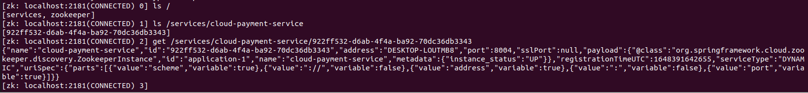
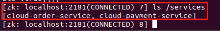

由于Eureka的停更,SpringCloud整合了Zookeeper代替了Eureka。zookeeper是一个分布式协调工具，可以实现注册中心功能。

## Ubuntu下安装zookeeper

1. 解压

```cmd
tar -zxvf zookeeper-3.4.11.tar.gz
```

2. 修改配置文件

进入解压的文件夹的conf目录：

将 zoo_sample.cfg 复制一份并命名为 zoo.cfg

```cmd
cp zoo_sample.cfg zoo.cfg
```

修改zoo.cfg,设置dataDir对应的位置，data目录为新建的目录:


3. 启动zookeeper

在zookeeper目录下的bin文件夹中，使用以下命令启动zookeeper:

```cmd
./zkServer.sh start
```


4. 检查zookeeper启动情况(需要关闭Linux服务器防火墙):

```cmd
./zkServer.sh status
```


除此之外，也可以通过查看zookeeper的进程是否存在来判断其是否启动成功:

```cmd
ps -ef | grep zookeeper
```

5. 关闭rookeeper

```cmd
./zkServer.sh stop
```

6. 查看rookeeper中注册的服务

```cmd
在bin目录下使用:
./zkCli.sh
 ls /  可以查看当前目录的节点
 get /zookeeper
 ls /zookeeper 查看节点下的所有服务
```


查看服务注册信息：



json信息如下

```json
{
    "name":"cloud-payment-service",
    "id":"922ff532-d6ab-4f4a-ba92-70dc36db3343",
    "address":"DESKTOP-LOUTMB8",
    "port":8004,
    "sslPort":null,
    "payload":{
        "@class":"org.springframework.cloud.zookeeper.discovery.ZookeeperInstance",
        "id":"application-1",
        "name":"cloud-payment-service",
        "metadata":{
            "instance_status":"UP"
        }
    },
    "registrationTimeUTC":1648391642655,
    "serviceType":"DYNAMIC",
    "uriSpec":{
        "parts":[
            {
                "value":"scheme",
                "variable":true
            },
            {
                "value":"://",
                "variable":false
            },
            {
                "value":"address",
                "variable":true
            },
            {
                "value":":",
                "variable":false
            },
            {
                "value":"port",
                "variable":true
            }
        ]
    }
}
```

## SpringCloud整合Zookeeper代替Eureka

### 服务提供者

新建005-cloud-provider-payment-zookeeper-8004

由于这里Zookeeper使用的是3.7.0，而SpringCloud自带的Zookeeper如下，所以需要排除该版本，引入新版本。


pom.xml

```xml
<?xml version="1.0" encoding="UTF-8"?>
<project xmlns="http://maven.apache.org/POM/4.0.0"
         xmlns:xsi="http://www.w3.org/2001/XMLSchema-instance"
         xsi:schemaLocation="http://maven.apache.org/POM/4.0.0 http://maven.apache.org/xsd/maven-4.0.0.xsd">
    <parent>
        <artifactId>SpringCloudModules</artifactId>
        <groupId>com.hashnode</groupId>
        <version>1.0-SNAPSHOT</version>
    </parent>
    <modelVersion>4.0.0</modelVersion>

    <artifactId>005-cloud-provider-payment-zookeeper-8004</artifactId>

    <properties>
        <maven.compiler.source>8</maven.compiler.source>
        <maven.compiler.target>8</maven.compiler.target>
    </properties>


    <dependencies>
        <dependency>
            <groupId>org.springframework.boot</groupId>
            <artifactId>spring-boot-starter-web</artifactId>
        </dependency>

        <dependency>
            <groupId>org.springframework.boot</groupId>
            <artifactId>spring-boot-starter-actuator</artifactId>
        </dependency>

        <dependency>
            <groupId>org.springframework.boot</groupId>
            <artifactId>spring-boot-starter-test</artifactId>
            <scope>test</scope>
            <exclusions>
                <exclusion>
                    <groupId>org.junit.vintage</groupId>
                    <artifactId>junit-vintage-engine</artifactId>
                </exclusion>
            </exclusions>
        </dependency>

        <!--eureka-client-->
<!--        <dependency>-->
<!--            <groupId>org.springframework.cloud</groupId>-->
<!--            <artifactId>spring-cloud-starter-netflix-eureka-client</artifactId>-->
<!--        </dependency>-->

        <!--zookeeper客户端-->
        <dependency>
            <groupId>org.springframework.cloud</groupId>
            <artifactId>spring-cloud-starter-zookeeper-discovery</artifactId>
<!--            排除自带的zookeeper解决版本冲突问题-->
            <exclusions>
                <exclusion>
                    <groupId>org.apache.zookeeper</groupId>
                    <artifactId>zookeeper</artifactId>
                </exclusion>
            </exclusions>
        </dependency>

        <!--            排除自带的zookeeper解决版本冲突问题-->
        <!--添加zookeeper3.7.0版本-->
        <!-- https://mvnrepository.com/artifact/org.apache.zookeeper/zookeeper -->
        <dependency>
            <groupId>org.apache.zookeeper</groupId>
            <artifactId>zookeeper</artifactId>
            <version>3.7.0</version>
        </dependency>


        <!--        引入自定义的api通用包，包括各种实体类-->
        <dependency>
            <groupId>com.hashnode</groupId>
            <artifactId>003-cloud-api-commons</artifactId>
            <version>1.0-SNAPSHOT</version>
        </dependency>

        <!--mysql-->
        <dependency>
            <groupId>mysql</groupId>
            <artifactId>mysql-connector-java</artifactId>
        </dependency>
        <!-- druid-->
        <dependency>
            <groupId>com.alibaba</groupId>
            <artifactId>druid</artifactId>
        </dependency>
        <!-- mybatis-->
        <dependency>
            <groupId>org.mybatis.spring.boot</groupId>
            <artifactId>mybatis-spring-boot-starter</artifactId>
        </dependency>
        <!--junit-->
        <dependency>
            <groupId>junit</groupId>
            <artifactId>junit</artifactId>
        </dependency>
        <!--log4j-->
        <dependency>
            <groupId>log4j</groupId>
            <artifactId>log4j</artifactId>
        </dependency>
        <!--SpringBoot Thymeleaf依赖-->
        <dependency>
            <groupId>org.springframework.boot</groupId>
            <artifactId>spring-boot-starter-thymeleaf</artifactId>
        </dependency>
        <!--添加Bootstrap WarJar的依赖-->
        <dependency>
            <groupId>org.webjars</groupId>
            <artifactId>bootstrap</artifactId>
        </dependency>

        <dependency>
            <groupId>org.projectlombok</groupId>
            <artifactId>lombok</artifactId>
        </dependency>


    </dependencies>


</project>
```

application.yml

```yml
server:
  port: 8004

spring:
  application:
    name: cloud-payment-service

  cloud:
    zookeeper:
      connect-string: 192.168.8.129:2181

  datasource:
    type: com.alibaba.druid.pool.DruidDataSource    #当前数据源操作类型
    driver-class-name: org.gjt.mm.mysql.Driver      #mysql驱动包
    url: jdbc:mysql://192.168.1.3:3306/springboot?useUnicode=true&characterEncoding=UTF-8&useJDBCCompliantTimezoneShift=true&useLegacyDateTimeCode=false&serverTimezone=GMT%2B8
    username: root
    password: root


mybatis:
  mapper-locations:
    - classpath:mapper/*.xml
  type-aliases-package: com.hashnode.model      #所有model所在包
```

主启动类

```java
package com.hashnode;

import org.mybatis.spring.annotation.MapperScan;
import org.springframework.boot.SpringApplication;
import org.springframework.boot.autoconfigure.SpringBootApplication;
import org.springframework.cloud.client.discovery.EnableDiscoveryClient;
import org.springframework.context.ConfigurableApplicationContext;

@SpringBootApplication
@MapperScan("com.hashnode.mapper")
//@EnableEurekaClient
@EnableDiscoveryClient//该注解用于向使用consul或者zookeeper作为注册中心时注册服务
public class PaymentMainZookeeper8004 {
    public static void main(String[] args) {
        ConfigurableApplicationContext run = SpringApplication.run(PaymentMainZookeeper8004.class, args);
//        PaymentService paymentService = run.getBean(PaymentService.class);
//        List<Payment> result = paymentService.getAllPayment();
//        for (int i=0;i<result.size();i++){
//            System.out.println(result.get(i));
//        }
    }
}
```

controller

```java
package com.hashnode.controller;

import com.hashnode.model.CommonResult;
import com.hashnode.model.Payment;
import com.hashnode.service.PaymentService;

import lombok.extern.slf4j.Slf4j;
import org.checkerframework.checker.units.qual.C;
import org.springframework.beans.factory.annotation.Value;
import org.springframework.cloud.client.ServiceInstance;
import org.springframework.cloud.client.discovery.DiscoveryClient;
import org.springframework.cloud.client.discovery.EnableDiscoveryClient;
import org.springframework.web.bind.annotation.*;

import javax.annotation.Resource;
import java.util.List;
import java.util.UUID;

@RestController
@Slf4j
public class PaymentController {
    @Resource
    private PaymentService paymentService;

    @Value("${server.port}")
    private String serverPort;

    @Resource
    private DiscoveryClient discoveryClient;


    @PostMapping(value = "/payment/create")
    public CommonResult create(@RequestBody Payment payment){
        int result = paymentService.createPaymentSelective(payment);
        log.info("插入结果"+result);

        if(result > 0){
            return new CommonResult(200,"插入数据库成功 port:"+serverPort,payment);
        }else{
            return new CommonResult(444,"插入数据库失败",null);
        }
    }

    @GetMapping(value = "/payment/get/{id}")
    public CommonResult<Payment> getPaymentById(@PathVariable("id") Long id){
        System.out.println(111);
        Payment result = paymentService.getPaymentById(id);
        log.info("查询结果"+result);

        if(result != null){
            return new CommonResult(200,"查询成功+ip:"+serverPort,result);
        }else {
            return new CommonResult(444,"没有对应记录,查询ID:"+id);
        }

    }

    @GetMapping(value = "/payment/discovery")
    public Object discovery(){
        List<String> services = discoveryClient.getServices();
        for (String service : services) {
            log.info("******element"+service);
        }

        List<ServiceInstance> instances = discoveryClient.getInstances("CLOUD-PAYMENT-SERVICE");

        for (ServiceInstance instance : instances){
            log.info(instance.getServiceId()+"\t" + instance.getHost()+"\t"+instance.getPort() + "\t" + instance.getUri());
        }

        return this.discoveryClient;
    }
}
```

测试1


测试2

在zookeeper的bin目录下，使用以下命令启动zookeeper:

```bash
./zkServer.sh start
```

然后进行如下操作：


使用json格式化工具(https://www.bejson.com/)查看：

```json
{
	"name": "cloud-payment-service",
	"id": "f9d81cef-ef3b-4d87-9443-390347ccaa86",
	"address": "DESKTOP-LOUTMB8",
	"port": 8004,
	"sslPort": null,
	"payload": {
		"@class": "org.springframework.cloud.zookeeper.discovery.ZookeeperInstance",
		"id": "application-1",
		"name": "cloud-payment-service",
		"metadata": {
			"instance_status": "UP"
		}
	},
	"registrationTimeUTC": 1650460435038,
	"serviceType": "DYNAMIC",
	"uriSpec": {
		"parts": [{
			"value": "scheme",
			"variable": true
		}, {
			"value": "://",
			"variable": false
		}, {
			"value": "address",
			"variable": true
		}, {
			"value": ":",
			"variable": false
		}, {
			"value": "port",
			"variable": true
		}]
	}
}
```

### 服务消费者

新建005-cloud-provider-zookeeper-order80

pom.xml

```xml
<?xml version="1.0" encoding="UTF-8"?>
<project xmlns="http://maven.apache.org/POM/4.0.0"
         xmlns:xsi="http://www.w3.org/2001/XMLSchema-instance"
         xsi:schemaLocation="http://maven.apache.org/POM/4.0.0 http://maven.apache.org/xsd/maven-4.0.0.xsd">
    <parent>
        <artifactId>SpringCloudModules</artifactId>
        <groupId>com.hashnode</groupId>
        <version>1.0-SNAPSHOT</version>
    </parent>
    <modelVersion>4.0.0</modelVersion>

    <artifactId>005-cloud-provider-zookeeper-order80</artifactId>

    <properties>
        <maven.compiler.source>8</maven.compiler.source>
        <maven.compiler.target>8</maven.compiler.target>
    </properties>

    <dependencies>
        <dependency>
            <groupId>org.springframework.boot</groupId>
            <artifactId>spring-boot-starter-web</artifactId>
        </dependency>

        <dependency>
            <groupId>org.springframework.boot</groupId>
            <artifactId>spring-boot-starter-actuator</artifactId>
        </dependency>

        <dependency>
            <groupId>org.springframework.boot</groupId>
            <artifactId>spring-boot-starter-test</artifactId>
            <scope>test</scope>
            <exclusions>
                <exclusion>
                    <groupId>org.junit.vintage</groupId>
                    <artifactId>junit-vintage-engine</artifactId>
                </exclusion>
            </exclusions>
        </dependency>

        <!--eureka-client-->
<!--        <dependency>-->
<!--            <groupId>org.springframework.cloud</groupId>-->
<!--            <artifactId>spring-cloud-starter-netflix-eureka-client</artifactId>-->
<!--        </dependency>-->

        <!--zookeeper客户端-->
        <dependency>
            <groupId>org.springframework.cloud</groupId>
            <artifactId>spring-cloud-starter-zookeeper-discovery</artifactId>
            <!--            排除自带的zookeeper解决版本冲突问题-->
            <exclusions>
                <exclusion>
                    <groupId>org.apache.zookeeper</groupId>
                    <artifactId>zookeeper</artifactId>
                </exclusion>
            </exclusions>
        </dependency>

        <!--            排除自带的zookeeper解决版本冲突问题-->
        <!--添加zookeeper3.7.0版本-->
        <!-- https://mvnrepository.com/artifact/org.apache.zookeeper/zookeeper -->
        <dependency>
            <groupId>org.apache.zookeeper</groupId>
            <artifactId>zookeeper</artifactId>
            <version>3.7.0</version>
        </dependency>

<!--        引入自定义的api通用包，包括各种实体类-->
        <dependency>
            <groupId>com.hashnode</groupId>
            <artifactId>003-cloud-api-commons</artifactId>
            <version>1.0-SNAPSHOT</version>
        </dependency>

        <dependency>
            <groupId>cn.hutool</groupId>
            <artifactId>hutool-all</artifactId>
            <version>5.1.0</version>
        </dependency>

        <!--mysql-->
        <dependency>
            <groupId>mysql</groupId>
            <artifactId>mysql-connector-java</artifactId>
        </dependency>
        <!-- druid-->
        <dependency>
            <groupId>com.alibaba</groupId>
            <artifactId>druid</artifactId>
        </dependency>
        <!-- mybatis 如果引入此依赖，springboot在启动的时候会在application.**中寻找数据库连接信息，如果找不到，则报错-->
<!--        <dependency>-->
<!--            <groupId>org.mybatis.spring.boot</groupId>-->
<!--            <artifactId>mybatis-spring-boot-starter</artifactId>-->
<!--        </dependency>-->
        <!--junit-->
        <dependency>
            <groupId>junit</groupId>
            <artifactId>junit</artifactId>
        </dependency>
        <!--log4j-->
        <dependency>
            <groupId>log4j</groupId>
            <artifactId>log4j</artifactId>
        </dependency>
        <!--SpringBoot Thymeleaf依赖-->
        <dependency>
            <groupId>org.springframework.boot</groupId>
            <artifactId>spring-boot-starter-thymeleaf</artifactId>
        </dependency>
        <!--添加Bootstrap WarJar的依赖-->
        <dependency>
            <groupId>org.webjars</groupId>
            <artifactId>bootstrap</artifactId>
        </dependency>

        <dependency>
            <groupId>org.projectlombok</groupId>
            <artifactId>lombok</artifactId>
        </dependency>


    </dependencies>

</project>
```

application.yml

```yml
server:
  port: 80

spring:
  application:
    name: cloud-order-service
  cloud:
    zookeeper:
      connect-string: 192.168.8.129:2181
  datasource:
    type: com.alibaba.druid.pool.DruidDataSource    #当前数据源操作类型
    driver-class-name: org.gjt.mm.mysql.Driver      #mysql驱动包
    url: jdbc:mysql://192.168.1.3:3306/springboot?useUnicode=true&characterEncoding=UTF-8&useJDBCCompliantTimezoneShift=true&useLegacyDateTimeCode=false&serverTimezone=GMT%2B8
    username: root
    password: root
```

主启动

```java
package com.hashnode;

import org.springframework.boot.SpringApplication;
import org.springframework.boot.autoconfigure.SpringBootApplication;
import org.springframework.cloud.client.discovery.EnableDiscoveryClient;
import org.springframework.context.ConfigurableApplicationContext;

@SpringBootApplication
//@EnableEurekaClient
@EnableDiscoveryClient//该注解用于向使用consul或者zookeeper作为注册中心时注册服务
public class OrderMainZookeeper80 {
    public static void main(String[] args) {
        ConfigurableApplicationContext run = SpringApplication.run(OrderMainZookeeper80.class, args);
    }
}
```

业务类

+ ApplicationContextConfig.java

```java
package com.hashnode.config;

import com.hashnode.model.Payment;
import org.springframework.cloud.client.loadbalancer.LoadBalanced;
import org.springframework.context.annotation.Bean;
import org.springframework.context.annotation.Configuration;
import org.springframework.web.client.RestTemplate;

@Configuration
public class ApplicationContextConfig {

    @Bean
    @LoadBalanced //负载均衡使用，从eureka寻找服务所在的域名
    public RestTemplate getRestTemplate(){
        return new RestTemplate();
    }


}
```

+ OrderController.java

```java
package com.hashnode.controller;

import com.hashnode.model.CommonResult;
import com.hashnode.model.Payment;
import lombok.extern.slf4j.Slf4j;
import org.springframework.beans.factory.annotation.Autowired;
import org.springframework.web.bind.annotation.GetMapping;
import org.springframework.web.bind.annotation.PathVariable;
import org.springframework.web.bind.annotation.RestController;
import org.springframework.web.client.RestTemplate;

@RestController
@Slf4j
public class OrderController {

//    public static final String PAYMENT_URL = "http://localhost:8001";
    public static final String PAYMENT_URL = "http://cloud-payment-service";

    @Autowired
    private RestTemplate restTemplate;

    @GetMapping("/consumer/payment/create")
    public CommonResult<Payment> create(Payment payment){
        return restTemplate.postForObject(PAYMENT_URL+"/payment/create",payment,CommonResult.class);
    }

    @GetMapping("/consumer/payment/get/{id}")
    public CommonResult<Payment> getPayment(@PathVariable("id")Long id){
        return restTemplate.getForObject(PAYMENT_URL+"/payment/get/"+id,CommonResult.class);
    }
}
```

测试



