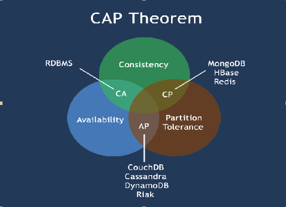

Consul 是一套开源的分布式服务发现和配置管理系统，由 HashiCorp 公司用 Go 语言开发。

提供了微服务系统中的服务治理、配置中心、控制总线等功能。这些功能中的每一个都可以根据需要单独使用，也可以一起使用以构建全方位的服务网格，总之Consul提供了一种完整的服务网格解决方案。

它具有很多优点。包括： 基于 raft 协议，比较简洁； 支持健康检查, 同时支持 HTTP 和 DNS 协议 支持跨数据中心的 WAN 集群 提供图形界面 跨平台，支持 Linux、Mac、Windows

具体的特性如下:

1. 服务发现(提供HTTP和DNS两种发现方式)
2. 健康检测(支持多种方式，HTTP、TCP、Docker、Shell脚本定制化监控)
3. KV存储(Key、Value的存储方式)
4. 多数据中心(Consul支持多数据中心)
5. 可视化Web界面

下载地址:https://www.consul.io/downloads.html

consul中文参考文档:https://www.springcloud.cc/spring-cloud-consul.html

英文参考手册：https://www.consul.io/docs/v1.11.x

本篇使用的是consul 1.11.4，LINUX BINARY版下载地址：https://releases.hashicorp.com/consul/1.11.4/consul_1.11.4_linux_amd64.zip

## ubuntu安装consul

1. consul安装

1.1 从https://www.consul.io/downloads下载对应版本的consul，然后使用 sudo unzip ... -d /usr/local/bin/ 将consul解压缩至/usr/local/bin目录;

1.2 命令行安装：

```bash
curl -fsSL https://apt.releases.hashicorp.com/gpg | sudo apt-key add -
sudo apt-add-repository "deb [arch=amd64] https://apt.releases.hashicorp.com $(lsb_release -cs) main"
sudo apt-get update && sudo apt-get install consul
```

2. 使用consul -h 测试consul是否安装成功.如果打印出consul的参数列表.表示安装成功.

3. 使用consul agent -dev可以启动consul

4. 在终端输入 consul members 可以查看集群中有多少个成员

5. consul info 查看当前consul 信息

6. 可以使用http:*//localhost:8500/ui* 进行访问

7. 如果想其他机器可以访问，可以在-client加上指定机器的ip，0.0.0.0表示允许所有ip访问

```bash
consul agent -dev -ui -node=consul-dev -client=0.0.0.0
```

访问:http://192.168.8.129:8500/,此处192.168.8.129为虚拟机的ip地址


补充：

查看该端口的占用情况 

```css
lsof -i:端口号 
```

关闭进程 

```javascript
kill PID
```

## 服务提供者

完整项目地址:[https://gitee.com/codinginn/SpringCloudTurorial](https://gitee.com/codinginn/SpringCloudTurorial)

新建006-cloud-provider-payment-consul-8004

pom.xml

```xml
<?xml version="1.0" encoding="UTF-8"?>
<project xmlns="http://maven.apache.org/POM/4.0.0"
         xmlns:xsi="http://www.w3.org/2001/XMLSchema-instance"
         xsi:schemaLocation="http://maven.apache.org/POM/4.0.0 http://maven.apache.org/xsd/maven-4.0.0.xsd">
    <parent>
        <artifactId>SpringCloudModules</artifactId>
        <groupId>com.hashnode</groupId>
        <version>1.0-SNAPSHOT</version>
    </parent>
    <modelVersion>4.0.0</modelVersion>

    <artifactId>006-cloud-provider-payment-consul-8004</artifactId>

    <properties>
        <maven.compiler.source>8</maven.compiler.source>
        <maven.compiler.target>8</maven.compiler.target>
    </properties>


    <dependencies>
        <dependency>
            <groupId>org.springframework.boot</groupId>
            <artifactId>spring-boot-starter-web</artifactId>
        </dependency>

        <dependency>
            <groupId>org.springframework.boot</groupId>
            <artifactId>spring-boot-starter-actuator</artifactId>
        </dependency>

        <dependency>
            <groupId>org.springframework.boot</groupId>
            <artifactId>spring-boot-starter-test</artifactId>
            <scope>test</scope>
            <exclusions>
                <exclusion>
                    <groupId>org.junit.vintage</groupId>
                    <artifactId>junit-vintage-engine</artifactId>
                </exclusion>
            </exclusions>
        </dependency>

        <!--eureka-client-->
<!--        <dependency>-->
<!--            <groupId>org.springframework.cloud</groupId>-->
<!--            <artifactId>spring-cloud-starter-netflix-eureka-client</artifactId>-->
<!--        </dependency>-->

        <!--zookeeper客户端-->
<!--        <dependency>-->
<!--            <groupId>org.springframework.cloud</groupId>-->
<!--            <artifactId>spring-cloud-starter-zookeeper-discovery</artifactId>-->
<!--&lt;!&ndash;            排除自带的zookeeper解决版本冲突问题1&ndash;&gt;-->
<!--&lt;!&ndash;            <exclusions>&ndash;&gt;-->
<!--&lt;!&ndash;                <exclusion>&ndash;&gt;-->
<!--&lt;!&ndash;                    <groupId>org.apache.zookeeper</groupId>&ndash;&gt;-->
<!--&lt;!&ndash;                    <artifactId>zookeeper</artifactId>&ndash;&gt;-->
<!--&lt;!&ndash;                </exclusion>&ndash;&gt;-->
<!--&lt;!&ndash;            </exclusions>&ndash;&gt;-->
<!--        </dependency>-->

        <!--            排除自带的zookeeper解决版本冲突问题2-->
        <!--添加zookeeper3.7.0版本-->
<!--        <dependency>-->
<!--            <groupId>org.apach.zookeeper</groupId>-->
<!--            <artifactId>zookeeper</artifactId>-->
<!--            <version>3.4.9</version>-->
<!--        </dependency>-->

        <!--consul客户端-->
        <dependency>
            <groupId>org.springframework.cloud</groupId>
            <artifactId>spring-cloud-starter-consul-discovery</artifactId>
        </dependency>


        <!--        引入自定义的api通用包，包括各种实体类-->
        <dependency>
            <groupId>com.hashnode</groupId>
            <artifactId>003-cloud-api-commons</artifactId>
            <version>1.0-SNAPSHOT</version>
        </dependency>

        <!--mysql-->
        <dependency>
            <groupId>mysql</groupId>
            <artifactId>mysql-connector-java</artifactId>
        </dependency>
        <!-- druid-->
        <dependency>
            <groupId>com.alibaba</groupId>
            <artifactId>druid</artifactId>
        </dependency>
        <!-- mybatis-->
        <dependency>
            <groupId>org.mybatis.spring.boot</groupId>
            <artifactId>mybatis-spring-boot-starter</artifactId>
        </dependency>
        <!--junit-->
        <dependency>
            <groupId>junit</groupId>
            <artifactId>junit</artifactId>
        </dependency>
        <!--log4j-->
        <dependency>
            <groupId>log4j</groupId>
            <artifactId>log4j</artifactId>
        </dependency>
        <!--SpringBoot Thymeleaf依赖-->
        <dependency>
            <groupId>org.springframework.boot</groupId>
            <artifactId>spring-boot-starter-thymeleaf</artifactId>
        </dependency>
        <!--添加Bootstrap WarJar的依赖-->
        <dependency>
            <groupId>org.webjars</groupId>
            <artifactId>bootstrap</artifactId>
        </dependency>

        <dependency>
            <groupId>org.projectlombok</groupId>
            <artifactId>lombok</artifactId>
        </dependency>


    </dependencies>


</project>
```

application.yml

```yml
server:
  port: 8004

spring:
  application:
    name: cloud-payment-service

  cloud:
    consul:
      host: 192.168.8.129
      port: 8500
      discovery:
        service-name: ${spring.application.name}

  datasource:
    type: com.alibaba.druid.pool.DruidDataSource    #当前数据源操作类型
    driver-class-name: org.gjt.mm.mysql.Driver      #mysql驱动包
    url: jdbc:mysql://192.168.1.101:3306/springboot?useUnicode=true&characterEncoding=UTF-8&useJDBCCompliantTimezoneShift=true&useLegacyDateTimeCode=false&serverTimezone=GMT%2B8
    username: root
    password: root


mybatis:
  mapper-locations:
    - classpath:mapper/*.xml
  type-aliases-package: com.hashnode.model      #所有model所在包
```

主启动

```java
package com.hashnode;

import org.mybatis.spring.annotation.MapperScan;
import org.springframework.boot.SpringApplication;
import org.springframework.boot.autoconfigure.SpringBootApplication;
import org.springframework.cloud.client.discovery.EnableDiscoveryClient;
import org.springframework.context.ConfigurableApplicationContext;

@SpringBootApplication
@MapperScan("com.hashnode.mapper")
//@EnableEurekaClient
@EnableDiscoveryClient//该注解用于向使用consul或者zookeeper作为注册中心时注册服务
public class PaymentMainZookeeperConsul8004 {
    public static void main(String[] args) {
        ConfigurableApplicationContext run = SpringApplication.run(PaymentMainZookeeperConsul8004.class, args);
//        PaymentService paymentService = run.getBean(PaymentService.class);
//        List<Payment> result = paymentService.getAllPayment();
//        for (int i=0;i<result.size();i++){
//            System.out.println(result.get(i));
//        }
    }
}
```

业务类

```java
package com.hashnode.controller;

import com.hashnode.model.CommonResult;
import com.hashnode.model.Payment;
import com.hashnode.service.PaymentService;

import lombok.extern.slf4j.Slf4j;
import org.springframework.beans.factory.annotation.Value;
import org.springframework.cloud.client.ServiceInstance;
import org.springframework.cloud.client.discovery.DiscoveryClient;
import org.springframework.cloud.client.discovery.EnableDiscoveryClient;
import org.springframework.web.bind.annotation.*;

import javax.annotation.Resource;
import java.util.List;
import java.util.UUID;

@RestController
@Slf4j
public class PaymentController {
    @Resource
    private PaymentService paymentService;

    @Value("${server.port}")
    private String serverPort;

    @Resource
    private DiscoveryClient discoveryClient;


    @PostMapping(value = "/payment/create")
    public CommonResult create(@RequestBody Payment payment){
        int result = paymentService.createPaymentSelective(payment);
        log.info("插入结果"+result);

        if(result > 0){
            return new CommonResult(200,"插入数据库成功 port:"+serverPort,payment);
        }else{
            return new CommonResult(444,"插入数据库失败",null);
        }
    }

    @GetMapping(value = "/payment/get/{id}")
    public CommonResult<Payment> getPaymentById(@PathVariable("id") Long id){
        System.out.println(111);
        Payment result = paymentService.getPaymentById(id);
        log.info("查询结果"+result);

        if(result != null){
            return new CommonResult(200,"查询成功+ip:"+serverPort,result);
        }else {
            return new CommonResult(444,"没有对应记录,查询ID:"+id);
        }

    }

    @GetMapping(value = "/payment/discovery")
    public Object discovery(){
        List<String> services = discoveryClient.getServices();
        for (String service : services) {
            log.info("******element"+service);
        }

        List<ServiceInstance> instances = discoveryClient.getInstances("CLOUD-PAYMENT-SERVICE");

        for (ServiceInstance instance : instances){
            log.info(instance.getServiceId()+"\t" + instance.getHost()+"\t"+instance.getPort() + "\t" + instance.getUri());
        }

        return this.discoveryClient;
    }
}
```

测试


## 服务消费者

新建006-cloud-provider-consul-order80

pom.xml

```xml
<?xml version="1.0" encoding="UTF-8"?>
<project xmlns="http://maven.apache.org/POM/4.0.0"
         xmlns:xsi="http://www.w3.org/2001/XMLSchema-instance"
         xsi:schemaLocation="http://maven.apache.org/POM/4.0.0 http://maven.apache.org/xsd/maven-4.0.0.xsd">
    <parent>
        <artifactId>SpringCloudModules</artifactId>
        <groupId>com.hashnode</groupId>
        <version>1.0-SNAPSHOT</version>
    </parent>
    <modelVersion>4.0.0</modelVersion>

    <artifactId>006-cloud-provider-consul-order80</artifactId>

    <properties>
        <maven.compiler.source>8</maven.compiler.source>
        <maven.compiler.target>8</maven.compiler.target>
    </properties>

    <dependencies>
        <dependency>
            <groupId>org.springframework.boot</groupId>
            <artifactId>spring-boot-starter-web</artifactId>
        </dependency>

        <dependency>
            <groupId>org.springframework.boot</groupId>
            <artifactId>spring-boot-starter-actuator</artifactId>
        </dependency>

        <dependency>
            <groupId>org.springframework.boot</groupId>
            <artifactId>spring-boot-starter-test</artifactId>
            <scope>test</scope>
            <exclusions>
                <exclusion>
                    <groupId>org.junit.vintage</groupId>
                    <artifactId>junit-vintage-engine</artifactId>
                </exclusion>
            </exclusions>
        </dependency>

        <!--eureka-client-->
        <!--        <dependency>-->
        <!--            <groupId>org.springframework.cloud</groupId>-->
        <!--            <artifactId>spring-cloud-starter-netflix-eureka-client</artifactId>-->
        <!--        </dependency>-->

        <!--zookeeper客户端-->
        <!--        <dependency>-->
        <!--            <groupId>org.springframework.cloud</groupId>-->
        <!--            <artifactId>spring-cloud-starter-zookeeper-discovery</artifactId>-->
        <!--&lt;!&ndash;            排除自带的zookeeper解决版本冲突问题1&ndash;&gt;-->
        <!--&lt;!&ndash;            <exclusions>&ndash;&gt;-->
        <!--&lt;!&ndash;                <exclusion>&ndash;&gt;-->
        <!--&lt;!&ndash;                    <groupId>org.apache.zookeeper</groupId>&ndash;&gt;-->
        <!--&lt;!&ndash;                    <artifactId>zookeeper</artifactId>&ndash;&gt;-->
        <!--&lt;!&ndash;                </exclusion>&ndash;&gt;-->
        <!--&lt;!&ndash;            </exclusions>&ndash;&gt;-->
        <!--        </dependency>-->

        <!--            排除自带的zookeeper解决版本冲突问题2-->
        <!--添加zookeeper3.7.0版本-->
        <!--        <dependency>-->
        <!--            <groupId>org.apach.zookeeper</groupId>-->
        <!--            <artifactId>zookeeper</artifactId>-->
        <!--            <version>3.4.9</version>-->
        <!--        </dependency>-->

        <!--consul客户端-->
        <dependency>
            <groupId>org.springframework.cloud</groupId>
            <artifactId>spring-cloud-starter-consul-discovery</artifactId>
        </dependency>

<!--        引入自定义的api通用包，包括各种实体类-->
        <dependency>
            <groupId>com.hashnode</groupId>
            <artifactId>003-cloud-api-commons</artifactId>
            <version>1.0-SNAPSHOT</version>
        </dependency>

        <dependency>
            <groupId>cn.hutool</groupId>
            <artifactId>hutool-all</artifactId>
            <version>5.1.0</version>
        </dependency>

        <!--mysql-->
        <dependency>
            <groupId>mysql</groupId>
            <artifactId>mysql-connector-java</artifactId>
        </dependency>
        <!-- druid-->
        <dependency>
            <groupId>com.alibaba</groupId>
            <artifactId>druid</artifactId>
        </dependency>
        <!-- mybatis 如果引入此依赖，springboot在启动的时候会在application.**中寻找数据库连接信息，如果找不到，则报错-->
<!--        <dependency>-->
<!--            <groupId>org.mybatis.spring.boot</groupId>-->
<!--            <artifactId>mybatis-spring-boot-starter</artifactId>-->
<!--        </dependency>-->
        <!--junit-->
        <dependency>
            <groupId>junit</groupId>
            <artifactId>junit</artifactId>
        </dependency>
        <!--log4j-->
        <dependency>
            <groupId>log4j</groupId>
            <artifactId>log4j</artifactId>
        </dependency>
        <!--SpringBoot Thymeleaf依赖-->
        <dependency>
            <groupId>org.springframework.boot</groupId>
            <artifactId>spring-boot-starter-thymeleaf</artifactId>
        </dependency>
        <!--添加Bootstrap WarJar的依赖-->
        <dependency>
            <groupId>org.webjars</groupId>
            <artifactId>bootstrap</artifactId>
        </dependency>

        <dependency>
            <groupId>org.projectlombok</groupId>
            <artifactId>lombok</artifactId>
        </dependency>


    </dependencies>

</project>
```

application.yml

```yml
server:
  port: 80

spring:
  application:
    name: cloud-order-service
  cloud:
    consul:
      host: 192.168.8.129
      port: 8500
      discovery:
        service-name: ${spring.application.name}
  datasource:
    type: com.alibaba.druid.pool.DruidDataSource    #当前数据源操作类型
    driver-class-name: org.gjt.mm.mysql.Driver      #mysql驱动包
    url: jdbc:mysql://127.0.0.1:3306/springboot?useUnicode=true&characterEncoding=UTF-8&useJDBCCompliantTimezoneShift=true&useLegacyDateTimeCode=false&serverTimezone=GMT%2B8
    username: root
    password: root
```

主启动

```java
package com.hashnode;

import org.springframework.boot.SpringApplication;
import org.springframework.boot.autoconfigure.SpringBootApplication;
import org.springframework.cloud.client.discovery.EnableDiscoveryClient;
import org.springframework.context.ConfigurableApplicationContext;

@SpringBootApplication
//@EnableEurekaClient
@EnableDiscoveryClient//该注解用于向使用consul或者zookeeper作为注册中心时注册服务
public class OrderMainConsul80 {
    public static void main(String[] args) {
        ConfigurableApplicationContext run = SpringApplication.run(OrderMainConsul80.class, args);
    }
}
```

配置Bean

```java
package com.hashnode.config;

import com.hashnode.model.Payment;
import org.springframework.cloud.client.loadbalancer.LoadBalanced;
import org.springframework.context.annotation.Bean;
import org.springframework.context.annotation.Configuration;
import org.springframework.web.client.RestTemplate;

@Configuration
public class ApplicationContextConfig {

    @Bean
    @LoadBalanced //负载均衡使用，从eureka寻找服务所在的域名
    public RestTemplate getRestTemplate(){
        return new RestTemplate();
    }
}
```

Controller

```java
package com.hashnode.controller;

import com.hashnode.model.CommonResult;
import com.hashnode.model.Payment;
import lombok.extern.slf4j.Slf4j;
import org.springframework.beans.factory.annotation.Autowired;
import org.springframework.http.ResponseEntity;
import org.springframework.web.bind.annotation.GetMapping;
import org.springframework.web.bind.annotation.PathVariable;
import org.springframework.web.bind.annotation.RestController;
import org.springframework.web.client.RestTemplate;

@RestController
@Slf4j
public class OrderController {

//    public static final String PAYMENT_URL = "http://localhost:8001";
    public static final String PAYMENT_URL = "http://cloud-payment-service";

    @Autowired
    private RestTemplate restTemplate;

    @GetMapping("/consumer/payment/create")
    public CommonResult<Payment> create(Payment payment){
        return restTemplate.postForObject(PAYMENT_URL+"/payment/create",payment,CommonResult.class);
    }

    @GetMapping("/consumer/payment/get/{id}")
    public CommonResult<Payment> getPayment(@PathVariable("id")Long id){
        return restTemplate.getForObject(PAYMENT_URL+"/payment/get/"+id,CommonResult.class);
    }

    @GetMapping("/consumer/payment2/get/{id}")
    public CommonResult<Payment> getPayment2(@PathVariable("id")Long id){
        ResponseEntity<CommonResult> entity = restTemplate.getForEntity(PAYMENT_URL+"/payment/get/"+id,CommonResult.class);
        if(entity.getStatusCode().is2xxSuccessful()){
            return entity.getBody();
        }else{
            return new CommonResult<>(444,"操作失败");
        }
    }
}
```

测试


## Eureka Consul Zookeeper三者区别




CAP:

C:Consistency（强一致性）

A:Availability（可用性）

P:Partition tolerance（分区容错性）

 CAP理论的核心是：一个分布式系统不可能同时很好的满足一致性，可用性和分区容错性这三个需求，因此，根据 CAP 原理将 NoSQL 数据库分成了满足 CA 原则、满足 CP 原则和满足 AP 原则三大类：
	CA - 单点集群，满足一致性，可用性的系统，通常在可扩展性上不太强大。
	CP - 满足一致性，通常性能不是特别高。
	AP - 满足可用性，通常可能对一致性要求低一些。