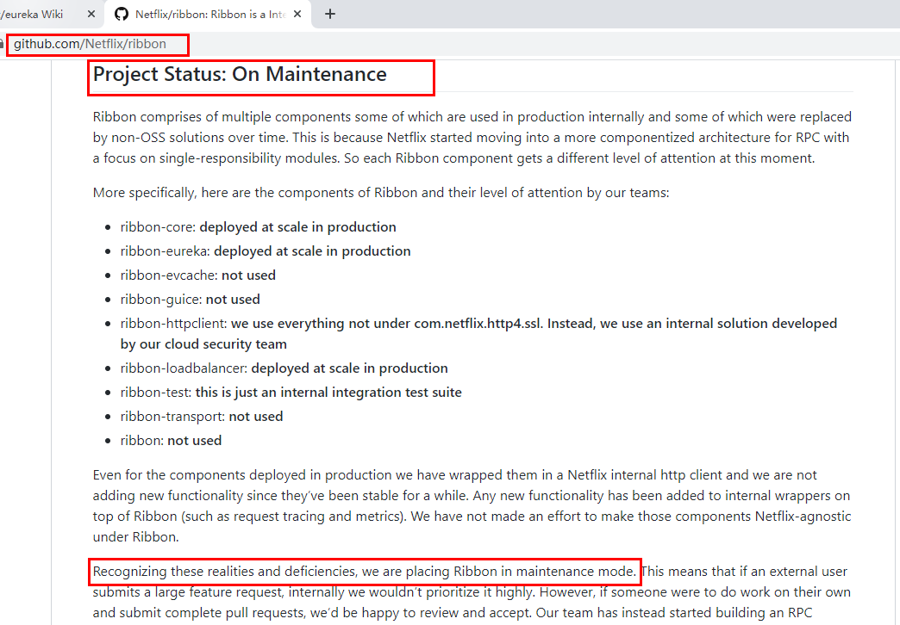
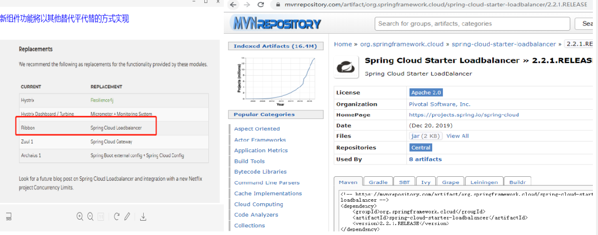
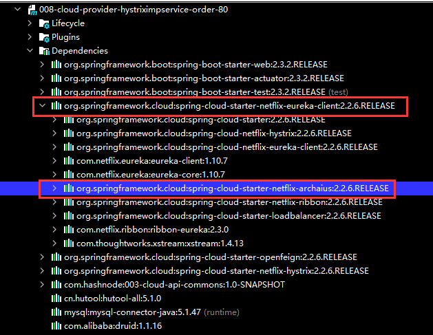
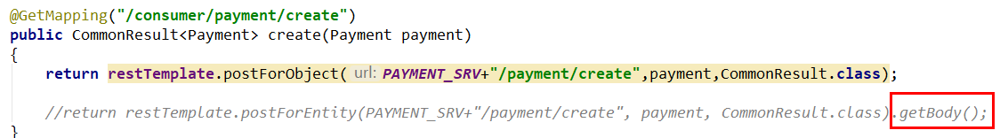
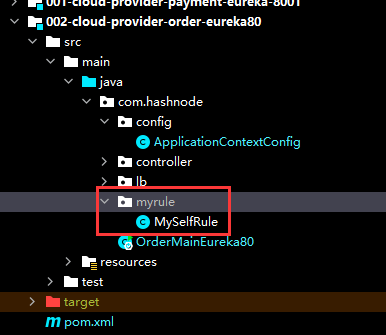
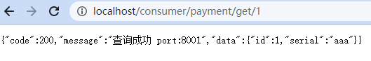
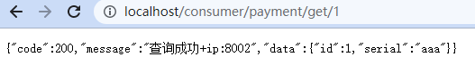
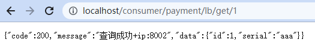
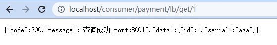

Spring Cloud Ribbon是基于Netflix Ribbon实现的一套客户端负载均衡的工具。

简单的说，Ribbon是Netflix发布的开源项目，主要功能是提供客户端的软件负载均衡算法和服务调用。Ribbon客户端组件提供一系列完善的配置项如连接超时，重试等。简单的说，就是在配置文件中列出Load Balancer（简称LB）后面所有的机器，Ribbon会自动的帮助我们基于某种规则（如简单轮询，随机连接等）去连接这些机器,我们很容易使用Ribbon实现自定义的负载均衡算法。一句话总结就是Ribbon赋予了RestTemplate负载均衡的能力,并且使用户可以自定义负载均衡算法。

官网资料:

https://github.com/Netflix/ribbon/wiki/Getting-Started

Ribbon目前已经进入维护模式:



未来的替换方案:



## Ribbon负载均衡演示


Ribbon在工作时分成两步。第一步先选择 EurekaServer ,它优先选择在同一个区域内负载较少的server；第二步再根据用户指定的策略，在从server取到的服务注册列表中选择一个地址。其中Ribbon提供了多种策略：比如轮询、随机和根据响应时间加权等。

spring-cloud-starter-netflix-eureka-client自带了spring-cloud-starter-ribbon引用:

```xml
<!--Eureka的依赖中包含了Ribbon依赖-->
<dependency>
    <groupId>org.springframework.cloud</groupId>
    <artifactId>spring-cloud-starter-netflix-eureka-client</artifactId>
</dependency>


<!--在没有使用Eureka的情况下，可以单独添加-->
<!-- <dependency>
    <groupId>org.springframework.cloud</groupId>
    <artifactId>spring-cloud-starter-netflix-ribbon</artifactId>
</dependency> -->
```



## RestTemplate的使用

官网：[https://docs.spring.io/spring-framework/docs/5.2.2.RELEASE/javadoc-api/org/springframework/web/client/RestTemplate.html](https://docs.spring.io/spring-framework/docs/5.2.2.RELEASE/javadoc-api/org/springframework/web/client/RestTemplate.html)

### getForObject方法getForEntity方法

返回对象为响应体中数据转化成的对象，基本上可以理解为Json


返回对象为ResponseEntity对象，包含了响应中的一些重要信息，比如响应头、响应状态码、响应体等


### getForObject/postForEntity



### GET请求方法


<T> T getForObject(String url, Class<T> responseType, Object... uriVariables);

<T> T getForObject(String url, Class<T> responseType, Map<String, ?> uriVariables);

<T> T getForObject(URI url, Class<T> responseType);

<T> ResponseEntity<T> getForEntity(String url, Class<T> responseType, Object... uriVariables);

<T> ResponseEntity<T> getForEntity(String url, Class<T> responseType, Map<String, ?> uriVariables);

<T> ResponseEntity<T> getForEntity(URI var1, Class<T> responseType);

### POST请求方法


<T> T postForObject(String url, @Nullable Object request, Class<T> responseType, Object... uriVariables);

<T> T postForObject(String url, @Nullable Object request, Class<T> responseType, Map<String, ?> uriVariables);

<T> T postForObject(URI url, @Nullable Object request, Class<T> responseType);

<T> ResponseEntity<T> postForEntity(String url, @Nullable Object request, Class<T> responseType, Object... uriVariables);

<T> ResponseEntity<T> postForEntity(String url, @Nullable Object request, Class<T> responseType, Map<String, ?> uriVariables);

<T> ResponseEntity<T> postForEntity(URI url, @Nullable Object request, Class<T> responseType);

## Ribbon核心组件IRule

IRule：根据特定算法中从服务列表中选取一个要访问的服务


+ com.netflix.loadbalancer.RoundRobinRule

轮询

+ com.netflix.loadbalancer.RandomRule

随机

+ com.netflix.loadbalancer.RetryRule

先按照RoundRobinRule的策略获取服务，如果获取服务失败则在指定时间内会进行重试，获取可用的服务

+ WeightedResponseTimeRule

对RoundRobinRule的扩展，响应速度越快的实例选择权重越大，越容易被选择

+ BestAvailableRule

会先过滤掉由于多次访问故障而处于断路器跳闸状态的服务，然后选择一个并发量最小的服务

+ AvailabilityFilteringRule

先过滤掉故障实例，再选择并发较小的实例

+ ZoneAvoidanceRule

默认规则,复合判断server所在区域的性能和server的可用性选择服务器

### 修改002-cloud-provider-order-eureka80,修改默认的负载均衡算法

新建package,com.hashnode.myrule,并在该包下新建MySelfRule.java



+ MySelfRule.java

```java
package com.hashnode.myrule;

import com.netflix.loadbalancer.IRule;
import com.netflix.loadbalancer.RandomRule;
import com.netflix.loadbalancer.RoundRobinRule;
import org.springframework.context.annotation.Bean;
import org.springframework.context.annotation.Configuration;

@Configuration //自定义负载均衡策略
public class MySelfRule {
    @Bean
    public IRule myrule(){
//        return new RandomRule();//定义为随机
        return new RoundRobinRule();//定义为轮询
    }
}
```

主启动类

```java
package com.hashnode;

import com.hashnode.myrule.MySelfRule;
import org.springframework.boot.SpringApplication;
import org.springframework.boot.autoconfigure.SpringBootApplication;
import org.springframework.cloud.netflix.eureka.EnableEurekaClient;
import org.springframework.cloud.netflix.ribbon.RibbonClient;
import org.springframework.context.ConfigurableApplicationContext;

@SpringBootApplication
@EnableEurekaClient
public class OrderMainEureka80 {
    public static void main(String[] args) {
        ConfigurableApplicationContext run = SpringApplication.run(OrderMainEureka80.class, args);
    }
}
```

+ ApplicationContextConfig.java

```java
@Configuration
public class ApplicationContextConfig {

    @Bean
    @LoadBalanced //负载均衡使用，从eureka寻找服务所在的域名   如果使用自定义的负载均衡(@RibbonClient(name = "CLOUD-ORDER-SERVICE",configuration = MySelfRule.class))，则不能使用此注解
    public RestTemplate getRestTemplate(){
        return new RestTemplate();
    }
}
```

测试





## 自定义负载均衡策略

1.ApplicationContextBean去掉注解@LoadBalanced

```java
package com.hashnode.config;

import com.hashnode.model.Payment;
import org.springframework.cloud.client.loadbalancer.LoadBalanced;
import org.springframework.context.annotation.Bean;
import org.springframework.context.annotation.Configuration;
import org.springframework.web.client.RestTemplate;

@Configuration
public class ApplicationContextConfig {

    @Bean
    //@LoadBalanced //负载均衡使用，从eureka寻找服务所在的域名   如果使用ribbon的负载均衡(@RibbonClient(name = "CLOUD-ORDER-SERVICE",configuration = MySelfRule.class))，则不能使用此注解
    public RestTemplate getRestTemplate(){
        return new RestTemplate();
    }

    @Bean
    public Payment getPayment(){
        return new Payment(0L,"000");
    }

}
```

2.LoadBalancer接口

+ LoadBalancer.java

```java
package com.hashnode.lb;

import org.springframework.cloud.client.ServiceInstance;
import java.util.List;

//自定义负载均衡策略，拿到相应的ServiceInstance
public interface LoadBalancer {
    ServiceInstance instance(List<ServiceInstance> serviceInstaces);
}
```

3.MyLB

+ LoadBalancerImpl.java

```java
package com.hashnode.lb.MyLB;

import com.hashnode.lb.LoadBalancer;
import org.springframework.cloud.client.ServiceInstance;
import org.springframework.stereotype.Component;

import java.util.List;
import java.util.concurrent.atomic.AtomicInteger;

@Component
public class LoadBalancerImpl implements LoadBalancer {
    private AtomicInteger atomicInteger = new AtomicInteger(0);

    public final int getAndIncreament(){

        for(;;){
            int current = atomicInteger.get();
            int next = current >= 2147483647 ? 0 : current + 1;
            if(atomicInteger.compareAndSet(current,next)){
                return next;
            }

        }
    }

    @Override
    public ServiceInstance instance(List<ServiceInstance> serviceInstaces) {
        int index = atomicInteger.addAndGet(1) % serviceInstaces.size();
        return serviceInstaces.get(index);
    }
}
```

4.OrderController

```java
package com.hashnode.lb.MyLB;

import com.hashnode.lb.LoadBalancer;
import org.springframework.cloud.client.ServiceInstance;
import org.springframework.stereotype.Component;

import java.util.List;
import java.util.concurrent.atomic.AtomicInteger;

@Component
public class LoadBalancerImpl implements LoadBalancer {
    private AtomicInteger atomicInteger = new AtomicInteger(0);

    public final int getAndIncreament(){

        for(;;){
            int current = atomicInteger.get();
            int next = current >= 2147483647 ? 0 : current + 1;
            if(atomicInteger.compareAndSet(current,next)){
                return next;
            }

        }
    }

    @Override
    public ServiceInstance instance(List<ServiceInstance> serviceInstaces) {
//        int index = atomicInteger.addAndGet(1) % serviceInstaces.size();
        int index = getAndIncreament() % serviceInstaces.size();
        return serviceInstaces.get(index);
    }
}

```

5.测试



