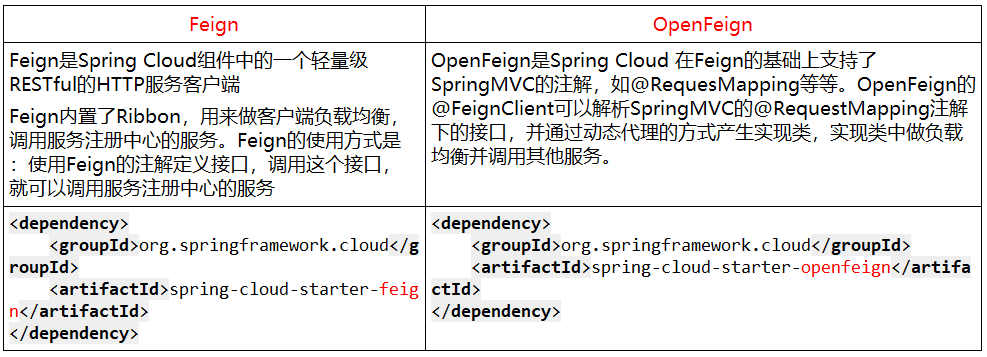

OpenFeign是一个声明式的Web服务客户端，让编写Web服务客户端变得非常容易，只需创建一个接口并在接口上添加注解即可。

GitHub地址：[https://github.com/spring-cloud/spring-cloud-openfeign](https://github.com/spring-cloud/spring-cloud-openfeign)

## Feign能干什么

Feign旨在使编写Java Http**客户端**变得更容易。前面在使用Ribbon+RestTemplate时，利用RestTemplate对http请求的封装处理，形成了一套模版化的调用方法。但是在实际开发中，由于对服务依赖的调用可能不止一处，往往一个接口会被多处调用，所以通常都会针对每个微服务自行封装一些客户端类来包装这些依赖服务的调用。所以，Feign在此基础上做了进一步封装，由他来帮助我们定义和实现依赖服务接口的定义。在Feign的实现下，我们只需创建一个接口并使用注解的方式来配置它(一个微服务接口上面标注一个Feign注解即可)，即可完成对服务提供方的接口绑定。

## Feign集成了Ribbon

与Ribbon不同的是，通过Feign只需要定义服务绑定接口即可优雅而简单的进行服务调用。

## Feign和OpenFeign的区别



## OpenFeign使用步骤

微服务调用接口+@FeignClient

### 新建007-cloud-provider-order-openfeign80

### pom.xml

```xml
<?xml version="1.0" encoding="UTF-8"?>
<project xmlns="http://maven.apache.org/POM/4.0.0"
         xmlns:xsi="http://www.w3.org/2001/XMLSchema-instance"
         xsi:schemaLocation="http://maven.apache.org/POM/4.0.0 http://maven.apache.org/xsd/maven-4.0.0.xsd">
    <parent>
        <artifactId>SpringCloudModules</artifactId>
        <groupId>com.hashnode</groupId>
        <version>1.0-SNAPSHOT</version>
    </parent>
    <modelVersion>4.0.0</modelVersion>

    <artifactId>007-cloud-provider-order-openfeign80</artifactId>

    <properties>
        <maven.compiler.source>8</maven.compiler.source>
        <maven.compiler.target>8</maven.compiler.target>
    </properties>

    <dependencies>
        <dependency>
            <groupId>org.springframework.boot</groupId>
            <artifactId>spring-boot-starter-web</artifactId>
        </dependency>

        <dependency>
            <groupId>org.springframework.boot</groupId>
            <artifactId>spring-boot-starter-actuator</artifactId>
        </dependency>

        <dependency>
            <groupId>org.springframework.boot</groupId>
            <artifactId>spring-boot-starter-test</artifactId>
            <scope>test</scope>
            <exclusions>
                <exclusion>
                    <groupId>org.junit.vintage</groupId>
                    <artifactId>junit-vintage-engine</artifactId>
                </exclusion>
            </exclusions>
        </dependency>

        <!--eureka-client-->
        <dependency>
            <groupId>org.springframework.cloud</groupId>
            <artifactId>spring-cloud-starter-netflix-eureka-client</artifactId>
        </dependency>

        <!--openfeign-->
        <dependency>
            <groupId>org.springframework.cloud</groupId>
            <artifactId>spring-cloud-starter-openfeign</artifactId>
        </dependency>

        <!--zookeeper客户端-->
        <!--        <dependency>-->
        <!--            <groupId>org.springframework.cloud</groupId>-->
        <!--            <artifactId>spring-cloud-starter-zookeeper-discovery</artifactId>-->
        <!--&lt;!&ndash;            排除自带的zookeeper解决版本冲突问题1&ndash;&gt;-->
        <!--&lt;!&ndash;            <exclusions>&ndash;&gt;-->
        <!--&lt;!&ndash;                <exclusion>&ndash;&gt;-->
        <!--&lt;!&ndash;                    <groupId>org.apache.zookeeper</groupId>&ndash;&gt;-->
        <!--&lt;!&ndash;                    <artifactId>zookeeper</artifactId>&ndash;&gt;-->
        <!--&lt;!&ndash;                </exclusion>&ndash;&gt;-->
        <!--&lt;!&ndash;            </exclusions>&ndash;&gt;-->
        <!--        </dependency>-->

        <!--            排除自带的zookeeper解决版本冲突问题2-->
        <!--添加zookeeper3.7.0版本-->
        <!--        <dependency>-->
        <!--            <groupId>org.apach.zookeeper</groupId>-->
        <!--            <artifactId>zookeeper</artifactId>-->
        <!--            <version>3.4.9</version>-->
        <!--        </dependency>-->


<!--        引入自定义的api通用包，包括各种实体类-->
        <dependency>
            <groupId>com.hashnode</groupId>
            <artifactId>003-cloud-api-commons</artifactId>
            <version>1.0-SNAPSHOT</version>
        </dependency>

        <dependency>
            <groupId>cn.hutool</groupId>
            <artifactId>hutool-all</artifactId>
            <version>5.1.0</version>
        </dependency>

        <!--mysql-->
        <dependency>
            <groupId>mysql</groupId>
            <artifactId>mysql-connector-java</artifactId>
        </dependency>
        <!-- druid-->
        <dependency>
            <groupId>com.alibaba</groupId>
            <artifactId>druid</artifactId>
        </dependency>
        <!-- mybatis 如果引入此依赖，springboot在启动的时候会在application.**中寻找数据库连接信息，如果找不到，则报错-->
<!--        <dependency>-->
<!--            <groupId>org.mybatis.spring.boot</groupId>-->
<!--            <artifactId>mybatis-spring-boot-starter</artifactId>-->
<!--        </dependency>-->
        <!--junit-->
        <dependency>
            <groupId>junit</groupId>
            <artifactId>junit</artifactId>
        </dependency>
        <!--log4j-->
        <dependency>
            <groupId>log4j</groupId>
            <artifactId>log4j</artifactId>
        </dependency>
        <!--SpringBoot Thymeleaf依赖-->
        <dependency>
            <groupId>org.springframework.boot</groupId>
            <artifactId>spring-boot-starter-thymeleaf</artifactId>
        </dependency>
        <!--添加Bootstrap WarJar的依赖-->
        <dependency>
            <groupId>org.webjars</groupId>
            <artifactId>bootstrap</artifactId>
        </dependency>

        <dependency>
            <groupId>org.projectlombok</groupId>
            <artifactId>lombok</artifactId>
        </dependency>


    </dependencies>

</project>
```

### application.yml

```yml
server:
  port: 80

spring:
  application:
    name: cloud-order-service


eureka:
  client:
    #表示是否将自己注册进EurekaServer默认为true
    register-with-eureka: true
    #是否从EurekaServer抓取已有的注册信息，默认为true,单节点无所谓，集群必须设置为true才能配合ribbon使用负载均衡
    fetch-registry: true
    service-url:
      defaultZone: http://localhost:7001/eureka,http://localhost:7002/eureka,http://localhost:7003/eureka

#      设置feign客户端超时时间 Openfeign默认支持ribbon
ribbon:
#      指的是建立连接所用的时间，适用于网络情况正常的情况下，两端连接所用的时间
  ReadTimeout: 5000
#      指的是建立连接后从服务器读取到可用资源所用的时间
  ConnectTimout: 5000


#日志相关
logging:
  level:
    com.hashnode.service.PaymentFeignService: debug
```

### 主启动

```java
package com.hashnode;

import com.hashnode.myrule.MySelfRule;
import org.springframework.boot.SpringApplication;
import org.springframework.boot.autoconfigure.SpringBootApplication;
import org.springframework.cloud.netflix.eureka.EnableEurekaClient;
import org.springframework.cloud.netflix.ribbon.RibbonClient;
import org.springframework.cloud.openfeign.EnableFeignClients;
import org.springframework.context.ConfigurableApplicationContext;

@SpringBootApplication
//@EnableEurekaClient
@EnableFeignClients
public class OrderMainOpenfeign80 {
    public static void main(String[] args) {
        ConfigurableApplicationContext run = SpringApplication.run(OrderMainOpenfeign80.class, args);
    }
}
```

### 业务类

新建PaymentFeignService接口并新增注解@FeignClient

```java
package com.hashnode.service;

import com.hashnode.model.CommonResult;
import com.hashnode.model.Payment;
import org.springframework.cloud.openfeign.FeignClient;
import org.springframework.stereotype.Component;
import org.springframework.web.bind.annotation.GetMapping;
import org.springframework.web.bind.annotation.PathVariable;

@Component
@FeignClient(value = "CLOUD-PAYMENT-SERVICE")
public interface PaymentFeignService {
    @GetMapping("/payment/get/{id}")
    public CommonResult<Payment> getPaymentById(@PathVariable("id")Long id);

    @GetMapping(value = "/payment/feign/timeout")
    public String paymentFeignTimeout();
}

```

### 控制层

```java
package com.hashnode.controller;

import com.hashnode.lb.LoadBalancer;
import com.hashnode.model.CommonResult;
import com.hashnode.model.Payment;
import com.hashnode.service.PaymentFeignService;
import lombok.extern.slf4j.Slf4j;
import org.springframework.beans.factory.annotation.Autowired;
import org.springframework.cloud.client.ServiceInstance;
import org.springframework.cloud.client.discovery.DiscoveryClient;
import org.springframework.web.bind.annotation.GetMapping;
import org.springframework.web.bind.annotation.PathVariable;
import org.springframework.web.bind.annotation.RestController;
import org.springframework.web.client.RestTemplate;

import javax.annotation.Resource;
import java.net.URI;
import java.util.List;

@RestController
@Slf4j
public class OrderController {
    @Autowired
    private DiscoveryClient discoveryClient;

    @Resource
    private PaymentFeignService paymentFeignService;

    @GetMapping("/consumer/payment/get/{id}")
    public CommonResult<Payment> getPaymentById(@PathVariable("id")Long id){
        return paymentFeignService.getPaymentById(id);
    }


    @GetMapping("/consumer/payment/feign/timeout")
    public String paymentFeignTimeout(){
        return paymentFeignService.paymentFeignTimeout();
    }


}

```


### 测试

先启动2个eureka集群7001/7002

再启动2个微服务8001/8002

启动OpenFeign

访问http://localhost/consumer/payment/get/1


可以看到Feign自带负载均衡的功能。

## OpenFeign超时控制

服务提供方8001故意写暂停程序演示出错情况

+ PaymentController.java

```java
package com.hashnode.controller;

import com.hashnode.model.CommonResult;
import com.hashnode.model.Payment;
import com.hashnode.service.PaymentService;
import lombok.extern.slf4j.Slf4j;
import org.springframework.beans.factory.annotation.Value;
import org.springframework.cloud.client.ServiceInstance;
import org.springframework.cloud.client.discovery.DiscoveryClient;
import org.springframework.web.bind.annotation.*;

import javax.annotation.Resource;
import java.util.List;
import java.util.concurrent.TimeUnit;

@RestController
@Slf4j
public class PaymentController {
    @Resource
    private PaymentService paymentService;

    @Value("${server.port}")
    private String serverPort;

    @Resource
    private DiscoveryClient discoveryClient;


    ...

    @GetMapping(value = "/payment/feign/timeout")
    public String paymentFeignTimeout(){
        try {
            TimeUnit.SECONDS.sleep(3);
        }catch (Exception e){
            e.printStackTrace();
        }
        return serverPort;
    }

   ...


}
```

服务消费方80添加超时方法

+ PaymentFeignService.java

```java
package com.hashnode.service;

import com.hashnode.model.CommonResult;
import com.hashnode.model.Payment;
import org.springframework.cloud.openfeign.FeignClient;
import org.springframework.stereotype.Component;
import org.springframework.web.bind.annotation.GetMapping;
import org.springframework.web.bind.annotation.PathVariable;

@Component
@FeignClient(value = "CLOUD-PAYMENT-SERVICE")
public interface PaymentFeignService {
    ...

    @GetMapping(value = "/payment/feign/timeout")
    public String paymentFeignTimeout();
}
```

测试


原因是OpenFeign默认等待1秒钟，如果响应超时会报错。为了避免这样的情况，有时候我们需要设置Feign客户端的超时控制。OpenFeign默认支持Ribbon:


如果需要设置Feign客户端的超时控制，可以在yml中添加如下配置：


## OpenFeign日志打印功能

Feign 提供了日志打印功能，我们可以通过配置来调整日志级别，从而了解 Feign 中 Http 请求的细节，说白了就是对Feign接口的调用情况进行监控和输出。

### 日志级别


NONE：默认的，不显示任何日志；

BASIC：仅记录请求方法、URL、响应状态码及执行时间；

HEADERS：除了 BASIC 中定义的信息之外，还有请求和响应的头信息；

FULL：除了 HEADERS 中定义的信息之外，还有请求和响应的正文及元数据。

### 配置日志bean

```java
package com.hashnode.config;

import feign.Logger;
import org.springframework.context.annotation.Bean;
import org.springframework.context.annotation.Configuration;

//配置日志
@Configuration
public class FeignConfig {

    @Bean
    Logger.Level feignLoggerLevel(){
        return Logger.Level.FULL;
    }
}
```

YML文件里需要开启日志的Feign客户端


后台日志查看：

