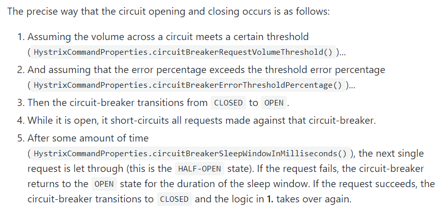

## Hystrix断路器

分布式系统面临的问题

复杂分布式体系结构中的应用程序有数十个依赖关系，每个依赖关系在某些时候将不可避免地失败。


**服务雪崩**

多个微服务之间调用的时候，假设微服务A调用微服务B和微服务C，微服务B和微服务C又调用其它的微服务，这就是所谓的“扇出”。如果扇出的链路上某个微服务的调用响应时间过长或者不可用，对微服务A的调用就会占用越来越多的系统资源，进而引起系统崩溃，所谓的“雪崩效应”.

对于高流量的应用来说，单一的后端依赖可能会导致所有服务器上的所有资源都在几秒钟内饱和。比失败更糟糕的是，这些应用程序还可能导致服务之间的延迟增加，备份队列，线程和其他系统资源紧张，导致整个系统发生更多的级联故障。这些都表示需要对故障和延迟进行隔离和管理，以便单个依赖关系的失败，不能取消整个应用程序或系统。

所以，通常当你发现一个模块下的某个实例失败后，这时候这个模块依然还会接收流量，然后这个有问题的模块还调用了其他的模块，这样就会发生级联故障，或者叫雪崩。

**Hystrix是什么**

Hystrix是一个用于处理分布式系统的延迟和容错的开源库，在分布式系统里，许多依赖不可避免的会调用失败，比如超时、异常等，Hystrix能够保证在一个依赖出问题的情况下，不会导致整体服务失败，避免级联故障，以提高分布式系统的弹性。

“断路器”本身是一种开关装置，当某个服务单元发生故障之后，通过断路器的故障监控（类似熔断保险丝），向调用方返回一个符合预期的、可处理的备选响应（FallBack），而不是长时间的等待或者抛出调用方无法处理的异常，这样就保证了服务调用方的线程不会被长时间、不必要地占用，从而避免了故障在分布式系统中的蔓延，乃至雪崩。

Hystrix可被用来进行服务降级,服务熔断,以及实时监控等。

官网资料：[https://github.com/Netflix/Hystrix/wiki/How-To-Use](https://github.com/Netflix/Hystrix/wiki/How-To-Use)

不过Hystrix已经宣布停止更新：https://github.com/Netflix/Hystrix


## Hystrix重要概念

### 服务降级

服务器忙，请稍后再试，不让客户端等待并立刻返回一个友好提示

**哪些情况会触发降级**

+ 程序运行异常

+ 超时

+ 服务熔断触发服务降级

+ 线程池/信号量打满也会导致服务降级

### 服务熔断

类比保险丝达到最大服务访问后，直接拒绝访问，拉闸限电，然后调用服务降级的方法并返回友好提示

服务的降级->进而熔断->恢复调用链路

### 服务限流

秒杀高并发等操作，严禁一窝蜂的过来拥挤，大家排队，一秒钟N个，有序进行

## Hystrix案例

新建008-cloud-provider-payment-hystrix-8001

+ pom.xml

```xml
<?xml version="1.0" encoding="UTF-8"?>
<project xmlns="http://maven.apache.org/POM/4.0.0"
         xmlns:xsi="http://www.w3.org/2001/XMLSchema-instance"
         xsi:schemaLocation="http://maven.apache.org/POM/4.0.0 http://maven.apache.org/xsd/maven-4.0.0.xsd">
    <parent>
        <artifactId>SpringCloudModules</artifactId>
        <groupId>com.hashnode</groupId>
        <version>1.0-SNAPSHOT</version>
    </parent>
    <modelVersion>4.0.0</modelVersion>

    <artifactId>008-cloud-provider-payment-hystrix-8001</artifactId>

    <properties>
        <maven.compiler.source>8</maven.compiler.source>
        <maven.compiler.target>8</maven.compiler.target>
    </properties>


    <dependencies>
        <dependency>
            <groupId>org.springframework.boot</groupId>
            <artifactId>spring-boot-starter-web</artifactId>
        </dependency>

        <dependency>
            <groupId>org.springframework.boot</groupId>
            <artifactId>spring-boot-starter-actuator</artifactId>
        </dependency>

        <dependency>
            <groupId>org.springframework.boot</groupId>
            <artifactId>spring-boot-starter-test</artifactId>
            <scope>test</scope>
            <exclusions>
                <exclusion>
                    <groupId>org.junit.vintage</groupId>
                    <artifactId>junit-vintage-engine</artifactId>
                </exclusion>
            </exclusions>
        </dependency>

        <!--eureka-client-->
        <dependency>
            <groupId>org.springframework.cloud</groupId>
            <artifactId>spring-cloud-starter-netflix-eureka-client</artifactId>
        </dependency>

<!--        使用hystrix熔断-->
        <dependency>
            <groupId>org.springframework.cloud</groupId>
            <artifactId>spring-cloud-starter-netflix-hystrix</artifactId>
        </dependency>

        <!--        引入自定义的api通用包，包括各种实体类-->
        <dependency>
            <groupId>com.hashnode</groupId>
            <artifactId>003-cloud-api-commons</artifactId>
            <version>1.0-SNAPSHOT</version>
        </dependency>

        <!--mysql-->
        <dependency>
            <groupId>mysql</groupId>
            <artifactId>mysql-connector-java</artifactId>
        </dependency>
        <!-- druid-->
        <dependency>
            <groupId>com.alibaba</groupId>
            <artifactId>druid</artifactId>
        </dependency>
        <!-- mybatis-->
        <dependency>
            <groupId>org.mybatis.spring.boot</groupId>
            <artifactId>mybatis-spring-boot-starter</artifactId>
        </dependency>
        <!--junit-->
        <dependency>
            <groupId>junit</groupId>
            <artifactId>junit</artifactId>
        </dependency>
        <!--log4j-->
        <dependency>
            <groupId>log4j</groupId>
            <artifactId>log4j</artifactId>
        </dependency>
        <!--SpringBoot Thymeleaf依赖-->
        <dependency>
            <groupId>org.springframework.boot</groupId>
            <artifactId>spring-boot-starter-thymeleaf</artifactId>
        </dependency>
        <!--添加Bootstrap WarJar的依赖-->
        <dependency>
            <groupId>org.webjars</groupId>
            <artifactId>bootstrap</artifactId>
        </dependency>

        <dependency>
            <groupId>org.projectlombok</groupId>
            <artifactId>lombok</artifactId>
        </dependency>


    </dependencies>


</project>
```

+ application.yml

```yml
server:
  port: 8001

spring:
  application:
    name: cloud-payment-service

  datasource:
    type: com.alibaba.druid.pool.DruidDataSource    #当前数据源操作类型
    driver-class-name: org.gjt.mm.mysql.Driver      #mysql驱动包
    url: jdbc:mysql://localhost:3306/springboot?useUnicode=true&characterEncoding=UTF-8&useJDBCCompliantTimezoneShift=true&useLegacyDateTimeCode=false&serverTimezone=GMT%2B8
    username: root
    password: root

eureka:
  client:
    #表示是否将自己注册进EurekaServer默认为true
    register-with-eureka: true
    #是否从EurekaServer抓取已有的注册信息，默认为true,单节点无所谓，集群必须设置为true才能配合ribbon使用负载均衡
    fetch-registry: true
    service-url:
#      defaultZone: http://eureka7001.com:7001/eureka,http://eureka7002.com:7002/eureka,http://eureka7003.com:7003/eureka
      defaultZone: http://eureka7001.com:7001/eureka
  instance:
    instance-id: payment8001
    prefer-ip-address: true   #访问路径可以显示IP地址

mybatis:
  mapper-locations:
    - classpath:mapper/*.xml
  type-aliases-package: com.hashnode.model      #所有model所在包
```

主启动

```java
package com.hashnode;

import org.mybatis.spring.annotation.MapperScan;
import org.springframework.boot.SpringApplication;
import org.springframework.boot.autoconfigure.SpringBootApplication;
import org.springframework.cloud.client.circuitbreaker.EnableCircuitBreaker;
import org.springframework.cloud.netflix.eureka.EnableEurekaClient;
import org.springframework.context.ConfigurableApplicationContext;

@SpringBootApplication
@MapperScan("com.hashnode.mapper")
@EnableEurekaClient
public class PaymentMainHystrix8001 {
    public static void main(String[] args) {
        ConfigurableApplicationContext run = SpringApplication.run(PaymentMainHystrix8001.class, args);
    }
}
```

+ PaymentService.java

```java
package com.hashnode.service;

import com.hashnode.model.Payment;

import java.util.List;

public interface PaymentService {
    public List<Payment> getAllPayment();

    public Payment getPaymentById(Long id);

    public int createPayment(Payment payment);

    public int createPaymentSelective(Payment payment);
}
```

+ PaymentServiceImpl.java

```java
package com.hashnode.service.imp;

import com.hashnode.mapper.PaymentMapper;
import com.hashnode.model.Payment;
import com.hashnode.service.PaymentService;
import org.springframework.beans.factory.annotation.Autowired;
import org.springframework.stereotype.Service;
import org.springframework.transaction.annotation.Propagation;
import org.springframework.transaction.annotation.Transactional;

import java.util.List;

@Service
@Transactional(propagation = Propagation.REQUIRED,timeout = 5)
public class PaymentServiceImpl implements PaymentService {
    @Autowired
    private PaymentMapper paymentMapper;

    @Override
    public List<Payment> getAllPayment() {
        return paymentMapper.getAllPayment();
    }

    @Override
    public Payment getPaymentById(Long id) {
        return paymentMapper.selectByPrimaryKey(id);
    }

    @Override
    public int createPayment(Payment payment) {
        return paymentMapper.insert(payment);
    }

    @Override
    public int createPaymentSelective(Payment payment) {

        return paymentMapper.insertSelective(payment);
    }
}
```

### 正常测试

先启动004-eureka-server7001，然后启动008-cloud-provider-payment-hystrix-8001。

访问：


上述在非高并发情形下，能勉强满足，但是在高并发的情形下,会出现问题,开启Jmeter进行压测:


点击运行,然后访问,发现两个服务都在转圈等待:


之所以出现这种情况,是因为tomcat的默认的工作线程数被打满 了，没有多余的线程来分解压力和处理。上面还是服务提供者8001自己测试，假如此时外部的消费者80也来访问，那消费者只能干等。

新建008-cloud-provider-hystriximpservice-order-80

pom.xml

```xml
<?xml version="1.0" encoding="UTF-8"?>
<project xmlns="http://maven.apache.org/POM/4.0.0"
         xmlns:xsi="http://www.w3.org/2001/XMLSchema-instance"
         xsi:schemaLocation="http://maven.apache.org/POM/4.0.0 http://maven.apache.org/xsd/maven-4.0.0.xsd">
    <parent>
        <artifactId>SpringCloudModules</artifactId>
        <groupId>com.hashnode</groupId>
        <version>1.0-SNAPSHOT</version>
    </parent>
    <modelVersion>4.0.0</modelVersion>

    <artifactId>008-cloud-provider-hystriximpservice-order-80</artifactId>

    <properties>
        <maven.compiler.source>8</maven.compiler.source>
        <maven.compiler.target>8</maven.compiler.target>
    </properties>

    <dependencies>
        <dependency>
            <groupId>org.springframework.boot</groupId>
            <artifactId>spring-boot-starter-web</artifactId>
        </dependency>

        <dependency>
            <groupId>org.springframework.boot</groupId>
            <artifactId>spring-boot-starter-actuator</artifactId>
        </dependency>

        <dependency>
            <groupId>org.springframework.boot</groupId>
            <artifactId>spring-boot-starter-test</artifactId>
            <scope>test</scope>
            <exclusions>
                <exclusion>
                    <groupId>org.junit.vintage</groupId>
                    <artifactId>junit-vintage-engine</artifactId>
                </exclusion>
            </exclusions>
        </dependency>

        <!--eureka-client-->
        <dependency>
            <groupId>org.springframework.cloud</groupId>
            <artifactId>spring-cloud-starter-netflix-eureka-client</artifactId>
        </dependency>


        <!--openfeign-->
        <dependency>
            <groupId>org.springframework.cloud</groupId>
            <artifactId>spring-cloud-starter-openfeign</artifactId>
        </dependency>

        <!--        使用hystrix熔断-->
        <dependency>
            <groupId>org.springframework.cloud</groupId>
            <artifactId>spring-cloud-starter-netflix-hystrix</artifactId>
        </dependency>

        <!--zookeeper客户端-->
        <!--        <dependency>-->
        <!--            <groupId>org.springframework.cloud</groupId>-->
        <!--            <artifactId>spring-cloud-starter-zookeeper-discovery</artifactId>-->
        <!--&lt;!&ndash;            排除自带的zookeeper解决版本冲突问题1&ndash;&gt;-->
        <!--&lt;!&ndash;            <exclusions>&ndash;&gt;-->
        <!--&lt;!&ndash;                <exclusion>&ndash;&gt;-->
        <!--&lt;!&ndash;                    <groupId>org.apache.zookeeper</groupId>&ndash;&gt;-->
        <!--&lt;!&ndash;                    <artifactId>zookeeper</artifactId>&ndash;&gt;-->
        <!--&lt;!&ndash;                </exclusion>&ndash;&gt;-->
        <!--&lt;!&ndash;            </exclusions>&ndash;&gt;-->
        <!--        </dependency>-->

        <!--            排除自带的zookeeper解决版本冲突问题2-->
        <!--添加zookeeper3.7.0版本-->
        <!--        <dependency>-->
        <!--            <groupId>org.apach.zookeeper</groupId>-->
        <!--            <artifactId>zookeeper</artifactId>-->
        <!--            <version>3.4.9</version>-->
        <!--        </dependency>-->


        <!--        引入自定义的api通用包，包括各种实体类-->
        <dependency>
            <groupId>com.hashnode</groupId>
            <artifactId>003-cloud-api-commons</artifactId>
            <version>1.0-SNAPSHOT</version>
        </dependency>

        <dependency>
            <groupId>cn.hutool</groupId>
            <artifactId>hutool-all</artifactId>
            <version>5.1.0</version>
        </dependency>

        <!--mysql-->
        <dependency>
            <groupId>mysql</groupId>
            <artifactId>mysql-connector-java</artifactId>
        </dependency>
        <!-- druid-->
        <dependency>
            <groupId>com.alibaba</groupId>
            <artifactId>druid</artifactId>
        </dependency>
        <!-- mybatis 如果引入此依赖，springboot在启动的时候会在application.**中寻找数据库连接信息，如果找不到，则报错-->
        <!--        <dependency>-->
        <!--            <groupId>org.mybatis.spring.boot</groupId>-->
        <!--            <artifactId>mybatis-spring-boot-starter</artifactId>-->
        <!--        </dependency>-->
        <!--junit-->
        <dependency>
            <groupId>junit</groupId>
            <artifactId>junit</artifactId>
        </dependency>
        <!--log4j-->
        <dependency>
            <groupId>log4j</groupId>
            <artifactId>log4j</artifactId>
        </dependency>
        <!--SpringBoot Thymeleaf依赖-->
        <dependency>
            <groupId>org.springframework.boot</groupId>
            <artifactId>spring-boot-starter-thymeleaf</artifactId>
        </dependency>
        <!--添加Bootstrap WarJar的依赖-->
        <dependency>
            <groupId>org.webjars</groupId>
            <artifactId>bootstrap</artifactId>
        </dependency>

        <dependency>
            <groupId>org.projectlombok</groupId>
            <artifactId>lombok</artifactId>
        </dependency>


    </dependencies>

</project>
```

application.yml

```yml
server:
  port: 80

spring:
  application:
    name: cloud-order-service


eureka:
  client:
    #表示是否将自己注册进EurekaServer默认为true
    register-with-eureka: true
    #是否从EurekaServer抓取已有的注册信息，默认为true,单节点无所谓，集群必须设置为true才能配合ribbon使用负载均衡
    fetch-registry: true
    service-url:
#      defaultZone: http://localhost:7001/eureka,http://localhost:7002/eureka,http://localhost:7003/eureka
      defaultZone: http://localhost:7001/eureka

#      设置feign客户端超时时间 Openfeign默认支持ribbon
ribbon:
  #      指的是建立连接所用的时间，适用于网络情况正常的情况下，两端连接所用的时间
  ReadTimeout: 5000
  #      指的是建立连接后从服务器读取到可用资源所用的时间
  ConnectTimout: 5000


#日志相关
logging:
  level:
    com.hashnode.service.PaymentFeignService: debug

#服务降级,用于在注解@FeignClient中添加fallbackFactory属性值
feign:
  hystrix:
    enabled: true # 在Feign中开启hystrix
```

主启动

```java
package com.hashnode;

import org.springframework.boot.SpringApplication;
import org.springframework.boot.autoconfigure.SpringBootApplication;
import org.springframework.cloud.client.circuitbreaker.EnableCircuitBreaker;
import org.springframework.cloud.openfeign.EnableFeignClients;
import org.springframework.context.ConfigurableApplicationContext;

@SpringBootApplication
//@EnableEurekaClient
//@EnableDiscoveryClient//该注解用于向使用consul或者zookeeper作为注册中心时注册服务
@EnableFeignClients
public class OrderMainHystrixImpSevice80 {
    public static void main(String[] args) {
        ConfigurableApplicationContext run = SpringApplication.run(OrderMainHystrixImpSevice80.class, args);
    }
}
```

业务类

+ PaymentHystrixService.java

```java
package com.hashnode.cloudservice;

import com.hashnode.cloudservice.imp.PaymentHystrixServiceImpl;
import org.springframework.cloud.openfeign.FeignClient;
import org.springframework.stereotype.Component;
import org.springframework.web.bind.annotation.GetMapping;
import org.springframework.web.bind.annotation.PathVariable;

@Component
@FeignClient(value = "CLOUD-PAYMENT-SERVICE")
public interface PaymentHystrixService {

    @GetMapping("/payment/hystrix/ok/{id}")
    public String paymentInfo_OK(@PathVariable("id") Integer id);

    @GetMapping("/payment/hystrix/timeout/{id}")
    public String paymentInfo_Tiemout(@PathVariable("id") Integer id);

}
```

正常测试


高并发测试


### 故障现象和导致原因

8001同一层次的其它接口服务被困死，因为tomcat线程池里面的工作线程已经被挤占完毕,80此时调用8001，客户端访问响应缓慢，所以转圈圈。

## 如何解决

+ 超时不再等待
+ 出错要有兜底

也就是说, 对方服务(8001)超时了，调用者(80)不能一直卡死等待，必须有服务降级;对方服务(8001)宕机了，调用者(80)不能一直卡死等待，必须有服务降级;对方服务(8001)OK，调用者(80)自己出故障或有自我要求（自己的等待时间小于服务提供者），自己处理降级。

## 服务降级

降级配置:@HystrixCommand,8001可以设置自身调用超时时间的峰值，峰值内可以正常运行，超过了需要有兜底的方法处理，作服务降级fallback。

### 8001服务提供者修改

主启动类激活:

添加新注解@EnableCircuitBreaker


服务提供方8001的service:

```java
package com.hashnode.testservice;

import cn.hutool.core.util.IdUtil;
import com.netflix.hystrix.contrib.javanica.annotation.HystrixCommand;
import com.netflix.hystrix.contrib.javanica.annotation.HystrixProperty;
import org.springframework.stereotype.Service;
import org.springframework.web.bind.annotation.PathVariable;

import java.util.concurrent.TimeUnit;

@Service
public class TestPaymentService {
//    正常访问
    public String paymentInfo_OK(Integer id){
        return "线程池:" + Thread.currentThread().getName() + "  paymentInfo_OK,id" + id +"\t";
    }

//    运行缓慢或出错则会进行服务降级
    @HystrixCommand(fallbackMethod = "paymentInfo_TimeOutHandler",commandProperties = {
            @HystrixProperty(name="execution.isolation.thread.timeoutInMilliseconds",value = "3000")
    })
    public String paymentInfo_TimeOut(Integer id){
        try {
            //运行异常
//            int a = 1/0;
            int timeNumer = 3;
            TimeUnit.SECONDS.sleep(timeNumer);
        }catch (Exception e){
            e.printStackTrace();
        }
        return "线程池:" + Thread.currentThread().getName() + "  paymentInfo_TimeOut,id" + id +"\t";
    }

    //服务降级，兜底方案
    public String paymentInfo_TimeOutHandler(Integer id){
        return "线程池:" + Thread.currentThread().getName() + "error paymentInfo_TimeOutHandler,id" + id +"\t";
    }


}
```

服务提供方8001的controller:

```java
package com.hashnode.controller;

import com.hashnode.model.CommonResult;
import com.hashnode.model.Payment;
import com.hashnode.service.PaymentService;
import com.hashnode.testservice.TestPaymentService;
import lombok.extern.slf4j.Slf4j;
import org.springframework.beans.factory.annotation.Value;
import org.springframework.web.bind.annotation.*;

import javax.annotation.Resource;
import java.util.concurrent.TimeUnit;

@RestController
@Slf4j
public class PaymentController {

    @Resource
    private TestPaymentService testPaymentService;

    @GetMapping("/payment/hystrix/ok/{id}")
    public String paymentInfo_OK(@PathVariable("id") Integer id){
        String s = testPaymentService.paymentInfo_OK(id);
        log.info("****result:" + s);
        return s;
    }

    @GetMapping("/payment/hystrix/timeout/{id}")
    public String paymentInfo_Tiemout(@PathVariable("id") Integer id){
        String s = testPaymentService.paymentInfo_TimeOut(id);
        log.info("****result:" + s);
        return s;
    }
}
```

### 80调用端修改

application.yml

```yml
server:
  port: 80

spring:
  application:
    name: cloud-order-service


eureka:
  client:
    #表示是否将自己注册进EurekaServer默认为true
    register-with-eureka: true
    #是否从EurekaServer抓取已有的注册信息，默认为true,单节点无所谓，集群必须设置为true才能配合ribbon使用负载均衡
    fetch-registry: true
    service-url:
#      defaultZone: http://localhost:7001/eureka,http://localhost:7002/eureka,http://localhost:7003/eureka
      defaultZone: http://localhost:7001/eureka

#      设置feign客户端超时时间 Openfeign默认支持ribbon
ribbon:
  #      指的是建立连接所用的时间，适用于网络情况正常的情况下，两端连接所用的时间
  ReadTimeout: 5000
  #      指的是建立连接后从服务器读取到可用资源所用的时间
  ConnectTimout: 5000


#日志相关
logging:
  level:
    com.hashnode.service.PaymentFeignService: debug

#服务降级,用于在注解@FeignClient中添加fallbackFactory属性值
feign:
  hystrix:
    enabled: true # 在Feign中开启hystrix
```

主启动

```java
package com.hashnode;

import org.springframework.boot.SpringApplication;
import org.springframework.boot.autoconfigure.SpringBootApplication;
import org.springframework.cloud.client.circuitbreaker.EnableCircuitBreaker;
import org.springframework.cloud.openfeign.EnableFeignClients;
import org.springframework.context.ConfigurableApplicationContext;

@SpringBootApplication
//@EnableEurekaClient
//@EnableDiscoveryClient//该注解用于向使用consul或者zookeeper作为注册中心时注册服务
@EnableFeignClients
@EnableCircuitBreaker  //激活熔断、降级机制和仪表盘监控
public class OrderMainHystrixImpSevice80 {
    public static void main(String[] args) {
        ConfigurableApplicationContext run = SpringApplication.run(OrderMainHystrixImpSevice80.class, args);
    }
}
```

业务类

+ PaymentHystrixService.java

```java 
package com.hashnode.cloudservice;

import com.hashnode.cloudservice.imp.PaymentHystrixServiceImpl;
import org.springframework.cloud.openfeign.FeignClient;
import org.springframework.stereotype.Component;
import org.springframework.web.bind.annotation.GetMapping;
import org.springframework.web.bind.annotation.PathVariable;

@Component
//@FeignClient(value = "CLOUD-PAYMENT-SERVICE")
//服务降级使用的类是PaymentHystrixServiceImpl
@FeignClient(value = "CLOUD-PAYMENT-SERVICE",fallback = PaymentHystrixServiceImpl.class)
public interface PaymentHystrixService {

    @GetMapping("/payment/hystrix/ok/{id}")
    public String paymentInfo_OK(@PathVariable("id") Integer id);

    @GetMapping("/payment/hystrix/timeout/{id}")
    public String paymentInfo_Tiemout(@PathVariable("id") Integer id);

}
```

+ PaymentHystrixServiceImpl.java

```java
package com.hashnode.cloudservice.imp;

import com.hashnode.cloudservice.PaymentHystrixService;
import org.springframework.stereotype.Component;

@Component
public class PaymentHystrixServiceImpl implements PaymentHystrixService {
    @Override
    public String paymentInfo_OK(Integer id) {
        return "default =====paymentInfo_OK=============";
    }

    @Override
    public String paymentInfo_Tiemout(Integer id) {
        return "=========paymentInfo_Tiemout=============";
    }
}
```

+ OrderController.java

```java
package com.hashnode.controller;

import com.hashnode.cloudservice.PaymentHystrixService;
import com.netflix.hystrix.contrib.javanica.annotation.DefaultProperties;
import com.netflix.hystrix.contrib.javanica.annotation.HystrixCommand;
import lombok.extern.slf4j.Slf4j;
import org.springframework.web.bind.annotation.GetMapping;
import org.springframework.web.bind.annotation.PathVariable;
import org.springframework.web.bind.annotation.RestController;

import javax.annotation.Resource;

@RestController
@Slf4j
@DefaultProperties(defaultFallback = "defaultHandler")//设置默认的容错方法,使用@HystrixCommand则会使用默认容错方案
public class OrderController {


    @Resource
    private PaymentHystrixService paymentHystrixService;

    @GetMapping("/consumer/payment/hystrix/ok/{id}")
    public String paymentInfo_OK(@PathVariable("id") Integer id){
        String result = paymentHystrixService.paymentInfo_OK(id);
        return result;
    }

    //如果所调用的服务有错会调用实现类的降级服务()
    @GetMapping("/consumer/payment/hystrix/timeoutt/{id}")
    public String paymentInfo_OK2(@PathVariable("id") Integer id){
        String result = paymentHystrixService.paymentInfo_Tiemout(id);
        return result;
    }

    //    运行缓慢或出错则会进行服务降级  使用这种方式会导致每个方法都要配置一个兜底方案,会使代码膨胀,所以一般不用
//    @HystrixCommand(fallbackMethod = "paymentInfo_TimeOutHandler",commandProperties = {
//            @HystrixProperty(name="execution.isolation.thread.timeoutInMilliseconds",value = "3000")
//    })
    //使用默认的容错 defaultHandler
    @HystrixCommand
    @GetMapping("/consumer/payment/hystrix/timeout/{id}")
    public String paymentInfo_Tiemout(@PathVariable("id") Integer id){
        String result = paymentHystrixService.paymentInfo_Tiemout(id);
        return result;
    }

    //服务降级，兜底方案
    public String paymentInfo_TimeOutHandler(Integer id){
        return "线程池:" + Thread.currentThread().getName() + "consumer paymentInfo_TimeOutHandler,id" + id +"\t";
    }

    //服务降级的默认方法
    public String defaultHandler(){
        return "线程池:" + Thread.currentThread().getName() + "consumer defaultHandler";
    }

}
```

测试


此时故意关闭微服务8001,但是我们做了服务降级处理，让客户端在服务端不可用时也会获得提示信息而不会挂起耗死服务器。

## 服务熔断

修改cloud-provider-hystrix-payment8001

PaymentService.java

```java
package com.hashnode.testservice;

import cn.hutool.core.util.IdUtil;
import com.netflix.hystrix.contrib.javanica.annotation.HystrixCommand;
import com.netflix.hystrix.contrib.javanica.annotation.HystrixProperty;
import org.springframework.stereotype.Service;
import org.springframework.web.bind.annotation.PathVariable;

import java.util.concurrent.TimeUnit;

@Service
public class TestPaymentService {
//    正常访问
    public String paymentInfo_OK(Integer id){
        return "线程池:" + Thread.currentThread().getName() + "  paymentInfo_OK,id" + id +"\t";
    }

    // 服务降级
//    运行缓慢或出错则会进行服务降级
    @HystrixCommand(fallbackMethod = "paymentInfo_TimeOutHandler",commandProperties = {
            @HystrixProperty(name="execution.isolation.thread.timeoutInMilliseconds",value = "3000")
    })
    public String paymentInfo_TimeOut(Integer id){
        try {
            //运行异常
//            int a = 1/0;
            int timeNumer = 3;
            TimeUnit.SECONDS.sleep(timeNumer);
        }catch (Exception e){
            e.printStackTrace();
        }
        return "线程池:" + Thread.currentThread().getName() + "  paymentInfo_TimeOut,id" + id +"\t";
    }

    //服务降级，兜底方案
    public String paymentInfo_TimeOutHandler(Integer id){
        return "线程池:" + Thread.currentThread().getName() + "error paymentInfo_TimeOutHandler,id" + id +"\t";
    }


    //-------服务熔断(过了窗口期会自动恢复)
    @HystrixCommand(groupKey="groupa",fallbackMethod = "paymentCircuitBreaker_fallback",commandProperties = {
            @HystrixProperty(name = "circuitBreaker.enabled",value = "true"),//是否开启断路器
            @HystrixProperty(name = "circuitBreaker.requestVolumeThreshold",value = "10"),//请求次数
            @HystrixProperty(name = "circuitBreaker.sleepWindowInMilliseconds",value = "10000"),//时间窗口期
            @HystrixProperty(name = "circuitBreaker.errorThresholdPercentage",value = "60"),//失败率达到多少后跳闸
    })
    public String paymentCircuitBreaker(Integer id){
        if(id < 0){
            throw new RuntimeException("*****id不能为负数");
        }
        String serialNumber = IdUtil.simpleUUID();

        return Thread.currentThread().getName() + "\t" + "调用成功,流水号" + serialNumber;
    }

    //参考:HystrixCommandProperties类,函数的默认执行时间为1000ms,如果运行时间超过1000ms则出错(default_executionTimeoutInMilliseconds = 1000)
    //groupKey的作用是当一组服务中有一个被熔断,同组的也会熔断,如果不设置,则默认为空,如果有一个熔断,其他都会熔断
    @HystrixCommand(groupKey="groupb",fallbackMethod = "paymentCircuitWithoutParaBreaker_fallback",commandProperties = {
            @HystrixProperty(name = "circuitBreaker.enabled",value = "true"),//是否开启断路器
            @HystrixProperty(name = "circuitBreaker.requestVolumeThreshold",value = "10"),//请求次数
            @HystrixProperty(name = "circuitBreaker.sleepWindowInMilliseconds",value = "10000"),//时间窗口期
            @HystrixProperty(name = "circuitBreaker.errorThresholdPercentage",value = "60"),//失败率达到多少后跳闸
    })
    public String paymentCircuitBreaker2(){
        try {
            //运行异常
            int timeNumer = 1;
//            TimeUnit.SECONDS.sleep(timeNumer);
            TimeUnit.MILLISECONDS.sleep(10);
        }catch (Exception e){
            e.printStackTrace();
        }
        return "线程池:" + Thread.currentThread().getName() + "success  paymentInfo_TimeOut" +"\t";
    }
}
```

+ PaymentController.java

```java
package com.hashnode.testservice;

import cn.hutool.core.util.IdUtil;
import com.netflix.hystrix.contrib.javanica.annotation.HystrixCommand;
import com.netflix.hystrix.contrib.javanica.annotation.HystrixProperty;
import org.springframework.stereotype.Service;
import org.springframework.web.bind.annotation.PathVariable;

import java.util.concurrent.TimeUnit;

@Service
public class TestPaymentService {

    //-------服务熔断(过了窗口期会自动恢复)
    @HystrixCommand(groupKey="groupa",fallbackMethod = "paymentCircuitBreaker_fallback",commandProperties = {
            @HystrixProperty(name = "circuitBreaker.enabled",value = "true"),//是否开启断路器
            @HystrixProperty(name = "circuitBreaker.requestVolumeThreshold",value = "10"),//请求次数
            @HystrixProperty(name = "circuitBreaker.sleepWindowInMilliseconds",value = "10000"),//时间窗口期
            @HystrixProperty(name = "circuitBreaker.errorThresholdPercentage",value = "60"),//失败率达到多少后跳闸
    })
    public String paymentCircuitBreaker(Integer id){
        if(id < 0){
            throw new RuntimeException("*****id不能为负数");
        }
        String serialNumber = IdUtil.simpleUUID();

        return Thread.currentThread().getName() + "\t" + "调用成功,流水号" + serialNumber;
    }

    //参考:HystrixCommandProperties类,函数的默认执行时间为1000ms,如果运行时间超过1000ms则出错(default_executionTimeoutInMilliseconds = 1000)
    //groupKey的作用是当一组服务中有一个被熔断,同组的也会熔断,如果不设置,则默认为空,如果有一个熔断,其他都会熔断
    @HystrixCommand(groupKey="groupb",fallbackMethod = "paymentCircuitWithoutParaBreaker_fallback",commandProperties = {
            @HystrixProperty(name = "circuitBreaker.enabled",value = "true"),//是否开启断路器
            @HystrixProperty(name = "circuitBreaker.requestVolumeThreshold",value = "10"),//请求次数
            @HystrixProperty(name = "circuitBreaker.sleepWindowInMilliseconds",value = "10000"),//时间窗口期
            @HystrixProperty(name = "circuitBreaker.errorThresholdPercentage",value = "60"),//失败率达到多少后跳闸
    })
    public String paymentCircuitBreaker2(){
        try {
            //运行异常
            int timeNumer = 1;
//            TimeUnit.SECONDS.sleep(timeNumer);
            TimeUnit.MILLISECONDS.sleep(10);
        }catch (Exception e){
            e.printStackTrace();
        }
        return "线程池:" + Thread.currentThread().getName() + "success  paymentInfo_TimeOut" +"\t";
    }

    public String paymentCircuitBreaker_fallback(Integer id){
        return "id不能为负数,请重新输入";
    }

    public String paymentCircuitWithoutParaBreaker_fallback(){
        return "无参熔断处理";
    }
}

```

测试


多次错误，然后慢慢正确，发现刚开始不满足条件，就算是正确的访问地址也不能进行:


### 熔断类型

1.熔断打开

请求不再进行调用当前服务，内部设置时钟一般为MTTR（平均故障处理时间)，当打开时长达到所设时钟则进入半熔断状态

2.熔断关闭

熔断关闭不会对服务进行熔断

3.熔断半开

部分请求根据规则调用当前服务，如果请求成功且符合规则则认为当前服务恢复正常，关闭熔断

### 官网断路器流程图



### 熔断器什么情况起作用


涉及到断路器的三个重要参数：快照时间窗、请求总数阀值、错误百分比阀值。

1：快照时间窗：断路器确定是否打开需要统计一些请求和错误数据，而统计的时间范围就是快照时间窗，默认为最近的10秒。

2：请求总数阀值：在快照时间窗内，必须满足请求总数阀值才有资格熔断。默认为20，意味着在10秒内，如果该hystrix命令的调用次数不足20次，即使所有的请求都超时或其他原因失败，断路器都不会打开。

3：错误百分比阀值：当请求总数在快照时间窗内超过了阀值，比如发生了30次调用，如果在这30次调用中，有15次发生了超时异常，也就是超过50%的错误百分比，在默认设定50%阀值情况下，这时候就会将断路器打开。

### 熔断器开启或者关闭的条件

当满足一定的阀值的时候（默认10秒内超过20个请求次数）

当失败率达到一定的时候（默认10秒内超过50%的请求失败）

到达以上阀值，断路器将会开启

当开启的时候，所有请求都不会进行转发

一段时间之后（默认是5秒），这个时候断路器是半开状态，会让其中一个请求进行转发。如果成功，断路器会关闭，若失败，继续开启。

### 熔断器打开后


1：再有请求调用的时候，将不会调用主逻辑，而是直接调用降级fallback。通过断路器，实现了自动地发现错误并将降级逻辑切换为主逻辑，减少响应延迟的效果。

2：原来的主逻辑要如何恢复呢？

对于这一问题，hystrix也为我们实现了自动恢复功能。当断路器打开，对主逻辑进行熔断之后，hystrix会启动一个休眠时间窗，在这个时间窗内，降级逻辑是临时的成为主逻辑，当休眠时间窗到期，断路器将进入半开状态，释放一次请求到原来的主逻辑上，如果此次请求正常返回，那么断路器将继续闭合，主逻辑恢复，如果这次请求依然有问题，断路器继续进入打开状态，休眠时间窗重新计时。

### 熔断器所有配置

```java
//========================All
@HystrixCommand(fallbackMethod = "str_fallbackMethod",
        groupKey = "strGroupCommand",
        commandKey = "strCommand",
        threadPoolKey = "strThreadPool",

        commandProperties = {
                // 设置隔离策略，THREAD 表示线程池 SEMAPHORE：信号池隔离
                @HystrixProperty(name = "execution.isolation.strategy", value = "THREAD"),
                // 当隔离策略选择信号池隔离的时候，用来设置信号池的大小（最大并发数）
                @HystrixProperty(name = "execution.isolation.semaphore.maxConcurrentRequests", value = "10"),
                // 配置命令执行的超时时间
                @HystrixProperty(name = "execution.isolation.thread.timeoutinMilliseconds", value = "10"),
                // 是否启用超时时间
                @HystrixProperty(name = "execution.timeout.enabled", value = "true"),
                // 执行超时的时候是否中断
                @HystrixProperty(name = "execution.isolation.thread.interruptOnTimeout", value = "true"),
                // 执行被取消的时候是否中断
                @HystrixProperty(name = "execution.isolation.thread.interruptOnCancel", value = "true"),
                // 允许回调方法执行的最大并发数
                @HystrixProperty(name = "fallback.isolation.semaphore.maxConcurrentRequests", value = "10"),
                // 服务降级是否启用，是否执行回调函数
                @HystrixProperty(name = "fallback.enabled", value = "true"),
                // 是否启用断路器
                @HystrixProperty(name = "circuitBreaker.enabled", value = "true"),
                // 该属性用来设置在滚动时间窗中，断路器熔断的最小请求数。例如，默认该值为 20 的时候，
                // 如果滚动时间窗（默认10秒）内仅收到了19个请求， 即使这19个请求都失败了，断路器也不会打开。
                @HystrixProperty(name = "circuitBreaker.requestVolumeThreshold", value = "20"),
                // 该属性用来设置在滚动时间窗中，表示在滚动时间窗中，在请求数量超过
                // circuitBreaker.requestVolumeThreshold 的情况下，如果错误请求数的百分比超过50,
                // 就把断路器设置为 "打开" 状态，否则就设置为 "关闭" 状态。
                @HystrixProperty(name = "circuitBreaker.errorThresholdPercentage", value = "50"),
                // 该属性用来设置当断路器打开之后的休眠时间窗。 休眠时间窗结束之后，
                // 会将断路器置为 "半开" 状态，尝试熔断的请求命令，如果依然失败就将断路器继续设置为 "打开" 状态，
                // 如果成功就设置为 "关闭" 状态。
                @HystrixProperty(name = "circuitBreaker.sleepWindowinMilliseconds", value = "5000"),
                // 断路器强制打开
                @HystrixProperty(name = "circuitBreaker.forceOpen", value = "false"),
                // 断路器强制关闭
                @HystrixProperty(name = "circuitBreaker.forceClosed", value = "false"),
                // 滚动时间窗设置，该时间用于断路器判断健康度时需要收集信息的持续时间
                @HystrixProperty(name = "metrics.rollingStats.timeinMilliseconds", value = "10000"),
                // 该属性用来设置滚动时间窗统计指标信息时划分"桶"的数量，断路器在收集指标信息的时候会根据
                // 设置的时间窗长度拆分成多个 "桶" 来累计各度量值，每个"桶"记录了一段时间内的采集指标。
                // 比如 10 秒内拆分成 10 个"桶"收集这样，所以 timeinMilliseconds 必须能被 numBuckets 整除。否则会抛异常
                @HystrixProperty(name = "metrics.rollingStats.numBuckets", value = "10"),
                // 该属性用来设置对命令执行的延迟是否使用百分位数来跟踪和计算。如果设置为 false, 那么所有的概要统计都将返回 -1。
                @HystrixProperty(name = "metrics.rollingPercentile.enabled", value = "false"),
                // 该属性用来设置百分位统计的滚动窗口的持续时间，单位为毫秒。
                @HystrixProperty(name = "metrics.rollingPercentile.timeInMilliseconds", value = "60000"),
                // 该属性用来设置百分位统计滚动窗口中使用 “ 桶 ”的数量。
                @HystrixProperty(name = "metrics.rollingPercentile.numBuckets", value = "60000"),
                // 该属性用来设置在执行过程中每个 “桶” 中保留的最大执行次数。如果在滚动时间窗内发生超过该设定值的执行次数，
                // 就从最初的位置开始重写。例如，将该值设置为100, 滚动窗口为10秒，若在10秒内一个 “桶 ”中发生了500次执行，
                // 那么该 “桶” 中只保留 最后的100次执行的统计。另外，增加该值的大小将会增加内存量的消耗，并增加排序百分位数所需的计算时间。
                @HystrixProperty(name = "metrics.rollingPercentile.bucketSize", value = "100"),
                // 该属性用来设置采集影响断路器状态的健康快照（请求的成功、 错误百分比）的间隔等待时间。
                @HystrixProperty(name = "metrics.healthSnapshot.intervalinMilliseconds", value = "500"),
                // 是否开启请求缓存
                @HystrixProperty(name = "requestCache.enabled", value = "true"),
                // HystrixCommand的执行和事件是否打印日志到 HystrixRequestLog 中
                @HystrixProperty(name = "requestLog.enabled", value = "true"),
        },
        threadPoolProperties = {
                // 该参数用来设置执行命令线程池的核心线程数，该值也就是命令执行的最大并发量
                @HystrixProperty(name = "coreSize", value = "10"),
                // 该参数用来设置线程池的最大队列大小。当设置为 -1 时，线程池将使用 SynchronousQueue 实现的队列，
                // 否则将使用 LinkedBlockingQueue 实现的队列。
                @HystrixProperty(name = "maxQueueSize", value = "-1"),
                // 该参数用来为队列设置拒绝阈值。 通过该参数， 即使队列没有达到最大值也能拒绝请求。
                // 该参数主要是对 LinkedBlockingQueue 队列的补充,因为 LinkedBlockingQueue
                // 队列不能动态修改它的对象大小，而通过该属性就可以调整拒绝请求的队列大小了。
                @HystrixProperty(name = "queueSizeRejectionThreshold", value = "5"),
        }
)
public String strConsumer() {
    return "hello";
}
public String str_fallbackMethod()
{
    return "*****fall back str_fallbackMethod";
}
```


Hystrix工作流程:https://github.com/Netflix/Hystrix/wiki/How-it-Works

官网图例:


## 服务监控hystrixDashboard

### dashboard端

新建008-cloud-consumer-hystrix-dashboard-9001

pom.xml

```xml
<?xml version="1.0" encoding="UTF-8"?>
<project xmlns="http://maven.apache.org/POM/4.0.0"
         xmlns:xsi="http://www.w3.org/2001/XMLSchema-instance"
         xsi:schemaLocation="http://maven.apache.org/POM/4.0.0 http://maven.apache.org/xsd/maven-4.0.0.xsd">
    <parent>
        <artifactId>SpringCloudModules</artifactId>
        <groupId>com.hashnode</groupId>
        <version>1.0-SNAPSHOT</version>
    </parent>
    <modelVersion>4.0.0</modelVersion>

    <artifactId>008-cloud-consumer-hystrix-dashboard-9001</artifactId>

    <properties>
        <maven.compiler.source>8</maven.compiler.source>
        <maven.compiler.target>8</maven.compiler.target>
    </properties>


    <dependencies>
        <dependency>
            <groupId>org.springframework.boot</groupId>
            <artifactId>spring-boot-starter-web</artifactId>
        </dependency>

        <dependency>
            <groupId>org.springframework.boot</groupId>
            <artifactId>spring-boot-starter-actuator</artifactId>
        </dependency>

        <dependency>
            <groupId>org.springframework.boot</groupId>
            <artifactId>spring-boot-starter-test</artifactId>
            <scope>test</scope>
            <exclusions>
                <exclusion>
                    <groupId>org.junit.vintage</groupId>
                    <artifactId>junit-vintage-engine</artifactId>
                </exclusion>
            </exclusions>
        </dependency>


<!--        使用hystrix熔断-->
        <dependency>
            <groupId>org.springframework.cloud</groupId>
            <artifactId>spring-cloud-starter-netflix-hystrix</artifactId>
        </dependency>

        <!--spring-cloud-starter-netflix-hystrix-dashboard-->
        <dependency>
            <groupId>org.springframework.cloud</groupId>
            <artifactId>spring-cloud-starter-netflix-hystrix-dashboard</artifactId>
        </dependency>
    </dependencies>


</project>
```

application.yml

```yml
server:
  port: 9001


hystrix:
  dashboard:
    proxy-stream-allow-list: "*"
```

主启动

```java
package com.hashnode;

import org.springframework.boot.SpringApplication;
import org.springframework.boot.autoconfigure.SpringBootApplication;
import org.springframework.cloud.client.circuitbreaker.EnableCircuitBreaker;
import org.springframework.cloud.netflix.hystrix.dashboard.EnableHystrixDashboard;
import org.springframework.context.ConfigurableApplicationContext;

@SpringBootApplication
@EnableHystrixDashboard
public class HystrixDashboard9001 {
    public static void main(String[] args) {
        ConfigurableApplicationContext run = SpringApplication.run(HystrixDashboard9001.class, args);
    }
}
```

### 被监控端

所有Provider微服务提供类(8001/8002/8003)都需要监控依赖配置


pom.xml

```xml
<?xml version="1.0" encoding="UTF-8"?>
<project xmlns="http://maven.apache.org/POM/4.0.0"
         xmlns:xsi="http://www.w3.org/2001/XMLSchema-instance"
         xsi:schemaLocation="http://maven.apache.org/POM/4.0.0 http://maven.apache.org/xsd/maven-4.0.0.xsd">
    <parent>
        <artifactId>SpringCloudModules</artifactId>
        <groupId>com.hashnode</groupId>
        <version>1.0-SNAPSHOT</version>
    </parent>
    <modelVersion>4.0.0</modelVersion>

    <artifactId>008-cloud-provider-payment-hystrix-breaker-8001</artifactId>

    <properties>
        <maven.compiler.source>8</maven.compiler.source>
        <maven.compiler.target>8</maven.compiler.target>
    </properties>


    <dependencies>
        <dependency>
            <groupId>org.springframework.boot</groupId>
            <artifactId>spring-boot-starter-web</artifactId>
        </dependency>

        <dependency>
            <groupId>org.springframework.boot</groupId>
            <artifactId>spring-boot-starter-actuator</artifactId>
        </dependency>

        <dependency>
            <groupId>org.springframework.boot</groupId>
            <artifactId>spring-boot-starter-test</artifactId>
            <scope>test</scope>
            <exclusions>
                <exclusion>
                    <groupId>org.junit.vintage</groupId>
                    <artifactId>junit-vintage-engine</artifactId>
                </exclusion>
            </exclusions>
        </dependency>

        <!--eureka-client-->
        <dependency>
            <groupId>org.springframework.cloud</groupId>
            <artifactId>spring-cloud-starter-netflix-eureka-client</artifactId>
        </dependency>

<!--        使用hystrix熔断-->
        <dependency>
            <groupId>org.springframework.cloud</groupId>
            <artifactId>spring-cloud-starter-netflix-hystrix</artifactId>
        </dependency>

        <!--        引入自定义的api通用包，包括各种实体类-->
        <dependency>
            <groupId>com.hashnode</groupId>
            <artifactId>003-cloud-api-commons</artifactId>
            <version>1.0-SNAPSHOT</version>
        </dependency>

        <!--mysql-->
        <dependency>
            <groupId>mysql</groupId>
            <artifactId>mysql-connector-java</artifactId>
        </dependency>
        <!-- druid-->
        <dependency>
            <groupId>com.alibaba</groupId>
            <artifactId>druid</artifactId>
        </dependency>
        <!-- mybatis-->
        <dependency>
            <groupId>org.mybatis.spring.boot</groupId>
            <artifactId>mybatis-spring-boot-starter</artifactId>
        </dependency>
        <!--junit-->
        <dependency>
            <groupId>junit</groupId>
            <artifactId>junit</artifactId>
        </dependency>
        <!--log4j-->
        <dependency>
            <groupId>log4j</groupId>
            <artifactId>log4j</artifactId>
        </dependency>
        <!--SpringBoot Thymeleaf依赖-->
        <dependency>
            <groupId>org.springframework.boot</groupId>
            <artifactId>spring-boot-starter-thymeleaf</artifactId>
        </dependency>
        <!--添加Bootstrap WarJar的依赖-->
        <dependency>
            <groupId>org.webjars</groupId>
            <artifactId>bootstrap</artifactId>
        </dependency>

        <dependency>
            <groupId>org.projectlombok</groupId>
            <artifactId>lombok</artifactId>
        </dependency>


    </dependencies>


</project>
```

application.yml

```yml
server:
  port: 8001

spring:
  application:
    name: cloud-payment-service

  datasource:
    type: com.alibaba.druid.pool.DruidDataSource    #当前数据源操作类型
    driver-class-name: org.gjt.mm.mysql.Driver      #mysql驱动包
    url: jdbc:mysql://localhost:3306/springboot?useUnicode=true&characterEncoding=UTF-8&useJDBCCompliantTimezoneShift=true&useLegacyDateTimeCode=false&serverTimezone=GMT%2B8
    username: root
    password: root

eureka:
  client:
    #表示是否将自己注册进EurekaServer默认为true
    register-with-eureka: true
    #是否从EurekaServer抓取已有的注册信息，默认为true,单节点无所谓，集群必须设置为true才能配合ribbon使用负载均衡
    fetch-registry: true
    service-url:
#      defaultZone: http://eureka7001.com:7001/eureka,http://eureka7002.com:7002/eureka,http://eureka7003.com:7003/eureka
      defaultZone: http://eureka7001.com:7001/eureka
  instance:
    instance-id: payment8001
    prefer-ip-address: true   #访问路径可以显示IP地址

mybatis:
  mapper-locations:
    - classpath:mapper/*.xml
  type-aliases-package: com.hashnode.model      #所有model所在包

#暴露全部监控信息
management:
  endpoints:
    web:
      exposure:
        include: "*"
```

主启动类

```java
package com.hashnode;

import com.netflix.hystrix.contrib.metrics.eventstream.HystrixMetricsStreamServlet;
import org.mybatis.spring.annotation.MapperScan;
import org.springframework.boot.SpringApplication;
import org.springframework.boot.autoconfigure.SpringBootApplication;
import org.springframework.boot.web.servlet.ServletRegistrationBean;
import org.springframework.cloud.client.circuitbreaker.EnableCircuitBreaker;
import org.springframework.cloud.netflix.eureka.EnableEurekaClient;
import org.springframework.context.ConfigurableApplicationContext;
import org.springframework.context.annotation.Bean;

@SpringBootApplication
@MapperScan("com.hashnode.mapper")
@EnableEurekaClient
@EnableCircuitBreaker  //激活熔断、降级机制和仪表盘监控
public class PaymentMainHystrix8001 {
    public static void main(String[] args) {
        ConfigurableApplicationContext run = SpringApplication.run(PaymentMainHystrix8001.class, args);
    }

    /**
     *此配置是为了服务监控而配置，与服务容错本身无关，springcloud升级后的坑
     *ServletRegistrationBean因为springboot的默认路径不是"/hystrix.stream"，
     *只要在自己的项目里配置上下面的servlet就可以了
     */
    @Bean
    public ServletRegistrationBean getServlet() {
        HystrixMetricsStreamServlet streamServlet = new HystrixMetricsStreamServlet();
        ServletRegistrationBean registrationBean = new ServletRegistrationBean(streamServlet);
        registrationBean.setLoadOnStartup(1);
        registrationBean.addUrlMappings("/hystrix.stream");
        registrationBean.setName("HystrixMetricsStreamServlet");
        return registrationBean;
    }
}
```

注意:hystrixDashboard只能监控带有@HystrixCommand注解的服务,如下图所示的服务


### 测试


熔断的演示:

多次访问:http://localhost:8001/payment/circuit/-1


一定时间后,进行正确的访问,熔断恢复:


### 如何看


实心圆：共有两种含义。它通过颜色的变化代表了实例的健康程度，它的健康度从绿色<黄色<橙色<红色递减。
该实心圆除了颜色的变化之外，它的大小也会根据实例的请求流量发生变化，流量越大该实心圆就越大。所以通过该实心圆的展示，就可以在大量的实例中快速的发现故障实例和高压力实例。

曲线：用来记录2分钟内流量的相对变化，可以通过它来观察到流量的上升和下降趋势。


