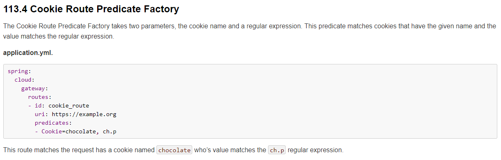
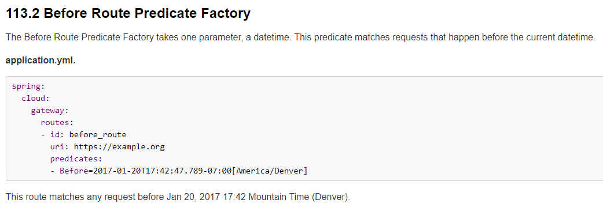
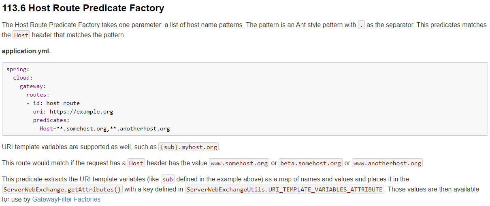
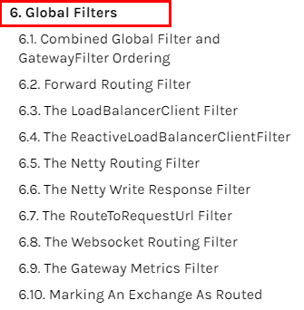

## 基本介绍

官网地址:[https://cloud.spring.io/spring-cloud-static/spring-cloud-gateway/2.2.1.RELEASE/reference/html/](https://cloud.spring.io/spring-cloud-static/spring-cloud-gateway/2.2.1.RELEASE/reference/html/)

**是什么**

Cloud全家桶中有个很重要的组件就是网关，在1.x版本中都是采用的Zuul网关；但在2.x版本中，zuul的升级一直跳票，SpringCloud最后自己研发了一个网关替代Zuul，那就是SpringCloud Gateway一句话：gateway是原zuul1.x版的替代


Gateway是在Spring生态系统之上构建的API网关服务，基于Spring 5，Spring Boot 2和 Project Reactor等技术。Gateway旨在提供一种简单而有效的方式来对API进行路由，以及提供一些强大的过滤器功能， 例如：熔断、限流、重试等。

SpringCloud Gateway使用的Webflux是reactor-netty响应式编程组件，底层使用了Netty通讯框架。

源码架构：


**微服务架构中网关在哪里**


**SpringCloud Gateway具有如下特性**

基于Spring Framework 5, Project Reactor 和 Spring Boot 2.0 进行构建；

动态路由：能够匹配任何请求属性；

可以对路由指定 Predicate（断言）和 Filter（过滤器）；

集成Hystrix的断路器功能；

集成 Spring Cloud 服务发现功能；

易于编写的 Predicate（断言）和 Filter（过滤器）；

请求限流功能；

支持路径重写。

## 三大核心概念

**Route(路由)**

路由是构建网关的基本模块，它由ID，目标URI，一系列的断言和过滤器组成，如果断言为true则匹配该路由

**Predicate(断言)**

参考的是Java8的java.util.function.Predicate，开发人员可以匹配HTTP请求中的所有内容(例如请求头或请求参数)，如果请求与断言相匹配则进行路由

**Filter(过滤)**

指的是Spring框架中GatewayFilter的实例，使用过滤器，可以在请求被路由前或者之后对请求进行修改。


web请求，通过一些匹配条件，定位到真正的服务节点，并在这个转发过程的前后，进行一些精细化控制。predicate就是我们的匹配条件；而filter，就可以理解为一个无所不能的拦截器，有了这两个元素，再加上目标uri，就可以实现一个具体的路由了。

## Gateway工作流程


客户端向 Spring Cloud Gateway 发出请求。然后在 Gateway Handler Mapping 中找到与请求相匹配的路由，将其发送到 Gateway Web Handler。

## 入门配置（使用绝对路径）

新建模块009-gateway-9527。

pom.xml

```xml
<?xml version="1.0" encoding="UTF-8"?>
<project xmlns="http://maven.apache.org/POM/4.0.0"
         xmlns:xsi="http://www.w3.org/2001/XMLSchema-instance"
         xsi:schemaLocation="http://maven.apache.org/POM/4.0.0 http://maven.apache.org/xsd/maven-4.0.0.xsd">
    <parent>
        <artifactId>SpringCloudModules</artifactId>
        <groupId>com.hashnode</groupId>
        <version>1.0-SNAPSHOT</version>
    </parent>
    <modelVersion>4.0.0</modelVersion>

    <artifactId>009-gateway-9527</artifactId>

    <properties>
        <maven.compiler.source>8</maven.compiler.source>
        <maven.compiler.target>8</maven.compiler.target>
    </properties>

    <dependencies>

        <dependency>
            <groupId>org.springframework.boot</groupId>
            <artifactId>spring-boot-starter-webflux</artifactId>
        </dependency>
        <!--gateway-->
        <dependency>
            <groupId>org.springframework.cloud</groupId>
            <artifactId>spring-cloud-starter-gateway</artifactId>
        </dependency>
        
    </dependencies>

</project>
```

application.yml

```yml

server:
  port: 9527

spring:
  application:
    name: cloud-gateway
  cloud:
    gateway:
      routes:
        - id: payment_route #路由的ID，没有固定规则但要求唯一，建议配合服务名
          uri: http://localhost:8001          #匹配后提供服务的路由地址
          predicates:
            - Path=/payment/get/**         # 断言，路径相匹配的进行路由

        - id: hystrix_route #路由的ID，没有固定规则但要求唯一，建议配合服务名
          uri: http://localhost:8001          #匹配后提供服务的路由地址
          predicates:
            - Path=/payment/hystrix/**         # 断言，路径相匹配的进行路由


eureka:
  instance:
    hostname: cloud-gateway-service
  client: #服务提供者provider注册进eureka服务列表内
    service-url:
      register-with-eureka: true
      fetch-registry: true
      defaultZone: http://eureka7001.com:7001/eureka

```

主启动类

```java
package com.hashnode;

import org.springframework.boot.SpringApplication;
import org.springframework.boot.autoconfigure.SpringBootApplication;
import org.springframework.cloud.netflix.eureka.EnableEurekaClient;

@SpringBootApplication
@EnableEurekaClient
public class Gateway9527 {
    public static void main(String[] args) {
        SpringApplication.run(Gateway9527.class,args);
    }
}
```

测试

启动7001,启动8001，启动9527网关


对网关的配置还可以使用代码的方式（代码方式优先级大于配置），

官网案例


```java
package com.hashnode.config;

import org.springframework.cloud.gateway.route.RouteLocator;
import org.springframework.cloud.gateway.route.builder.RouteLocatorBuilder;
import org.springframework.context.annotation.Bean;
import org.springframework.context.annotation.Configuration;

@Configuration
public class GatewayConfig {
    @Bean
    public RouteLocator customRouteLocator(RouteLocatorBuilder routeLocatorBuilder){
        RouteLocatorBuilder.Builder routes = routeLocatorBuilder.routes();

        routes.route("path_route_route1",
                r->r.path("/v/douga")
                        .uri("http://www.bilibili.com"));
        return routes.build();
    }

    @Bean
    public RouteLocator paymentRouteLocator(RouteLocatorBuilder routeLocatorBuilder){
        RouteLocatorBuilder.Builder routes = routeLocatorBuilder.routes();

        routes.route("path_route_route2",
                r->r.path("/payment/get/**")
                        .uri("http://localhost:8001"));
        return routes.build();
    }
}
```

测试


## 通过微服务名实现动态路由

默认情况下Gateway会根据注册中心注册的服务列表，以注册中心上微服务名为路径创建动态路由进行转发，从而实现动态路由的功能。

修改pom，添加eureka-client

```xml
<?xml version="1.0" encoding="UTF-8"?>
<project xmlns="http://maven.apache.org/POM/4.0.0"
         xmlns:xsi="http://www.w3.org/2001/XMLSchema-instance"
         xsi:schemaLocation="http://maven.apache.org/POM/4.0.0 http://maven.apache.org/xsd/maven-4.0.0.xsd">
    <parent>
        <artifactId>SpringCloudModules</artifactId>
        <groupId>com.hashnode</groupId>
        <version>1.0-SNAPSHOT</version>
    </parent>
    <modelVersion>4.0.0</modelVersion>

    <artifactId>009-gateway-9527</artifactId>

    <properties>
        <maven.compiler.source>8</maven.compiler.source>
        <maven.compiler.target>8</maven.compiler.target>
    </properties>

    <dependencies>

        <dependency>
            <groupId>org.springframework.boot</groupId>
            <artifactId>spring-boot-starter-webflux</artifactId>
        </dependency>
        <!--gateway-->
        <dependency>
            <groupId>org.springframework.cloud</groupId>
            <artifactId>spring-cloud-starter-gateway</artifactId>
        </dependency>

        <!--eureka-client-->
        <dependency>
            <groupId>org.springframework.cloud</groupId>
            <artifactId>spring-cloud-starter-netflix-eureka-client</artifactId>
        </dependency>


    </dependencies>

</project>
```

修改yml

```yml
server:
  port: 9527

spring:
  application:
    name: cloud-gateway
  cloud:
    gateway:
      discovery:
        locator:
          enabled: true #开启从注册中心动态创建路由的功能,利用微服务进行路由
      routes:
        - id: payment_route #payment_route    #路由的ID，没有固定规则但要求唯一，建议配合服务名
          uri: lb://cloud-payment-service          #匹配后提供服务的路由地址
          predicates:
            - Path=/payment/get/**         # 断言，路径相匹配的进行路由

        - id: hystrix_route #payment_route    #路由的ID，没有固定规则但要求唯一，建议配合服务名
          uri: lb://cloud-payment-service          #匹配后提供服务的路由地址  如果使用了lb:// 会使用负载均衡的方式调用cloud-payment-service,如果某一个微服务没有实现某一个功能，而另一个微服务实现了该功能，则调用测试会发现成功一次，失败一次
          predicates:
            - Path=/payment/hystrix/**         # 断言，路径相匹配的进行路由


eureka:
  instance:
    hostname: cloud-gateway-service
  client: #服务提供者provider注册进eureka服务列表内
    service-url:
      register-with-eureka: true
      fetch-registry: true
      defaultZone: http://eureka7001.com:7001/eureka
```

需要注意的是uri的协议为lb，表示启用Gateway的负载均衡功能。lb://serviceName是spring cloud gateway在微服务中自动为我们创建的负载均衡uri。

测试

先启动7001，然后启动8001/8002，最后启动9527，访问结果如下：


## Predicate的使用

启动9527


Route Predicate Factories是什么?


Spring Cloud Gateway将路由匹配作为Spring WebFlux HandlerMapping基础架构的一部分，包括许多内置的Route Predicate工厂，所有这些Predicate都与HTTP请求的不同属性匹配，多个Route Predicate工厂可以进行组合。

+ After Route Predicate与Cookie Route Predicate


Cookie Route 	

Predicate需要两个参数，一个是 Cookie name ,一个是正则表达式。路由规则会通过获取对应的 Cookie name 值和正则表达式去匹配，如果匹配上就会执行路由，如果没有匹配上则不执行。

```java
import java.time.ZoneId;
import java.time.ZonedDateTime;

/**
 * 获得时间
 */
public class ZonedDateTimeDemo
{
    public static void main(String[] args)
    {
        ZonedDateTime zbj = ZonedDateTime.now(); // 默认时区
        System.out.println(zbj);
//        ZonedDateTime zny = ZonedDateTime.now(ZoneId.of("America/New_York")); // 用指定时区获取当前时间
//        System.out.println(zny);
    }
}
```

```yml

server:
  port: 9527

spring:
  application:
    name: cloud-gateway
  cloud:
    gateway:
      discovery:
        locator:
          enabled: true #开启从注册中心动态创建路由的功能,利用微服务进行路由
      routes:

        - id: payment_route #payment_route    #路由的ID，没有固定规则但要求唯一，建议配合服务名
          uri: lb://cloud-payment-service          #匹配后提供服务的路由地址
          predicates:
            - Path=/payment/get/**         # 断言，路径相匹配的进行路由
            - After=2022-03-29T19:30:28.342+08:00[Asia/Shanghai] #设置时间
            - Cookie=username,aaa
#             同时含有对应的cookie
#            - Cookie=username,aaa
#            - Cookie=sex,male

# 两者满足其一即可调用
        - id: payment_route2 #payment_route    #路由的ID，没有固定规则但要求唯一，建议配合服务名
          uri: lb://cloud-payment-service          #匹配后提供服务的路由地址
          predicates:
            - Path=/payment/get/**         # 断言，路径相匹配的进行路由
            - After=2022-03-29T19:30:28.342+08:00[Asia/Shanghai] #设置时间
            - Cookie=sex,male

eureka:
  instance:
    hostname: cloud-gateway-service
  client: #服务提供者provider注册进eureka服务列表内
    service-url:
      register-with-eureka: true
      fetch-registry: true
      defaultZone: http://eureka7001.com:7001/eureka


```

带cookies访问和不带cookies访问


+ Before Route Predicate



```yml
server:
  port: 9527

spring:
  application:
    name: cloud-gateway
  cloud:
    gateway:
      discovery:
        locator:
          enabled: true #开启从注册中心动态创建路由的功能
      routes:
        - id: payment_routh #payment_route    #路由的ID，没有固定规则但要求唯一，建议配合服务名
          # uri: http://localhost:8001          #匹配后提供服务的路由地址
          uri: lb://cloud-payment-service #匹配后提供服务的路由地址
          predicates:
            - Path=/payment/get/**         # 断言，路径相匹配的进行路由

        - id: payment_routh2 #payment_route    #路由的ID，没有固定规则但要求唯一，建议配合服务名
          # uri: http://localhost:8001          #匹配后提供服务的路由地址
          uri: lb://cloud-payment-service #匹配后提供服务的路由地址
          predicates:
            - Path=/payment/lb/**         # 断言，路径相匹配的进行路由
            - After=2020-02-05T15:10:03.685+08:00[Asia/Shanghai]         # 断言，路径相匹配的进行路由
            - Before=2020-02-05T15:10:03.685+08:00[Asia/Shanghai]         # 断言，路径相匹配的进行路由


eureka:
  instance:
    hostname: cloud-gateway-service
  client: #服务提供者provider注册进eureka服务列表内
    service-url:
      register-with-eureka: true
      fetch-registry: true
      defaultZone: http://eureka7001.com:7001/eureka
```

+ Between Route Predicate

```yml
 
- Between=2019-12-02T17:45:06.206+08:00[Asia/Shanghai],2019-12-02T18:59:06.206+08:00[Asia/Shanghai]
 
server:
  port: 9527

spring:
  application:
    name: cloud-gateway
  cloud:
    gateway:
      discovery:
        locator:
          enabled: true #开启从注册中心动态创建路由的功能
      routes:
        - id: payment_routh #payment_route    #路由的ID，没有固定规则但要求唯一，建议配合服务名
          # uri: http://localhost:8001          #匹配后提供服务的路由地址
          uri: lb://cloud-payment-service #匹配后提供服务的路由地址
          predicates:
            - Path=/payment/get/**         # 断言，路径相匹配的进行路由

        - id: payment_routh2 #payment_route    #路由的ID，没有固定规则但要求唯一，建议配合服务名
          # uri: http://localhost:8001          #匹配后提供服务的路由地址
          uri: lb://cloud-payment-service #匹配后提供服务的路由地址
          predicates:
            - Path=/payment/lb/**         # 断言，路径相匹配的进行路由
            #- After=2020-02-05T15:10:03.685+08:00[Asia/Shanghai]         # 断言，路径相匹配的进行路由
            #- Before=2020-02-05T15:10:03.685+08:00[Asia/Shanghai]         # 断言，路径相匹配的进行路由
            - Between=2020-02-02T17:45:06.206+08:00[Asia/Shanghai],2020-03-25T18:59:06.206+08:00[Asia/Shanghai]


eureka:
  instance:
    hostname: cloud-gateway-service
  client: #服务提供者provider注册进eureka服务列表内
    service-url:
      register-with-eureka: true
      fetch-registry: true
      defaultZone: http://eureka7001.com:7001/eureka

```

+ Header Route Predicate


两个参数：一个是属性名称和一个正则表达式，这个属性值和正则表达式匹配则执行。

```yml
 
server:
  port: 9527

spring:
  application:
    name: cloud-gateway
  cloud:
    gateway:
      discovery:
        locator:
          enabled: true #开启从注册中心动态创建路由的功能
      routes:
        - id: payment_routh #payment_route    #路由的ID，没有固定规则但要求唯一，建议配合服务名
          # uri: http://localhost:8001          #匹配后提供服务的路由地址
          uri: lb://cloud-payment-service #匹配后提供服务的路由地址
          predicates:
            - Path=/payment/get/**         # 断言，路径相匹配的进行路由

        - id: payment_routh2 #payment_route    #路由的ID，没有固定规则但要求唯一，建议配合服务名
          # uri: http://localhost:8001          #匹配后提供服务的路由地址
          uri: lb://cloud-payment-service #匹配后提供服务的路由地址
          predicates:
            - Path=/payment/lb/**         # 断言，路径相匹配的进行路由
            - After=2020-02-05T15:10:03.685+08:00[Asia/Shanghai]         # 断言，路径相匹配的进行路由
            #- Before=2020-02-05T15:10:03.685+08:00[Asia/Shanghai]         # 断言，路径相匹配的进行路由
            #- Between=2020-02-02T17:45:06.206+08:00[Asia/Shanghai],2020-03-25T18:59:06.206+08:00[Asia/Shanghai]
            #- Cookie=username,zzyy
            - Header=X-Request-Id, \d+  # 请求头要有X-Request-Id属性并且值为整数的正则表达式
            
curl http://localhost:9588/paymentInfo -H "X-Request-Id:123"
 curl http://localhost:9527/payment/lb -H "X-Request-Id:123"
```

+ Host Route Predicate



Host Route Predicate 接收一组参数，一组匹配的域名列表，这个模板是一个 ant 分隔的模板，用.号作为分隔符,它通过参数中的主机地址作为匹配规则。

```yml
server:
  port: 9527

spring:
  application:
    name: cloud-gateway
  cloud:
    gateway:
      discovery:
        locator:
          enabled: true #开启从注册中心动态创建路由的功能
      routes:
        - id: payment_routh #payment_route    #路由的ID，没有固定规则但要求唯一，建议配合服务名
          # uri: http://localhost:8001          #匹配后提供服务的路由地址
          uri: lb://cloud-payment-service #匹配后提供服务的路由地址
          predicates:
            - Path=/payment/get/**         # 断言，路径相匹配的进行路由

        - id: payment_routh2 #payment_route    #路由的ID，没有固定规则但要求唯一，建议配合服务名
          # uri: http://localhost:8001          #匹配后提供服务的路由地址
          uri: lb://cloud-payment-service #匹配后提供服务的路由地址
          predicates:
            - Path=/payment/lb/**         # 断言，路径相匹配的进行路由
            - After=2020-02-05T15:10:03.685+08:00[Asia/Shanghai]         # 断言，路径相匹配的进行路由
            #- Before=2020-02-05T15:10:03.685+08:00[Asia/Shanghai]         # 断言，路径相匹配的进行路由
            #- Between=2020-02-02T17:45:06.206+08:00[Asia/Shanghai],2020-03-25T18:59:06.206+08:00[Asia/Shanghai]
            #- Cookie=username,zzyy
            #- Header=X-Request-Id, \d+  # 请求头要有X-Request-Id属性并且值为整数的正则表达式
            - Host=**.baidu.com


eureka:
  instance:
    hostname: cloud-gateway-service
  client: #服务提供者provider注册进eureka服务列表内
    service-url:
      register-with-eureka: true
      fetch-registry: true
      defaultZone: http://eureka7001.com:7001/eureka

 
curl http://localhost:9588/paymentInfo -H "Host: www.baidu.com" 
curl http://localhost:9588/paymentInfo -H "Host: news.baidu.com" 
====================================================================================
正确：curl http://localhost:9527/payment/lb -H "Host: www.baidu.com"
正确：curl http://localhost:9527/payment/lb -H "Host: java.baidu.com"
错误：curl http://localhost:9527/payment/lb -H "Host: java.baidu.net"
```

+ Method Route Predicate


```yml
server:
  port: 9527

spring:
  application:
    name: cloud-gateway
  cloud:
    gateway:
      discovery:
        locator:
          enabled: true #开启从注册中心动态创建路由的功能
      routes:
        - id: payment_routh #payment_route    #路由的ID，没有固定规则但要求唯一，建议配合服务名
          # uri: http://localhost:8001          #匹配后提供服务的路由地址
          uri: lb://cloud-payment-service #匹配后提供服务的路由地址
          predicates:
            - Path=/payment/get/**         # 断言，路径相匹配的进行路由

        - id: payment_routh2 #payment_route    #路由的ID，没有固定规则但要求唯一，建议配合服务名
          # uri: http://localhost:8001          #匹配后提供服务的路由地址
          uri: lb://cloud-payment-service #匹配后提供服务的路由地址
          predicates:
            - Path=/payment/lb/**         # 断言，路径相匹配的进行路由
            - After=2020-02-05T15:10:03.685+08:00[Asia/Shanghai]         # 断言，路径相匹配的进行路由
            #- Before=2020-02-05T15:10:03.685+08:00[Asia/Shanghai]         # 断言，路径相匹配的进行路由
            #- Between=2020-02-02T17:45:06.206+08:00[Asia/Shanghai],2020-03-25T18:59:06.206+08:00[Asia/Shanghai]
            #- Cookie=username,zzyy
            #- Header=X-Request-Id, \d+  # 请求头要有X-Request-Id属性并且值为整数的正则表达式
            #- Host=**.baidu.com
            - Method=GET


eureka:
  instance:
    hostname: cloud-gateway-service
  client: #服务提供者provider注册进eureka服务列表内
    service-url:
      register-with-eureka: true
      fetch-registry: true
      defaultZone: http://eureka7001.com:7001/eureka
```


+ Path Route Predicate


```yml
server:
  port: 9527

spring:
  application:
    name: cloud-gateway
  cloud:
    gateway:
      discovery:
        locator:
          enabled: true #开启从注册中心动态创建路由的功能
      routes:
        - id: payment_routh #payment_route    #路由的ID，没有固定规则但要求唯一，建议配合服务名
          # uri: http://localhost:8001          #匹配后提供服务的路由地址
          uri: lb://cloud-payment-service #匹配后提供服务的路由地址
          predicates:
            - Path=/payment/get/**         # 断言，路径相匹配的进行路由

        - id: payment_routh2 #payment_route    #路由的ID，没有固定规则但要求唯一，建议配合服务名
          # uri: http://localhost:8001          #匹配后提供服务的路由地址
          uri: lb://cloud-payment-service #匹配后提供服务的路由地址
          predicates:
            - Path=/payment/lb/**         # 断言，路径相匹配的进行路由
            - After=2020-02-05T15:10:03.685+08:00[Asia/Shanghai]         # 断言，路径相匹配的进行路由
            #- Before=2020-02-05T15:10:03.685+08:00[Asia/Shanghai]         # 断言，路径相匹配的进行路由
            #- Between=2020-02-02T17:45:06.206+08:00[Asia/Shanghai],2020-03-25T18:59:06.206+08:00[Asia/Shanghai]
            #- Cookie=username,zzyy
            #- Header=X-Request-Id, \d+  # 请求头要有X-Request-Id属性并且值为整数的正则表达式
            #- Host=**.baidu.com
            - Method=GET


eureka:
  instance:
    hostname: cloud-gateway-service
  client: #服务提供者provider注册进eureka服务列表内
    service-url:
      register-with-eureka: true
      fetch-registry: true
      defaultZone: http://eureka7001.com:7001/eureka

```

+ Query Route Predicate


支持传入两个参数，一个是属性名，一个为属性值，属性值可以是正则表达式。


说白了，Predicate就是为了实现一组匹配规则，让请求过来找到对应的Route进行处理。

## Filter的使用


路由过滤器可用于修改进入的HTTP请求和返回的HTTP响应，路由过滤器只能指定路由进行使用。Spring Cloud Gateway 内置了多种路由过滤器，他们都由GatewayFilter的工厂类来产生。

Spring Cloud Gateway的Filter的生命周期只有两种:pre和post;种类也只有两种,GatewayFilter和GlobalFilter。

+ GatewayFilter

[https://cloud.spring.io/spring-cloud-static/spring-cloud-gateway/2.2.1.RELEASE/reference/html/#the-addrequestparameter-gatewayfilter-factory](https://cloud.spring.io/spring-cloud-static/spring-cloud-gateway/2.2.1.RELEASE/reference/html/#the-addrequestparameter-gatewayfilter-factory)


+ GlobalFilter



### 常用的GatewayFilter

yml

```yml
 server:
  port: 9588

spring:
  application:
    name: cloud-gateway
  cloud:
    gateway:
      discovery:
        locator:
          enabled: true #开启从注册中心动态创建路由的功能
          lower-case-service-id: true #使用小写服务名，默认是大写
      routes:
        - id: payment_routh #payment_route #路由的ID，没有固定规则但要求唯一，建议配合服务名
          uri: lb://cloud-provider-payment #匹配后的目标服务地址，供服务的路由地址
          #uri: http://localhost:8001 #匹配后提供服务的路由地址
          filters:
            - AddRequestParameter=X-Request-Id,1024 #过滤器工厂会在匹配的请求头加上一对请求头，名称为X-Request-Id值为1024
          predicates:
            - Path=/paymentInfo/**        # 断言，路径相匹配的进行路由
            - Method=GET,POST

eureka:
  instance:
    hostname: cloud-gateway-service
  client: #服务提供者provider注册进eureka服务列表内
    service-url:
      register-with-eureka: true
      fetch-registry: true
      defaultZone: http://eureka7001.com:7001/eureka
```

### 自定义过滤器

implements GlobalFilter,Ordered,如下所示

```java
package com.hashnode.filter;

import org.springframework.cloud.gateway.filter.GatewayFilterChain;
import org.springframework.cloud.gateway.filter.GlobalFilter;
import org.springframework.core.Ordered;
import org.springframework.http.HttpStatus;
import org.springframework.stereotype.Component;
import org.springframework.web.server.ServerWebExchange;
import reactor.core.publisher.Mono;

import java.util.Date;

//转发前进行过滤
@Component //必须加
public class MyLogGateWayFilter implements GlobalFilter, Ordered {
    @Override
    public Mono<Void> filter(ServerWebExchange exchange, GatewayFilterChain chain) {
        System.out.println("****************come in MyLogGateWayFilter:   " + new Date());
        String username = exchange.getRequest().getQueryParams().getFirst("username");
        if (username == null){
            System.out.println("非法用户");
            exchange.getResponse().setStatusCode(HttpStatus.NOT_ACCEPTABLE);
            return exchange.getResponse().setComplete();
        }
        return chain.filter(exchange);
    }

    @Override
    public int getOrder() {
        return 0;
    }
}
```

测试


不带username:

