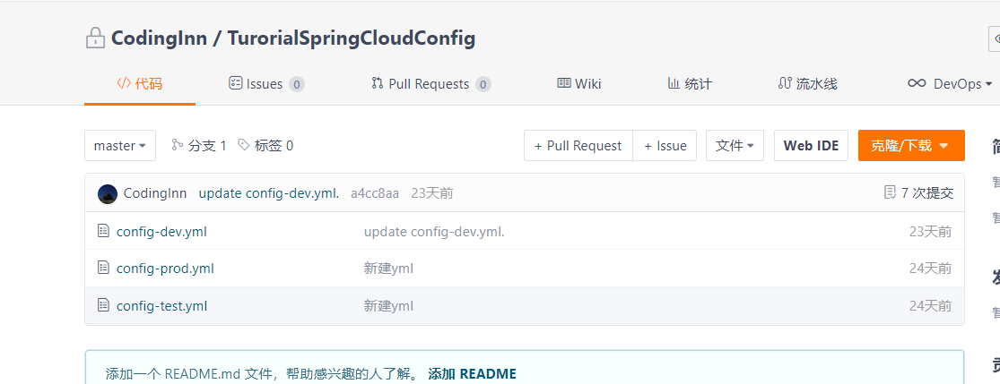
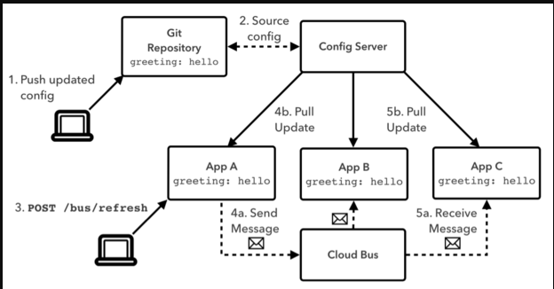

微服务意味着要将单体应用中的业务拆分成一个个子服务，每个服务的粒度相对较小，因此系统中会出现大量的服务。由于每个服务都需要必要的配置信息才能运行，所以一套集中式的、动态的配置管理设施是必不可少的。

SpringCloud提供了ConfigServer来解决这个问题。

 

**是什么**

SpringCloud Config为微服务架构中的微服务提供集中化的外部配置支持，配置服务器为各个不同微服务应用的所有环境提供了一个中心化的外部配置。

**能干吗**

集中管理配置文件

不同环境不同配置，动态化的配置更新，分环境部署比如dev/test/prod/beta/release

运行期间动态调整配置，不再需要在每个服务部署的机器上编写配置文件，服务会向配置中心统一拉取配置自己的信息

当配置发生变动时，服务不需要重启即可感知到配置的变化并应用新的配置

将配置信息以REST接口的形式暴露（post、curl访问刷新均可）

**怎么用**

SpringCloud Config分为服务端和客户端两部分。

服务端也称为分布式配置中心，它是一个独立的微服务应用，用来连接配置服务器并为客户端提供获取配置信息，加密/解密信息等访问接口，客户端则是通过指定的配置中心来管理应用资源，以及与业务相关的配置内容，并在启动的时候从配置中心获取和加载配置信息配置服务器默认采用git来存储配置信息，这样就有助于对环境配置进行版本管理，并且可以通过git客户端工具来方便的管理和访问配置内容。

 由于SpringCloud Config默认使用Git来存储配置文件(也有其它方式,比如支持SVN和本地文件)，但最推荐的还是Git，而且使用的是http/https访问的形式。

 官网：https://cloud.spring.io/spring-cloud-static/spring-cloud-config/2.2.1.RELEASE/reference/html/

##  Config服务端配置与测试

在Gitee上新建一个名为TurorialSpringCloudConfig的新Repository

 

 

由上一步获得刚新建的git地址:git@gitee.com:codinginn/turorial-spring-cloud-config.git

新建config-dev.yml、config-prod.yml、config-test.yml表示多环境的配置文件。

这里只配置了config-dev.yml

```yml
config:
    info: "master branch,turorial-spring-cloud-config/config-dev.yml version=3"
```

### 新建Module模块cloud-config-center-3344

它作为为Cloud的配置中心模块cloudConfig Center

pom

```xml
<?xml version="1.0" encoding="UTF-8"?>
<project xmlns="http://maven.apache.org/POM/4.0.0"
         xmlns:xsi="http://www.w3.org/2001/XMLSchema-instance"
         xsi:schemaLocation="http://maven.apache.org/POM/4.0.0 http://maven.apache.org/xsd/maven-4.0.0.xsd">
    <parent>
        <artifactId>SpringCloudModules</artifactId>
        <groupId>com.hashnode</groupId>
        <version>1.0-SNAPSHOT</version>
    </parent>
    <modelVersion>4.0.0</modelVersion>

    <artifactId>010-cloud-center-3344</artifactId>

    <properties>
        <maven.compiler.source>8</maven.compiler.source>
        <maven.compiler.target>8</maven.compiler.target>
    </properties>

    <dependencies>

<!--        springframework.cloud,使用这种方法可能会导致github不支持本地的rsa加密-->
<!--        <dependency>-->
<!--            <groupId>org.springframework.cloud</groupId>-->
<!--            <artifactId>spring-cloud-config-server</artifactId>-->
<!--        </dependency>-->

        <dependency>
            <groupId>org.springframework.cloud</groupId>
            <artifactId>spring-cloud-config-server</artifactId>
            <!-- Excluding this older, not maintained library that does not support newer versions of RSA -->
            <exclusions>
                <exclusion>
                    <groupId>com.jcraft</groupId>
                    <artifactId>jsch</artifactId>
                </exclusion>
            </exclusions>
        </dependency>
        <!--         Adding this fork of com.jcraft.jsch, which supports newer versions of RSA (sha2-256 / sha2-512) -->
        <dependency>
            <groupId>com.github.mwiede</groupId>
            <artifactId>jsch</artifactId>
            <version>0.2.0</version>
        </dependency>

        <dependency>
            <groupId>org.springframework.cloud</groupId>
            <artifactId>spring-cloud-starter-netflix-eureka-client</artifactId>
        </dependency>

        <dependency>
            <groupId>org.springframework.boot</groupId>
            <artifactId>spring-boot-starter-web</artifactId>
        </dependency>

        <dependency>
            <groupId>org.springframework.boot</groupId>
            <artifactId>spring-boot-starter-actuator</artifactId>
        </dependency>

        <dependency>
            <groupId>org.springframework.boot</groupId>
            <artifactId>spring-boot-devtools</artifactId>
            <scope>runtime</scope>
            <optional>true</optional>
        </dependency>

        <dependency>
            <groupId>org.projectlombok</groupId>
            <artifactId>lombok</artifactId>
            <optional>true</optional>
        </dependency>

        <dependency>
            <groupId>org.springframework.boot</groupId>
            <artifactId>spring-boot-starter-test</artifactId>
            <scope>test</scope>
        </dependency>
    </dependencies>

</project>
```

yml

```yml
server:
  port: 3344

spring:
  application:
    name:  cloud-config-center #注册进Eureka服务器的微服务名
  cloud:
    config:
      server:
        git:
#          以下两步均需要在idea的插件中配置gitee
          # 方式1 通过ssh登录
#          uri: git@github.com:GuoWeiChi/turorial-spring-cloud-config.git #GitHub上面的git仓库名字
          uri: git@gitee.com:codinginn/turorial-spring-cloud-config.git #Gitee上面的git仓库名字
          #          ###搜索目录
          search-paths:
            - turorial-spring-cloud-config
          # 方式2 通过账号登录
#          uri: https://gitee.com/codinginn/turorial-spring-cloud-config.git #GitHub上面的git仓库名字
#          search-paths:
#            - turorial-spring-cloud-config
#          username: yourusername
#          password: yourpassword

####读取分支
        label: master

#服务注册到eureka地址
eureka:
  client:
    service-url:
      defaultZone: http://localhost:7001/eureka
```

配置类

```java
package com.hashnode.config;

import com.jcraft.jsch.JSch;
import org.springframework.context.annotation.Configuration;

@Configuration
public class JschConfig {
    //Shim to fix the way jGit configures JSch
    static{
        JSch.setConfig("signature.rsa", "com.jcraft.jsch.jce.SignatureRSA");
    }

}
```

主启动类

```java
package com.hashnode;

import org.springframework.boot.SpringApplication;
import org.springframework.boot.autoconfigure.SpringBootApplication;
import org.springframework.cloud.config.server.EnableConfigServer;


@SpringBootApplication
@EnableConfigServer
public class MainConfigCenter3344 {
    public static void main(String[] args) {
        SpringApplication.run(MainConfigCenter3344.class,args);
    }
}
```

windows下修改hosts文件,增加映射

127.0.0.1  config-3344.com

测试通过Config微服务是否可以从GitHub上获取配置内容

启动微服务3344

http://config-3344.com:3344/master/config-dev.yml


### 配置读取规则

官网:


#### /{label}/{application}-{profile}.yml

master分支

http://config-3344.com:3344/master/config-dev.yml

http://config-3344.com:3344/master/config-test.yml

http://config-3344.com:3344/master/config-prod.yml

dev分支

http://config-3344.com:3344/dev/config-dev.yml

http://config-3344.com:3344/dev/config-test.yml

http://config-3344.com:3344/dev/config-prod.yml

#### /{application}-{profile}.yml

http://config-3344.com:3344/config-dev.yml

http://config-3344.com:3344/config-test.yml

http://config-3344.com:3344/config-prod.yml

http://config-3344.com:3344/config-xxxx.yml(不存在的配置)

#### /{application}/{profile}[/{label}]

http://config-3344.com:3344/config/dev/master

http://config-3344.com:3344/config/test/master

http://config-3344.com:3344/config/test/dev

总结

```properties
 /{name}-{profiles}.yml
 
/{label}-{name}-{profiles}.yml
 
label：分支(branch)
name ：服务名
profiles：环境(dev/test/prod)
```

## 新建Module模块cloud-config-center-3355

pom.xml

```xml
<?xml version="1.0" encoding="UTF-8"?>
<project xmlns="http://maven.apache.org/POM/4.0.0"
         xmlns:xsi="http://www.w3.org/2001/XMLSchema-instance"
         xsi:schemaLocation="http://maven.apache.org/POM/4.0.0 http://maven.apache.org/xsd/maven-4.0.0.xsd">
    <parent>
        <artifactId>SpringCloudModules</artifactId>
        <groupId>com.hashnode</groupId>
        <version>1.0-SNAPSHOT</version>
    </parent>
    <modelVersion>4.0.0</modelVersion>

    <artifactId>011-cloud-config-starter-3355</artifactId>

    <properties>
        <maven.compiler.source>8</maven.compiler.source>
        <maven.compiler.target>8</maven.compiler.target>
    </properties>


    <dependencies>
        <dependency>
            <groupId>org.springframework.boot</groupId>
            <artifactId>spring-boot-starter-web</artifactId>
        </dependency>

        <dependency>
            <groupId>org.springframework.boot</groupId>
            <artifactId>spring-boot-starter-actuator</artifactId>
        </dependency>

        <dependency>
            <groupId>org.springframework.boot</groupId>
            <artifactId>spring-boot-starter-test</artifactId>
            <scope>test</scope>
            <exclusions>
                <exclusion>
                    <groupId>org.junit.vintage</groupId>
                    <artifactId>junit-vintage-engine</artifactId>
                </exclusion>
            </exclusions>
        </dependency>


        <!--spring-cloud配置,读git上配置的yml-->
        <dependency>
            <groupId>org.springframework.cloud</groupId>
            <artifactId>spring-cloud-starter-config</artifactId>
        </dependency>

        <dependency>
            <groupId>org.springframework.cloud</groupId>
            <artifactId>spring-cloud-starter-bus-amqp</artifactId>
        </dependency>

        <!--eureka-client-->
        <dependency>
            <groupId>org.springframework.cloud</groupId>
            <artifactId>spring-cloud-starter-netflix-eureka-client</artifactId>
        </dependency>

<!--        使用hystrix熔断-->
        <dependency>
            <groupId>org.springframework.cloud</groupId>
            <artifactId>spring-cloud-starter-netflix-hystrix</artifactId>
        </dependency>

        <!--        引入自定义的api通用包，包括各种实体类-->
        <dependency>
            <groupId>com.hashnode</groupId>
            <artifactId>003-cloud-api-commons</artifactId>
            <version>1.0-SNAPSHOT</version>
        </dependency>

        <!--mysql-->
        <dependency>
            <groupId>mysql</groupId>
            <artifactId>mysql-connector-java</artifactId>
        </dependency>
        <!-- druid-->
        <dependency>
            <groupId>com.alibaba</groupId>
            <artifactId>druid</artifactId>
        </dependency>
        <!-- mybatis-->
        <dependency>
            <groupId>org.mybatis.spring.boot</groupId>
            <artifactId>mybatis-spring-boot-starter</artifactId>
        </dependency>
        <!--junit-->
        <dependency>
            <groupId>junit</groupId>
            <artifactId>junit</artifactId>
        </dependency>
        <!--log4j-->
        <dependency>
            <groupId>log4j</groupId>
            <artifactId>log4j</artifactId>
        </dependency>
        <!--SpringBoot Thymeleaf依赖-->
        <dependency>
            <groupId>org.springframework.boot</groupId>
            <artifactId>spring-boot-starter-thymeleaf</artifactId>
        </dependency>
        <!--添加Bootstrap WarJar的依赖-->
        <dependency>
            <groupId>org.webjars</groupId>
            <artifactId>bootstrap</artifactId>
        </dependency>

        <dependency>
            <groupId>org.projectlombok</groupId>
            <artifactId>lombok</artifactId>
        </dependency>


    </dependencies>


</project>
```

bootstrap.yml

```yml
server:
  port: 3355

spring:
  application:
    name: config-clident
  cloud:
    config:
      label: master
      name: config  #配置文件名
      profile: dev  #读取后缀名 以上三个综合:master分支config-dev.yml
      uri:
        - http://localhost:3344

  datasource:
    type: com.alibaba.druid.pool.DruidDataSource    #当前数据源操作类型
    driver-class-name: org.gjt.mm.mysql.Driver      #mysql驱动包
    url: jdbc:mysql://localhost:3306/springboot?useUnicode=true&characterEncoding=UTF-8&useJDBCCompliantTimezoneShift=true&useLegacyDateTimeCode=false&serverTimezone=GMT%2B8
    username: root
    password: root

    #rabbitmq相关配置 15672是Web管理界面的端口；5672是MQ访问的端口
  rabbitmq:
    host: localhost
    port: 5672
    username: guest
    password: guest

eureka:
  client:
    service-url:
      defaultZone: http://localhost:7001/eureka


mybatis:
  mapper-locations:
    - classpath:mapper/*.xml
  type-aliases-package: com.hashnode.model      #所有model所在包


#暴露全部监控信息
management:
  endpoints:
    web:
      exposure:
        include: "*"
  endpoint:
    refresh:
      enabled: true
```

主启动

```java
package com.hashnode;

import org.mybatis.spring.annotation.MapperScan;
import org.springframework.boot.SpringApplication;
import org.springframework.boot.autoconfigure.SpringBootApplication;
import org.springframework.cloud.client.circuitbreaker.EnableCircuitBreaker;
import org.springframework.cloud.netflix.eureka.EnableEurekaClient;
import org.springframework.context.ConfigurableApplicationContext;

@SpringBootApplication
@MapperScan("com.hashnode.mapper")
@EnableEurekaClient
@EnableCircuitBreaker  //激活熔断机制和仪表盘监控
public class CloudConfigStarter3355 {
    public static void main(String[] args) {
        ConfigurableApplicationContext run = SpringApplication.run(CloudConfigStarter3355.class, args);
    }
}
```

业务类

```java
package com.hashnode.controller;

import org.springframework.beans.factory.annotation.Value;
import org.springframework.cloud.context.config.annotation.RefreshScope;
import org.springframework.web.bind.annotation.GetMapping;
import org.springframework.web.bind.annotation.RestController;

@RestController
public class ConfigClientController {
    @Value("${config.info}")
    private String configInfo;

    @GetMapping("/configInfo")
    public String getConfigInfo(){
        return configInfo;
    }
}
```

测试


Linux运维修改GitHub上的配置文件内容做调整,刷新3344，发现ConfigServer配置中心立刻响应,刷新3355，发现ConfigClient客户端没有任何响应,3355没有变化除非自己重启或者重新加载,有没有办法使客户端自动读取配置文件?

## Config客户端之动态刷新

修改3355模块

pom引入actuator监控


修改YML，暴露监控端口

```yml
server:
  port: 3355

spring:
  application:
    name: config-clident
  cloud:
    config:
      label: master
      name: config  #配置文件名
      profile: dev  #读取后缀名 以上三个综合:master分支config-dev.yml
      uri:
        - http://localhost:3344

  datasource:
    type: com.alibaba.druid.pool.DruidDataSource    #当前数据源操作类型
    driver-class-name: org.gjt.mm.mysql.Driver      #mysql驱动包
    url: jdbc:mysql://localhost:3306/springboot?useUnicode=true&characterEncoding=UTF-8&useJDBCCompliantTimezoneShift=true&useLegacyDateTimeCode=false&serverTimezone=GMT%2B8
    username: root
    password: root

    #rabbitmq相关配置 15672是Web管理界面的端口；5672是MQ访问的端口
  rabbitmq:
    host: localhost
    port: 5672
    username: guest
    password: guest

eureka:
  client:
    service-url:
      defaultZone: http://localhost:7001/eureka


mybatis:
  mapper-locations:
    - classpath:mapper/*.xml
  type-aliases-package: com.hashnode.model      #所有model所在包


#暴露全部监控信息
management:
  endpoints:
    web:
      exposure:
        include: "*"
  endpoint:
    refresh:
      enabled: true
```

@RefreshScope业务类Controller修改,添加@RefreshScope

```java
package com.hashnode.controller;

import org.springframework.beans.factory.annotation.Value;
import org.springframework.cloud.context.config.annotation.RefreshScope;
import org.springframework.web.bind.annotation.GetMapping;
import org.springframework.web.bind.annotation.RestController;

@RestController
@RefreshScope
public class ConfigClientController {
    @Value("${config.info}")
    private String configInfo;

    @GetMapping("/configInfo")
    public String getConfigInfo(){
        return configInfo;
    }
}
```

此时修改gitee


3355并没有动态获取。此时需要运维人员发送post请求刷新3355:


但是如果微服务过多,每个微服务都要执行一次post请求,比较麻烦，可以用Spring Cloud Bus 配合 Spring Cloud Config的方式一次通知,处处生效。

## spring cloud bus

Spring Cloud Bus 配合 Spring Cloud Config 使用可以实现配置的动态刷新。



Spring Cloud Bus是用来将分布式系统的节点与轻量级消息系统链接起来的框架，它整合了Java的事件处理机制和消息中间件的功能。Spring Clud Bus目前支持RabbitMQ和Kafka等。

Spring Cloud Bus能管理和传播分布式系统间的消息，就像一个分布式执行器，可用于广播状态更改、事件推送等，也可以当作微服务间的通信通道。


**什么是总线**

在微服务架构的系统中，通常会使用轻量级的消息代理来构建一个共用的消息主题，并让系统中所有微服务实例都连接上来，由于该主题中产生的消息会被所有实例监听和消费，所以称它为消息总线，在总线上的各个实例，都可以方便地广播一些需要让其他连接在该主题上的实例都知道的消息。

**基本原理**

ConfigClient实例都监听MQ中同一个topic(默认是springCloudBus)，当一个服务刷新数据的时候，它会把这个信息放入到Topic中，这样其它监听同一Topic的服务就能得到通知，然后去更新自身的配置。

## RabbitMQ环境配置

### 安装Erlang

erlang和rabbitq版本说明(版本一定要对应):https://www.rabbitmq.com/which-erlang.html#compatibility-matrix, 这里使用的版本是erlang24.0-rc1,rabbitmq3.9.14


## 安装RabbitMQ

下载地址:https://dl.bintray.com/rabbitmq/all/rabbitmq-server

这里使用的版本:


安装步骤


配置环境变量


在系统变量的path中添加 %ERLANG_HOME%\bin


进入RabbitMQ安装目录下的sbin目录启动

```java
rabbitmqctl status  //查看当前状态
rabbitmq-plugins enable rabbitmq_management    //开启Web插件
rabbitmq-server start  //启动服务
rabbitmq-server stop  //停止服务
rabbitmq-server restart   //重启服务
```

访问地址查看是否安装成功:http://localhost:15672/


输入账号密码并登录：guest guest


### SpringCloud Bus全局广播

#### 新增3366

为了增加复杂度,以3355为模板再制作一个3366

pom.xml

```xml
<?xml version="1.0" encoding="UTF-8"?>
<project xmlns="http://maven.apache.org/POM/4.0.0"
         xmlns:xsi="http://www.w3.org/2001/XMLSchema-instance"
         xsi:schemaLocation="http://maven.apache.org/POM/4.0.0 http://maven.apache.org/xsd/maven-4.0.0.xsd">
    <parent>
        <artifactId>SpringCloudModules</artifactId>
        <groupId>com.hashnode</groupId>
        <version>1.0-SNAPSHOT</version>
    </parent>
    <modelVersion>4.0.0</modelVersion>

    <artifactId>011-cloud-config-starter-3366</artifactId>

    <properties>
        <maven.compiler.source>8</maven.compiler.source>
        <maven.compiler.target>8</maven.compiler.target>
    </properties>


    <dependencies>
        <dependency>
            <groupId>org.springframework.boot</groupId>
            <artifactId>spring-boot-starter-web</artifactId>
        </dependency>

        <dependency>
            <groupId>org.springframework.boot</groupId>
            <artifactId>spring-boot-starter-actuator</artifactId>
        </dependency>

        <dependency>
            <groupId>org.springframework.boot</groupId>
            <artifactId>spring-boot-starter-test</artifactId>
            <scope>test</scope>
            <exclusions>
                <exclusion>
                    <groupId>org.junit.vintage</groupId>
                    <artifactId>junit-vintage-engine</artifactId>
                </exclusion>
            </exclusions>
        </dependency>

        <!--spring-cloud配置,读git上配置的yml-->
        <dependency>
            <groupId>org.springframework.cloud</groupId>
            <artifactId>spring-cloud-starter-config</artifactId>
        </dependency>

        <dependency>
            <groupId>org.springframework.cloud</groupId>
            <artifactId>spring-cloud-starter-bus-amqp</artifactId>
        </dependency>

        <!--eureka-client-->
        <dependency>
            <groupId>org.springframework.cloud</groupId>
            <artifactId>spring-cloud-starter-netflix-eureka-client</artifactId>
        </dependency>

<!--        使用hystrix熔断-->
        <dependency>
            <groupId>org.springframework.cloud</groupId>
            <artifactId>spring-cloud-starter-netflix-hystrix</artifactId>
        </dependency>

        <!--        引入自定义的api通用包，包括各种实体类-->
        <dependency>
            <groupId>com.hashnode</groupId>
            <artifactId>003-cloud-api-commons</artifactId>
            <version>1.0-SNAPSHOT</version>
        </dependency>

        <!--mysql-->
        <dependency>
            <groupId>mysql</groupId>
            <artifactId>mysql-connector-java</artifactId>
        </dependency>
        <!-- druid-->
        <dependency>
            <groupId>com.alibaba</groupId>
            <artifactId>druid</artifactId>
        </dependency>
        <!-- mybatis-->
        <dependency>
            <groupId>org.mybatis.spring.boot</groupId>
            <artifactId>mybatis-spring-boot-starter</artifactId>
        </dependency>
        <!--junit-->
        <dependency>
            <groupId>junit</groupId>
            <artifactId>junit</artifactId>
        </dependency>
        <!--log4j-->
        <dependency>
            <groupId>log4j</groupId>
            <artifactId>log4j</artifactId>
        </dependency>
        <!--SpringBoot Thymeleaf依赖-->
        <dependency>
            <groupId>org.springframework.boot</groupId>
            <artifactId>spring-boot-starter-thymeleaf</artifactId>
        </dependency>
        <!--添加Bootstrap WarJar的依赖-->
        <dependency>
            <groupId>org.webjars</groupId>
            <artifactId>bootstrap</artifactId>
        </dependency>

        <dependency>
            <groupId>org.projectlombok</groupId>
            <artifactId>lombok</artifactId>
        </dependency>


    </dependencies>


</project>
```

bootstrap.yml

```yml
server:
  port: 3366

spring:
  application:
    name: config-clident
  cloud:
    config:
      label: master
      name: config  #配置文件名
      profile: dev  #读取后缀名 以上三个综合:master分支config-dev.yml
      uri:
        - http://localhost:3344

  datasource:
    type: com.alibaba.druid.pool.DruidDataSource    #当前数据源操作类型
    driver-class-name: org.gjt.mm.mysql.Driver      #mysql驱动包
    url: jdbc:mysql://localhost:3306/springboot?useUnicode=true&characterEncoding=UTF-8&useJDBCCompliantTimezoneShift=true&useLegacyDateTimeCode=false&serverTimezone=GMT%2B8
    username: root
    password: root

  rabbitmq:
    host: localhost
    port: 5672
    username: guest
    password: guest

eureka:
  client:
    service-url:
      defaultZone: http://localhost:7001/eureka


mybatis:
  mapper-locations:
    - classpath:mapper/*.xml
  type-aliases-package: com.hashnode.model      #所有model所在包


#暴露全部监控信息
management:
  endpoints:
    web:
      exposure:
        include: "*"
  endpoint:
    refresh:
      enabled: true
```

主启动

```java
package com.hashnode;

import org.mybatis.spring.annotation.MapperScan;
import org.springframework.boot.SpringApplication;
import org.springframework.boot.autoconfigure.SpringBootApplication;
import org.springframework.cloud.client.circuitbreaker.EnableCircuitBreaker;
import org.springframework.cloud.netflix.eureka.EnableEurekaClient;
import org.springframework.context.ConfigurableApplicationContext;

@SpringBootApplication
@MapperScan("com.hashnode.mapper")
@EnableEurekaClient
@EnableCircuitBreaker  //激活熔断机制和仪表盘监控
public class CloudConfigStarter3366 {
    public static void main(String[] args) {
        ConfigurableApplicationContext run = SpringApplication.run(CloudConfigStarter3366.class, args);
//        PaymentService paymentService = run.getBean(PaymentService.class);
//        List<Payment> result = paymentService.getAllPayment();
//        for (int i=0;i<result.size();i++){
//            System.out.println(result.get(i));
//        }
    }
}
```

controller

```java
package com.hashnode.controller;

import org.springframework.beans.factory.annotation.Value;
import org.springframework.cloud.context.config.annotation.RefreshScope;
import org.springframework.web.bind.annotation.GetMapping;
import org.springframework.web.bind.annotation.RestController;

@RestController
@RefreshScope
public class ConfigClientController {
    @Value("${config.info}")
    private String configInfo;

    @GetMapping("/configInfo")
    public String getConfigInfo(){
        return configInfo;
    }
}
```

#### 设计思想

1）利用消息总线触发一个客户端/bus/refresh,而刷新所有客户端的配置

图一:


2）利用消息总线触发一个服务端ConfigServer的/bus/refresh端点，而刷新所有客户端的配置

图二:


图二的架构显然更加适合，图一不适合的原因如下

+ 打破了微服务的职责单一性，因为微服务本身是业务模块，它本不应该承担配置刷新的职责。
+ 破坏了微服务各节点的对等性。
+ 有一定的局限性。例如，微服务在迁移时，它的网络地址常常会发生变化，此时如果想要做到自动刷新，那就会增加更多的修改

#### 给cloud-config-center-3344配置中心服务端添加消息总线支持

pom.xml

```xml
<?xml version="1.0" encoding="UTF-8"?>
<project xmlns="http://maven.apache.org/POM/4.0.0"
         xmlns:xsi="http://www.w3.org/2001/XMLSchema-instance"
         xsi:schemaLocation="http://maven.apache.org/POM/4.0.0 http://maven.apache.org/xsd/maven-4.0.0.xsd">
    <parent>
        <artifactId>SpringCloudModules</artifactId>
        <groupId>com.hashnode</groupId>
        <version>1.0-SNAPSHOT</version>
    </parent>
    <modelVersion>4.0.0</modelVersion>

    <artifactId>011-cloud-center-bus-3344</artifactId>

    <properties>
        <maven.compiler.source>8</maven.compiler.source>
        <maven.compiler.target>8</maven.compiler.target>
    </properties>

    <dependencies>


<!--        springframework.cloud,使用这种方法可能会导致github不支持本地的rsa加密-->
<!--        <dependency>-->
<!--            <groupId>org.springframework.cloud</groupId>-->
<!--            <artifactId>spring-cloud-config-server</artifactId>-->
<!--        </dependency>-->

        <dependency>
            <groupId>org.springframework.cloud</groupId>
            <artifactId>spring-cloud-config-server</artifactId>
            <!-- Excluding this older, not maintained library that does not support newer versions of RSA -->
            <exclusions>
                <exclusion>
                    <groupId>com.jcraft</groupId>
                    <artifactId>jsch</artifactId>
                </exclusion>
            </exclusions>
        </dependency>
        <!--         Adding this fork of com.jcraft.jsch, which supports newer versions of RSA (sha2-256 / sha2-512) -->
        <dependency>
            <groupId>com.github.mwiede</groupId>
            <artifactId>jsch</artifactId>
            <version>0.2.0</version>
        </dependency>

        <!--添加消息总线RabbitMQ支持-->
        <dependency>
            <groupId>org.springframework.cloud</groupId>
            <artifactId>spring-cloud-starter-bus-amqp</artifactId>
        </dependency>

        <dependency>
            <groupId>org.springframework.cloud</groupId>
            <artifactId>spring-cloud-starter-netflix-eureka-client</artifactId>
        </dependency>

        <dependency>
            <groupId>org.springframework.boot</groupId>
            <artifactId>spring-boot-starter-web</artifactId>
        </dependency>

        <dependency>
            <groupId>org.springframework.boot</groupId>
            <artifactId>spring-boot-starter-actuator</artifactId>
        </dependency>

        <dependency>
            <groupId>org.springframework.boot</groupId>
            <artifactId>spring-boot-devtools</artifactId>
            <scope>runtime</scope>
            <optional>true</optional>
        </dependency>

        <dependency>
            <groupId>org.projectlombok</groupId>
            <artifactId>lombok</artifactId>
            <optional>true</optional>
        </dependency>

        <dependency>
            <groupId>org.springframework.boot</groupId>
            <artifactId>spring-boot-starter-test</artifactId>
            <scope>test</scope>
        </dependency>
    </dependencies>

</project>
```

application.yml

```yml
server:
  port: 3344

spring:
  application:
    name:  cloud-config-center #注册进Eureka服务器的微服务名
  cloud:
    config:
      server:
        git:
#          以下两步均需要在idea的插件中配置gitee
          # 方式1 通过ssh登录
#          uri: git@github.com:GuoWeiChi/turorial-spring-cloud-config.git #GitHub上面的git仓库名字
          uri: git@gitee.com:codinginn/turorial-spring-cloud-config.git #Gitee上面的git仓库名字
          #          ###搜索目录
          search-paths:
            - turorial-spring-cloud-config
          # 方式2 通过账号登录
#          uri: https://gitee.com/codinginn/turorial-spring-cloud-config.git #GitHub上面的git仓库名字
#          search-paths:
#            - turorial-spring-cloud-config
#          username: yourusername
#          password: yourpassword

####读取分支
        label: master

#服务注册到eureka地址
eureka:
  client:
    service-url:
      defaultZone: http://localhost:7001/eureka


##rabbitmq相关配置,暴露bus刷新配置的端点
management:
  endpoints: #暴露bus刷新配置的端点
    web:
      exposure:
        include: 'bus-refresh'


```

controller

```java
package com.hashnode.controller;

import org.springframework.beans.factory.annotation.Value;
import org.springframework.cloud.context.config.annotation.RefreshScope;
import org.springframework.web.bind.annotation.GetMapping;
import org.springframework.web.bind.annotation.RestController;

@RestController
@RefreshScope
public class ConfigClientController {
    @Value("${config.info}")
    private String configInfo;

    @GetMapping("/configInfo")
    public String getConfigInfo(){
        return configInfo;
    }
}
```


#### 给cloud-config-client-3355客户端添加消息总线支持

pom.xml

```xml
<?xml version="1.0" encoding="UTF-8"?>
<project xmlns="http://maven.apache.org/POM/4.0.0"
         xmlns:xsi="http://www.w3.org/2001/XMLSchema-instance"
         xsi:schemaLocation="http://maven.apache.org/POM/4.0.0 http://maven.apache.org/xsd/maven-4.0.0.xsd">
    <parent>
        <artifactId>SpringCloudModules</artifactId>
        <groupId>com.hashnode</groupId>
        <version>1.0-SNAPSHOT</version>
    </parent>
    <modelVersion>4.0.0</modelVersion>

    <artifactId>011-cloud-config-starter-3355</artifactId>

    <properties>
        <maven.compiler.source>8</maven.compiler.source>
        <maven.compiler.target>8</maven.compiler.target>
    </properties>


    <dependencies>
        <dependency>
            <groupId>org.springframework.boot</groupId>
            <artifactId>spring-boot-starter-web</artifactId>
        </dependency>

        <dependency>
            <groupId>org.springframework.boot</groupId>
            <artifactId>spring-boot-starter-actuator</artifactId>
        </dependency>

        <dependency>
            <groupId>org.springframework.boot</groupId>
            <artifactId>spring-boot-starter-test</artifactId>
            <scope>test</scope>
            <exclusions>
                <exclusion>
                    <groupId>org.junit.vintage</groupId>
                    <artifactId>junit-vintage-engine</artifactId>
                </exclusion>
            </exclusions>
        </dependency>


        <!--spring-cloud配置,读git上配置的yml-->
        <dependency>
            <groupId>org.springframework.cloud</groupId>
            <artifactId>spring-cloud-starter-config</artifactId>
        </dependency>

        <dependency>
            <groupId>org.springframework.cloud</groupId>
            <artifactId>spring-cloud-starter-bus-amqp</artifactId>
        </dependency>

        <!--eureka-client-->
        <dependency>
            <groupId>org.springframework.cloud</groupId>
            <artifactId>spring-cloud-starter-netflix-eureka-client</artifactId>
        </dependency>

<!--        使用hystrix熔断-->
        <dependency>
            <groupId>org.springframework.cloud</groupId>
            <artifactId>spring-cloud-starter-netflix-hystrix</artifactId>
        </dependency>

        <!--        引入自定义的api通用包，包括各种实体类-->
        <dependency>
            <groupId>com.hashnode</groupId>
            <artifactId>003-cloud-api-commons</artifactId>
            <version>1.0-SNAPSHOT</version>
        </dependency>

        <!--mysql-->
        <dependency>
            <groupId>mysql</groupId>
            <artifactId>mysql-connector-java</artifactId>
        </dependency>
        <!-- druid-->
        <dependency>
            <groupId>com.alibaba</groupId>
            <artifactId>druid</artifactId>
        </dependency>
        <!-- mybatis-->
        <dependency>
            <groupId>org.mybatis.spring.boot</groupId>
            <artifactId>mybatis-spring-boot-starter</artifactId>
        </dependency>
        <!--junit-->
        <dependency>
            <groupId>junit</groupId>
            <artifactId>junit</artifactId>
        </dependency>
        <!--log4j-->
        <dependency>
            <groupId>log4j</groupId>
            <artifactId>log4j</artifactId>
        </dependency>
        <!--SpringBoot Thymeleaf依赖-->
        <dependency>
            <groupId>org.springframework.boot</groupId>
            <artifactId>spring-boot-starter-thymeleaf</artifactId>
        </dependency>
        <!--添加Bootstrap WarJar的依赖-->
        <dependency>
            <groupId>org.webjars</groupId>
            <artifactId>bootstrap</artifactId>
        </dependency>

        <dependency>
            <groupId>org.projectlombok</groupId>
            <artifactId>lombok</artifactId>
        </dependency>


    </dependencies>


</project>
```

bootstrap.yml

```yml
server:
  port: 3355

spring:
  application:
    name: config-clident
  cloud:
    config:
      label: master
      name: config  #配置文件名
      profile: dev  #读取后缀名 以上三个综合:master分支config-dev.yml
      uri:
        - http://localhost:3344

  datasource:
    type: com.alibaba.druid.pool.DruidDataSource    #当前数据源操作类型
    driver-class-name: org.gjt.mm.mysql.Driver      #mysql驱动包
    url: jdbc:mysql://localhost:3306/springboot?useUnicode=true&characterEncoding=UTF-8&useJDBCCompliantTimezoneShift=true&useLegacyDateTimeCode=false&serverTimezone=GMT%2B8
    username: root
    password: root

    #rabbitmq相关配置 15672是Web管理界面的端口；5672是MQ访问的端口
  rabbitmq:
    host: localhost
    port: 5672
    username: guest
    password: guest

eureka:
  client:
    service-url:
      defaultZone: http://localhost:7001/eureka


mybatis:
  mapper-locations:
    - classpath:mapper/*.xml
  type-aliases-package: com.hashnode.model      #所有model所在包


#暴露全部监控信息
management:
  endpoints:
    web:
      exposure:
        include: "*"
  endpoint:
    refresh:
      enabled: true
```

controller

```java
package com.hashnode.controller;

import org.springframework.beans.factory.annotation.Value;
import org.springframework.cloud.context.config.annotation.RefreshScope;
import org.springframework.web.bind.annotation.GetMapping;
import org.springframework.web.bind.annotation.RestController;

@RestController
@RefreshScope
public class ConfigClientController {
    @Value("${config.info}")
    private String configInfo;

    @GetMapping("/configInfo")
    public String getConfigInfo(){
        return configInfo;
    }
}
```


#### 给cloud-config-client-3366客户端添加消息总线支持

pom.xml

```xml
<?xml version="1.0" encoding="UTF-8"?>
<project xmlns="http://maven.apache.org/POM/4.0.0"
         xmlns:xsi="http://www.w3.org/2001/XMLSchema-instance"
         xsi:schemaLocation="http://maven.apache.org/POM/4.0.0 http://maven.apache.org/xsd/maven-4.0.0.xsd">
    <parent>
        <artifactId>SpringCloudModules</artifactId>
        <groupId>com.hashnode</groupId>
        <version>1.0-SNAPSHOT</version>
    </parent>
    <modelVersion>4.0.0</modelVersion>

    <artifactId>011-cloud-config-starter-3366</artifactId>

    <properties>
        <maven.compiler.source>8</maven.compiler.source>
        <maven.compiler.target>8</maven.compiler.target>
    </properties>


    <dependencies>
        <dependency>
            <groupId>org.springframework.boot</groupId>
            <artifactId>spring-boot-starter-web</artifactId>
        </dependency>

        <dependency>
            <groupId>org.springframework.boot</groupId>
            <artifactId>spring-boot-starter-actuator</artifactId>
        </dependency>

        <dependency>
            <groupId>org.springframework.boot</groupId>
            <artifactId>spring-boot-starter-test</artifactId>
            <scope>test</scope>
            <exclusions>
                <exclusion>
                    <groupId>org.junit.vintage</groupId>
                    <artifactId>junit-vintage-engine</artifactId>
                </exclusion>
            </exclusions>
        </dependency>

        <!--spring-cloud配置,读git上配置的yml-->
        <dependency>
            <groupId>org.springframework.cloud</groupId>
            <artifactId>spring-cloud-starter-config</artifactId>
        </dependency>

        <dependency>
            <groupId>org.springframework.cloud</groupId>
            <artifactId>spring-cloud-starter-bus-amqp</artifactId>
        </dependency>

        <!--eureka-client-->
        <dependency>
            <groupId>org.springframework.cloud</groupId>
            <artifactId>spring-cloud-starter-netflix-eureka-client</artifactId>
        </dependency>

<!--        使用hystrix熔断-->
        <dependency>
            <groupId>org.springframework.cloud</groupId>
            <artifactId>spring-cloud-starter-netflix-hystrix</artifactId>
        </dependency>

        <!--        引入自定义的api通用包，包括各种实体类-->
        <dependency>
            <groupId>com.hashnode</groupId>
            <artifactId>003-cloud-api-commons</artifactId>
            <version>1.0-SNAPSHOT</version>
        </dependency>

        <!--mysql-->
        <dependency>
            <groupId>mysql</groupId>
            <artifactId>mysql-connector-java</artifactId>
        </dependency>
        <!-- druid-->
        <dependency>
            <groupId>com.alibaba</groupId>
            <artifactId>druid</artifactId>
        </dependency>
        <!-- mybatis-->
        <dependency>
            <groupId>org.mybatis.spring.boot</groupId>
            <artifactId>mybatis-spring-boot-starter</artifactId>
        </dependency>
        <!--junit-->
        <dependency>
            <groupId>junit</groupId>
            <artifactId>junit</artifactId>
        </dependency>
        <!--log4j-->
        <dependency>
            <groupId>log4j</groupId>
            <artifactId>log4j</artifactId>
        </dependency>
        <!--SpringBoot Thymeleaf依赖-->
        <dependency>
            <groupId>org.springframework.boot</groupId>
            <artifactId>spring-boot-starter-thymeleaf</artifactId>
        </dependency>
        <!--添加Bootstrap WarJar的依赖-->
        <dependency>
            <groupId>org.webjars</groupId>
            <artifactId>bootstrap</artifactId>
        </dependency>

        <dependency>
            <groupId>org.projectlombok</groupId>
            <artifactId>lombok</artifactId>
        </dependency>


    </dependencies>


</project>
```

bootstrap.yml

```yml
server:
  port: 3366

spring:
  application:
    name: config-clident
  cloud:
    config:
      label: master
      name: config  #配置文件名
      profile: dev  #读取后缀名 以上三个综合:master分支config-dev.yml
      uri:
        - http://localhost:3344

  datasource:
    type: com.alibaba.druid.pool.DruidDataSource    #当前数据源操作类型
    driver-class-name: org.gjt.mm.mysql.Driver      #mysql驱动包
    url: jdbc:mysql://localhost:3306/springboot?useUnicode=true&characterEncoding=UTF-8&useJDBCCompliantTimezoneShift=true&useLegacyDateTimeCode=false&serverTimezone=GMT%2B8
    username: root
    password: root

  rabbitmq:
    host: localhost
    port: 5672
    username: guest
    password: guest

eureka:
  client:
    service-url:
      defaultZone: http://localhost:7001/eureka


mybatis:
  mapper-locations:
    - classpath:mapper/*.xml
  type-aliases-package: com.hashnode.model      #所有model所在包


#暴露全部监控信息
management:
  endpoints:
    web:
      exposure:
        include: "*"
  endpoint:
    refresh:
      enabled: true
```

controller

```java
package com.hashnode.controller;

import org.springframework.beans.factory.annotation.Value;
import org.springframework.cloud.context.config.annotation.RefreshScope;
import org.springframework.web.bind.annotation.GetMapping;
import org.springframework.web.bind.annotation.RestController;

@RestController
@RefreshScope
public class ConfigClientController {
    @Value("${config.info}")
    private String configInfo;

    @GetMapping("/configInfo")
    public String getConfigInfo(){
        return configInfo;
    }
}
```

向3344发送POST请求:

curl -X POST "http://localhost:3344/actuator/bus-refresh"


访问:

http://localhost:3355/configInfo

http://localhost:3366/configInfo

发现,一次发送,处处生效

直接访问3344的配置:http://localhost:3344/master/config-dev.yml

#### 只通知部分微服务

规则:http://localhost:配置中心的端口号/actuator/bus-refresh/{destination}

/bus/refresh请求不再发送到具体的服务实例上，而是发给config server并通过destination参数类指定需要更新配置的服务或实例

案例:只通知3355,不通知3366

curl -X POST "http://localhost:3344/actuator/bus-refresh/config-client:3355"

#### 总结

