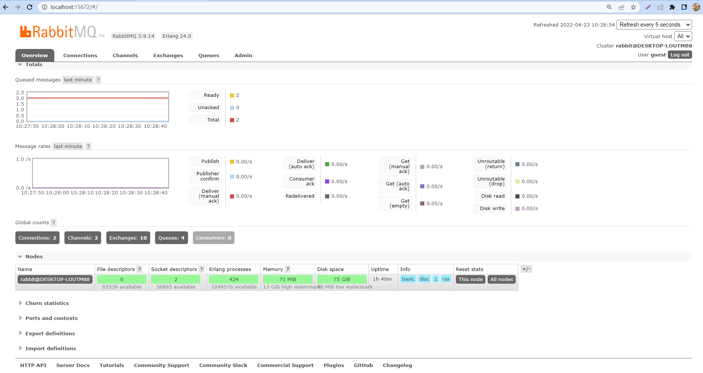
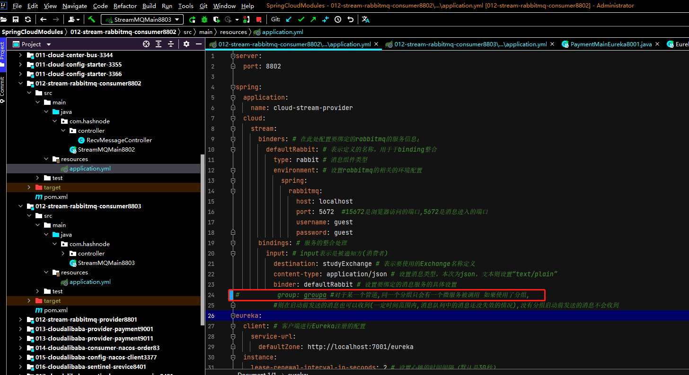

**什么是SpringCloudStream**

官方定义 Spring Cloud Stream 是一个构建消息驱动微服务的框架。

应用程序通过inputs或者outputs来与Spring Cloud Stream中binder对象交互,通过配置来binding(绑定)，而Spring Cloud Stream的binder对象负责与消息中间件交互,所以，我们只需要搞清楚如何与 Spring Cloud Stream 交互就可以方便使用消息驱动的方式。

通过使用Spring Integration来连接消息代理中间件以实现消息事件驱动,Spring Cloud Stream 为一些供应商的消息中间件产品提供了个性化的自动化配置实现，引用了发布-订阅、消费组、分区的三个核心概念。

使用SpringCloudStream可以屏蔽底层消息中间件的差异,降低切换成本，统一消息的编程模型

**官网**

https://spring.io/projects/spring-cloud-stream#overview

https://spring.io/projects/spring-cloud-stream#overview

中文指导手册:https://m.wang1314.com/doc/webapp/topic/20971999.html

Spring Cloud Stream是用于构建与共享消息传递系统连接的高度可伸缩的事件驱动微服务框架，该框架提供了一个灵活的编程模型，它建立在已经建立和熟悉的Spring熟语和最佳实践上，包括支持持久化的发布/订阅、消费组以及消息分区这三个核心概念


## 设计思想

### 标准MQ

生产者/消费者之间靠消息媒介传递信息内容,消息必须走特定的通道，消息通道里的消息由消息通道MessageChannel的子接口SubscribableChannel消费，由MessageHandler消息处理器订阅。

### 为什么用Cloud Stream

比方说我们用到了RabbitMQ和Kafka，由于这两个消息中间件的架构上的不同，像RabbitMQ有exchange，kafka有Topic和Partitions分区，


这些中间件的差异性给实际项目开发造成了一定的困扰，我们如果用了两个消息队列的其中一种，后面的业务需求，想往另外一种消息队列进行迁移，这时候无疑就是一个灾难性的，一大堆东西都要重新推倒重新做，因为它跟我们的系统耦合了，这时候springcloud Stream给我们提供了一种解耦合的方式。

在没有绑定器这个概念的情况下，我们的SpringBoot应用要直接与消息中间件进行信息交互的时候，由于各消息中间件构建的初衷不同，它们的实现细节上会有较大的差异性通过定义绑定器作为中间层，完美地实现了应用程序与消息中间件细节之间的隔离。通过向应用程序暴露统一的Channel通道，使得应用程序不需要再考虑各种不同的消息中间件实现。


### Binder

在没有绑定器这个概念的情况下，我们的SpringBoot应用要直接与消息中间件进行信息交互的时候，由于各消息中间件构建的初衷不同，它们的实现细节上会有较大的差异性，通过定义绑定器作为中间层，完美地实现了应用程序与消息中间件细节之间的隔离。Stream对消息中间件的进一步封装，可以做到代码层面对中间件的无感知，甚至于动态的切换中间件(rabbitmq切换为kafka)，使得微服务开发的高度解耦，服务可以关注更多自己的业务流程


通过定义绑定器Binder作为中间层，实现了应用程序与消息中间件细节之间的隔离。Binder可以生成Binding，Binding用来绑定消息容器的生产者和消费者，它有两种类型，INPUT和OUTPUT，**INPUT对应于消费者，OUTPUT对应于生产者。**

Stream中的消息通信方式遵循了发布-订阅模式。

### Spring Cloud Stream标准流程套路


+ Binder

很方便的连接中间件，屏蔽差异

+ Channel

通道，是队列Queue的一种抽象，在消息通讯系统中就是实现存储和转发的媒介，通过Channel对队列进行配置

+ Source和Sink

简单的可理解为参照对象是Spring Cloud Stream自身，从Stream发布消息就是输出，接受消息就是输入。

### 编码API和常用注解


## 案例说明

RabbitMQ环境已经OK

工程中新建三个子模块012-stream-rabbitmq-provider8801（生产者，发消息模块），012-stream-rabbitmq-consumer8802（消费者，消息接受模块），012-stream-rabbitmq-consumer8803（消费者，消息接受模块）。

### 012-stream-rabbitmq-provider8801

#### pom.xml

```xml
<?xml version="1.0" encoding="UTF-8"?>
<project xmlns="http://maven.apache.org/POM/4.0.0"
         xmlns:xsi="http://www.w3.org/2001/XMLSchema-instance"
         xsi:schemaLocation="http://maven.apache.org/POM/4.0.0 http://maven.apache.org/xsd/maven-4.0.0.xsd">
    <parent>
        <artifactId>SpringCloudModules</artifactId>
        <groupId>com.hashnode</groupId>
        <version>1.0-SNAPSHOT</version>
    </parent>
    <modelVersion>4.0.0</modelVersion>

    <artifactId>012-stream-rabbitmq-provider8801</artifactId>

    <properties>
        <maven.compiler.source>8</maven.compiler.source>
        <maven.compiler.target>8</maven.compiler.target>
    </properties>

    <dependencies>
        <dependency>
            <groupId>org.springframework.boot</groupId>
            <artifactId>spring-boot-starter-web</artifactId>
        </dependency>
        <dependency>
            <groupId>org.springframework.boot</groupId>
            <artifactId>spring-boot-starter-actuator</artifactId>
        </dependency>
        <dependency>
            <groupId>org.springframework.cloud</groupId>
            <artifactId>spring-cloud-starter-netflix-eureka-client</artifactId>
        </dependency>
<!--        rabbit流-->
        <dependency>
            <groupId>org.springframework.cloud</groupId>
            <artifactId>spring-cloud-starter-stream-rabbit</artifactId>
        </dependency>
        <!--基础配置-->
        <dependency>
            <groupId>org.springframework.boot</groupId>
            <artifactId>spring-boot-devtools</artifactId>
            <scope>runtime</scope>
            <optional>true</optional>
        </dependency>
        <dependency>
            <groupId>org.projectlombok</groupId>
            <artifactId>lombok</artifactId>
            <optional>true</optional>
        </dependency>
        <dependency>
            <groupId>org.springframework.boot</groupId>
            <artifactId>spring-boot-starter-test</artifactId>
            <scope>test</scope>
        </dependency>
    </dependencies>

</project>
```

#### application.yml

```yml
server:
  port: 8801

spring:
  application:
    name: cloud-stream-provider
  cloud:
    stream:
      binders: # 在此处配置要绑定的rabbitmq的服务信息；
        defaultRabbit: # 表示定义的名称，用于于binding整合
          type: rabbit # 消息组件类型
          environment: # 设置rabbitmq的相关的环境配置
            spring:
              rabbitmq:
                host: localhost
                port: 5672  #15672是浏览器访问的端口,5672是消息进入的端口
                username: guest
                password: guest
      bindings: # 服务的整合处理
        output: # output表示是通知方(生产者)
          destination: studyExchange # 表示要使用的Exchange名称定义
          content-type: application/json # 设置消息类型，这里为json，如果是文本则设置“text/plain”
          binder: defaultRabbit # 设置要绑定的消息服务的具体设置

eureka:
  client: # 客户端进行Eureka注册的配置
    service-url:
      defaultZone: http://localhost:7001/eureka
  instance:
    lease-renewal-interval-in-seconds: 2 # 设置心跳的时间间隔（默认是30秒）
    lease-expiration-duration-in-seconds: 5 # 如果现在超过了5秒的间隔（默认是90秒）
    instance-id: send-8801.com  # 在信息列表时显示主机名称
    prefer-ip-address: true     # 访问的路径变为IP地址
```

#### 发送消息接口和实现类

发送消息接口

```java
package com.hashnode.service;

public interface IMessageProvider {
    public String send();
}
```

发送消息接口实现类

```java
package com.hashnode.service.imp;

import com.hashnode.service.IMessageProvider;

import org.springframework.beans.factory.annotation.Autowired;
import org.springframework.cloud.stream.annotation.EnableBinding;

//该包不能引入错误
import org.springframework.cloud.stream.messaging.Source;
import org.springframework.messaging.MessageChannel;
//该包不能引入错误
import org.springframework.messaging.support.MessageBuilder;

import javax.annotation.Resource;
import java.util.UUID;


@EnableBinding(Source.class) //可以理解为是一个消息的发送管道的定义
public class IMessageProviderImpl implements IMessageProvider {

    @Resource
    private MessageChannel output;

    @Override
    public String send() {
        String serial = UUID.randomUUID().toString();
        output.send(MessageBuilder.withPayload(serial).build());
        System.out.println("*****serial"+serial);
        return serial;
    }
}
```

#### Controller

```java
package com.hashnode.controller;

import com.hashnode.service.IMessageProvider;
import org.springframework.web.bind.annotation.GetMapping;
import org.springframework.web.bind.annotation.RestController;

import javax.annotation.Resource;

@RestController
public class SendMessageController {
    @Resource
    private IMessageProvider messageProvider;

    @GetMapping(value = "/sendMessage")
    public String sendMessage()
    {
        return messageProvider.send();
    }

}
```

#### 主启动类

```java
package com.hashnode;

import org.springframework.boot.SpringApplication;
import org.springframework.boot.autoconfigure.SpringBootApplication;
import org.springframework.context.annotation.ComponentScan;
import org.springframework.scheduling.annotation.EnableAsync;

@SpringBootApplication
public class StreamMQMain8801 {
    public static void main(String[] args) {
        SpringApplication.run(StreamMQMain8801.class,args);
    }
}
```

#### 测试

1. 启动7001eureka

2. 启动rabbitmq

rabbitmq-plugins enable rabbitmq_management

http://localhost:15672/



3. 启动8801

4. 访问http://localhost:8801/sendMessage ,发现出现了对应的管道


### 消费者模块

012-stream-rabbitmq-consumer8802模块

pom.xml

```xml
<?xml version="1.0" encoding="UTF-8"?>
<project xmlns="http://maven.apache.org/POM/4.0.0"
         xmlns:xsi="http://www.w3.org/2001/XMLSchema-instance"
         xsi:schemaLocation="http://maven.apache.org/POM/4.0.0 http://maven.apache.org/xsd/maven-4.0.0.xsd">
    <parent>
        <artifactId>SpringCloudModules</artifactId>
        <groupId>com.hashnode</groupId>
        <version>1.0-SNAPSHOT</version>
    </parent>
    <modelVersion>4.0.0</modelVersion>

    <artifactId>012-stream-rabbitmq-consumer8802</artifactId>

    <properties>
        <maven.compiler.source>8</maven.compiler.source>
        <maven.compiler.target>8</maven.compiler.target>
    </properties>

    <dependencies>
        <dependency>
            <groupId>org.springframework.boot</groupId>
            <artifactId>spring-boot-starter-web</artifactId>
        </dependency>
        <dependency>
            <groupId>org.springframework.boot</groupId>
            <artifactId>spring-boot-starter-actuator</artifactId>
        </dependency>
        <dependency>
            <groupId>org.springframework.cloud</groupId>
            <artifactId>spring-cloud-starter-netflix-eureka-client</artifactId>
        </dependency>
<!--        rabbit流-->
        <dependency>
            <groupId>org.springframework.cloud</groupId>
            <artifactId>spring-cloud-starter-stream-rabbit</artifactId>
        </dependency>
        <!--基础配置-->
        <dependency>
            <groupId>org.springframework.boot</groupId>
            <artifactId>spring-boot-devtools</artifactId>
            <scope>runtime</scope>
            <optional>true</optional>
        </dependency>
        <dependency>
            <groupId>org.projectlombok</groupId>
            <artifactId>lombok</artifactId>
            <optional>true</optional>
        </dependency>
        <dependency>
            <groupId>org.springframework.boot</groupId>
            <artifactId>spring-boot-starter-test</artifactId>
            <scope>test</scope>
        </dependency>
    </dependencies>

</project>
```

application.yml

```yml
server:
  port: 8802

spring:
  application:
    name: cloud-stream-provider
  cloud:
    stream:
      binders: # 在此处配置要绑定的rabbitmq的服务信息；
        defaultRabbit: # 表示定义的名称，用于于binding整合
          type: rabbit # 消息组件类型
          environment: # 设置rabbitmq的相关的环境配置
            spring:
              rabbitmq:
                host: localhost
                port: 5672  #15672是浏览器访问的端口,5672是消息进入的端口
                username: guest
                password: guest
      bindings: # 服务的整合处理
        input: # input表示是被通知方(消费者)
          destination: studyExchange # 表示要使用的Exchange名称定义
          content-type: application/json # 设置消息类型，这里为json，文本则设置“text/plain”
          binder: defaultRabbit # 设置要绑定的消息服务的具体设置
          # group: groupa #对于某一个管道,同一个分组只会有一个微服务被调用 如果使用了分组,
          #则在启动前发送的消息也可以收到(一定时间范围内,消息队列中的消息还没失效的情况),没有分组启动前发送的消息不会收到
eureka:
  client: # 客户端进行Eureka注册的配置
    service-url:
      defaultZone: http://localhost:7001/eureka
  instance:
    lease-renewal-interval-in-seconds: 2 # 设置心跳的时间间隔（默认是30秒）
    lease-expiration-duration-in-seconds: 5 # 如果现在超过了5秒的间隔（默认是90秒）
    instance-id: send-8801.com  # 在信息列表时显示主机名称
    prefer-ip-address: true     # 访问的路径变为IP地址
```

主启动类

```java
package com.hashnode;

import org.springframework.boot.SpringApplication;
import org.springframework.boot.autoconfigure.SpringBootApplication;

@SpringBootApplication
public class StreamMQMain8802 {
    public static void main(String[] args) {
        SpringApplication.run(StreamMQMain8802.class,args);
    }
}
```

业务类

```java
package com.hashnode.controller;


import org.springframework.beans.factory.annotation.Value;
import org.springframework.cloud.stream.annotation.EnableBinding;
import org.springframework.cloud.stream.annotation.StreamListener;
import org.springframework.cloud.stream.messaging.Sink;
import org.springframework.messaging.Message;
import org.springframework.stereotype.Component;

@Component
@EnableBinding(Sink.class)
public class RecvMessageController {
    @Value("${server.port}")
    private String serverPort;

    @StreamListener(Sink.INPUT)
    public void recevied(Message<String> message){
        System.out.println("8802------->接收到的消息：" + message.getPayload()+"\t port: "+serverPort);
    }

}
```

测试


### 分组消费与持久化

按照012-stream-rabbitmq-consumer8802赋值出012-stream-rabbitmq-consumer8803

pom.xml

```xml
<?xml version="1.0" encoding="UTF-8"?>
<project xmlns="http://maven.apache.org/POM/4.0.0"
         xmlns:xsi="http://www.w3.org/2001/XMLSchema-instance"
         xsi:schemaLocation="http://maven.apache.org/POM/4.0.0 http://maven.apache.org/xsd/maven-4.0.0.xsd">
    <parent>
        <artifactId>SpringCloudModules</artifactId>
        <groupId>com.hashnode</groupId>
        <version>1.0-SNAPSHOT</version>
    </parent>
    <modelVersion>4.0.0</modelVersion>

    <artifactId>012-stream-rabbitmq-consumer8803</artifactId>

    <properties>
        <maven.compiler.source>8</maven.compiler.source>
        <maven.compiler.target>8</maven.compiler.target>
    </properties>

    <dependencies>
        <dependency>
            <groupId>org.springframework.boot</groupId>
            <artifactId>spring-boot-starter-web</artifactId>
        </dependency>
        <dependency>
            <groupId>org.springframework.boot</groupId>
            <artifactId>spring-boot-starter-actuator</artifactId>
        </dependency>
        <dependency>
            <groupId>org.springframework.cloud</groupId>
            <artifactId>spring-cloud-starter-netflix-eureka-client</artifactId>
        </dependency>
<!--        rabbit流-->
        <dependency>
            <groupId>org.springframework.cloud</groupId>
            <artifactId>spring-cloud-starter-stream-rabbit</artifactId>
        </dependency>
        <!--基础配置-->
        <dependency>
            <groupId>org.springframework.boot</groupId>
            <artifactId>spring-boot-devtools</artifactId>
            <scope>runtime</scope>
            <optional>true</optional>
        </dependency>
        <dependency>
            <groupId>org.projectlombok</groupId>
            <artifactId>lombok</artifactId>
            <optional>true</optional>
        </dependency>
        <dependency>
            <groupId>org.springframework.boot</groupId>
            <artifactId>spring-boot-starter-test</artifactId>
            <scope>test</scope>
        </dependency>
    </dependencies>

</project>
```

application.yml

```yml
server:
  port: 8803

spring:
  application:
    name: cloud-stream-provider
  cloud:
    stream:
      binders: # 在此处配置要绑定的rabbitmq的服务信息；
        defaultRabbit: # 表示定义的名称，用于于binding整合
          type: rabbit # 消息组件类型
          environment: # 设置rabbitmq的相关的环境配置
            spring:
              rabbitmq:
                host: localhost
                port: 5672  #15672是浏览器访问的端口,5672是消息进入的端口
                username: guest
                password: guest
      bindings: # 服务的整合处理
        input: # input表示是被通知方(消费者)
          destination: studyExchange # 表示要使用的Exchange名称定义
          content-type: application/json # 设置消息类型，这里为json，文本则设置“text/plain”
          binder: defaultRabbit # 设置要绑定的消息服务的具体设置
          # group: groupc #对于某一个管道,同一个分组只会有一个微服务被调用 如果使用了分组,
          #则在启动前发送的消息也可以收到(一定时间范围内,消息队列中的消息还没失效的情况),没有分组启动前发送的消息不会收到
#          group: groupa

eureka:
  client: # 客户端进行Eureka注册的配置
    service-url:
      defaultZone: http://localhost:7001/eureka
  instance:
    lease-renewal-interval-in-seconds: 2 # 设置心跳的时间间隔（默认是30秒）
    lease-expiration-duration-in-seconds: 5 # 如果现在超过了5秒的间隔（默认是90秒）
    instance-id: send-8801.com  # 在信息列表时显示主机名称
    prefer-ip-address: true     # 访问的路径变为IP地址
```

主启动类

```java
package com.hashnode;

import org.springframework.boot.SpringApplication;
import org.springframework.boot.autoconfigure.SpringBootApplication;

@SpringBootApplication
public class StreamMQMain8803 {
    public static void main(String[] args) {
        SpringApplication.run(StreamMQMain8803.class,args);
    }
}
```

业务类

```java
package com.hashnode.controller;


import org.springframework.beans.factory.annotation.Value;
import org.springframework.cloud.stream.annotation.EnableBinding;
import org.springframework.cloud.stream.annotation.StreamListener;
import org.springframework.cloud.stream.messaging.Sink;
import org.springframework.messaging.Message;
import org.springframework.stereotype.Component;

@Component
@EnableBinding(Sink.class)
public class RecvMessageController {
    @Value("${server.port}")
    private String serverPort;

    @StreamListener(Sink.INPUT)
    public void recevied(Message<String> message){
        System.out.println("8803------->接收到的消息：" + message.getPayload()+"\t port: "+serverPort);
    }

}
```

如果启动了8802,8003,此时访问了http://localhost:8801/sendMessage, 8802和8803会同时收到,可能会产生重复消费问题。

比如在如下订单系统的场景中，我们做集群部署，并且从RabbitMQ中获取订单信息，那如果一个订单同时被两个服务获取到，那么就会造成数据错误，我们得避免这种情况,这时我们就可以使用Stream中的消息分组来解决。


注意在Stream中处于同一个group中的多个消费者是竞争关系，就能够保证消息只会被其中一个应用消费一次。不同组的不会竞争，都会处理事件，同一组内会发生竞争关系，只有其中一个可以消费。

#### 分组

微服务应用放置于同一个group中，就能够保证消息只会被其中一个应用消费一次，不同的组都可以消费，同一个组内会发生竞争关系，只有其中一个可以消费。

8802修改YML


8803修改YML


查看rabbitmq


设置不同的分组访问http://localhost:8801/sendMessage可以发现,如果设置相同的分组,则只有一个微服务能处理消息,如果设置不同的分组则都能处理该消息.

#### 持久化

8801先发送4条消息到rabbitmq

先启动8802，无分组属性配置，后台没有打出来消息




再启动8803，有分组属性配置(此配置信息需要先在RabbitMQ中存在),如果是之前rabbitmq中不存在的分组,则在启动后不会接收到之前发送的消息。


后台输出了MQ上的消息:

