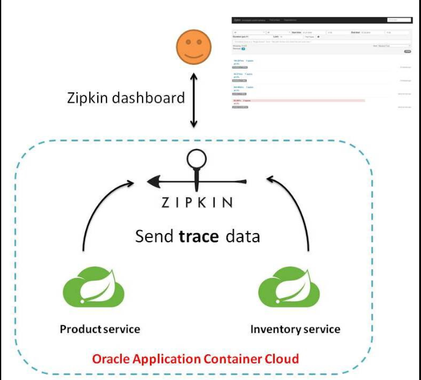

 在微服务框架中，一个由客户端发起的请求在后端系统中会经过多个不同的的服务节点调用来协同产生最后的请求结果，每一个前段请求都会形成一条复杂的分布式服务调用链路，链路中的任何一环出现高延时或错误都会引起整个请求最后的失败。


官方文档：https://github.com/spring-cloud/spring-cloud-sleuth

Spring Cloud Sleuth提供了一套完整的服务跟踪的解决方案，在分布式系统中提供追踪解决方案并且兼容支持了zipkin。

解决方案：



## 搭建链路监控步骤

### zipkin

SpringCloud从F版起已不需要自己构建Zipkin Server了，只需调用jar包即可。

https://zipkin.io/pages/quickstart.html


运行jar


访问：http://localhost:9411/zipkin/


 完整的调用链路示例如下：


一条链路通过Trace Id唯一标识，Span标识发起的请求信息，各span通过parent id 关联起来：


### 服务提供者

修改001-cloud-provider-payment-eureka-8001

pom.xml  （添加spring-cloud-starter-zipkin）

```xml
<?xml version="1.0" encoding="UTF-8"?>
<project xmlns="http://maven.apache.org/POM/4.0.0"
         xmlns:xsi="http://www.w3.org/2001/XMLSchema-instance"
         xsi:schemaLocation="http://maven.apache.org/POM/4.0.0 http://maven.apache.org/xsd/maven-4.0.0.xsd">
    <parent>
        <artifactId>SpringCloudModules</artifactId>
        <groupId>com.hashnode</groupId>
        <version>1.0-SNAPSHOT</version>
    </parent>
    <modelVersion>4.0.0</modelVersion>

    <artifactId>001-cloud-provider-payment-eureka-8001</artifactId>

    <properties>
        <maven.compiler.source>8</maven.compiler.source>
        <maven.compiler.target>8</maven.compiler.target>
    </properties>


    <dependencies>
        <dependency>
            <groupId>org.springframework.boot</groupId>
            <artifactId>spring-boot-starter-web</artifactId>
        </dependency>

        <dependency>
            <groupId>org.springframework.boot</groupId>
            <artifactId>spring-boot-starter-actuator</artifactId>
        </dependency>

        <dependency>
            <groupId>org.springframework.boot</groupId>
            <artifactId>spring-boot-starter-test</artifactId>
            <scope>test</scope>
            <exclusions>
                <exclusion>
                    <groupId>org.junit.vintage</groupId>
                    <artifactId>junit-vintage-engine</artifactId>
                </exclusion>
            </exclusions>
        </dependency>

        <!--包含了sleuth+zipkin-->
        <dependency>
            <groupId>org.springframework.cloud</groupId>
            <artifactId>spring-cloud-starter-zipkin</artifactId>
        </dependency>


        <!--eureka-client-->
        <dependency>
            <groupId>org.springframework.cloud</groupId>
            <artifactId>spring-cloud-starter-netflix-eureka-client</artifactId>
        </dependency>

        <!--        使用hystrix熔断-->
        <dependency>
            <groupId>org.springframework.cloud</groupId>
            <artifactId>spring-cloud-starter-netflix-hystrix</artifactId>
        </dependency>

        <!--        引入自定义的api通用包，包括各种实体类-->
        <dependency>
            <groupId>com.hashnode</groupId>
            <artifactId>003-cloud-api-commons</artifactId>
            <version>1.0-SNAPSHOT</version>
        </dependency>

        <!--mysql-->
        <dependency>
            <groupId>mysql</groupId>
            <artifactId>mysql-connector-java</artifactId>
        </dependency>
        <!-- druid-->
        <dependency>
            <groupId>com.alibaba</groupId>
            <artifactId>druid</artifactId>
        </dependency>
        <!-- mybatis-->
        <dependency>
            <groupId>org.mybatis.spring.boot</groupId>
            <artifactId>mybatis-spring-boot-starter</artifactId>
        </dependency>
        <!--junit-->
        <dependency>
            <groupId>junit</groupId>
            <artifactId>junit</artifactId>
        </dependency>
        <!--log4j-->
        <dependency>
            <groupId>log4j</groupId>
            <artifactId>log4j</artifactId>
        </dependency>
        <!--SpringBoot Thymeleaf依赖-->
        <dependency>
            <groupId>org.springframework.boot</groupId>
            <artifactId>spring-boot-starter-thymeleaf</artifactId>
        </dependency>
        <!--添加Bootstrap WarJar的依赖-->
        <dependency>
            <groupId>org.webjars</groupId>
            <artifactId>bootstrap</artifactId>
        </dependency>

        <dependency>
            <groupId>org.projectlombok</groupId>
            <artifactId>lombok</artifactId>
        </dependency>
        <dependency>
            <groupId>com.netflix.hystrix</groupId>
            <artifactId>hystrix-metrics-event-stream</artifactId>
        </dependency>


    </dependencies>


</project>
```

application.yml

```yml
server:
  port: 8001

spring:
  application:
    name: cloud-payment-service

  zipkin:
    base-url: http://localhost:9411
  sleuth:
    sampler:
      #采样率值介于 0 到 1 之间，1 则表示全部采集
      probability: 1

  datasource:
    type: com.alibaba.druid.pool.DruidDataSource    #当前数据源操作类型
    driver-class-name: org.gjt.mm.mysql.Driver      #mysql驱动包
    url: jdbc:mysql://localhost:3306/springboot?useUnicode=true&characterEncoding=UTF-8&useJDBCCompliantTimezoneShift=true&useLegacyDateTimeCode=false&serverTimezone=GMT%2B8
    username: root
    password: root

eureka:
  client:
    #表示是否将自己注册进EurekaServer默认为true
    register-with-eureka: true
    #是否从EurekaServer抓取已有的注册信息，默认为true,单节点无所谓，集群必须设置为true才能配合ribbon使用负载均衡
    fetch-registry: true
    service-url:
      defaultZone: http://eureka7001.com:7001/eureka,http://eureka7002.com:7002/eureka,http://eureka7003.com:7003/eureka
#      defaultZone: http://localhost:7001/eureka
  instance:
    instance-id: payment8001
#    prefer-ip-address: true   #访问路径可以显示IP地址
    #Eureka客户端向服务端发送心跳的时间间隔，单位为秒(默认是30秒)
    lease-renewal-interval-in-seconds: 1
    #Eureka服务端在收到最后一次心跳后等待时间上限，单位为秒(默认是90秒)，超时将剔除服务
    lease-expiration-duration-in-seconds: 2

mybatis:
  mapper-locations:
    - classpath:mapper/*.xml
  type-aliases-package: com.hashnode.model      #所有model所在包

#暴露全部的监控信息
management:
  security:
    enabled: false
  endpoints:
    web:
      exposure:
        include: hystrix.stream
      base-path: /

hystrix:
  dashboard:
    proxy-stream-allow-list: "*"
```


controller

```java
package com.hashnode.controller;

import com.hashnode.model.CommonResult;
import com.hashnode.model.Payment;
import com.hashnode.service.PaymentService;
import lombok.extern.slf4j.Slf4j;
import org.springframework.beans.factory.annotation.Value;
import org.springframework.cloud.client.ServiceInstance;
import org.springframework.cloud.client.discovery.DiscoveryClient;
import org.springframework.web.bind.annotation.*;

import javax.annotation.Resource;
import java.util.List;
import java.util.concurrent.TimeUnit;

@RestController
@Slf4j
public class PaymentController {
    @Resource
    private PaymentService paymentService;

    @Value("${server.port}")
    private String serverPort;

    @Resource
    private DiscoveryClient discoveryClient;


    @PostMapping(value = "/payment/create")
    public CommonResult create(@RequestBody Payment payment){
        int result = paymentService.createPaymentSelective(payment);
        log.info("插入结果"+result);

        if(result > 0){
            return new CommonResult(200,"插入数据库成功",payment);
        }else{
            return new CommonResult(444,"插入数据库失败",null);
        }
    }

    @GetMapping(value = "/payment/get/{id}")
    public CommonResult<Payment> getPaymentById(@PathVariable("id") Long id){
        System.out.println(111);
        Payment result = paymentService.getPaymentById(id);
        log.info("查询结果"+result);

        if(result != null){
            return new CommonResult(200,"查询成功 port:"+serverPort,result);
        }else {
            return new CommonResult(444,"没有对应记录,查询ID:"+id);
        }
    }

    @GetMapping(value = "/payment/feign/timeout")
    public String paymentFeignTimeout(){
        try {
            TimeUnit.SECONDS.sleep(3);
        }catch (Exception e){
            e.printStackTrace();
        }
        return serverPort;
    }

    @GetMapping(value = "/payment/discovery")
    public Object discovery(){
        List<String> services = discoveryClient.getServices();
        for (String service : services) {
            log.info("******element"+service);
        }

        List<ServiceInstance> instances = discoveryClient.getInstances("CLOUD-PAYMENT-SERVICE");

        for (ServiceInstance instance : instances){
            log.info(instance.getServiceId()+"\t" + instance.getHost()+"\t"+instance.getPort() + "\t" + instance.getUri());
        }

//        return this.discoveryClient;
        return services;
    }

    @GetMapping("/payment/zipkin")
    public String paymentZipkin()
    {
        return "hi ,i'am paymentzipkin server fall back，welcome to atguigu，O(∩_∩)O哈哈~";
    }
}
```

### 服务消费者（调用方）

修改002-cloud-provider-order-eureka80

pom.xml  （添加spring-cloud-starter-zipkin）

```xml
<?xml version="1.0" encoding="UTF-8"?>
<project xmlns="http://maven.apache.org/POM/4.0.0"
         xmlns:xsi="http://www.w3.org/2001/XMLSchema-instance"
         xsi:schemaLocation="http://maven.apache.org/POM/4.0.0 http://maven.apache.org/xsd/maven-4.0.0.xsd">
    <parent>
        <artifactId>SpringCloudModules</artifactId>
        <groupId>com.hashnode</groupId>
        <version>1.0-SNAPSHOT</version>
    </parent>
    <modelVersion>4.0.0</modelVersion>

    <artifactId>002-cloud-provider-order-eureka80</artifactId>

    <properties>
        <maven.compiler.source>8</maven.compiler.source>
        <maven.compiler.target>8</maven.compiler.target>
    </properties>

    <dependencies>
        <dependency>
            <groupId>org.springframework.boot</groupId>
            <artifactId>spring-boot-starter-web</artifactId>
        </dependency>

        <dependency>
            <groupId>org.springframework.boot</groupId>
            <artifactId>spring-boot-starter-actuator</artifactId>
        </dependency>

        <dependency>
            <groupId>org.springframework.boot</groupId>
            <artifactId>spring-boot-starter-test</artifactId>
            <scope>test</scope>
            <exclusions>
                <exclusion>
                    <groupId>org.junit.vintage</groupId>
                    <artifactId>junit-vintage-engine</artifactId>
                </exclusion>
            </exclusions>
        </dependency>

        <!--包含了sleuth+zipkin-->
        <dependency>
            <groupId>org.springframework.cloud</groupId>
            <artifactId>spring-cloud-starter-zipkin</artifactId>
        </dependency>

        <!--eureka-client-->
        <dependency>
            <groupId>org.springframework.cloud</groupId>
            <artifactId>spring-cloud-starter-netflix-eureka-client</artifactId>
        </dependency>

        <!--        引入自定义的api通用包，包括各种实体类-->
        <dependency>
            <groupId>com.hashnode</groupId>
            <artifactId>003-cloud-api-commons</artifactId>
            <version>1.0-SNAPSHOT</version>
        </dependency>

        <!--mysql-->
        <dependency>
            <groupId>mysql</groupId>
            <artifactId>mysql-connector-java</artifactId>
        </dependency>
        <!-- druid-->
        <dependency>
            <groupId>com.alibaba</groupId>
            <artifactId>druid</artifactId>
        </dependency>
        <!-- mybatis,引入mybatis-spring-boot-starter必须配置数据库-->
        <!--        <dependency>-->
        <!--            <groupId>org.mybatis.spring.boot</groupId>-->
        <!--            <artifactId>mybatis-spring-boot-starter</artifactId>-->
        <!--        </dependency>-->
        <!--junit-->
        <dependency>
            <groupId>junit</groupId>
            <artifactId>junit</artifactId>
        </dependency>
        <!--log4j-->
        <dependency>
            <groupId>log4j</groupId>
            <artifactId>log4j</artifactId>
        </dependency>
        <!--SpringBoot Thymeleaf依赖-->
        <dependency>
            <groupId>org.springframework.boot</groupId>
            <artifactId>spring-boot-starter-thymeleaf</artifactId>
        </dependency>
        <!--添加Bootstrap WarJar的依赖-->
        <dependency>
            <groupId>org.webjars</groupId>
            <artifactId>bootstrap</artifactId>
        </dependency>

        <dependency>
            <groupId>org.projectlombok</groupId>
            <artifactId>lombok</artifactId>
        </dependency>


    </dependencies>


</project>
```

applicaton.yml

```yml
server:
  port: 80

spring:
  application:
    name: cloud-order-service
  zipkin:
    base-url: http://localhost:9411
  sleuth:
    sampler:
      probability: 1


eureka:
  client:
    #表示是否将自己注册进EurekaServer默认为true
    register-with-eureka: true
    #是否从EurekaServer抓取已有的注册信息，默认为true,单节点无所谓，集群必须设置为true才能配合ribbon使用负载均衡
    fetch-registry: true
    service-url:
      defaultZone: http://localhost:7001/eureka,http://localhost:7002/eureka,http://localhost:7003/eureka
#      defaultZone: http://localhost:7001/eureka
```


controller

```java
package com.hashnode.controller;

import com.hashnode.lb.LoadBalancer;
import com.hashnode.model.CommonResult;
import com.hashnode.model.Payment;
import lombok.extern.slf4j.Slf4j;
import org.springframework.beans.factory.annotation.Autowired;
import org.springframework.cloud.client.ServiceInstance;
import org.springframework.cloud.client.discovery.DiscoveryClient;
import org.springframework.web.bind.annotation.GetMapping;
import org.springframework.web.bind.annotation.PathVariable;
import org.springframework.web.bind.annotation.RestController;
import org.springframework.web.client.RestTemplate;

import javax.annotation.Resource;
import java.net.URI;
import java.util.List;

@RestController
@Slf4j
public class OrderController {

//    public static final String PAYMENT_URL = "http://localhost:8001";
    public static final String PAYMENT_URL = "http://CLOUD-PAYMENT-SERVICE";

    @Autowired
    private RestTemplate restTemplate;

    @Autowired
    private DiscoveryClient discoveryClient;

    @Resource
    private LoadBalancer loadBalancer;

    @GetMapping("/consumer/payment/create")
    public CommonResult<Payment> create(Payment payment){
        return restTemplate.postForObject(PAYMENT_URL+"/payment/create",payment,CommonResult.class);
    }

    @GetMapping("/consumer/payment/get/{id}")
    public CommonResult<Payment> getPayment(@PathVariable("id")Long id){
        return restTemplate.getForObject(PAYMENT_URL+"/payment/get/"+id,CommonResult.class);
    }


//    自定义负载均衡策略
    @GetMapping("/consumer/payment/lb/get/{id}")
    public CommonResult<Payment> getPaymentLB(@PathVariable("id")Long id){
        List<ServiceInstance> instances = discoveryClient.getInstances("CLOUD-PAYMENT-SERVICE");
        if(null == instances || instances.size() <=0 ){
            return null;
        }
        ServiceInstance serviceInstance = loadBalancer.instance(instances);
        URI uri = serviceInstance.getUri();

        return restTemplate.getForObject(uri+"/payment/get/"+id,CommonResult.class);
    }

    // ====================> zipkin+sleuth
    @GetMapping("/consumer/payment/zipkin")
    public String paymentZipkin()
    {
//        String result = restTemplate.getForObject("http://localhost:8001"+"/payment/zipkin/", String.class);
        String result = restTemplate.getForObject(PAYMENT_URL+"/payment/zipkin/", String.class);
        return result;
    }
}
```

### 依次启动eureka7001/8001/80

访问：http://localhost/consumer/payment/zipkin


访问：http://localhost/consumer/payment/get/1


打开浏览器访问：http://localhost:9411，点击RUN QUERY


点击show：


