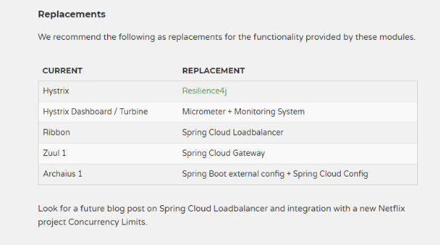
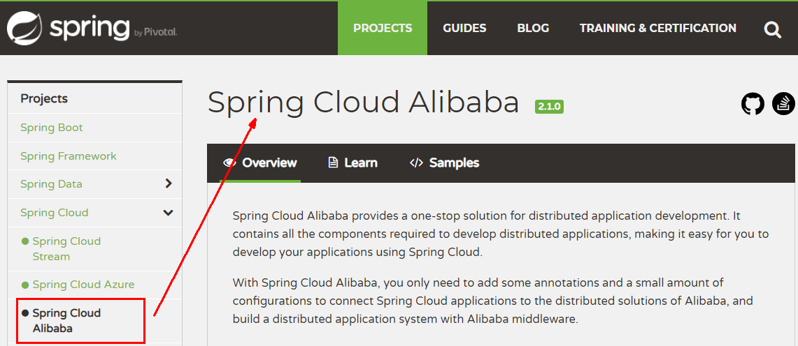

## 为什么会出现SpringCloud alibaba

Spring Cloud Netflix项目目前进入了维护模式：https://spring.io/blog/2018/12/12/spring-cloud-greenwich-rc1-available-now

维护模式，意味着 Spring Cloud 团队将不会再向模块添加新功能，新组件功能将以其他替代品代替：

## SpringCloud alibaba带来了什么

官网：https://github.com/alibaba/spring-cloud-alibaba/blob/master/README-zh.md

可以做如下事情：

+ 服务限流降级：默认支持 Servlet、Feign、RestTemplate、Dubbo 和 RocketMQ 限流降级功能的接入，可以在运行时通过控制台实时修改限流降级规则，还支持查看限流降级 Metrics 监控。
+ 服务注册与发现：适配 Spring Cloud 服务注册与发现标准，默认集成了 Ribbon 的支持。
+ 分布式配置管理：支持分布式系统中的外部化配置，配置更改时自动刷新。
+ 消息驱动能力：基于 Spring Cloud Stream 为微服务应用构建消息驱动能力。
+ 阿里云对象存储：阿里云提供的海量、安全、低成本、高可靠的云存储服务。支持在任何应用、任何时间、任何地点存储和访问任意类型的数据。
+ 分布式任务调度：提供秒级、精准、高可靠、高可用的定时（基于 Cron 表达式）任务调度服务。同时提供分布式的任务执行模型，如网格任务。网格任务支持海量子任务均匀分配到所有 Worker（schedulerx-client）上执行。

有如下产品：

## SpringCloud alibaba学习资料获取

官网：[https://spring.io/projects/spring-cloud-alibaba#overview](https://spring.io/projects/spring-cloud-alibaba#overview)

Spring Cloud Alibaba 致力于提供微服务开发的一站式解决方案。此项目包含开发分布式应用微服务的必需组件，方便开发者通过 Spring Cloud 编程模型轻松使用这些组件来开发分布式应用服务。

依托 Spring Cloud Alibaba，您只需要添加一些注解和少量配置，就可以将 Spring Cloud 应用接入阿里微服务解决方案，通过阿里中间件来迅速搭建分布式应用系统。

英文资料：

https://github.com/alibaba/spring-cloud-alibaba

https://spring-cloud-alibaba-group.github.io/github-pages/greenwich/spring-cloud-alibaba.html

中文资料：

https://github.com/alibaba/spring-cloud-alibaba/blob/master/README-zh.md

