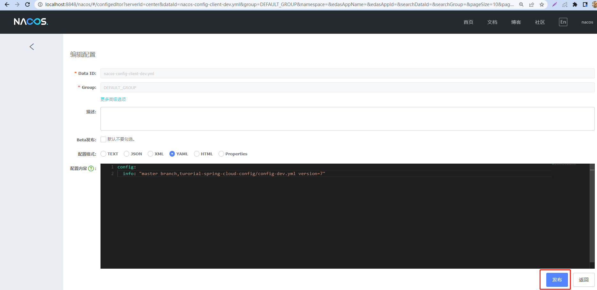
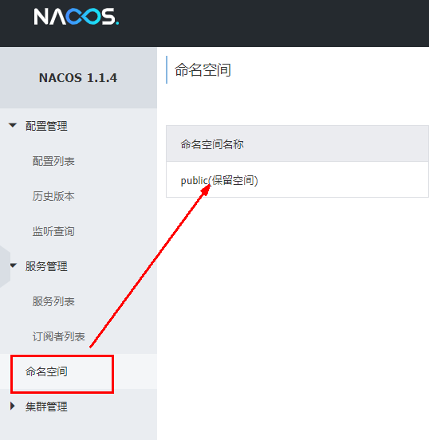
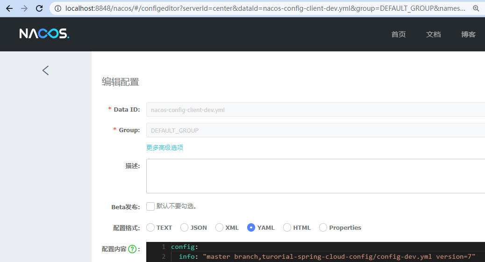
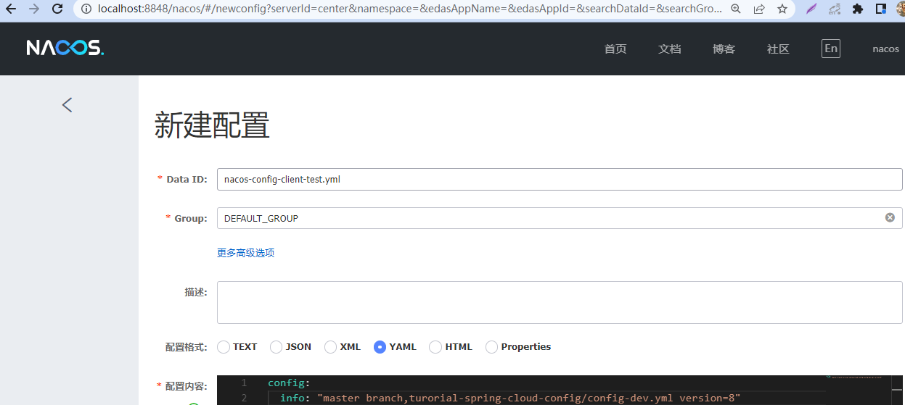
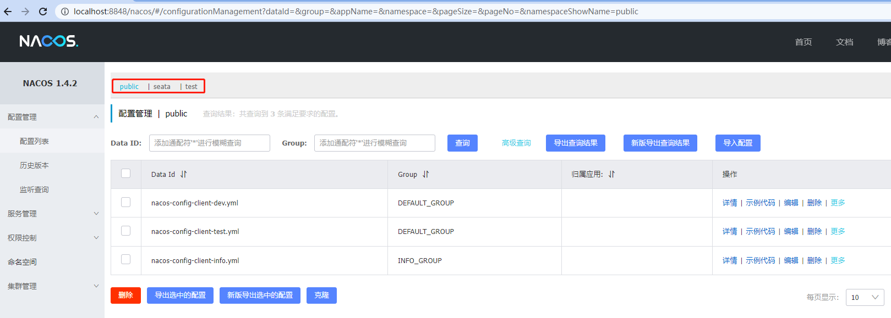
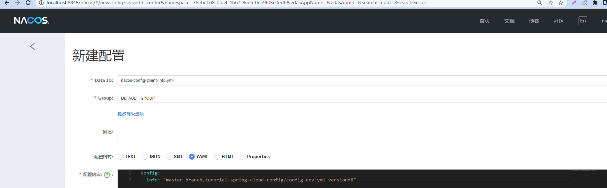

## Nacos简介

Nacos是Naming和Configuration的前两个字母+Service的第一个字母组成。

是一个更易于构建云原生应用的动态服务发现、配置管理和服务管理平台，简单来说Nacos就是注册中心+配置中心的组合。

Nacos = Eureka + Config + Bus

可以替代Eureka做服务注册中心，也可以替代Config做服务配置中心。


下载地址：https://github.com/alibaba/Nacos

官方文档：

https://nacos.io/zh-cn/index.html

https://spring-cloud-alibaba-group.github.io/github-pages/greenwich/spring-cloud-alibaba.html#_spring_cloud_alibaba_nacos_discovery


各种注册中心比较：


## 安装并运行Nacos

运行Nacos前需要配置好本地的Java8和Maven环境。

首先从官网下载Nacos:https://github.com/alibaba/nacos/releases

这里使用的版本是1.4.2

将安装包解压，直接运行bin目录下的startup.cmd


上图中的standalone表示不以集群的方式启动。

命令运行成功后直接访问http://localhost:8848/nacos，默认账号密码都是nacos


## Nacos作为配置中心演示

### Nacos作为配置中心-基础配置

新建模块015-cloudalibaba-config-nacos-client3377

**pom.xml**

```xml
<?xml version="1.0" encoding="UTF-8"?>
<project xmlns="http://maven.apache.org/POM/4.0.0"
         xmlns:xsi="http://www.w3.org/2001/XMLSchema-instance"
         xsi:schemaLocation="http://maven.apache.org/POM/4.0.0 http://maven.apache.org/xsd/maven-4.0.0.xsd">
    <parent>
        <artifactId>SpringCloudModules</artifactId>
        <groupId>com.hashnode</groupId>
        <version>1.0-SNAPSHOT</version>
    </parent>
    <modelVersion>4.0.0</modelVersion>

    <artifactId>015-cloudalibaba-config-nacos-client3377</artifactId>

    <properties>
        <maven.compiler.source>8</maven.compiler.source>
        <maven.compiler.target>8</maven.compiler.target>
    </properties>

    <dependencies>
        <!--nacos-config-->
        <dependency>
            <groupId>com.alibaba.cloud</groupId>
            <artifactId>spring-cloud-starter-alibaba-nacos-config</artifactId>
        </dependency>
        <!--nacos-discovery-->
        <dependency>
            <groupId>com.alibaba.cloud</groupId>
            <artifactId>spring-cloud-starter-alibaba-nacos-discovery</artifactId>
        </dependency>
        <!--web + actuator-->
        <dependency>
            <groupId>org.springframework.boot</groupId>
            <artifactId>spring-boot-starter-web</artifactId>
        </dependency>
        <dependency>
            <groupId>org.springframework.boot</groupId>
            <artifactId>spring-boot-starter-actuator</artifactId>
        </dependency>
        <!--一般基础配置-->
        <dependency>
            <groupId>org.springframework.boot</groupId>
            <artifactId>spring-boot-devtools</artifactId>
            <scope>runtime</scope>
            <optional>true</optional>
        </dependency>
        <dependency>
            <groupId>org.projectlombok</groupId>
            <artifactId>lombok</artifactId>
            <optional>true</optional>
        </dependency>
        <dependency>
            <groupId>org.springframework.boot</groupId>
            <artifactId>spring-boot-starter-test</artifactId>
            <scope>test</scope>
        </dependency>
    </dependencies>
</project>
```

**bootstrap.yml**

```yml
# nacos配置
server:
  port: 3377

spring:
  application:
    name: nacos-config-client
  cloud:
    nacos:
      discovery:
        server-addr: localhost:8848 #Nacos服务注册中心地址
#      使用config会自动将服务注册到nacos
      config:
        server-addr: localhost:8848 #Nacos作为配置中心地址
        file-extension: yml #指定yml格式的配置
#        namespace: ae31b101-ba2a-46ec-a6a7-0d76ddb67799 #命名空间id,不配默认为public
        group: DEFAULT_GROUP #寻找对应分组的yml,如果不配默认为DEFAULT_GROUP


  # ${spring.application.name}-${spring.profile.active}.${spring.cloud.nacos.config.file-extension}
# nacos-config-client-dev.yml
```

**applicaton.yml**

```yml
spring:
  profiles:
#    active: dev # 表示开发环境
    active: test # 表示开发环境
```

为什么配置两个yml?

Nacos同springcloud-config一样，在项目初始化时，要保证先从配置中心进行配置拉取，拉取配置之后，才能保证项目的正常启动。

springboot中配置文件的加载是存在优先级顺序的，bootstrap优先级高于application。

**主启动**

```java
package com.hashnode;

import org.springframework.boot.SpringApplication;
import org.springframework.boot.autoconfigure.SpringBootApplication;
import org.springframework.cloud.client.discovery.EnableDiscoveryClient;

@EnableDiscoveryClient
@SpringBootApplication
public class NacosConfigClientMain3377 {
    public static void main(String[] args) {
        SpringApplication.run(NacosConfigClientMain3377.class, args);
    }
}
```

**业务类**

通过SpringCloud原生注解@RefreshScope可以实现配置的自动更新:

```java
package com.hashnode.controller;

import org.springframework.beans.factory.annotation.Value;
import org.springframework.cloud.context.config.annotation.RefreshScope;
import org.springframework.web.bind.annotation.GetMapping;
import org.springframework.web.bind.annotation.RestController;

@RestController
@RefreshScope //在控制器类加入@RefreshScope注解使当前类下的配置支持Nacos的动态刷新功能。
public class ConfigClientController {
    @Value("${config.info}")
    private String configInfo;

    @GetMapping("/config/info")
    public String getConfigInfo() {
        return configInfo;
    }
}
```

**在Nacos中添加配置信息**

在配置中新增如下配置


Data ID的配置规则为（参考：[https://nacos.io/zh-cn/docs/quick-start-spring-cloud.html](https://nacos.io/zh-cn/docs/quick-start-spring-cloud.html)）：


prefix 默认为 spring.application.name 的值

spring.profile.active 即为当前环境对应的 profile，可以通过配置项 spring.profile.active 来配置。

file-exetension 为配置内容的数据格式，可以通过配置项 spring.cloud.nacos.config.file-extension 来配置


（注意yml和yaml）

Nacos会记录配置文件的历史版本默认保留30天，此外还有一键回滚功能，回滚操作将会触发配置更新


**测试**

启动前需要在nacos客户端-配置管理-配置管理栏目下有对应的yaml配置文件

运行cloud-config-nacos-client3377的主启动类

调用接口查看配置信息:http://localhost:3377/config/info


**自带动态刷新**



在此访问http://localhost:3377/config/info，发现已经动态刷新


### Nacos作为配置中心-分类配置

问题1：

+ 实际开发中，通常一个系统会准备dev开发环境、test测试环境、prod生产环境，如何保证指定环境启动时服务能正确读取到Nacos上相应环境的配置文件呢？

问题2：

一个大型分布式微服务系统会有很多微服务子项目，每个微服务项目又都会有相应的开发环境、测试环境、预发环境、正式环境......那怎么对这些微服务配置进行管理呢？

**配置管理**


**命名空间**



Namespace+Group+Data ID三者关系？为什么这么设计？

1 是什么

 类似Java里面的package名和类名，最外层的namespace是可以用于区分部署环境的，Group和DataID逻辑上区分两个目标对象。

2 三者情况


默认情况：Namespace=public，Group=DEFAULT_GROUP, 默认Cluster是DEFAULT

Nacos默认的命名空间是public，Namespace主要用来实现隔离。比方说我们现在有三个环境：开发、测试、生产环境，我们就可以创建三个Namespace，不同的Namespace之间是隔离的。

Group默认是DEFAULT_GROUP，Group可以把不同的微服务划分到同一个分组里面去

Service就是微服务；一个Service可以包含多个Cluster（集群），Nacos默认Cluster是DEFAULT，Cluster是对指定微服务的一个虚拟划分。比方说为了容灾，将Service微服务分别部署在了杭州机房和广州机房，这时就可以给杭州机房的Service微服务起一个集群名称（HZ），给广州机房的Service微服务起一个集群名称（GZ），还可以尽量让同一个机房的微服务互相调用，以提升性能。

最后是Instance，就是微服务的实例。

#### 三种方案加载配置

1. DataID方案

指定spring.profile.active和配置文件的DataID来使不同环境下读取不同的配置

默认空间+默认分组+新建dev和test两个DataID

新建dev配置DataID



新建test配置DataID



通过spring.profile.active属性就能进行多环境下配置文件的读取


测试：http://localhost:3377/config/info


2. Group方案

新建Group


bootstrap+application(在config下增加一条group的配置即可。可配置为DEV_GROUP或TEST_GROUP)


访问http://localhost:3377/config/info:


3. Namespace方案

新建名称为test的Namespace


回到服务管理-服务列表查看



test命名空间新建配置




yml配置


访问测试:


## Nacos作为注册中心演示

官方文档:[https://spring-cloud-alibaba-group.github.io/github-pages/greenwich/spring-cloud-alibaba.html#_spring_cloud_alibaba_nacos_config](https://spring-cloud-alibaba-group.github.io/github-pages/greenwich/spring-cloud-alibaba.html#_spring_cloud_alibaba_nacos_config)

### 基于Nacos的服务提供者

新建013-cloudalibaba-provider-payment9001

pom.xml

```xml
<?xml version="1.0" encoding="UTF-8"?>
<project xmlns="http://maven.apache.org/POM/4.0.0"
         xmlns:xsi="http://www.w3.org/2001/XMLSchema-instance"
         xsi:schemaLocation="http://maven.apache.org/POM/4.0.0 http://maven.apache.org/xsd/maven-4.0.0.xsd">
    <parent>
        <artifactId>SpringCloudModules</artifactId>
        <groupId>com.hashnode</groupId>
        <version>1.0-SNAPSHOT</version>
    </parent>
    <modelVersion>4.0.0</modelVersion>

    <artifactId>013-cloudalibaba-provider-payment9001</artifactId>

    <properties>
        <maven.compiler.source>8</maven.compiler.source>
        <maven.compiler.target>8</maven.compiler.target>
    </properties>

    <dependencies>
        <!--SpringCloud ailibaba nacos -->
        <dependency>
            <groupId>com.alibaba.cloud</groupId>
            <artifactId>spring-cloud-starter-alibaba-nacos-discovery</artifactId>
        </dependency>
        <!-- SpringBoot整合Web组件 -->
        <dependency>
            <groupId>org.springframework.boot</groupId>
            <artifactId>spring-boot-starter-web</artifactId>
        </dependency>
        <dependency>
            <groupId>org.springframework.boot</groupId>
            <artifactId>spring-boot-starter-actuator</artifactId>
        </dependency>
        <!--日常通用jar包配置-->
        <dependency>
            <groupId>org.springframework.boot</groupId>
            <artifactId>spring-boot-devtools</artifactId>
            <scope>runtime</scope>
            <optional>true</optional>
        </dependency>
        <dependency>
            <groupId>org.projectlombok</groupId>
            <artifactId>lombok</artifactId>
            <optional>true</optional>
        </dependency>
        <dependency>
            <groupId>org.springframework.boot</groupId>
            <artifactId>spring-boot-starter-test</artifactId>
            <scope>test</scope>
        </dependency>
    </dependencies>
</project>

```

application.yml

```yml
server:
  port: 9001

spring:
  application:
    name: nacos-payment-provider
  cloud:
    nacos:
      discovery:
        server-addr: localhost:8848 #配置Nacos地址

management:
  endpoints:
    web:
      exposure:
        include: '*'
```

主启动

```java
package com.hashnode;

import org.springframework.boot.SpringApplication;
import org.springframework.boot.autoconfigure.SpringBootApplication;
import org.springframework.cloud.client.discovery.EnableDiscoveryClient;

@EnableDiscoveryClient
@SpringBootApplication
public class PaymentMain9001 {
    public static void main(String[] args) {
        SpringApplication.run(PaymentMain9001.class, args);
    }
}

```

业务类

```java
package com.hashnode.controller;

import org.springframework.beans.factory.annotation.Value;
import org.springframework.web.bind.annotation.GetMapping;
import org.springframework.web.bind.annotation.PathVariable;
import org.springframework.web.bind.annotation.RestController;

@RestController
public class PaymentController
{
    @Value("${server.port}")
    private String serverPort;

    @GetMapping(value = "/payment/nacos/{id}")
    public String getPayment(@PathVariable("id") Integer id)
    {
        return "nacos registry, serverPort: "+ serverPort+"\t id"+id;
    }
}

```

访问http://localhost:9001/payment/nacos/1:


为了后面演示nacos的负载均衡，参照9001新建9011。

### 基于Nacos的服务消费者

新建模块014-cloudalibaba-consumer-nacos-order83

pom.xml

```xml
<?xml version="1.0" encoding="UTF-8"?>
<project xmlns="http://maven.apache.org/POM/4.0.0"
         xmlns:xsi="http://www.w3.org/2001/XMLSchema-instance"
         xsi:schemaLocation="http://maven.apache.org/POM/4.0.0 http://maven.apache.org/xsd/maven-4.0.0.xsd">
    <parent>
        <artifactId>SpringCloudModules</artifactId>
        <groupId>com.hashnode</groupId>
        <version>1.0-SNAPSHOT</version>
    </parent>
    <modelVersion>4.0.0</modelVersion>

    <artifactId>014-cloudalibaba-consumer-nacos-order83</artifactId>

    <properties>
        <maven.compiler.source>8</maven.compiler.source>
        <maven.compiler.target>8</maven.compiler.target>
    </properties>

    <dependencies>
        <!-- SpringBoot整合Web组件 -->
        <dependency>
            <groupId>org.springframework.boot</groupId>
            <artifactId>spring-boot-starter-web</artifactId>
        </dependency>
        <dependency>
            <groupId>org.springframework.boot</groupId>
            <artifactId>spring-boot-starter-actuator</artifactId>
        </dependency>
        <!--日常通用jar包配置-->
        <dependency>
            <groupId>org.springframework.boot</groupId>
            <artifactId>spring-boot-devtools</artifactId>
            <scope>runtime</scope>
            <optional>true</optional>
        </dependency>

        <!--SpringCloud ailibaba nacos -->
        <dependency>
            <groupId>com.alibaba.cloud</groupId>
            <artifactId>spring-cloud-starter-alibaba-nacos-discovery</artifactId>
        </dependency>
        <!--        引入自定义的api通用包，包括各种实体类-->
        <dependency>
            <groupId>com.hashnode</groupId>
            <artifactId>003-cloud-api-commons</artifactId>
            <version>1.0-SNAPSHOT</version>
        </dependency>

        <dependency>
            <groupId>org.projectlombok</groupId>
            <artifactId>lombok</artifactId>
            <optional>true</optional>
        </dependency>
        <dependency>
            <groupId>org.springframework.boot</groupId>
            <artifactId>spring-boot-starter-test</artifactId>
            <scope>test</scope>
        </dependency>
    </dependencies>
</project>

```

application.yml

```yml
server:
  port: 83


spring:
  application:
    name: nacos-order-consumer
  cloud:
    nacos:
      discovery:
        server-addr: localhost:8848


#消费者将要去访问的微服务名称(注册成功进nacos的微服务提供者)
service-url:
  nacos-user-service: http://nacos-payment-provider

```

主启动

```java
package com.hashnode;

import org.springframework.boot.SpringApplication;
import org.springframework.boot.autoconfigure.SpringBootApplication;
import org.springframework.cloud.client.discovery.EnableDiscoveryClient;

@EnableDiscoveryClient
@SpringBootApplication
public class OrderNacosMain83
{
    public static void main(String[] args)
    {
        SpringApplication.run(OrderNacosMain83.class,args);
    }
}

```

业务类

+ ApplicationContextBean.java

```java
package com.hashnode.config;

import org.springframework.cloud.client.loadbalancer.LoadBalanced;
import org.springframework.context.annotation.Bean;
import org.springframework.context.annotation.Configuration;
import org.springframework.web.client.RestTemplate;

@Configuration
public class ApplicationContextBean {
    @Bean
    @LoadBalanced
    public RestTemplate getRestTemplate()
    {
        return new RestTemplate();
    }

}
```

+ OrderNacosController.java

```java
package com.hashnode.controller;

import org.springframework.beans.factory.annotation.Value;
import org.springframework.web.bind.annotation.GetMapping;
import org.springframework.web.bind.annotation.PathVariable;
import org.springframework.web.bind.annotation.RestController;
import org.springframework.web.client.RestTemplate;

import javax.annotation.Resource;

@RestController
public class OrderNacosController
{
    @Resource
    private RestTemplate restTemplate;

    @Value("${service-url.nacos-user-service}")
    private String serverURL;

    @GetMapping("/consumer/payment/nacos/{id}")
    public String paymentInfo(@PathVariable("id") Long id)
    {
        return restTemplate.getForObject(serverURL+"/payment/nacos/"+id,String.class);
    }

}
```

测试

启动9001、9011、83，nacos控制台如下：


访问http://localhost:83/consumer/payment/nacos/13


发现9001和9002交替出现,实现了轮询负载均衡。

### 服务注册中心对比

Nacos全景图


Nacos和CAP


Nacos 支持AP和CP模式的切换


C表示所有节点在同一时间看到的数据是一致的；而A的定义是所有的请求都会收到响应。

何时选择使用何种模式？

一般来说，如果不需要存储服务级别的信息且服务实例是通过nacos-client注册，并能够保持心跳上报，那么就可以选择AP模式。当前主流的服务如 Spring cloud 和 Dubbo 服务，都适用于AP模式，AP模式为了服务的可能性而减弱了一致性，因此AP模式下只支持注册临时实例。

如果需要在服务级别编辑或者存储配置信息，那么 CP 是必须的，K8S服务和DNS服务适用于CP模式，CP模式下支持注册持久化实例，该模式下注册实例之前必须先注册服务，如果服务不存在，则会返回错误。


curl -X PUT '$NACOS_SERVER:8848/nacos/v1/ns/operator/switches?entry=serverMode&value=CP'

## Nacos集群和持久化配置

本文使用了1个Nginx,3个nacos注册中心和1个mysql

### Nacos下载Linux版

本文使用的版本是1.4.2:[https://github.com/alibaba/nacos/releases/tag/1.4.2](https://github.com/alibaba/nacos/releases/tag/1.4.2)


linux环境本文使用的是阿里云,将nacos解压:


linux服务器上mysql数据库配置

sql脚本在:


赋值内容,然后使用linux服务器的mysql执行:

```sql
/*
 * Copyright 1999-2018 Alibaba Group Holding Ltd.
 *
 * Licensed under the Apache License, Version 2.0 (the "License");
 * you may not use this file except in compliance with the License.
 * You may obtain a copy of the License at
 *
 *      http://www.apache.org/licenses/LICENSE-2.0
 *
 * Unless required by applicable law or agreed to in writing, software
 * distributed under the License is distributed on an "AS IS" BASIS,
 * WITHOUT WARRANTIES OR CONDITIONS OF ANY KIND, either express or implied.
 * See the License for the specific language governing permissions and
 * limitations under the License.
 */

/******************************************/
/*   数据库全名 = nacos_config   */
/*   表名称 = config_info   */
/******************************************/
CREATE TABLE `config_info` (
  `id` bigint(20) NOT NULL AUTO_INCREMENT COMMENT 'id',
  `data_id` varchar(255) NOT NULL COMMENT 'data_id',
  `group_id` varchar(255) DEFAULT NULL,
  `content` longtext NOT NULL COMMENT 'content',
  `md5` varchar(32) DEFAULT NULL COMMENT 'md5',
  `gmt_create` datetime NOT NULL DEFAULT CURRENT_TIMESTAMP COMMENT '创建时间',
  `gmt_modified` datetime NOT NULL DEFAULT CURRENT_TIMESTAMP COMMENT '修改时间',
  `src_user` text COMMENT 'source user',
  `src_ip` varchar(50) DEFAULT NULL COMMENT 'source ip',
  `app_name` varchar(128) DEFAULT NULL,
  `tenant_id` varchar(128) DEFAULT '' COMMENT '租户字段',
  `c_desc` varchar(256) DEFAULT NULL,
  `c_use` varchar(64) DEFAULT NULL,
  `effect` varchar(64) DEFAULT NULL,
  `type` varchar(64) DEFAULT NULL,
  `c_schema` text,
  PRIMARY KEY (`id`),
  UNIQUE KEY `uk_configinfo_datagrouptenant` (`data_id`,`group_id`,`tenant_id`)
) ENGINE=InnoDB DEFAULT CHARSET=utf8 COLLATE=utf8_bin COMMENT='config_info';

/******************************************/
/*   数据库全名 = nacos_config   */
/*   表名称 = config_info_aggr   */
/******************************************/
CREATE TABLE `config_info_aggr` (
  `id` bigint(20) NOT NULL AUTO_INCREMENT COMMENT 'id',
  `data_id` varchar(255) NOT NULL COMMENT 'data_id',
  `group_id` varchar(255) NOT NULL COMMENT 'group_id',
  `datum_id` varchar(255) NOT NULL COMMENT 'datum_id',
  `content` longtext NOT NULL COMMENT '内容',
  `gmt_modified` datetime NOT NULL COMMENT '修改时间',
  `app_name` varchar(128) DEFAULT NULL,
  `tenant_id` varchar(128) DEFAULT '' COMMENT '租户字段',
  PRIMARY KEY (`id`),
  UNIQUE KEY `uk_configinfoaggr_datagrouptenantdatum` (`data_id`,`group_id`,`tenant_id`,`datum_id`)
) ENGINE=InnoDB DEFAULT CHARSET=utf8 COLLATE=utf8_bin COMMENT='增加租户字段';


/******************************************/
/*   数据库全名 = nacos_config   */
/*   表名称 = config_info_beta   */
/******************************************/
CREATE TABLE `config_info_beta` (
  `id` bigint(20) NOT NULL AUTO_INCREMENT COMMENT 'id',
  `data_id` varchar(255) NOT NULL COMMENT 'data_id',
  `group_id` varchar(128) NOT NULL COMMENT 'group_id',
  `app_name` varchar(128) DEFAULT NULL COMMENT 'app_name',
  `content` longtext NOT NULL COMMENT 'content',
  `beta_ips` varchar(1024) DEFAULT NULL COMMENT 'betaIps',
  `md5` varchar(32) DEFAULT NULL COMMENT 'md5',
  `gmt_create` datetime NOT NULL DEFAULT CURRENT_TIMESTAMP COMMENT '创建时间',
  `gmt_modified` datetime NOT NULL DEFAULT CURRENT_TIMESTAMP COMMENT '修改时间',
  `src_user` text COMMENT 'source user',
  `src_ip` varchar(50) DEFAULT NULL COMMENT 'source ip',
  `tenant_id` varchar(128) DEFAULT '' COMMENT '租户字段',
  PRIMARY KEY (`id`),
  UNIQUE KEY `uk_configinfobeta_datagrouptenant` (`data_id`,`group_id`,`tenant_id`)
) ENGINE=InnoDB DEFAULT CHARSET=utf8 COLLATE=utf8_bin COMMENT='config_info_beta';

/******************************************/
/*   数据库全名 = nacos_config   */
/*   表名称 = config_info_tag   */
/******************************************/
CREATE TABLE `config_info_tag` (
  `id` bigint(20) NOT NULL AUTO_INCREMENT COMMENT 'id',
  `data_id` varchar(255) NOT NULL COMMENT 'data_id',
  `group_id` varchar(128) NOT NULL COMMENT 'group_id',
  `tenant_id` varchar(128) DEFAULT '' COMMENT 'tenant_id',
  `tag_id` varchar(128) NOT NULL COMMENT 'tag_id',
  `app_name` varchar(128) DEFAULT NULL COMMENT 'app_name',
  `content` longtext NOT NULL COMMENT 'content',
  `md5` varchar(32) DEFAULT NULL COMMENT 'md5',
  `gmt_create` datetime NOT NULL DEFAULT CURRENT_TIMESTAMP COMMENT '创建时间',
  `gmt_modified` datetime NOT NULL DEFAULT CURRENT_TIMESTAMP COMMENT '修改时间',
  `src_user` text COMMENT 'source user',
  `src_ip` varchar(50) DEFAULT NULL COMMENT 'source ip',
  PRIMARY KEY (`id`),
  UNIQUE KEY `uk_configinfotag_datagrouptenanttag` (`data_id`,`group_id`,`tenant_id`,`tag_id`)
) ENGINE=InnoDB DEFAULT CHARSET=utf8 COLLATE=utf8_bin COMMENT='config_info_tag';

/******************************************/
/*   数据库全名 = nacos_config   */
/*   表名称 = config_tags_relation   */
/******************************************/
CREATE TABLE `config_tags_relation` (
  `id` bigint(20) NOT NULL COMMENT 'id',
  `tag_name` varchar(128) NOT NULL COMMENT 'tag_name',
  `tag_type` varchar(64) DEFAULT NULL COMMENT 'tag_type',
  `data_id` varchar(255) NOT NULL COMMENT 'data_id',
  `group_id` varchar(128) NOT NULL COMMENT 'group_id',
  `tenant_id` varchar(128) DEFAULT '' COMMENT 'tenant_id',
  `nid` bigint(20) NOT NULL AUTO_INCREMENT,
  PRIMARY KEY (`nid`),
  UNIQUE KEY `uk_configtagrelation_configidtag` (`id`,`tag_name`,`tag_type`),
  KEY `idx_tenant_id` (`tenant_id`)
) ENGINE=InnoDB DEFAULT CHARSET=utf8 COLLATE=utf8_bin COMMENT='config_tag_relation';

/******************************************/
/*   数据库全名 = nacos_config   */
/*   表名称 = group_capacity   */
/******************************************/
CREATE TABLE `group_capacity` (
  `id` bigint(20) unsigned NOT NULL AUTO_INCREMENT COMMENT '主键ID',
  `group_id` varchar(128) NOT NULL DEFAULT '' COMMENT 'Group ID，空字符表示整个集群',
  `quota` int(10) unsigned NOT NULL DEFAULT '0' COMMENT '配额，0表示使用默认值',
  `usage` int(10) unsigned NOT NULL DEFAULT '0' COMMENT '使用量',
  `max_size` int(10) unsigned NOT NULL DEFAULT '0' COMMENT '单个配置大小上限，单位为字节，0表示使用默认值',
  `max_aggr_count` int(10) unsigned NOT NULL DEFAULT '0' COMMENT '聚合子配置最大个数，，0表示使用默认值',
  `max_aggr_size` int(10) unsigned NOT NULL DEFAULT '0' COMMENT '单个聚合数据的子配置大小上限，单位为字节，0表示使用默认值',
  `max_history_count` int(10) unsigned NOT NULL DEFAULT '0' COMMENT '最大变更历史数量',
  `gmt_create` datetime NOT NULL DEFAULT CURRENT_TIMESTAMP COMMENT '创建时间',
  `gmt_modified` datetime NOT NULL DEFAULT CURRENT_TIMESTAMP COMMENT '修改时间',
  PRIMARY KEY (`id`),
  UNIQUE KEY `uk_group_id` (`group_id`)
) ENGINE=InnoDB DEFAULT CHARSET=utf8 COLLATE=utf8_bin COMMENT='集群、各Group容量信息表';

/******************************************/
/*   数据库全名 = nacos_config   */
/*   表名称 = his_config_info   */
/******************************************/
CREATE TABLE `his_config_info` (
  `id` bigint(64) unsigned NOT NULL,
  `nid` bigint(20) unsigned NOT NULL AUTO_INCREMENT,
  `data_id` varchar(255) NOT NULL,
  `group_id` varchar(128) NOT NULL,
  `app_name` varchar(128) DEFAULT NULL COMMENT 'app_name',
  `content` longtext NOT NULL,
  `md5` varchar(32) DEFAULT NULL,
  `gmt_create` datetime NOT NULL DEFAULT CURRENT_TIMESTAMP,
  `gmt_modified` datetime NOT NULL DEFAULT CURRENT_TIMESTAMP,
  `src_user` text,
  `src_ip` varchar(50) DEFAULT NULL,
  `op_type` char(10) DEFAULT NULL,
  `tenant_id` varchar(128) DEFAULT '' COMMENT '租户字段',
  PRIMARY KEY (`nid`),
  KEY `idx_gmt_create` (`gmt_create`),
  KEY `idx_gmt_modified` (`gmt_modified`),
  KEY `idx_did` (`data_id`)
) ENGINE=InnoDB DEFAULT CHARSET=utf8 COLLATE=utf8_bin COMMENT='多租户改造';


/******************************************/
/*   数据库全名 = nacos_config   */
/*   表名称 = tenant_capacity   */
/******************************************/
CREATE TABLE `tenant_capacity` (
  `id` bigint(20) unsigned NOT NULL AUTO_INCREMENT COMMENT '主键ID',
  `tenant_id` varchar(128) NOT NULL DEFAULT '' COMMENT 'Tenant ID',
  `quota` int(10) unsigned NOT NULL DEFAULT '0' COMMENT '配额，0表示使用默认值',
  `usage` int(10) unsigned NOT NULL DEFAULT '0' COMMENT '使用量',
  `max_size` int(10) unsigned NOT NULL DEFAULT '0' COMMENT '单个配置大小上限，单位为字节，0表示使用默认值',
  `max_aggr_count` int(10) unsigned NOT NULL DEFAULT '0' COMMENT '聚合子配置最大个数',
  `max_aggr_size` int(10) unsigned NOT NULL DEFAULT '0' COMMENT '单个聚合数据的子配置大小上限，单位为字节，0表示使用默认值',
  `max_history_count` int(10) unsigned NOT NULL DEFAULT '0' COMMENT '最大变更历史数量',
  `gmt_create` datetime NOT NULL DEFAULT CURRENT_TIMESTAMP COMMENT '创建时间',
  `gmt_modified` datetime NOT NULL DEFAULT CURRENT_TIMESTAMP COMMENT '修改时间',
  PRIMARY KEY (`id`),
  UNIQUE KEY `uk_tenant_id` (`tenant_id`)
) ENGINE=InnoDB DEFAULT CHARSET=utf8 COLLATE=utf8_bin COMMENT='租户容量信息表';


CREATE TABLE `tenant_info` (
  `id` bigint(20) NOT NULL AUTO_INCREMENT COMMENT 'id',
  `kp` varchar(128) NOT NULL COMMENT 'kp',
  `tenant_id` varchar(128) default '' COMMENT 'tenant_id',
  `tenant_name` varchar(128) default '' COMMENT 'tenant_name',
  `tenant_desc` varchar(256) DEFAULT NULL COMMENT 'tenant_desc',
  `create_source` varchar(32) DEFAULT NULL COMMENT 'create_source',
  `gmt_create` bigint(20) NOT NULL COMMENT '创建时间',
  `gmt_modified` bigint(20) NOT NULL COMMENT '修改时间',
  PRIMARY KEY (`id`),
  UNIQUE KEY `uk_tenant_info_kptenantid` (`kp`,`tenant_id`),
  KEY `idx_tenant_id` (`tenant_id`)
) ENGINE=InnoDB DEFAULT CHARSET=utf8 COLLATE=utf8_bin COMMENT='tenant_info';

CREATE TABLE `users` (
	`username` varchar(50) NOT NULL PRIMARY KEY,
	`password` varchar(500) NOT NULL,
	`enabled` boolean NOT NULL
);

CREATE TABLE `roles` (
	`username` varchar(50) NOT NULL,
	`role` varchar(50) NOT NULL,
	UNIQUE INDEX `idx_user_role` (`username` ASC, `role` ASC) USING BTREE
);

CREATE TABLE `permissions` (
    `role` varchar(50) NOT NULL,
    `resource` varchar(255) NOT NULL,
    `action` varchar(8) NOT NULL,
    UNIQUE INDEX `uk_role_permission` (`role`,`resource`,`action`) USING BTREE
);

INSERT INTO users (username, password, enabled) VALUES ('nacos', '$2a$10$EuWPZHzz32dJN7jexM34MOeYirDdFAZm2kuWj7VEOJhhZkDrxfvUu', TRUE);

INSERT INTO roles (username, role) VALUES ('nacos', 'ROLE_ADMIN');

```


### application.properties 配置

位置


application.properties 文件打开后的最后面，配置如下内容：

```properties
#
# Copyright 1999-2018 Alibaba Group Holding Ltd.
#
# Licensed under the Apache License, Version 2.0 (the "License");
# you may not use this file except in compliance with the License.
# You may obtain a copy of the License at
#
#      http://www.apache.org/licenses/LICENSE-2.0
#
# Unless required by applicable law or agreed to in writing, software
# distributed under the License is distributed on an "AS IS" BASIS,
# WITHOUT WARRANTIES OR CONDITIONS OF ANY KIND, either express or implied.
# See the License for the specific language governing permissions and
# limitations under the License.
#

#*************** Spring Boot Related Configurations ***************#
### Default web context path:
server.servlet.contextPath=/nacos
### Default web server port:
server.port=8848

#*************** Network Related Configurations ***************#
### If prefer hostname over ip for Nacos server addresses in cluster.conf:
# nacos.inetutils.prefer-hostname-over-ip=false

### Specify local server's IP:
# nacos.inetutils.ip-address=


#*************** Config Module Related Configurations ***************#
### If use MySQL as datasource:
# spring.datasource.platform=mysql

### Count of DB:
# db.num=1

### Connect URL of DB:
# db.url.0=jdbc:mysql://127.0.0.1:3306/nacos?characterEncoding=utf8&connectTimeout=1000&socketTimeout=3000&autoReconnect=true&useUnicode=true&useSSL=false&serverTimezone=UTC
# db.user.0=nacos
# db.password.0=nacos

### Connection pool configuration: hikariCP
db.pool.config.connectionTimeout=30000
db.pool.config.validationTimeout=10000
db.pool.config.maximumPoolSize=20
db.pool.config.minimumIdle=2

#*************** Naming Module Related Configurations ***************#
### Data dispatch task execution period in milliseconds:
# nacos.naming.distro.taskDispatchPeriod=200

### Data count of batch sync task:
# nacos.naming.distro.batchSyncKeyCount=1000

### Retry delay in milliseconds if sync task failed:
# nacos.naming.distro.syncRetryDelay=5000

### If enable data warmup. If set to false, the server would accept request without local data preparation:
# nacos.naming.data.warmup=true

### If enable the instance auto expiration, kind like of health check of instance:
# nacos.naming.expireInstance=true

nacos.naming.empty-service.auto-clean=true
nacos.naming.empty-service.clean.initial-delay-ms=50000
nacos.naming.empty-service.clean.period-time-ms=30000


#*************** CMDB Module Related Configurations ***************#
### The interval to dump external CMDB in seconds:
# nacos.cmdb.dumpTaskInterval=3600

### The interval of polling data change event in seconds:
# nacos.cmdb.eventTaskInterval=10

### The interval of loading labels in seconds:
# nacos.cmdb.labelTaskInterval=300

### If turn on data loading task:
# nacos.cmdb.loadDataAtStart=false


#*************** Metrics Related Configurations ***************#
### Metrics for prometheus
#management.endpoints.web.exposure.include=*

### Metrics for elastic search
management.metrics.export.elastic.enabled=false
#management.metrics.export.elastic.host=http://localhost:9200

### Metrics for influx
management.metrics.export.influx.enabled=false
#management.metrics.export.influx.db=springboot
#management.metrics.export.influx.uri=http://localhost:8086
#management.metrics.export.influx.auto-create-db=true
#management.metrics.export.influx.consistency=one
#management.metrics.export.influx.compressed=true


#*************** Access Log Related Configurations ***************#
### If turn on the access log:
server.tomcat.accesslog.enabled=true

### The access log pattern:
server.tomcat.accesslog.pattern=%h %l %u %t "%r" %s %b %D %{User-Agent}i %{Request-Source}i

### The directory of access log:
server.tomcat.basedir=


#*************** Access Control Related Configurations ***************#
### If enable spring security, this option is deprecated in 1.2.0:
#spring.security.enabled=false

### The ignore urls of auth, is deprecated in 1.2.0:
nacos.security.ignore.urls=/,/error,/**/*.css,/**/*.js,/**/*.html,/**/*.map,/**/*.svg,/**/*.png,/**/*.ico,/console-ui/public/**,/v1/auth/**,/v1/console/health/**,/actuator/**,/v1/console/server/**

### The auth system to use, currently only 'nacos' is supported:
nacos.core.auth.system.type=nacos

### If turn on auth system:
nacos.core.auth.enabled=false

### The token expiration in seconds:
nacos.core.auth.default.token.expire.seconds=18000

### The default token:
nacos.core.auth.default.token.secret.key=SecretKey012345678901234567890123456789012345678901234567890123456789

### Turn on/off caching of auth information. By turning on this switch, the update of auth information would have a 15 seconds delay.
nacos.core.auth.caching.enabled=true

### Since 1.4.1, Turn on/off white auth for user-agent: nacos-server, only for upgrade from old version.
nacos.core.auth.enable.userAgentAuthWhite=true

### Since 1.4.1, worked when nacos.core.auth.enabled=true and nacos.core.auth.enable.userAgentAuthWhite=false.
### The two properties is the white list for auth and used by identity the request from other server.
nacos.core.auth.server.identity.key=
nacos.core.auth.server.identity.value=

#*************** Istio Related Configurations ***************#
### If turn on the MCP server:
nacos.istio.mcp.server.enabled=false


###*************** Add from 1.3.0 ***************###


#*************** Core Related Configurations ***************#

### set the WorkerID manually
# nacos.core.snowflake.worker-id=

### Member-MetaData
# nacos.core.member.meta.site=
# nacos.core.member.meta.adweight=
# nacos.core.member.meta.weight=

### MemberLookup
### Addressing pattern category, If set, the priority is highest
# nacos.core.member.lookup.type=[file,address-server]
## Set the cluster list with a configuration file or command-line argument
# nacos.member.list=192.168.16.101:8847?raft_port=8807,192.168.16.101?raft_port=8808,192.168.16.101:8849?raft_port=8809
## for AddressServerMemberLookup
# Maximum number of retries to query the address server upon initialization
# nacos.core.address-server.retry=5
## Server domain name address of [address-server] mode
# address.server.domain=jmenv.tbsite.net
## Server port of [address-server] mode
# address.server.port=8080
## Request address of [address-server] mode
# address.server.url=/nacos/serverlist

#*************** JRaft Related Configurations ***************#

### Sets the Raft cluster election timeout, default value is 5 second
# nacos.core.protocol.raft.data.election_timeout_ms=5000
### Sets the amount of time the Raft snapshot will execute periodically, default is 30 minute
# nacos.core.protocol.raft.data.snapshot_interval_secs=30
### raft internal worker threads
# nacos.core.protocol.raft.data.core_thread_num=8
### Number of threads required for raft business request processing
# nacos.core.protocol.raft.data.cli_service_thread_num=4
### raft linear read strategy. Safe linear reads are used by default, that is, the Leader tenure is confirmed by heartbeat
# nacos.core.protocol.raft.data.read_index_type=ReadOnlySafe
### rpc request timeout, default 5 seconds
# nacos.core.protocol.raft.data.rpc_request_timeout_ms=5000
spring.datasource.platform=mysql
db.num=1
db.url.0=jdbc:mysql://127.0.0.1:3306/nacos_config?characterEncoding=utf8&connectTimeout=1000&socketTimeout=3000&autoReconnect=true&useUnicode=true&useSSL=false&serverTimezone=UTC
db.user=root
db.password=root
```

### Linux服务器上nacos的集群配置cluster.conf

复制出cluster.conf (cp cluster.conf.example cluster.conf)


内容:

```properties
#2022-04-01T10:07:59.686
172.28.184.113:3333
172.28.184.113:4444
172.28.184.113:5555
172.28.184.113:8848
```

这个IP不能写127.0.0.1，必须是Linux命令hostname -i能够识别的IP:


### 编辑Nacos的启动脚本startup.sh，使它能够接受不同的启动端口

/mynacos/nacos/bin 目录下有startup.sh


/mynacos/nacos/bin 目录下有startup.sh

平时单机版的启动，都是./startup.sh即可。但是当集群启动的时候，我们希望可以类似其它软件的shell命令，传递不同的端口号启动不同的nacos实例。命令：./startup.sh -p 3333 表示启动端口号为3333的nacos服务器实例，和上一步的cluster.conf配置的一致。

修改内容:


完整内容如下:

```bash
#!/bin/bash

# Copyright 1999-2018 Alibaba Group Holding Ltd.
# Licensed under the Apache License, Version 2.0 (the "License");
# you may not use this file except in compliance with the License.
# You may obtain a copy of the License at

#      http://www.apache.org/licenses/LICENSE-2.0
#
# Unless required by applicable law or agreed to in writing, software
# distributed under the License is distributed on an "AS IS" BASIS,
# WITHOUT WARRANTIES OR CONDITIONS OF ANY KIND, either express or implied.
# See the License for the specific language governing permissions and
# limitations under the License.

cygwin=false
darwin=false
os400=false
case "`uname`" in
CYGWIN*) cygwin=true;;
Darwin*) darwin=true;;
OS400*) os400=true;;
esac
error_exit ()
{
    echo "ERROR: $1 !!"
    exit 1
}
[ ! -e "$JAVA_HOME/bin/java" ] && JAVA_HOME=$HOME/jdk/java
[ ! -e "$JAVA_HOME/bin/java" ] && JAVA_HOME=/usr/java
[ ! -e "$JAVA_HOME/bin/java" ] && JAVA_HOME=/opt/taobao/java
[ ! -e "$JAVA_HOME/bin/java" ] && unset JAVA_HOME

if [ -z "$JAVA_HOME" ]; then
  if $darwin; then

    if [ -x '/usr/libexec/java_home' ] ; then
      export JAVA_HOME=`/usr/libexec/java_home`

    elif [ -d "/System/Library/Frameworks/JavaVM.framework/Versions/CurrentJDK/Home" ]; then
      export JAVA_HOME="/System/Library/Frameworks/JavaVM.framework/Versions/CurrentJDK/Home"
    fi
  else
    JAVA_PATH=`dirname $(readlink -f $(which javac))`
    if [ "x$JAVA_PATH" != "x" ]; then
      export JAVA_HOME=`dirname $JAVA_PATH 2>/dev/null`
    fi
  fi
  if [ -z "$JAVA_HOME" ]; then
        error_exit "Please set the JAVA_HOME variable in your environment, We need java(x64)! jdk8 or later is better!"
  fi
fi

export SERVER="nacos-server"
export MODE="cluster"
export FUNCTION_MODE="all"
export MEMBER_LIST=""
export EMBEDDED_STORAGE=""
while getopts ":m:f:s:c:p:" opt
do
    case $opt in
        m)
            MODE=$OPTARG;;
        f)
            FUNCTION_MODE=$OPTARG;;
        s)
            SERVER=$OPTARG;;
        c)
            MEMBER_LIST=$OPTARG;;
        p)
            EMBEDDED_STORAGE=$OPTARG;;
        ?)
        echo "Unknown parameter"
        exit 1;;
    esac
done

export JAVA_HOME
export JAVA="$JAVA_HOME/bin/java"
export BASE_DIR=`cd $(dirname $0)/..; pwd`
export CUSTOM_SEARCH_LOCATIONS=file:${BASE_DIR}/conf/

#===========================================================================================
# JVM Configuration
#===========================================================================================
if [[ "${MODE}" == "standalone" ]]; then
    JAVA_OPT="${JAVA_OPT} -Xms512m -Xmx512m -Xmn256m"
    JAVA_OPT="${JAVA_OPT} -Dnacos.standalone=true"
else
    if [[ "${EMBEDDED_STORAGE}" == "embedded" ]]; then
        JAVA_OPT="${JAVA_OPT} -DembeddedStorage=true"
    fi
    JAVA_OPT="${JAVA_OPT} -server -Xms2g -Xmx2g -Xmn1g -XX:MetaspaceSize=128m -XX:MaxMetaspaceSize=320m"
    JAVA_OPT="${JAVA_OPT} -XX:-OmitStackTraceInFastThrow -XX:+HeapDumpOnOutOfMemoryError -XX:HeapDumpPath=${BASE_DIR}/logs/java_heapdump.hprof"
    JAVA_OPT="${JAVA_OPT} -XX:-UseLargePages"

fi

if [[ "${FUNCTION_MODE}" == "config" ]]; then
    JAVA_OPT="${JAVA_OPT} -Dnacos.functionMode=config"
elif [[ "${FUNCTION_MODE}" == "naming" ]]; then
    JAVA_OPT="${JAVA_OPT} -Dnacos.functionMode=naming"
fi

JAVA_OPT="${JAVA_OPT} -Dnacos.member.list=${MEMBER_LIST}"

JAVA_MAJOR_VERSION=$($JAVA -version 2>&1 | sed -E -n 's/.* version "([0-9]*).*$/\1/p')
if [[ "$JAVA_MAJOR_VERSION" -ge "9" ]] ; then
  JAVA_OPT="${JAVA_OPT} -Xlog:gc*:file=${BASE_DIR}/logs/nacos_gc.log:time,tags:filecount=10,filesize=102400"
else
  JAVA_OPT="${JAVA_OPT} -Djava.ext.dirs=${JAVA_HOME}/jre/lib/ext:${JAVA_HOME}/lib/ext"
  JAVA_OPT="${JAVA_OPT} -Xloggc:${BASE_DIR}/logs/nacos_gc.log -verbose:gc -XX:+PrintGCDetails -XX:+PrintGCDateStamps -XX:+PrintGCTimeStamps -XX:+UseGCLogFileRotation -XX:NumberOfGCLogFiles=10 -XX:GCLogFileSize=100M"
fi

JAVA_OPT="${JAVA_OPT} -Dloader.path=${BASE_DIR}/plugins/health,${BASE_DIR}/plugins/cmdb"
JAVA_OPT="${JAVA_OPT} -Dnacos.home=${BASE_DIR}"
JAVA_OPT="${JAVA_OPT} -jar ${BASE_DIR}/target/${SERVER}.jar"
JAVA_OPT="${JAVA_OPT} ${JAVA_OPT_EXT}"
JAVA_OPT="${JAVA_OPT} --spring.config.additional-location=${CUSTOM_SEARCH_LOCATIONS}"
JAVA_OPT="${JAVA_OPT} --logging.config=${BASE_DIR}/conf/nacos-logback.xml"
JAVA_OPT="${JAVA_OPT} --server.max-http-header-size=524288"

if [ ! -d "${BASE_DIR}/logs" ]; then
  mkdir ${BASE_DIR}/logs
fi

echo "$JAVA ${JAVA_OPT}"

if [[ "${MODE}" == "standalone" ]]; then
    echo "nacos is starting with standalone"
else
    echo "nacos is starting with cluster"
fi

# check the start.out log output file
if [ ! -f "${BASE_DIR}/logs/start.out" ]; then
  touch "${BASE_DIR}/logs/start.out"
fi
# start
echo "$JAVA ${JAVA_OPT}" > ${BASE_DIR}/logs/start.out 2>&1 &
nohup $JAVA -Dserver.port=${EMBEDDED_STORAGE} ${JAVA_OPT} nacos.nacos >> ${BASE_DIR}/logs/start.out 2>&1 &
echo "nacos is starting，you can check the ${BASE_DIR}/logs/start.out"

```

执行方式:


### 配置Nginx，由它作为负载均衡器

修改nginx的配置文件

nginx.conf

```properties
user  www www;
worker_processes auto;
error_log  /www/wwwlogs/nginx_error.log  crit;
pid        /www/server/nginx/logs/nginx.pid;
worker_rlimit_nofile 51200;

events
    {
        use epoll;
        worker_connections 51200;
        multi_accept on;
    }

http
    {
        include       mime.types;
		#include luawaf.conf;

		include proxy.conf;

        default_type  application/octet-stream;

        server_names_hash_bucket_size 512;
        client_header_buffer_size 32k;
        large_client_header_buffers 4 32k;
        client_max_body_size 50m;

        sendfile   on;
        tcp_nopush on;

        keepalive_timeout 60;

        tcp_nodelay on;

        fastcgi_connect_timeout 300;
        fastcgi_send_timeout 300;
        fastcgi_read_timeout 300;
        fastcgi_buffer_size 64k;
        fastcgi_buffers 4 64k;
        fastcgi_busy_buffers_size 128k;
        fastcgi_temp_file_write_size 256k;
		fastcgi_intercept_errors on;

        gzip on;
        gzip_min_length  1k;
        gzip_buffers     4 16k;
        gzip_http_version 1.1;
        gzip_comp_level 2;
        gzip_types     text/plain application/javascript application/x-javascript text/javascript text/css application/xml;
        gzip_vary on;
        gzip_proxied   expired no-cache no-store private auth;
        gzip_disable   "MSIE [1-6]\.";

        limit_conn_zone $binary_remote_addr zone=perip:10m;
		limit_conn_zone $server_name zone=perserver:10m;

        server_tokens off;
        access_log off;

upstream cluster{
        server 127.0.0.1:3333;
        server 127.0.0.1:4444;
        server 127.0.0.1:5555;
    }
    
server
    {
        listen 1111;
        server_name localhost;
        
        location / {
            proxy_pass http://cluster;
        }
    }
include /www/server/panel/vhost/nginx/*.conf;
}


```

测试:

测试通过nginx访问nacos:http://47.106.176.37:1111/nacos/


新建一个配置测试


此时config_info表中新插入了一条记录


### 微服务cloudalibaba-provider-payment9002启动注册进nacos集群

修改013-cloudalibaba-provider-payment9001的pom

```yml
server:
  port: 9001

spring:
  application:
    name: nacos-payment-provider
  cloud:
    nacos:
      discovery:
#        server-addr: localhost:8848 #配置Nacos地址
        server-addr: http://47.106.176.37:1111/ #换成nginx的1111端口，做集群

management:
  endpoints:
    web:
      exposure:
        include: '*'
```

结果:


修改014-cloudalibaba-consumer-nacos-order83的yml

```yml
server:
  port: 83


spring:
  application:
    name: nacos-order-consumer
  cloud:
    nacos:
      discovery:
#        server-addr: localhost:8848
        server-addr: http://47.106.176.37:1111/ #换成nginx的1111端口，做集群


#消费者将要去访问的微服务名称(注册成功进nacos的微服务提供者)
service-url:
  nacos-user-service: http://nacos-payment-provider
```

访问测试:


### 总结


