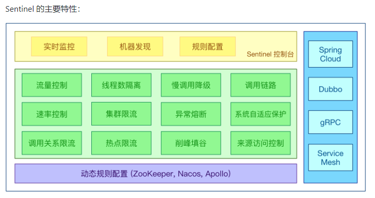
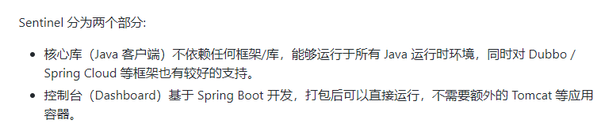
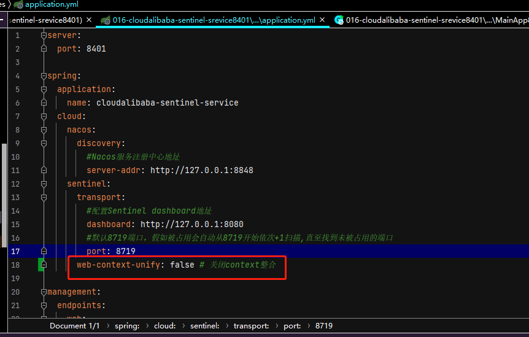
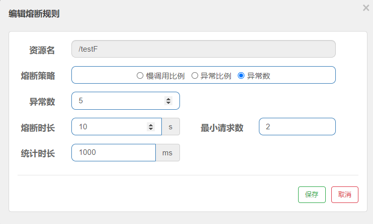
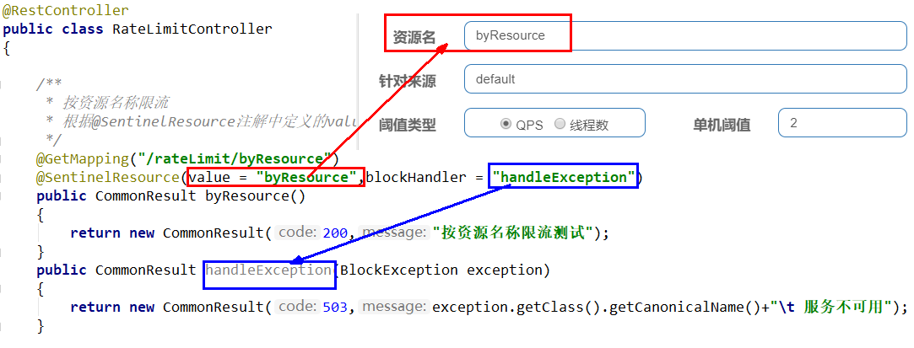
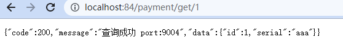

官网

中文:https://github.com/alibaba/Sentinel/wiki/%E4%BB%8B%E7%BB%8D

英文:https://github.com/alibaba/Sentinel


下载地址:https://github.com/alibaba/Sentinel/releases

本文使用的版本是sentinel-dashboard-1.8.3.jar



如何使用:https://spring-cloud-alibaba-group.github.io/github-pages/greenwich/spring-cloud-alibaba.html#_spring_cloud_alibaba_sentinel

使用sentinel可以解决服务雪崩的问题,并可以对服务进行降级,熔断和限流。

## 安装Sentinel控制台



使用sentinel的前提

1. 下载好sentinel,这里使用的是sentinel-dashboard-1.8.3.jar
2. java8环境OK
3. 8080端口不能被占用

命令:java -jar sentinel-dashboard-1.8.3.jar


访问sentinel管理界：


登录账号密码均为sentinel。

## 初始化演示工程

启动nacos8848（这里使用的是Nacos 1.4.2的windows启动版本）：


访问http://localhost:8848/nacos


新建module：016-cloudalibaba-sentinel-srevice8401

pom.xml

```xml
<?xml version="1.0" encoding="UTF-8"?>
<project xmlns="http://maven.apache.org/POM/4.0.0"
         xmlns:xsi="http://www.w3.org/2001/XMLSchema-instance"
         xsi:schemaLocation="http://maven.apache.org/POM/4.0.0 http://maven.apache.org/xsd/maven-4.0.0.xsd">
    <parent>
        <artifactId>SpringCloudModules</artifactId>
        <groupId>com.hashnode</groupId>
        <version>1.0-SNAPSHOT</version>
    </parent>
    <modelVersion>4.0.0</modelVersion>

    <artifactId>016-cloudalibaba-sentinel-srevice8401</artifactId>
    <packaging>jar</packaging>

    <properties>
        <maven.compiler.source>8</maven.compiler.source>
        <maven.compiler.target>8</maven.compiler.target>
    </properties>

    <dependencies>
        <!--SpringCloud ailibaba nacos -->
        <dependency>
            <groupId>com.alibaba.cloud</groupId>
            <artifactId>spring-cloud-starter-alibaba-nacos-discovery</artifactId>
        </dependency>
        <!--SpringCloud ailibaba sentinel-datasource-nacos 后续做持久化用到-->
        <dependency>
            <groupId>com.alibaba.csp</groupId>
            <artifactId>sentinel-datasource-nacos</artifactId>
        </dependency>
        <!--SpringCloud ailibaba sentinel -->
        <dependency>
            <groupId>com.alibaba.cloud</groupId>
            <artifactId>spring-cloud-starter-alibaba-sentinel</artifactId>
        </dependency>
        <!--openfeign-->
        <dependency>
            <groupId>org.springframework.cloud</groupId>
            <artifactId>spring-cloud-starter-openfeign</artifactId>
        </dependency>
        <!-- SpringBoot整合Web组件+actuator -->
        <dependency>
            <groupId>org.springframework.boot</groupId>
            <artifactId>spring-boot-starter-web</artifactId>
        </dependency>
        <dependency>
            <groupId>org.springframework.boot</groupId>
            <artifactId>spring-boot-starter-actuator</artifactId>
        </dependency>
        <!--日常通用jar包配置-->
        <dependency>
            <groupId>org.springframework.boot</groupId>
            <artifactId>spring-boot-devtools</artifactId>
            <scope>runtime</scope>
            <optional>true</optional>
        </dependency>
        <dependency>
            <groupId>cn.hutool</groupId>
            <artifactId>hutool-all</artifactId>
            <version>4.6.3</version>
        </dependency>
        <dependency>
            <groupId>org.projectlombok</groupId>
            <artifactId>lombok</artifactId>
            <optional>true</optional>
        </dependency>
        <dependency>
            <groupId>org.springframework.boot</groupId>
            <artifactId>spring-boot-starter-test</artifactId>
            <scope>test</scope>
        </dependency>

    </dependencies>

<!--    打包配置-->
    <build>
        <plugins>
            <plugin>
                <groupId>org.springframework.boot</groupId>
                <artifactId>spring-boot-maven-plugin</artifactId>

                <executions>
                    <execution>
                        <phase>package</phase>
                        <goals>
                            <goal>repackage</goal>
                        </goals>
                    </execution>
                </executions>

                <configuration>
                    <includeSystemScope>true</includeSystemScope>
                    <mainClass>com.hashnode.MainApp8401</mainClass>
                </configuration>
            </plugin>
        </plugins>
    </build>


</project>

```

application.yml

```yml
server:
  port: 8401

spring:
  application:
    name: cloudalibaba-sentinel-service
  cloud:
    nacos:
      discovery:
        #Nacos服务注册中心地址
        server-addr: http://127.0.0.1:8848
    sentinel:
      transport:
        #配置Sentinel dashboard地址
        dashboard: http://127.0.0.1:8080
        #默认8719端口，假如被占用会自动从8719开始依次+1扫描,直至找到未被占用的端口
        port: 8719

management:
  endpoints:
    web:
      exposure:
        include: '*'
```

主启动

```java
package com.hashnode;

import org.springframework.boot.SpringApplication;
import org.springframework.boot.autoconfigure.SpringBootApplication;
import org.springframework.cloud.client.discovery.EnableDiscoveryClient;

@EnableDiscoveryClient
@SpringBootApplication
public class MainApp8401
{
    public static void main(String[] args) {
        SpringApplication.run(MainApp8401.class, args);
    }
}

```

业务类

```java
package com.hashnode.controller;

import com.alibaba.csp.sentinel.annotation.SentinelResource;
import com.alibaba.csp.sentinel.slots.block.BlockException;
import org.springframework.web.bind.annotation.GetMapping;
import org.springframework.web.bind.annotation.RequestParam;
import org.springframework.web.bind.annotation.RestController;

import java.util.concurrent.TimeUnit;

@RestController
public class FlowLimitController {
    @GetMapping("/testA")
    public String testA()
    {
        return "------testA";
    }

    @GetMapping("/testB")
    public String testB()
    {
        return "------testB";
    }

    @GetMapping("/testC/common")
    public String testC()
    {
        return "------testC";
    }

    @GetMapping("/testD/common")
    public String testD()
    {
        try{
            TimeUnit.SECONDS.sleep(1);
        }catch (InterruptedException e){
            e.printStackTrace();
        }
        return "------testD";
    }

    @GetMapping("/testHotkey")
    @SentinelResource(value = "testHotkey",blockHandler = "deal_testHotkey")
    public String testHotKey(@RequestParam(value = "p1",required = false)String p1,
                             @RequestParam(value = "p2",required = false) String p2){
        return "----------testHotkey";
    }

    public String deal_testHotkey(String p1, String p2, BlockException exception){
        return "------deal_testHotkey";
    }
}

```

启动Sentinel8080 java -jar sentinel-dashboard-1.8.3.jar

启动微服务016-cloudalibaba-sentinel-srevice8401

Sentinel采用懒加载，只有执行一次，才能显示访问结果。依次访问http://localhost:8401/testA，http://localhost:8401/testB

效果：


此时sentinel8080正在监控微服务8401。

## 流控规则


详细说明：


### 流控模式

#### 直接（默认）

直接->快速失败，系统默认。


测试:

快速点击访问http://localhost:8401/testA


#### 关联

当关联的资源达到阈值时，就限流自己。


当与A关联的资源B达到阀值后，就限流A自己。

##### postman模拟并发密集访问testB

访问testB成功


postman里新建多线程集合组


将访问地址添加进新新线程组


Run


此时访问http://localhost:8401/testA：


发现：大批量线程高并发访问B，导致A失效了

#### 链路

链路模式：只针对从指定链路访问到本资源的请求做统计，判断是否超过阈值。

Sentinel默认会将Controller方法做context整合，导致链路模式的流控失效，需要修改application.yml，添加配置：



+ application.yml

```yml
server:
  port: 8401

spring:
  application:
    name: cloudalibaba-sentinel-service
  cloud:
    nacos:
      discovery:
        #Nacos服务注册中心地址
        server-addr: http://127.0.0.1:8848
    sentinel:
      transport:
        #配置Sentinel dashboard地址
        dashboard: http://127.0.0.1:8080
        #默认8719端口，假如被占用会自动从8719开始依次+1扫描,直至找到未被占用的端口
        port: 8719
      web-context-unify: false # 关闭context整合

management:
  endpoints:
    web:
      exposure:
        include: '*'
```

/testC/common和/testD/common都调用服务testSentinelService


TestSentinelService如下:

```java
package com.hashnode.service;

import com.alibaba.csp.sentinel.annotation.SentinelResource;
import org.springframework.stereotype.Service;

@Service
public class TestSentinelService {

    @SentinelResource("testSentinelService")
    public String testSentinelService(){
        return "sentService";
    }
}
```

如果只希望统计/testD/common的请求，对/testD/common进行限流，则可以这样配置：


测试：


如果不想出现这种页面，返回自定义的异常，可以修改@SentinelResource注解

```java
package com.hashnode.service;

import com.alibaba.csp.sentinel.annotation.SentinelResource;
import com.alibaba.csp.sentinel.slots.block.BlockException;
import org.springframework.stereotype.Service;

@Service
public class TestSentinelService {

    @SentinelResource(value = "testSentinelService",blockHandler = "handleException")
    public String testSentinelService(){
        return "sentService";
    }

    public String handleException(BlockException exception){
        return exception.getClass().getCanonicalName() + "\t服务不可用";
    }
}
```


**案例**

需求：有查询订单和创建订单业务，两者都需要查询商品。针对从查询订单进入到查询商品的请求统计，并设置限流。

步骤：

1. 在OrderService中添加一个queryGoods方法，不用实现业务
2. 在OrderController中，改造/order/query端点，调用OrderService中的queryGoods方法(/order/query -> queryGoods)
3. 在OrderController中添加一个/order/save的端点，调用OrderService的queryGoods方法(/order/save -> queryGoods)
4. 给queryGoods设置限流规则，从/order/query进入queryGoods的方法限制QPS必须小于2**（设置/order/query qqs<2）**

Sentinel默认只标记Controller中的方法为资源，如果要标记其它方法，需要利用@SentinelResource注解，示例：

```java
@SentinelResource("goods")
public void queryGoods(){
    System.err.println("查询商品");
}
```


访问/order/query、/order/save资源

http://localhost:8088/order/query ##触发链路限流

http://localhost:8088/order/save ##不会触发链路限流

### 流控效果

+ 直接->快速失败(默认的流控处理)

直接失败，抛出异常，Blocked by Sentinel (flow limiting)

源码：com.alibaba.csp.sentinel.slots.block.flow.controller.DefaultController

+ 预热

官网：https://github.com/alibaba/Sentinel/wiki/%E6%B5%81%E9%87%8F%E6%8E%A7%E5%88%B6


阈值除以coldFactor(默认值为3),经过预热时长后才会达到阈值，coldFactor默认为3，即请求 QPS 从 threshold / 3 开始，经预热时长逐渐升至设定的 QPS 阈值。

限流 冷启动：https://github.com/alibaba/Sentinel/wiki/%E9%99%90%E6%B5%81---%E5%86%B7%E5%90%AF%E5%8A%A8

源码：com.alibaba.csp.sentinel.slots.block.flow.controller.WarmUpController


WarmUp配置

默认 coldFactor 为 3，即请求QPS从(threshold / 3) 开始，经多少预热时长才逐渐升至设定的 QPS 阈值。

案例，阀值为10，预热时长设置5秒。

系统初始化的阀值为10 / 3 约等于3,即阀值刚开始为3；然后过了5秒后阀值才慢慢升高恢复到10


多次点击http://localhost:8401/testA，刚开始不行，后面慢慢可以。

应用场景：如：秒杀系统在开启的瞬间，会有很多流量上来，很有可能把系统打死，预热方式就是把为了保护系统，可慢慢的把流量放进来，慢慢的把阀值增长到设置的阀值。

+ 排队等待

  

  匀速排队，让请求以均匀的速度通过，阀值类型必须设成QPS，否则无效。
  设置含义：/testA每秒1次请求，超过的话就排队等待，等待的超时时间为20000毫秒。

匀速排队，阈值必须设置为QPS

官网：https://github.com/alibaba/Sentinel/wiki/%E6%B5%81%E9%87%8F%E6%8E%A7%E5%88%B6


源码：com.alibaba.csp.sentinel.slots.block.flow.controller.RateLimiterController

测试


1s处理完成一个：


## 服务熔断

Sentinel 熔断降级会在调用链路中某个资源出现不稳定状态时（比如：调用超时或异常比例升高），对这个资源的调用进行限制，让请求快速失败返回，避免影响到其他资源而导致级联错误。

官网：https://github.com/alibaba/Sentinel/wiki/%E7%86%94%E6%96%AD%E9%99%8D%E7%BA%A7


+ RT（平均响应时间，秒级）      

  平均响应时间   超出阈值  且   在时间窗口内通过的请求>=5，两个条件同时满足后触发降级
        窗口期过后关闭断路器
        RT最大4900（更大的需要通过-Dcsp.sentinel.statistic.max.rt=XXXX才能生效）

+ 异常比列
  QPS >= 5 且异常比例超过阈值时，触发降级；时间窗口结束后，关闭降级

+ 异常数     

  异常数超过阈值时，触发降级；时间窗口结束后，关闭降级

### 降级策略

#### 慢调用比例(SLOW_REQUEST_RATIO)

慢调用比例：选择以慢调用比例作为阈值，需要设置允许的慢调用RT（平均响应时间），请求的响应时间大于该RT值则统计为慢调用。当单位统计时长内请求数大于设置的最小请求数，并且慢调用的比例大于设置的比例阈值，则接下来的熔断时长内请求会自动被熔断。经过熔断时长后熔断器会进入探测恢复状态（HALF-OPEN 状态），若接下来的一个请求响应时间小于设置的慢调用RT值则结束熔断，若大于设置的慢调用RT值则会再次会被熔断。
编写Controller类

```java
    @GetMapping("/testE")
    public String testE()
    {
        try{
            TimeUnit.SECONDS.sleep(1);
        }catch (InterruptedException e){
            e.printStackTrace();
        }
        return "------testE";
    }
```

新增熔断规则：


说明：在1000毫秒内，当请求数大于5，接口响应时间大于800ms，慢调用比例达到100%时，接下来的20秒内自动开启熔断。

整合nacos后，下发配置对应的内容如下：

```json
[
     {
        "resource": "/testE",//资源名
        "grade": 0,//熔断策略，0-慢调用比例
        "count": 800,//最大RT
        "slowRatioThreshold": 1,//比例阈值
        "timeWindow": 20,//熔断时长
        "minRequestAmount": 5,//最小请求数
        "statIntervalMs": 1000//统计时长
    }
]

```

使用JMeter或postman进行压测，让1秒内请求接口（http://localhost:9001/testE）10次，这时Sentinel就开启了熔断：


#### 异常比例(ERROR_RATIO)

异常比例：当单位统计时长（statIntervalMs）内请求数大于设置的最小请求数，并且异常比例大于设置的比例阈值，则接下来的熔断时长内请求自动会被熔断。经过熔断时长后熔断器会进入探测恢复状态（HALF-OPEN 状态），若接下来的一个请求成功（无异常）则结束熔断，否则会再次被熔断。

编写controller类

```java
@GetMapping("/testF")
public String testF(Integer id)
{
    if(id == null || id < 0){
        throw new RuntimeException("运行异常");
    }
    return "------testF";
}
```

新增熔断规则


说明：在1000毫秒内，当请求数大于5且异常比例达到阈值50%时，接下来的20秒内自动开启熔断。

整合nacos后，下发配置对应的内容如下：

```json
[
     {
        "resource": "/testF",//资源名
        "grade": 1,//熔断策略：1-异常比例
        "count": 0.5,//比例阈值
        "timeWindow": 20,//熔断时长
        "minRequestAmount": 5,//最小请求数
        "statIntervalMs": 1000//统计时长
    }
]
```

测试

访问：http://localhost:8401/testF?id=-1,并快速刷新页面


#### 异常数(ERROR_COUNT)

当单位统计时长（statIntervalMs）内请求数大于设置的最小请求数，并且异常数大于设置的异常数，则接下来的熔断时长内请求自动会被熔断。经过熔断时长后熔断器会进入探测恢复状态（HALF-OPEN 状态），若接下来的一个请求成功（无异常）则结束熔断，否则会再次被熔断。

仍然使用上面的controller类

新增熔断规则：



说明：在1000毫秒内，当请求数大于5且异常数达到5时，接下来的20秒内自动开启熔断。

整合nacos后，下发配置对应的内容如下：

```json
[
     {
        "resource": "/testF",//资源名
        "grade": 2,//熔断策略：2-异常数
        "count": 5,//异常数
        "timeWindow": 20,//熔断时长
        "minRequestAmount": 5,//最小请求数
        "statIntervalMs": 1000//统计时长
    }
]
```

访问：http://localhost:8401/testF?id=-1,并快速刷新页面


10秒后，如果使用浏览器请求：http://localhost:9001/getBody6_2?id=0，接口访问正常，说明熔断结束。

## 热点key限流

热点即经常访问的数据，很多时候我们希望统计或者限制某个热点数据中访问频次最高的TopN数据，并对其访问进行限流或者其它操作


官网：https://github.com/alibaba/Sentinel/wiki/%E7%83%AD%E7%82%B9%E5%8F%82%E6%95%B0%E9%99%90%E6%B5%81

限流的默认处理分为系统默认和客户自定义两种，如果不配置，限流出问题后，都是用sentinel系统默认的提示：Blocked by Sentinel (flow limiting)

我们能不能自定?类似hystrix，某个方法出问题了，就找对应的兜底降级方法？可以使用@SentinelResource来自定义兜底方案。

如果使用@SentinelResource(value = "testHotKey")，默认提示会显示到前台，界面不友好，可以使用@SentinelResource(value = "testHotKey",blockHandler = "dealHandler_testHotKey")，如果被限流或熔断会调用dealHandler_testHotKey方法，但是如果是java内部错误，例如 10/0，这个是运行时异常，出错不走sentinel的兜底处理（除非是设置了熔断，内部运行异常达到一定比例，才会调用Sentinel的兜底处理方案）。

配置


限流模式只支持QPS模式。@SentinelResource注解的方法参数索引，0代表第一个参数，1代表第二个参数，以此类推。

单机阀值以及统计窗口时长表示在此窗口时间超过阀值就限流。

上面的截图表示如果第一个参数有值，QPS超过1就限流，限流后调用dealHandler_testHotKey支持方法。

测试：


## 参数例外项

上述案例演示了第一个参数p1，当QPS超过1秒1次点击后马上被限流，超过1秒钟一个后，达到阈值1后马上被限流，例如当p1的值等于5时，它的阈值可以达到200。

配置


访问


## 系统规则

规则：https://github.com/alibaba/Sentinel/wiki/%E7%B3%BB%E7%BB%9F%E8%87%AA%E9%80%82%E5%BA%94%E9%99%90%E6%B5%81


## @SentinelResource

启动Nacos（访问http://localhost:8848/nacos/#/login成功，则启动成功）

启动Sentinel java -jar sentinel-dashboard-1.7.0.jar

新建模块017-cloudalibaba-sentinel-resource-service8401

pom

```xml
<?xml version="1.0" encoding="UTF-8"?>
<project xmlns="http://maven.apache.org/POM/4.0.0"
         xmlns:xsi="http://www.w3.org/2001/XMLSchema-instance"
         xsi:schemaLocation="http://maven.apache.org/POM/4.0.0 http://maven.apache.org/xsd/maven-4.0.0.xsd">
    <parent>
        <artifactId>SpringCloudModules</artifactId>
        <groupId>com.hashnode</groupId>
        <version>1.0-SNAPSHOT</version>
    </parent>
    <modelVersion>4.0.0</modelVersion>

    <artifactId>017-cloudalibaba-sentinel-resource-service8401</artifactId>

    <properties>
        <maven.compiler.source>8</maven.compiler.source>
        <maven.compiler.target>8</maven.compiler.target>
    </properties>

    <dependencies>
        <!--SpringCloud ailibaba nacos -->
        <dependency>
            <groupId>com.alibaba.cloud</groupId>
            <artifactId>spring-cloud-starter-alibaba-nacos-discovery</artifactId>
        </dependency>

        <dependency>
            <groupId>com.hashnode</groupId>
            <artifactId>003-cloud-api-commons</artifactId>
            <version>1.0-SNAPSHOT</version>
        </dependency>

        <!--SpringCloud ailibaba sentinel-datasource-nacos sentinel持久化用到-->
        <dependency>
            <groupId>com.alibaba.csp</groupId>
            <artifactId>sentinel-datasource-nacos</artifactId>
        </dependency>
        <!--SpringCloud ailibaba sentinel -->
        <dependency>
            <groupId>com.alibaba.cloud</groupId>
            <artifactId>spring-cloud-starter-alibaba-sentinel</artifactId>
        </dependency>
        <!--openfeign-->
        <dependency>
            <groupId>org.springframework.cloud</groupId>
            <artifactId>spring-cloud-starter-openfeign</artifactId>
        </dependency>
        <!-- SpringBoot整合Web组件+actuator -->
        <dependency>
            <groupId>org.springframework.boot</groupId>
            <artifactId>spring-boot-starter-web</artifactId>
        </dependency>
        <dependency>
            <groupId>org.springframework.boot</groupId>
            <artifactId>spring-boot-starter-actuator</artifactId>
        </dependency>
        <!--日常通用jar包配置-->
        <dependency>
            <groupId>org.springframework.boot</groupId>
            <artifactId>spring-boot-devtools</artifactId>
            <scope>runtime</scope>
            <optional>true</optional>
        </dependency>
        <dependency>
            <groupId>cn.hutool</groupId>
            <artifactId>hutool-all</artifactId>
            <version>4.6.3</version>
        </dependency>
        <dependency>
            <groupId>org.projectlombok</groupId>
            <artifactId>lombok</artifactId>
            <optional>true</optional>
        </dependency>
        <dependency>
            <groupId>org.springframework.boot</groupId>
            <artifactId>spring-boot-starter-test</artifactId>
            <scope>test</scope>
        </dependency>

    </dependencies>

</project>
```

application.yml

```yml
server:
  port: 8401

spring:
  application:
    name: cloudalibaba-sentinel-service
  cloud:
    nacos:
      discovery:
        server-addr: localhost:8848 #Nacos服务注册中心地址
    sentinel:
      transport:
        dashboard: localhost:8080 #配置Sentinel dashboard地址
        port: 8719
#        sentinel持久化支持(获取nacos中配置的默认值)
      datasource:
        ds1:
          nacos:
            server-addr: localhost:8848
            dataId: cloudalibaba-sentinel-service-sentinel
            groupId: DEFAULT_GROUP
            data-type: json
            rule-type: flow


management:
  endpoints:
    web:
      exposure:
        include: '*'

# 激活Sentinel对Feign熔断的支持 需要配置 service-url.nacos-user-service 参考018-cloudalibaba-consumer-payment-84
#feign:
#  sentinel:
#    enabled: true # SentinelFeign


#feign:
#  sentinel:
#    enabled: true # SentinelFeign
```

controller

```java
package com.hashnode.controller;

import com.alibaba.csp.sentinel.annotation.SentinelResource;
import com.alibaba.csp.sentinel.slots.block.BlockException;
import com.hashnode.model.CommonResult;
import com.hashnode.model.Payment;
import com.hashnode.myhandler.CustomerBlockHandler;
import org.springframework.web.bind.annotation.GetMapping;
import org.springframework.web.bind.annotation.ResponseBody;
import org.springframework.web.bind.annotation.RestController;

@RestController
public class RateLimitController {
    @GetMapping("/byResource")
    @SentinelResource(value = "byResource",blockHandler = "handleException")//超过流控,使用默认的限流规则
    public CommonResult byResource()
    {
        return new CommonResult(200,"按资源名称限流测试OK",new Payment(2022L,"serial001"));
    }
    public CommonResult handleException(BlockException exception)
    {
        return new CommonResult(444,exception.getClass().getCanonicalName()+"\t 服务不可用");
    }

    @GetMapping("/rateLimit/buUrl")
    @SentinelResource(value = "byUrl")
    public CommonResult byUrl(){
        return new CommonResult(200,"按url限流测试OK",new Payment(2022L,"serial002"));
    }


    @GetMapping("/rateLimit/customerBlockHandler")
    @SentinelResource(value = "customerBlockHandler",blockHandlerClass = CustomerBlockHandler.class,blockHandler = "handlerException1")
    public CommonResult customerBlockHandler(){
        return new CommonResult(200,"按url限流测试OK",new Payment(2022L,"serial002"));
    }
}
```

限流处理的handler

```java
package com.hashnode.myhandler;

import com.alibaba.csp.sentinel.slots.block.BlockException;
import com.hashnode.model.CommonResult;
import com.hashnode.model.Payment;

public class CustomerBlockHandler {
    public static CommonResult handlerException1(BlockException exception){
        return new CommonResult(4444,"自定义global1",new Payment(2022L,"serial002"));
    }

    public static CommonResult handlerException2(BlockException exception){
        return new CommonResult(4444,"自定义global2",new Payment(2022L,"serial002"));
    }
}
```

主启动

```java
package com.hashnode;

import org.springframework.boot.SpringApplication;
import org.springframework.boot.autoconfigure.SpringBootApplication;
import org.springframework.cloud.client.discovery.EnableDiscoveryClient;

@EnableDiscoveryClient
@SpringBootApplication
public class MainApp8401 {
    public static void main(String[] args) {
        SpringApplication.run(MainApp8401.class,args);
    }
}
```

### 配置流控规则


图形配置和代码关系



表示1秒钟内查询次数大于1，就跑到我们自定义的处流，进行限流：


### 按照Url地址限流+后续处理

```java
package com.hashnode.controller;

import com.alibaba.csp.sentinel.annotation.SentinelResource;
import com.alibaba.csp.sentinel.slots.block.BlockException;
import com.hashnode.model.CommonResult;
import com.hashnode.model.Payment;
import com.hashnode.myhandler.CustomerBlockHandler;
import org.springframework.web.bind.annotation.GetMapping;
import org.springframework.web.bind.annotation.ResponseBody;
import org.springframework.web.bind.annotation.RestController;

@RestController
public class RateLimitController {
    @GetMapping("/byResource")
    @SentinelResource(value = "byResource",blockHandler = "handleException")//超过流控,使用默认的限流规则
    public CommonResult byResource()
    {
        return new CommonResult(200,"按资源名称限流测试OK",new Payment(2022L,"serial001"));
    }
    public CommonResult handleException(BlockException exception)
    {
        return new CommonResult(444,exception.getClass().getCanonicalName()+"\t 服务不可用");
    }

    @GetMapping("/rateLimit/buUrl")
    @SentinelResource(value = "byUrl")
    public CommonResult byUrl(){
        return new CommonResult(200,"按url限流测试OK",new Payment(2022L,"serial002"));
    }


    @GetMapping("/rateLimit/customerBlockHandler")
    @SentinelResource(value = "customerBlockHandler",blockHandlerClass = CustomerBlockHandler.class,blockHandler = "handlerException1")
    public CommonResult customerBlockHandler(){
        return new CommonResult(200,"按url限流测试OK",new Payment(2022L,"serial002"));
    }
}
```

访问http://localhost:8401/rateLimit/byUrl


Sentinel控制台配置


疯狂点击http://localhost:8401/rateLimit/buUrl


默认兜底方案面临的问题：

1. 系统默认的，没有体现我们自己的业务要求。

2. 依照现有条件，我们自定义的处理方法又和业务代码耦合在一块，不直观。

3. 每个业务方法都添加一个兜底的，那代码膨胀加剧。

4. 全局统一的处理方法没有体现。

### 客户端自定义限流处理逻辑

创建CustomerBlockHandler类用于自定义限流处理逻辑

自定义限流处理类

```java
package com.hashnode.myhandler;

import com.alibaba.csp.sentinel.slots.block.BlockException;
import com.hashnode.model.CommonResult;
import com.hashnode.model.Payment;

public class CustomerBlockHandler {
    public static CommonResult handlerException1(BlockException exception){
        return new CommonResult(4444,"自定义global1",new Payment(2022L,"serial002"));
    }

    public static CommonResult handlerException2(BlockException exception){
        return new CommonResult(4444,"自定义global2",new Payment(2022L,"serial002"));
    }
}
```


controller

```java
package com.hashnode.controller;

import com.alibaba.csp.sentinel.annotation.SentinelResource;
import com.alibaba.csp.sentinel.slots.block.BlockException;
import com.hashnode.model.CommonResult;
import com.hashnode.model.Payment;
import com.hashnode.myhandler.CustomerBlockHandler;
import org.springframework.web.bind.annotation.GetMapping;
import org.springframework.web.bind.annotation.ResponseBody;
import org.springframework.web.bind.annotation.RestController;

@RestController
public class RateLimitController {
    @GetMapping("/byResource")
    @SentinelResource(value = "byResource",blockHandler = "handleException")//超过流控,使用默认的限流规则
    public CommonResult byResource()
    {
        return new CommonResult(200,"按资源名称限流测试OK",new Payment(2022L,"serial001"));
    }
    public CommonResult handleException(BlockException exception)
    {
        return new CommonResult(444,exception.getClass().getCanonicalName()+"\t 服务不可用");
    }

    @GetMapping("/rateLimit/buUrl")
    @SentinelResource(value = "byUrl")
    public CommonResult byUrl(){
        return new CommonResult(200,"按url限流测试OK",new Payment(2022L,"serial002"));
    }


    @GetMapping("/rateLimit/customerBlockHandler")
    @SentinelResource(value = "customerBlockHandler",blockHandlerClass = CustomerBlockHandler.class,blockHandler = "handlerException1")
    public CommonResult customerBlockHandler(){
        return new CommonResult(200,"按url限流测试OK",new Payment(2022L,"serial002"));
    }
}
```

启动微服务后先调用一次http://localhost:8401/rateLimit/customerBlockHandler


设置限流


进一步说明：


更多注解属性说明：


## sentinel整合ribbon+openFeign+fallback

### Ribbon系列

启动nacos和sentinel

新建模块018-cloudalibaba-provider-payment-9003，018-cloudalibaba-provider-payment-9004，两个除了端口号，其他都一样，以018-cloudalibaba-provider-payment-9003为例

pom.xml

```xml
<?xml version="1.0" encoding="UTF-8"?>
<project xmlns="http://maven.apache.org/POM/4.0.0"
         xmlns:xsi="http://www.w3.org/2001/XMLSchema-instance"
         xsi:schemaLocation="http://maven.apache.org/POM/4.0.0 http://maven.apache.org/xsd/maven-4.0.0.xsd">
    <parent>
        <artifactId>SpringCloudModules</artifactId>
        <groupId>com.hashnode</groupId>
        <version>1.0-SNAPSHOT</version>
    </parent>
    <modelVersion>4.0.0</modelVersion>

    <artifactId>018-cloudalibaba-provider-payment-9003</artifactId>

    <properties>
        <maven.compiler.source>8</maven.compiler.source>
        <maven.compiler.target>8</maven.compiler.target>
    </properties>


    <dependencies>
        <dependency>
            <groupId>org.springframework.boot</groupId>
            <artifactId>spring-boot-starter-web</artifactId>
        </dependency>

        <dependency>
            <groupId>org.springframework.boot</groupId>
            <artifactId>spring-boot-starter-actuator</artifactId>
        </dependency>

        <dependency>
            <groupId>org.springframework.boot</groupId>
            <artifactId>spring-boot-starter-test</artifactId>
            <scope>test</scope>
            <exclusions>
                <exclusion>
                    <groupId>org.junit.vintage</groupId>
                    <artifactId>junit-vintage-engine</artifactId>
                </exclusion>
            </exclusions>
        </dependency>

        <!--SpringCloud ailibaba nacos -->
        <dependency>
            <groupId>com.alibaba.cloud</groupId>
            <artifactId>spring-cloud-starter-alibaba-nacos-discovery</artifactId>
        </dependency>

        <!--        引入自定义的api通用包，包括各种实体类-->
        <dependency>
            <groupId>com.hashnode</groupId>
            <artifactId>003-cloud-api-commons</artifactId>
            <version>1.0-SNAPSHOT</version>
        </dependency>

        <!--mysql-->
        <dependency>
            <groupId>mysql</groupId>
            <artifactId>mysql-connector-java</artifactId>
        </dependency>
        <!-- druid-->
        <dependency>
            <groupId>com.alibaba</groupId>
            <artifactId>druid</artifactId>
        </dependency>
        <!-- mybatis-->
        <dependency>
            <groupId>org.mybatis.spring.boot</groupId>
            <artifactId>mybatis-spring-boot-starter</artifactId>
        </dependency>
        <!--junit-->
        <dependency>
            <groupId>junit</groupId>
            <artifactId>junit</artifactId>
        </dependency>
        <!--log4j-->
        <dependency>
            <groupId>log4j</groupId>
            <artifactId>log4j</artifactId>
        </dependency>
        <!--SpringBoot Thymeleaf依赖-->
        <dependency>
            <groupId>org.springframework.boot</groupId>
            <artifactId>spring-boot-starter-thymeleaf</artifactId>
        </dependency>
        <!--添加Bootstrap WarJar的依赖-->
        <dependency>
            <groupId>org.webjars</groupId>
            <artifactId>bootstrap</artifactId>
        </dependency>

        <dependency>
            <groupId>org.projectlombok</groupId>
            <artifactId>lombok</artifactId>
        </dependency>


    </dependencies>


</project>
```

application.yml

```yml
server:
  port: 9003

spring:
  application:
    name: nacos-payment-provider

  datasource:
    type: com.alibaba.druid.pool.DruidDataSource    #当前数据源操作类型
    driver-class-name: org.gjt.mm.mysql.Driver      #mysql驱动包
    url: jdbc:mysql://localhost:3306/springboot?useUnicode=true&characterEncoding=UTF-8&useJDBCCompliantTimezoneShift=true&useLegacyDateTimeCode=false&serverTimezone=GMT%2B8
    username: root
    password: root

  cloud:
    nacos:
      discovery:
        server-addr: localhost:8848 #配置Nacos地址


mybatis:
  mapper-locations:
    - classpath:mapper/*.xml
  type-aliases-package: com.hashnode.model      #所有model所在包

management:
  endpoints:
    web:
      exposure:
        include: '*'
```

主启动

```java
package com.hashnode;

import org.mybatis.spring.annotation.MapperScan;
import org.springframework.boot.SpringApplication;
import org.springframework.boot.autoconfigure.SpringBootApplication;
import org.springframework.cloud.client.discovery.EnableDiscoveryClient;
import org.springframework.context.ConfigurableApplicationContext;

@SpringBootApplication
@MapperScan("com.hashnode.mapper")
@EnableDiscoveryClient
public class PaymentMainHystrix9003 {
    public static void main(String[] args) {
        ConfigurableApplicationContext run = SpringApplication.run(PaymentMainHystrix9003.class, args);
//        PaymentService paymentService = run.getBean(PaymentService.class);
//        List<Payment> result = paymentService.getAllPayment();
//        for (int i=0;i<result.size();i++){
//            System.out.println(result.get(i));
//        }
    }
}
```

业务类

```java
package com.hashnode.service;

import com.hashnode.model.Payment;

import java.util.List;

public interface PaymentService {
    public List<Payment> getAllPayment();

    public Payment getPaymentById(Long id);

    public int createPayment(Payment payment);

    public int createPaymentSelective(Payment payment);
}
```

```java
package com.hashnode.service.imp;

import com.hashnode.mapper.PaymentMapper;
import com.hashnode.model.Payment;
import com.hashnode.service.PaymentService;
import org.springframework.beans.factory.annotation.Autowired;
import org.springframework.stereotype.Service;
import org.springframework.transaction.annotation.Propagation;
import org.springframework.transaction.annotation.Transactional;

import java.util.List;

@Service
@Transactional(propagation = Propagation.REQUIRED,timeout = 5)
public class PaymentServiceImpl implements PaymentService {
    @Autowired
    private PaymentMapper paymentMapper;

    @Override
    public List<Payment> getAllPayment() {
        return paymentMapper.getAllPayment();
    }

    @Override
    public Payment getPaymentById(Long id) {
        return paymentMapper.selectByPrimaryKey(id);
    }

    @Override
    public int createPayment(Payment payment) {
        return paymentMapper.insert(payment);
    }

    @Override
    public int createPaymentSelective(Payment payment) {

        return paymentMapper.insertSelective(payment);
    }
}
```

测试地址：http://localhost:9003/payment/get/1


新建018-cloudalibaba-consumer-payment-84

+ pom.xml

```xml
<?xml version="1.0" encoding="UTF-8"?>
<project xmlns="http://maven.apache.org/POM/4.0.0"
         xmlns:xsi="http://www.w3.org/2001/XMLSchema-instance"
         xsi:schemaLocation="http://maven.apache.org/POM/4.0.0 http://maven.apache.org/xsd/maven-4.0.0.xsd">
    <parent>
        <artifactId>SpringCloudModules</artifactId>
        <groupId>com.hashnode</groupId>
        <version>1.0-SNAPSHOT</version>
    </parent>
    <modelVersion>4.0.0</modelVersion>

    <artifactId>018-cloudalibaba-consumer-payment-84</artifactId>

    <properties>
        <maven.compiler.source>8</maven.compiler.source>
        <maven.compiler.target>8</maven.compiler.target>
    </properties>


    <dependencies>
        <dependency>
            <groupId>org.springframework.boot</groupId>
            <artifactId>spring-boot-starter-web</artifactId>
        </dependency>

        <dependency>
            <groupId>org.springframework.boot</groupId>
            <artifactId>spring-boot-starter-actuator</artifactId>
        </dependency>

        <dependency>
            <groupId>org.springframework.boot</groupId>
            <artifactId>spring-boot-starter-test</artifactId>
            <scope>test</scope>
            <exclusions>
                <exclusion>
                    <groupId>org.junit.vintage</groupId>
                    <artifactId>junit-vintage-engine</artifactId>
                </exclusion>
            </exclusions>
        </dependency>

        <!--SpringCloud ailibaba nacos -->
        <dependency>
            <groupId>com.alibaba.cloud</groupId>
            <artifactId>spring-cloud-starter-alibaba-nacos-discovery</artifactId>
        </dependency>

        <!--SpringCloud ailibaba sentinel -->
        <dependency>
            <groupId>com.alibaba.cloud</groupId>
            <artifactId>spring-cloud-starter-alibaba-sentinel</artifactId>
        </dependency>

        <!--SpringCloud openfeign -->
        <dependency>
            <groupId>org.springframework.cloud</groupId>
            <artifactId>spring-cloud-starter-openfeign</artifactId>
        </dependency>

        <!--        引入自定义的api通用包，包括各种实体类-->
        <dependency>
            <groupId>com.hashnode</groupId>
            <artifactId>003-cloud-api-commons</artifactId>
            <version>1.0-SNAPSHOT</version>
        </dependency>

        <!--mysql-->
        <dependency>
            <groupId>mysql</groupId>
            <artifactId>mysql-connector-java</artifactId>
        </dependency>
        <!-- druid-->
        <dependency>
            <groupId>com.alibaba</groupId>
            <artifactId>druid</artifactId>
        </dependency>
        <!-- mybatis-->
        <dependency>
            <groupId>org.mybatis.spring.boot</groupId>
            <artifactId>mybatis-spring-boot-starter</artifactId>
        </dependency>
        <!--junit-->
        <dependency>
            <groupId>junit</groupId>
            <artifactId>junit</artifactId>
        </dependency>
        <!--log4j-->
        <dependency>
            <groupId>log4j</groupId>
            <artifactId>log4j</artifactId>
        </dependency>
        <!--SpringBoot Thymeleaf依赖-->
        <dependency>
            <groupId>org.springframework.boot</groupId>
            <artifactId>spring-boot-starter-thymeleaf</artifactId>
        </dependency>
        <!--添加Bootstrap WarJar的依赖-->
        <dependency>
            <groupId>org.webjars</groupId>
            <artifactId>bootstrap</artifactId>
        </dependency>

        <dependency>
            <groupId>org.projectlombok</groupId>
            <artifactId>lombok</artifactId>
        </dependency>


    </dependencies>


</project>
```

+ application.yml

```yml
server:
  port: 84

spring:
  application:
    name: nacos-payment-consumer

  datasource:
    type: com.alibaba.druid.pool.DruidDataSource    #当前数据源操作类型
    driver-class-name: org.gjt.mm.mysql.Driver      #mysql驱动包
    url: jdbc:mysql://localhost:3306/springboot?useUnicode=true&characterEncoding=UTF-8&useJDBCCompliantTimezoneShift=true&useLegacyDateTimeCode=false&serverTimezone=GMT%2B8
    username: root
    password: root

  cloud:
    nacos:
      discovery:
        server-addr: localhost:8848 #配置Nacos地址

    sentinel:
      transport:
        #配置Sentinel dashboard地址
        dashboard: http://127.0.0.1:8080
        #默认8719端口，假如被占用会自动从8719开始依次+1扫描,直至找到未被占用的端口
        port: 8719

#消费者将要去访问的微服务名称(注册成功进nacos的微服务提供者)
service-url:
  nacos-user-service: http://nacos-payment-provider

mybatis:
  mapper-locations:
    - classpath:mapper/*.xml
  type-aliases-package: com.hashnode.model      #所有model所在包

management:
  endpoints:
    web:
      exposure:
        include: '*'

# 激活Sentinel对Feign熔断的支持
feign:
  sentinel:
    enabled: true
```

主启动

+ PaymentMain84.java

```java
package com.hashnode;

import org.mybatis.spring.annotation.MapperScan;
import org.springframework.boot.SpringApplication;
import org.springframework.boot.autoconfigure.SpringBootApplication;
import org.springframework.cloud.client.discovery.EnableDiscoveryClient;
import org.springframework.cloud.openfeign.EnableFeignClients;
import org.springframework.context.ConfigurableApplicationContext;

@SpringBootApplication
@MapperScan("com.hashnode.mapper")
@EnableDiscoveryClient
@EnableFeignClients
public class PaymentMain84 {
    public static void main(String[] args) {
        ConfigurableApplicationContext run = SpringApplication.run(PaymentMain84.class, args);
//        PaymentService paymentService = run.getBean(PaymentService.class);
//        List<Payment> result = paymentService.getAllPayment();
//        for (int i=0;i<result.size();i++){
//            System.out.println(result.get(i));
//        }
    }
}
```

config

+ ApplicationContextConfig.java

```java
package com.hashnode.config;

import org.springframework.cloud.client.loadbalancer.LoadBalanced;
import org.springframework.context.annotation.Bean;
import org.springframework.context.annotation.Configuration;
import org.springframework.web.client.RestTemplate;

@Configuration
public class ApplicationContextConfig {
    @Bean
    @LoadBalanced
    public RestTemplate getRestTemplate(){
        return new RestTemplate();
    }
}
```

controller

+ CircleBreakerController.java

```java
package com.hashnode.controller;

import com.alibaba.csp.sentinel.annotation.SentinelResource;
import com.alibaba.csp.sentinel.slots.block.BlockException;
import com.hashnode.cloudservice.PaymentService;
import com.hashnode.model.CommonResult;
import com.hashnode.model.Payment;
import org.springframework.web.bind.annotation.GetMapping;
import org.springframework.web.bind.annotation.PathVariable;
import org.springframework.web.bind.annotation.RequestMapping;
import org.springframework.web.bind.annotation.RestController;
import org.springframework.web.client.RestTemplate;

import javax.annotation.Resource;

@RestController
public class CircleBreakerController {
    public static final String SERVICE_URL = "http://nacos-payment-provider";

    @Resource
    private RestTemplate restTemplate;

    @RequestMapping("/payment/get/{id}")
    @SentinelResource(value = "fallback") //没有配置
//    @SentinelResource(value = "fallback",fallback = "handlExceptionFallback")//异常处理
//    @SentinelResource(value = "fallback",blockHandler = "handleBlockFallback")//处理sentinel控制台配置违规
//    @SentinelResource(value = "fallback",fallback = "handlExceptionFallback",
//            blockHandler = "handleBlockFallback",
//        exceptionsToIgnore = {IllegalArgumentException.class})//两个都配置,如果sentinel有配置熔断规则，则会调用handleBlockFallback,
//    //否则调用handlExceptionFallback，如果设置了exceptionsToIgnore = {IllegalArgumentException.class}则会忽略IllegalArgumentException异常,不走配置的兜底方案
    public CommonResult<Payment> fallback(@PathVariable Long id)
    {
        if (id == 4) {
            throw new IllegalArgumentException ("IllegalArgumentException,非法参数异常....");
        }

        CommonResult<Payment> result = restTemplate.getForObject(SERVICE_URL + "/payment/get/"+id,CommonResult.class,id);

        if (result.getData() == null) {
            throw new NullPointerException ("NullPointerException,该ID没有对应记录,空指针异常");
        }

        return result;
    }

    public CommonResult handlExceptionFallback(@PathVariable Long id,Throwable e){
        Payment payment = new Payment(id, "null");
        return new CommonResult<>(444,"兜底异常handlExceptionFallback"+e.getMessage(),payment);
    }

    public CommonResult handleBlockFallback(@PathVariable Long id, BlockException e){
        Payment payment = new Payment(id, "null");
        return new CommonResult<>(445,"兜底Block异常handleBlockFallback"+e.getMessage(),payment);
    }


//    @Resource
//    private PaymentService paymentService;
//
//    @GetMapping(value = "/payment/get/{id}")
//    public CommonResult<Payment> paymentSQL(@PathVariable("id") Long id){
//        //调用paymentService.paymentSQL方法对应的请求
//        return paymentService.paymentSQL(id);
//    }

}

```

访问：


给客户error页面，不友好，配置fallback管理异常：


配置blockHandler管理异常：


使用blockHandler需要配置sentinel：


异常在1s中超过1一次，且一秒请求大于等于1，fallback熔断，系统被保护。


fallback和blockHandler都配置


忽略属性


结果，如果抛出了IllegalArgumentException异常，不会走兜底方案，程序异常会达到前台:


### Feign系列

Feign组件一般是消费侧

pom.xml

```xml
<?xml version="1.0" encoding="UTF-8"?>
<project xmlns="http://maven.apache.org/POM/4.0.0"
         xmlns:xsi="http://www.w3.org/2001/XMLSchema-instance"
         xsi:schemaLocation="http://maven.apache.org/POM/4.0.0 http://maven.apache.org/xsd/maven-4.0.0.xsd">
    <parent>
        <artifactId>SpringCloudModules</artifactId>
        <groupId>com.hashnode</groupId>
        <version>1.0-SNAPSHOT</version>
    </parent>
    <modelVersion>4.0.0</modelVersion>

    <artifactId>018-cloudalibaba-consumer-payment-84</artifactId>

    <properties>
        <maven.compiler.source>8</maven.compiler.source>
        <maven.compiler.target>8</maven.compiler.target>
    </properties>


    <dependencies>
        <dependency>
            <groupId>org.springframework.boot</groupId>
            <artifactId>spring-boot-starter-web</artifactId>
        </dependency>

        <dependency>
            <groupId>org.springframework.boot</groupId>
            <artifactId>spring-boot-starter-actuator</artifactId>
        </dependency>

        <dependency>
            <groupId>org.springframework.boot</groupId>
            <artifactId>spring-boot-starter-test</artifactId>
            <scope>test</scope>
            <exclusions>
                <exclusion>
                    <groupId>org.junit.vintage</groupId>
                    <artifactId>junit-vintage-engine</artifactId>
                </exclusion>
            </exclusions>
        </dependency>

        <!--SpringCloud ailibaba nacos -->
        <dependency>
            <groupId>com.alibaba.cloud</groupId>
            <artifactId>spring-cloud-starter-alibaba-nacos-discovery</artifactId>
        </dependency>

        <!--SpringCloud ailibaba sentinel -->
        <dependency>
            <groupId>com.alibaba.cloud</groupId>
            <artifactId>spring-cloud-starter-alibaba-sentinel</artifactId>
        </dependency>

        <!--SpringCloud openfeign -->
        <dependency>
            <groupId>org.springframework.cloud</groupId>
            <artifactId>spring-cloud-starter-openfeign</artifactId>
        </dependency>

        <!--        引入自定义的api通用包，包括各种实体类-->
        <dependency>
            <groupId>com.hashnode</groupId>
            <artifactId>003-cloud-api-commons</artifactId>
            <version>1.0-SNAPSHOT</version>
        </dependency>

        <!--mysql-->
        <dependency>
            <groupId>mysql</groupId>
            <artifactId>mysql-connector-java</artifactId>
        </dependency>
        <!-- druid-->
        <dependency>
            <groupId>com.alibaba</groupId>
            <artifactId>druid</artifactId>
        </dependency>
        <!-- mybatis-->
        <dependency>
            <groupId>org.mybatis.spring.boot</groupId>
            <artifactId>mybatis-spring-boot-starter</artifactId>
        </dependency>
        <!--junit-->
        <dependency>
            <groupId>junit</groupId>
            <artifactId>junit</artifactId>
        </dependency>
        <!--log4j-->
        <dependency>
            <groupId>log4j</groupId>
            <artifactId>log4j</artifactId>
        </dependency>
        <!--SpringBoot Thymeleaf依赖-->
        <dependency>
            <groupId>org.springframework.boot</groupId>
            <artifactId>spring-boot-starter-thymeleaf</artifactId>
        </dependency>
        <!--添加Bootstrap WarJar的依赖-->
        <dependency>
            <groupId>org.webjars</groupId>
            <artifactId>bootstrap</artifactId>
        </dependency>

        <dependency>
            <groupId>org.projectlombok</groupId>
            <artifactId>lombok</artifactId>
        </dependency>


    </dependencies>


</project>
```

application.yml

```yml
server:
  port: 84

spring:
  application:
    name: nacos-payment-consumer

  datasource:
    type: com.alibaba.druid.pool.DruidDataSource    #当前数据源操作类型
    driver-class-name: org.gjt.mm.mysql.Driver      #mysql驱动包
    url: jdbc:mysql://localhost:3306/springboot?useUnicode=true&characterEncoding=UTF-8&useJDBCCompliantTimezoneShift=true&useLegacyDateTimeCode=false&serverTimezone=GMT%2B8
    username: root
    password: root

  cloud:
    nacos:
      discovery:
        server-addr: localhost:8848 #配置Nacos地址

    sentinel:
      transport:
        #配置Sentinel dashboard地址
        dashboard: http://127.0.0.1:8080
        #默认8719端口，假如被占用会自动从8719开始依次+1扫描,直至找到未被占用的端口
        port: 8719

#消费者将要去访问的微服务名称(注册成功进nacos的微服务提供者)
service-url:
  nacos-user-service: http://nacos-payment-provider

mybatis:
  mapper-locations:
    - classpath:mapper/*.xml
  type-aliases-package: com.hashnode.model      #所有model所在包

management:
  endpoints:
    web:
      exposure:
        include: '*'

# 激活Sentinel对Feign熔断的支持
feign:
  sentinel:
    enabled: true
```

业务类

+ PaymentService.java

```java
package com.hashnode.cloudservice;

import com.hashnode.cloudservice.imp.PaymentServiceImpl;
import com.hashnode.model.CommonResult;
import com.hashnode.model.Payment;
import org.springframework.cloud.openfeign.FeignClient;
import org.springframework.web.bind.annotation.GetMapping;
import org.springframework.web.bind.annotation.PathVariable;

//带@FeignClient注解的业务接口,使用 fallback 方式是无法获取异常信息的，如果想要获取异常信息，可以使用 fallbackFactory参数
@FeignClient(value = "nacos-payment-provider",fallback = PaymentServiceImpl.class)
public interface PaymentService {
    @GetMapping(value = "/payment/get/{id}")//向"/payment/get/{id}"发送请求,并封装结果,兜底方案对应PaymentServiceImpl实现类的同名方法
    public CommonResult<Payment> paymentSQL(@PathVariable("id")Long id);
}
```

+ PaymentServiceImpl.java

```java
package com.hashnode.cloudservice.imp;

import com.hashnode.cloudservice.PaymentService;
import com.hashnode.model.CommonResult;
import com.hashnode.model.Payment;
import org.springframework.stereotype.Component;

//兜底处理
@Component
public class PaymentServiceImpl implements PaymentService {
    @Override
    public CommonResult<Payment> paymentSQL(Long id) {
        return new CommonResult<>(444,"服务降级返回,没有该流水信息",new Payment(id, "errorSerial......"));
    }
}
```

controller

```java
package com.hashnode.controller;

import com.alibaba.csp.sentinel.annotation.SentinelResource;
import com.alibaba.csp.sentinel.slots.block.BlockException;
import com.hashnode.cloudservice.PaymentService;
import com.hashnode.model.CommonResult;
import com.hashnode.model.Payment;
import org.springframework.web.bind.annotation.GetMapping;
import org.springframework.web.bind.annotation.PathVariable;
import org.springframework.web.bind.annotation.RequestMapping;
import org.springframework.web.bind.annotation.RestController;
import org.springframework.web.client.RestTemplate;

import javax.annotation.Resource;

@RestController
public class CircleBreakerController {
    public static final String SERVICE_URL = "http://nacos-payment-provider";

    @Resource
    private RestTemplate restTemplate;

//    @RequestMapping("/payment/get/{id}")
//    @SentinelResource(value = "fallback") //没有配置
////    @SentinelResource(value = "fallback",fallback = "handlExceptionFallback")//异常处理
////    @SentinelResource(value = "fallback",blockHandler = "handleBlockFallback")//处理sentinel控制台配置违规
////    @SentinelResource(value = "fallback",fallback = "handlExceptionFallback",
////            blockHandler = "handleBlockFallback",
////        exceptionsToIgnore = {IllegalArgumentException.class})//两个都配置,如果sentinel有配置熔断规则，则会调用handleBlockFallback,
////    //否则调用handlExceptionFallback，如果设置了exceptionsToIgnore = {IllegalArgumentException.class}则会忽略IllegalArgumentException异常,不走配置的兜底方案
//    public CommonResult<Payment> fallback(@PathVariable Long id)
//    {
//        if (id == 4) {
//            throw new IllegalArgumentException ("IllegalArgumentException,非法参数异常....");
//        }
//
//        CommonResult<Payment> result = restTemplate.getForObject(SERVICE_URL + "/payment/get/"+id,CommonResult.class,id);
//
//        if (result.getData() == null) {
//            throw new NullPointerException ("NullPointerException,该ID没有对应记录,空指针异常");
//        }
//
//        return result;
//    }

    public CommonResult handlExceptionFallback(@PathVariable Long id,Throwable e){
        Payment payment = new Payment(id, "null");
        return new CommonResult<>(444,"兜底异常handlExceptionFallback"+e.getMessage(),payment);
    }

    public CommonResult handleBlockFallback(@PathVariable Long id, BlockException e){
        Payment payment = new Payment(id, "null");
        return new CommonResult<>(445,"兜底Block异常handleBlockFallback"+e.getMessage(),payment);
    }


    @Resource
    private PaymentService paymentService;

    @GetMapping(value = "/payment/get/{id}")
    public CommonResult<Payment> paymentSQL(@PathVariable("id") Long id){
        //调用paymentService.paymentSQL方法对应的请求
        return paymentService.paymentSQL(id);
    }

}
```

主启动

```java
package com.hashnode;

import org.mybatis.spring.annotation.MapperScan;
import org.springframework.boot.SpringApplication;
import org.springframework.boot.autoconfigure.SpringBootApplication;
import org.springframework.cloud.client.discovery.EnableDiscoveryClient;
import org.springframework.cloud.openfeign.EnableFeignClients;
import org.springframework.context.ConfigurableApplicationContext;

@SpringBootApplication
@MapperScan("com.hashnode.mapper")
@EnableDiscoveryClient
@EnableFeignClients
public class PaymentMain84 {
    public static void main(String[] args) {
        ConfigurableApplicationContext run = SpringApplication.run(PaymentMain84.class, args);
//        PaymentService paymentService = run.getBean(PaymentService.class);
//        List<Payment> result = paymentService.getAllPayment();
//        for (int i=0;i<result.size();i++){
//            System.out.println(result.get(i));
//        }
    }
}
```

测试：

访问http://localhost:84/payment/get/1



测试84调用9003/9004，此时故意关闭9003/9004微服务提供者，看84消费侧自动降级，不会被耗死


熔断框架比较


## 规则持久化

一旦我们重启应用，sentinel规则将消失，在生产环境需要将配置规则进行持久化(该持久化获取的是nacos中配置的默认值)。

可以将将限流配置规则持久化进Nacos保存，只要刷新8401某个rest地址，sentinel控制台的流控规则就能看到，只要Nacos里面的配置不删除，针对8401上sentinel上的流控规则持续有效。

步骤：

1. 修改017-cloudalibaba-sentinel-resource-service8401
2. 修改pom.xml

```xml
<?xml version="1.0" encoding="UTF-8"?>
<project xmlns="http://maven.apache.org/POM/4.0.0"
         xmlns:xsi="http://www.w3.org/2001/XMLSchema-instance"
         xsi:schemaLocation="http://maven.apache.org/POM/4.0.0 http://maven.apache.org/xsd/maven-4.0.0.xsd">
    <parent>
        <artifactId>SpringCloudModules</artifactId>
        <groupId>com.hashnode</groupId>
        <version>1.0-SNAPSHOT</version>
    </parent>
    <modelVersion>4.0.0</modelVersion>

    <artifactId>017-cloudalibaba-sentinel-resource-service8401</artifactId>

    <properties>
        <maven.compiler.source>8</maven.compiler.source>
        <maven.compiler.target>8</maven.compiler.target>
    </properties>

    <dependencies>
        <!--SpringCloud ailibaba nacos -->
        <dependency>
            <groupId>com.alibaba.cloud</groupId>
            <artifactId>spring-cloud-starter-alibaba-nacos-discovery</artifactId>
        </dependency>

        <dependency>
            <groupId>com.hashnode</groupId>
            <artifactId>003-cloud-api-commons</artifactId>
            <version>1.0-SNAPSHOT</version>
        </dependency>

        <!--SpringCloud ailibaba sentinel-datasource-nacos sentinel持久化用到-->
        <dependency>
            <groupId>com.alibaba.csp</groupId>
            <artifactId>sentinel-datasource-nacos</artifactId>
        </dependency>
        <!--SpringCloud ailibaba sentinel -->
        <dependency>
            <groupId>com.alibaba.cloud</groupId>
            <artifactId>spring-cloud-starter-alibaba-sentinel</artifactId>
        </dependency>
        <!--openfeign-->
        <dependency>
            <groupId>org.springframework.cloud</groupId>
            <artifactId>spring-cloud-starter-openfeign</artifactId>
        </dependency>
        <!-- SpringBoot整合Web组件+actuator -->
        <dependency>
            <groupId>org.springframework.boot</groupId>
            <artifactId>spring-boot-starter-web</artifactId>
        </dependency>
        <dependency>
            <groupId>org.springframework.boot</groupId>
            <artifactId>spring-boot-starter-actuator</artifactId>
        </dependency>
        <!--日常通用jar包配置-->
        <dependency>
            <groupId>org.springframework.boot</groupId>
            <artifactId>spring-boot-devtools</artifactId>
            <scope>runtime</scope>
            <optional>true</optional>
        </dependency>
        <dependency>
            <groupId>cn.hutool</groupId>
            <artifactId>hutool-all</artifactId>
            <version>4.6.3</version>
        </dependency>
        <dependency>
            <groupId>org.projectlombok</groupId>
            <artifactId>lombok</artifactId>
            <optional>true</optional>
        </dependency>
        <dependency>
            <groupId>org.springframework.boot</groupId>
            <artifactId>spring-boot-starter-test</artifactId>
            <scope>test</scope>
        </dependency>

    </dependencies>

</project>
```


3. application.yml

```yml
server:
  port: 8401

spring:
  application:
    name: cloudalibaba-sentinel-service
  cloud:
    nacos:
      discovery:
        server-addr: localhost:8848 #Nacos服务注册中心地址
    sentinel:
      transport:
        dashboard: localhost:8080 #配置Sentinel dashboard地址
        port: 8719
#        sentinel持久化支持(获取nacos中配置的默认值)
      datasource:
        ds1:
          nacos:
            server-addr: localhost:8848
            dataId: cloudalibaba-sentinel-service-sentinel
            groupId: DEFAULT_GROUP
            data-type: json
            rule-type: flow


management:
  endpoints:
    web:
      exposure:
        include: '*'

# 激活Sentinel对Feign熔断的支持 需要配置 service-url.nacos-user-service 参考018-cloudalibaba-consumer-payment-84
#feign:
#  sentinel:
#    enabled: true # SentinelFeign


#feign:
#  sentinel:
#    enabled: true # SentinelFeign
```


4. 添加Nacos业务规则配置


```json
[
    {
        "resource": "/rateLimit/byUrl",
        "limitApp": "default",
        "grade": 1,
        "count": 5,
        "strategy": 0,
        "controlBehavior": 0,
        "clusterMode": false
    }
]

 
resource：资源名称,要与想要持久化的uri保持一致;
limitApp：来源应用；
grade：阈值类型，0表示线程数，1表示QPS；
count：单机阈值,重启后最小的阈值count；
strategy：流控模式，0表示直接，1表示关联，2表示链路；
controlBehavior：流控效果，0表示快速失败，1表示Warm Up，2表示排队等待；
clusterMode：是否集群。

```

启动8401后访问：http://localhost:8401/rateLimit/buUrl

刷新sentinel发现业务规则有了


快速访问：http://localhost:8401/rateLimit/buUrl


停止8401，再看sentinel，发现规则没有了，此时重新启动8401，访问http://localhost:8401/rateLimit/buUrl，发现配置的规则又出现了，持久化验证通过。