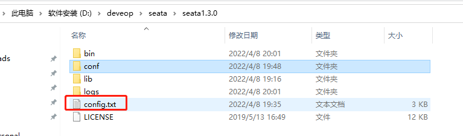
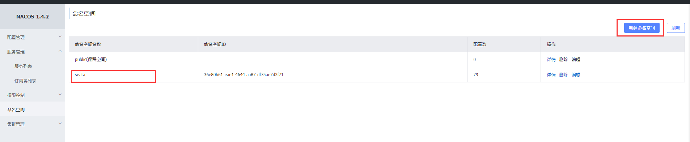
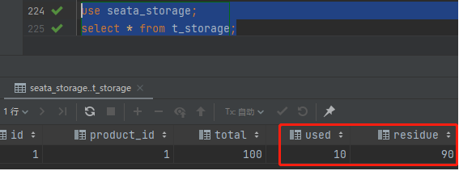

单体应用被拆分成微服务应用，原来的三个模块被拆分成三个独立的应用，分别使用三个独立的数据源，业务操作需要调用三个服务来完成，此时每个服务内部的数据一致性由本地事务来保证，但是全局的数据一致性问题没法保证。


当一次业务操作需要跨多个数据源或需要跨多个系统进行远程调用，就会产生分布式事务问题。

## Seata简介

Seata是一款开源的分布式事务解决方案，致力于在微服务架构下提供高性能和简单易用的分布式事务服务。

官网地址：http://seata.io/zh-cn/

**分布式事务处理过程的一ID+三组件模型**

+ Transaction ID XID

  全局唯一的事务ID。

三个组件如下：

+ Transaction Coordinator (TC)

事务协调器，维护全局事务的运行状态，负责协调并驱动全局事务的提交或回滚；

+ Transaction Manager (TM)

控制全局事务的边界，负责开启一个全局事务，并最终发起全局提交或全局回滚的决议；

+ Resource Manager (RM)

控制分支事务，负责分支注册、状态汇报，并接收事务协调器的指令，驱动分支（本地）事务的提交和回滚

处理过程：


1. TM 向 TC 申请开启一个全局事务，全局事务创建成功并生成一个全局唯一的 XID；
2. XID 在微服务调用链路的上下文中传播；
3. RM 向 TC 注册分支事务，将其纳入 XID 对应全局事务的管辖；
4. TM 向 TC 发起针对 XID 的全局提交或回滚决议；
5. TC 调度 XID 下管辖的全部分支事务完成提交或回滚请求。

下载地址：https://github.com/seata/seata/releases

这里使用的版本是seata1.3.0


## seata-server安装

官网地址：http://seata.io/zh-cn/

下载地址：https://github.com/seata/seata/releases

下载的是：seata-server-1.3.0.zip和seata-1.3.0-src.zip，之所以会下载seata-1.3.0-src.zip是后面会用到该源码包中/script/config-center/nacos文件夹下的nacos-config.sh文件。

1. 将seata-server-1.3.0.zip解压到指定目录，并修改conf目录下的file.conf配置文件。先备份原始file.conf文件，然后修改file.conf。主要修改：主要修改：自定义事务组名称+事务日志存储模式为db+数据库连接信息。

+ file.conf

```properties

## transaction log store, only used in seata-server
store {
  ## store mode: file、db、redis
  mode = "db"

  ## file store property
  file {
    ## store location dir
    dir = "sessionStore"
    # branch session size , if exceeded first try compress lockkey, still exceeded throws exceptions
    maxBranchSessionSize = 16384
    # globe session size , if exceeded throws exceptions
    maxGlobalSessionSize = 512
    # file buffer size , if exceeded allocate new buffer
    fileWriteBufferCacheSize = 16384
    # when recover batch read size
    sessionReloadReadSize = 100
    # async, sync
    flushDiskMode = async
  }

  ## database store property
  db {
    ## the implement of javax.sql.DataSource, such as DruidDataSource(druid)/BasicDataSource(dbcp)/HikariDataSource(hikari) etc.
    datasource = "druid"
    ## mysql/oracle/postgresql/h2/oceanbase etc.
    dbType = "mysql"
    driverClassName = "com.mysql.jdbc.Driver"
    url = "jdbc:mysql://127.0.0.1:3306/seata"
    user = "root"
    password = "root"
    minConn = 5
    maxConn = 30
    globalTable = "global_table"
    branchTable = "branch_table"
    lockTable = "lock_table"
    queryLimit = 100
    maxWait = 5000
  }

  ## redis store property
  redis {
    host = "127.0.0.1"
    port = "6379"
    password = ""
    database = "0"
    minConn = 1
    maxConn = 10
    queryLimit = 100
  }

}
```

2. 新建数据库seata

```sql
create database seata;
```

3. 在seata库里建表

```sql
create database seata;
use seata;

-- -------------------------------- The script used when storeMode is 'db' --------------------------------
-- the table to store GlobalSession data
CREATE TABLE IF NOT EXISTS `global_table`
(
    `xid`                       VARCHAR(128) NOT NULL,
    `transaction_id`            BIGINT,
    `status`                    TINYINT      NOT NULL,
    `application_id`            VARCHAR(32),
    `transaction_service_group` VARCHAR(32),
    `transaction_name`          VARCHAR(128),
    `timeout`                   INT,
    `begin_time`                BIGINT,
    `application_data`          VARCHAR(2000),
    `gmt_create`                DATETIME,
    `gmt_modified`              DATETIME,
    PRIMARY KEY (`xid`),
    KEY `idx_status_gmt_modified` (`status` , `gmt_modified`),
    KEY `idx_transaction_id` (`transaction_id`)
) ENGINE = InnoDB
  DEFAULT CHARSET = utf8mb4;

-- the table to store BranchSession data
CREATE TABLE IF NOT EXISTS `branch_table`
(
    `branch_id`         BIGINT       NOT NULL,
    `xid`               VARCHAR(128) NOT NULL,
    `transaction_id`    BIGINT,
    `resource_group_id` VARCHAR(32),
    `resource_id`       VARCHAR(256),
    `branch_type`       VARCHAR(8),
    `status`            TINYINT,
    `client_id`         VARCHAR(64),
    `application_data`  VARCHAR(2000),
    `gmt_create`        DATETIME,
    `gmt_modified`      DATETIME,
    PRIMARY KEY (`branch_id`),
    KEY `idx_xid` (`xid`)
) ENGINE = InnoDB
  DEFAULT CHARSET = utf8mb4;

-- the table to store lock data
CREATE TABLE IF NOT EXISTS `lock_table`
(
    `row_key`        VARCHAR(128) NOT NULL,
    `xid`            VARCHAR(128),
    `transaction_id` BIGINT,
    `branch_id`      BIGINT       NOT NULL,
    `resource_id`    VARCHAR(256),
    `table_name`     VARCHAR(32),
    `pk`             VARCHAR(36),
    `status`         TINYINT      NOT NULL DEFAULT '0' COMMENT '0:locked ,1:rollbacking',
    `gmt_create`     DATETIME,
    `gmt_modified`   DATETIME,
    PRIMARY KEY (`row_key`),
    KEY `idx_status` (`status`),
    KEY `idx_branch_id` (`branch_id`)
) ENGINE = InnoDB
  DEFAULT CHARSET = utf8mb4;

CREATE TABLE IF NOT EXISTS `distributed_lock`
(
    `lock_key`       CHAR(20) NOT NULL,
    `lock_value`     VARCHAR(20) NOT NULL,
    `expire`         BIGINT,
    primary key (`lock_key`)
) ENGINE = InnoDB
  DEFAULT CHARSET = utf8mb4;

INSERT INTO `distributed_lock` (lock_key, lock_value, expire) VALUES ('HandleAllSession', ' ', 0);
```


4. 修改conf目录下的registry.conf配置文件

```properties
registry {
  # file 、nacos 、eureka、redis、zk、consul、etcd3、sofa
  type = "nacos"

  nacos {
    application = "seata-server"
    serverAddr = "127.0.0.1:8848"
    group = "SEATA_GROUP"
    namespace = ""
    cluster = "default"
    username = "nacos"
    password = "nacos"
  }
  eureka {
    serviceUrl = "http://localhost:8761/eureka"
    application = "default"
    weight = "1"
  }
  redis {
    serverAddr = "localhost:6379"
    db = 0
    password = ""
    cluster = "default"
    timeout = 0
  }
  zk {
    cluster = "default"
    serverAddr = "127.0.0.1:2181"
    sessionTimeout = 6000
    connectTimeout = 2000
    username = ""
    password = ""
  }
  consul {
    cluster = "default"
    serverAddr = "127.0.0.1:8500"
  }
  etcd3 {
    cluster = "default"
    serverAddr = "http://localhost:2379"
  }
  sofa {
    serverAddr = "127.0.0.1:9603"
    application = "default"
    region = "DEFAULT_ZONE"
    datacenter = "DefaultDataCenter"
    cluster = "default"
    group = "SEATA_GROUP"
    addressWaitTime = "3000"
  }
  file {
    name = "file.conf"
  }
}

config {
  # file、nacos 、apollo、zk、consul、etcd3
  type = "nacos"

  nacos {
    serverAddr = "127.0.0.1:8848"
    namespace = ""
    group = "SEATA_GROUP"
    username = "nacos"
    password = "nacos"
  }
  consul {
    serverAddr = "127.0.0.1:8500"
  }
  apollo {
    appId = "seata-server"
    apolloMeta = "http://192.168.1.204:8801"
    namespace = "application"
  }
  zk {
    serverAddr = "127.0.0.1:2181"
    sessionTimeout = 6000
    connectTimeout = 2000
    username = ""
    password = ""
  }
  etcd3 {
    serverAddr = "http://localhost:2379"
  }
  file {
    name = "file.conf"
  }
}

```

5. 将配置导入nacos

seata根目录新建config.txt



config.txt

```properties
transport.type=TCP
transport.server=NIO
transport.heartbeat=true
transport.enableClientBatchSendRequest=false
transport.threadFactory.bossThreadPrefix=NettyBoss
transport.threadFactory.workerThreadPrefix=NettyServerNIOWorker
transport.threadFactory.serverExecutorThreadPrefix=NettyServerBizHandler
transport.threadFactory.shareBossWorker=false
transport.threadFactory.clientSelectorThreadPrefix=NettyClientSelector
transport.threadFactory.clientSelectorThreadSize=1
transport.threadFactory.clientWorkerThreadPrefix=NettyClientWorkerThread
transport.threadFactory.bossThreadSize=1
transport.threadFactory.workerThreadSize=default
transport.shutdown.wait=3

#修改为自己项目的事务分组
service.vgroupMapping.my_test_tx_group=default
service.default.grouplist=127.0.0.1:8091
service.enableDegrade=false
service.disableGlobalTransaction=false
client.rm.asyncCommitBufferLimit=10000
client.rm.lock.retryInterval=10
client.rm.lock.retryTimes=30
client.rm.lock.retryPolicyBranchRollbackOnConflict=true
client.rm.reportRetryCount=5
client.rm.tableMetaCheckEnable=false
client.rm.sqlParserType=druid
client.rm.reportSuccessEnable=false
client.rm.sagaBranchRegisterEnable=false
client.tm.commitRetryCount=5
client.tm.rollbackRetryCount=5
client.tm.degradeCheck=false
client.tm.degradeCheckAllowTimes=10
client.tm.degradeCheckPeriod=2000

#此处配置要与file.conf一致
store.mode=db
store.file.dir=file_store/data
store.file.maxBranchSessionSize=16384
store.file.maxGlobalSessionSize=512
store.file.fileWriteBufferCacheSize=16384
store.file.flushDiskMode=async
store.file.sessionReloadReadSize=100
store.db.datasource=druid
store.db.dbType=mysql
store.db.driverClassName=com.mysql.jdbc.Driver
store.db.url=jdbc:mysql://127.0.0.1:3306/seata?useUnicode=true
store.db.user=root
store.db.password=123456
store.db.minConn=5
store.db.maxConn=30
store.db.globalTable=global_table
store.db.branchTable=branch_table
store.db.queryLimit=100
store.db.lockTable=lock_table
store.db.maxWait=5000
store.redis.host=127.0.0.1
store.redis.port=6379
store.redis.maxConn=10
store.redis.minConn=1
store.redis.database=0
store.redis.password=null
store.redis.queryLimit=100
server.recovery.committingRetryPeriod=1000
server.recovery.asynCommittingRetryPeriod=1000
server.recovery.rollbackingRetryPeriod=1000
server.recovery.timeoutRetryPeriod=1000
server.maxCommitRetryTimeout=-1
server.maxRollbackRetryTimeout=-1
server.rollbackRetryTimeoutUnlockEnable=false
client.undo.dataValidation=true
client.undo.logSerialization=jackson
client.undo.onlyCareUpdateColumns=true
server.undo.logSaveDays=7
server.undo.logDeletePeriod=86400000
client.undo.logTable=undo_log
client.log.exceptionRate=100
transport.serialization=seata
transport.compressor=none
metrics.enabled=false
metrics.registryType=compact
metrics.exporterList=prometheus
metrics.exporterPrometheusPort=9898
```

在nacos中新建namespace



在源码包的/script/config-center/nacos文件夹下，将nacos-config.sh文件复制到conf下

+ nacos-config.sh

```bash
#!/usr/bin/env bash
# Copyright 1999-2019 Seata.io Group.
#
# Licensed under the Apache License, Version 2.0 (the "License");
# you may not use this file except in compliance with the License.
# You may obtain a copy of the License at、
#
#      http://www.apache.org/licenses/LICENSE-2.0
#
# Unless required by applicable law or agreed to in writing, software
# distributed under the License is distributed on an "AS IS" BASIS,
# WITHOUT WARRANTIES OR CONDITIONS OF ANY KIND, either express or implied.
# See the License for the specific language governing permissions and
# limitations under the License.
 
while getopts ":h:p:g:t:u:w:" opt
do
  case $opt in
  h)
    host=$OPTARG
    ;;
  p)
    port=$OPTARG
    ;;
  g)
    group=$OPTARG
    ;;
  t)
    tenant=$OPTARG
    ;;
  u)
    username=$OPTARG
    ;;
  w)
    password=$OPTARG
    ;;
  ?)
    echo " USAGE OPTION: $0 [-h host] [-p port] [-g group] [-t tenant] [-u username] [-w password] "
    exit 1
    ;;
  esac
done
 
if [[ -z ${host} ]]; then
    host=localhost
fi
if [[ -z ${port} ]]; then
    port=8848
fi
if [[ -z ${group} ]]; then
    group="SEATA_GROUP"
fi
if [[ -z ${tenant} ]]; then
    tenant=""
fi
if [[ -z ${username} ]]; then
    username=""
fi
if [[ -z ${password} ]]; then
    password=""
fi
 
nacosAddr=$host:$port
contentType="content-type:application/json;charset=UTF-8"
 
echo "set nacosAddr=$nacosAddr"
echo "set group=$group"
 
failCount=0
tempLog=$(mktemp -u)
function addConfig() {
  curl -X POST -H "${contentType}" "http://$nacosAddr/nacos/v1/cs/configs?dataId=$1&group=$group&content=$2&tenant=$tenant&username=$username&password=$password" >"${tempLog}" 2>/dev/null
  if [[ -z $(cat "${tempLog}") ]]; then
    echo " Please check the cluster status. "
    exit 1
  fi
  if [[ $(cat "${tempLog}") =~ "true" ]]; then
    echo "Set $1=$2 successfully "
  else
    echo "Set $1=$2 failure "
    (( failCount++ ))
  fi
}
 
count=0
for line in $(cat $(dirname "$PWD")/config.txt | sed s/[[:space:]]//g); do
  (( count++ ))
    key=${line%%=*}
    value=${line#*=}
    addConfig "${key}" "${value}"
done
 
echo "========================================================================="
echo " Complete initialization parameters,  total-count:$count ,  failure-count:$failCount "
echo "========================================================================="
 
if [[ ${failCount} -eq 0 ]]; then
    echo " Init nacos config finished, please start seata-server. "
else
    echo " init nacos config fail. "
fi


```

先启动先启动Nacos端口号8848

在git命令中执行：

```bash
 ./nacos-config.sh -h localhost -p 8848 -g SEATA_GROUP -t 36e80b61-eae1-4644-aa87-df75ae7d2f71
```

参数说明：

-h: host，默认值 localhost

-p: port，默认值 8848

-g: 配置分组，默认值为 'SEATA_GROUP'

-t: 在nacos中对应的namespace信息，使用的是namespace的命名空间ID


执行完之后，查看nacos：


## 订单/库存/账户业务模块编写

业务说明：

这里我们会创建三个服务，一个订单服务，一个库存服务，一个账户服务。当用户下单时，会在订单服务中创建一个订单，然后通过远程调用库存服务来扣减下单商品的库存，再通过远程调用账户服务来扣减用户账户里面的余额，最后在订单服务中修改订单状态为已完成。该操作跨越三个数据库，有两次远程调用，很明显会有分布式事务问题。

### 创建业务数据库

seata_order：存储订单的数据库；

seata_storage：存储库存的数据库；

seata_account：存储账户信息的数据库。

```sql
CREATE DATABASE seata_order;

CREATE DATABASE seata_storage;

CREATE DATABASE seata_account;
```

seata_order库下建t_order表

```sql
use seata_order;
CREATE TABLE t_order (
  `id` BIGINT(11) NOT NULL AUTO_INCREMENT PRIMARY KEY,
  `user_id` BIGINT(11) DEFAULT NULL COMMENT '用户id',
  `product_id` BIGINT(11) DEFAULT NULL COMMENT '产品id',
  `count` INT(11) DEFAULT NULL COMMENT '数量',
  `money` DECIMAL(11,0) DEFAULT NULL COMMENT '金额',
  `status` INT(1) DEFAULT NULL COMMENT '订单状态：0：创建中；1：已完结'
) ENGINE=INNODB AUTO_INCREMENT=7 DEFAULT CHARSET=utf8;


SELECT * FROM t_order;
```

seata_storage库下建t_storage 表

```sql
 use seata_storage;
CREATE TABLE t_storage (
 `id` BIGINT(11) NOT NULL AUTO_INCREMENT PRIMARY KEY,
 `product_id` BIGINT(11) DEFAULT NULL COMMENT '产品id',
 `total` INT(11) DEFAULT NULL COMMENT '总库存',
 `used` INT(11) DEFAULT NULL COMMENT '已用库存',
 `residue` INT(11) DEFAULT NULL COMMENT '剩余库存'
) ENGINE=INNODB AUTO_INCREMENT=2 DEFAULT CHARSET=utf8;

INSERT INTO seata_storage.t_storage(`id`, `product_id`, `total`, `used`, `residue`)
VALUES ('1', '1', '100', '0', '100');

SELECT * FROM t_storage;
```

seata_account库下建t_account 表

```sql
 use seata_account;
CREATE TABLE t_account (
  `id` BIGINT(11) NOT NULL AUTO_INCREMENT PRIMARY KEY COMMENT 'id',
  `user_id` BIGINT(11) DEFAULT NULL COMMENT '用户id',
  `total` DECIMAL(10,0) DEFAULT NULL COMMENT '总额度',
  `used` DECIMAL(10,0) DEFAULT NULL COMMENT '已用余额',
  `residue` DECIMAL(10,0) DEFAULT '0' COMMENT '剩余可用额度'
) ENGINE=INNODB AUTO_INCREMENT=2 DEFAULT CHARSET=utf8; # AUTO_INCREMENT=2，表示如果t_account为空，从2开始加1

INSERT INTO seata_account.t_account(`id`, `user_id`, `total`, `used`, `residue`)  VALUES ('1', '1', '1000', '0', '1000');

SELECT * FROM t_account;
```

订单-库存-账户3个库下都需要建各自的回滚日志表

```sql
use seata_order;
CREATE TABLE `undo_log` (
  `id` BIGINT(20) NOT NULL AUTO_INCREMENT,
  `branch_id` BIGINT(20) NOT NULL,
  `xid` VARCHAR(100) NOT NULL,
  `context` VARCHAR(128) NOT NULL,
  `rollback_info` LONGBLOB NOT NULL,
  `log_status` INT(11) NOT NULL,
  `log_created` DATETIME NOT NULL,
  `log_modified` DATETIME NOT NULL,
  `ext` VARCHAR(100) DEFAULT NULL,
  PRIMARY KEY (`id`),
  UNIQUE KEY `ux_undo_log` (`xid`,`branch_id`)
) ENGINE=INNODB AUTO_INCREMENT=1 DEFAULT CHARSET=utf8;

use seata_storage;
CREATE TABLE `undo_log` (
  `id` BIGINT(20) NOT NULL AUTO_INCREMENT,
  `branch_id` BIGINT(20) NOT NULL,
  `xid` VARCHAR(100) NOT NULL,
  `context` VARCHAR(128) NOT NULL,
  `rollback_info` LONGBLOB NOT NULL,
  `log_status` INT(11) NOT NULL,
  `log_created` DATETIME NOT NULL,
  `log_modified` DATETIME NOT NULL,
  `ext` VARCHAR(100) DEFAULT NULL,
  PRIMARY KEY (`id`),
  UNIQUE KEY `ux_undo_log` (`xid`,`branch_id`)
) ENGINE=INNODB AUTO_INCREMENT=1 DEFAULT CHARSET=utf8;

use seata_account;
CREATE TABLE `undo_log` (
  `id` BIGINT(20) NOT NULL AUTO_INCREMENT,
  `branch_id` BIGINT(20) NOT NULL,
  `xid` VARCHAR(100) NOT NULL,
  `context` VARCHAR(128) NOT NULL,
  `rollback_info` LONGBLOB NOT NULL,
  `log_status` INT(11) NOT NULL,
  `log_created` DATETIME NOT NULL,
  `log_modified` DATETIME NOT NULL,
  `ext` VARCHAR(100) DEFAULT NULL,
  PRIMARY KEY (`id`),
  UNIQUE KEY `ux_undo_log` (`xid`,`branch_id`)
) ENGINE=INNODB AUTO_INCREMENT=1 DEFAULT CHARSET=utf8;
```

最终效果：


## 订单/库存/账户业务微服务准备

业务需求：下订单->减库存->扣余额->改(订单)状态

### 新建库存模块19-seata-storage-service2002

#### pom.xml

```xml
<?xml version="1.0" encoding="UTF-8"?>
<project xmlns="http://maven.apache.org/POM/4.0.0"
         xmlns:xsi="http://www.w3.org/2001/XMLSchema-instance"
         xsi:schemaLocation="http://maven.apache.org/POM/4.0.0 http://maven.apache.org/xsd/maven-4.0.0.xsd">
    <parent>
        <artifactId>SpringCloudModules</artifactId>
        <groupId>com.hashnode</groupId>
        <version>1.0-SNAPSHOT</version>
    </parent>
    <modelVersion>4.0.0</modelVersion>

    <artifactId>19-seata-storage-service2002</artifactId>

    <properties>
        <maven.compiler.source>8</maven.compiler.source>
        <maven.compiler.target>8</maven.compiler.target>
    </properties>

    <dependencies>
        <dependency>
            <groupId>org.springframework.boot</groupId>
            <artifactId>spring-boot-starter-test</artifactId>
            <scope>test</scope>
        </dependency>

        <!--web-actuator-->
        <dependency>
            <groupId>org.springframework.boot</groupId>
            <artifactId>spring-boot-starter-web</artifactId>
        </dependency>

        <dependency>
            <groupId>org.springframework.boot</groupId>
            <artifactId>spring-boot-starter-actuator</artifactId>
        </dependency>


        <!--nacos-->
        <dependency>
            <groupId>com.alibaba.cloud</groupId>
            <artifactId>spring-cloud-starter-alibaba-nacos-discovery</artifactId>
        </dependency>

        <!--seata-->
        <dependency>
            <groupId>com.alibaba.cloud</groupId>
            <artifactId>spring-cloud-starter-alibaba-seata</artifactId>
            <exclusions>
                <!-- 要与seata服务端版本一直,所以把自带的替换掉 -->
                <exclusion>
                    <groupId>io.seata</groupId>
                    <artifactId>seata-spring-boot-starter</artifactId>
<!--                    <groupId>io.seata</groupId>-->
<!--                    <artifactId>seata-all</artifactId>-->
                </exclusion>
            </exclusions>
        </dependency>

        <!--使用1.3.0版本的seata-spring-boot-starter -->
        <dependency>
            <groupId>io.seata</groupId>
            <artifactId>seata-spring-boot-starter</artifactId>
            <version>1.3.0</version>
        </dependency>

<!--        <dependency>-->
<!--            <groupId>io.seata</groupId>-->
<!--            <artifactId>seata-all</artifactId>-->
<!--            &lt;!&ndash;  <version>${seata.version}</version> &ndash;&gt;-->
<!--            <version>1.3.0</version>-->
<!--        </dependency>-->


        <!--feign-->
        <dependency>
            <groupId>org.springframework.cloud</groupId>
            <artifactId>spring-cloud-starter-openfeign</artifactId>
        </dependency>

        <dependency>
            <groupId>org.mybatis.spring.boot</groupId>
            <artifactId>mybatis-spring-boot-starter</artifactId>
            <version>2.0.0</version>
        </dependency>

        <!--mysql-->
        <dependency>
            <groupId>mysql</groupId>
            <artifactId>mysql-connector-java</artifactId>
        </dependency>
        <!-- druid-->
        <dependency>
            <groupId>com.alibaba</groupId>
            <artifactId>druid</artifactId>
        </dependency>
        <!-- mybatis-->
        <dependency>
            <groupId>org.mybatis.spring.boot</groupId>
            <artifactId>mybatis-spring-boot-starter</artifactId>
        </dependency>
        <!--junit-->
        <dependency>
            <groupId>junit</groupId>
            <artifactId>junit</artifactId>
        </dependency>
        <!--log4j-->
        <dependency>
            <groupId>log4j</groupId>
            <artifactId>log4j</artifactId>
        </dependency>
        <!--SpringBoot Thymeleaf依赖-->
        <dependency>
            <groupId>org.springframework.boot</groupId>
            <artifactId>spring-boot-starter-thymeleaf</artifactId>
        </dependency>
        <!--添加Bootstrap WarJar的依赖-->
        <dependency>
            <groupId>org.webjars</groupId>
            <artifactId>bootstrap</artifactId>
        </dependency>

        <dependency>
            <groupId>org.projectlombok</groupId>
            <artifactId>lombok</artifactId>
        </dependency>

    </dependencies>

</project>
```

#### application.yml

```yml
server:
  port: 2002

spring:
  application:
    name: seata-storage-service
  cloud:
    nacos:
      discovery:
        server-addr: localhost:8848

  datasource:
    type: com.alibaba.druid.pool.DruidDataSource    #当前数据源操作类型
#    driver-class-name: com.mysql.jdbc.Driver
    driver-class-name: org.gjt.mm.mysql.Driver      #mysql驱动包
    url: jdbc:mysql://localhost:3306/seata_storage?useUnicode=true&characterEncoding=UTF-8&useJDBCCompliantTimezoneShift=true&useLegacyDateTimeCode=false&serverTimezone=GMT%2B8
    username: root
    password: root


seata:
  enabled: true 
  enable-auto-data-source-proxy: true  # 牵扯到回滚
  tx-service-group: my_test_tx_group  # 需要与config.txt中的 service.vgroupMapping.seata_test_group=default保持一致
  registry:  ## 注册中心
    type: nacos #注册nacos
    nacos:
      application: seata-server  #nacos中seata-server启动注册成功后的服务名称
      server-addr: 127.0.0.1:8848
      username: nacos
      password: nacos
  config: ## 配置中心  与register.conf文件中的保持一致
    type: nacos
    nacos:
      server-addr: 127.0.0.1:8848
      group: SEATA_GROUP
      username: nacos
      password: nacos
      namespace: 36e80b61-eae1-4644-aa87-df75ae7d2f71  # 对应之前新建的命名空间seata的id
  service:
    vgroup-mapping:
      my_test_tx_group: default
  client:
    rm:
      report-success-enable: false


feign:
  hystrix:
    enabled: false

logging:
  level:
    io:
      seata: info

mybatis:
  mapperLocations: classpath:mapper/*.xml


#暴露全部监控信息
management:
  endpoints:
    web:
      exposure:
        include: "*"
```


#### domin

+ CommonResult.java

```java
package com.hashnode.domain;

import lombok.AllArgsConstructor;
import lombok.Data;
import lombok.NoArgsConstructor;

@Data
@AllArgsConstructor
@NoArgsConstructor
public class CommonResult<T>
{
    private Integer code;
    private String  message;
    private T       data;

    public CommonResult(Integer code, String message)
    {
        this(code,message,null);
    }
}
```

#### model

+ Storage.java

```java
package com.hashnode.model;

public class Storage {
    private Long id;

    private Long productId;

    private Integer total;

    private Integer used;

    private Integer residue;

    public Long getId() {
        return id;
    }

    public void setId(Long id) {
        this.id = id;
    }

    public Long getProductId() {
        return productId;
    }

    public void setProductId(Long productId) {
        this.productId = productId;
    }

    public Integer getTotal() {
        return total;
    }

    public void setTotal(Integer total) {
        this.total = total;
    }

    public Integer getUsed() {
        return used;
    }

    public void setUsed(Integer used) {
        this.used = used;
    }

    public Integer getResidue() {
        return residue;
    }

    public void setResidue(Integer residue) {
        this.residue = residue;
    }
}
```

#### mapper接口及实现

+ StorageMapper.java

```java
package com.hashnode.mapper;

import com.hashnode.model.Storage;
import org.apache.ibatis.annotations.Param;

public interface StorageMapper {
    int deleteByPrimaryKey(Long id);

    int insert(Storage record);

    int insertSelective(Storage record);

    Storage selectByPrimaryKey(Long id);

    int updateByPrimaryKeySelective(Storage record);

    int updateByPrimaryKey(Storage record);

    void decrease(@Param("productId") Long productId, @Param("count") Integer count);
}
```

resources文件夹下新建mapper文件夹后添加StorageMapper.xml

```xml
<?xml version="1.0" encoding="UTF-8"?>
<!DOCTYPE mapper PUBLIC "-//mybatis.org//DTD Mapper 3.0//EN" "http://mybatis.org/dtd/mybatis-3-mapper.dtd">
<mapper namespace="com.hashnode.mapper.StorageMapper">
  <resultMap id="BaseResultMap" type="com.hashnode.model.Storage">
    <id column="id" jdbcType="BIGINT" property="id" />
    <result column="product_id" jdbcType="BIGINT" property="productId" />
    <result column="total" jdbcType="INTEGER" property="total" />
    <result column="used" jdbcType="INTEGER" property="used" />
    <result column="residue" jdbcType="INTEGER" property="residue" />
  </resultMap>
  <sql id="Base_Column_List">
    id, product_id, total, used, residue
  </sql>
  <select id="selectByPrimaryKey" parameterType="java.lang.Long" resultMap="BaseResultMap">
    select 
    <include refid="Base_Column_List" />
    from t_storage
    where id = #{id,jdbcType=BIGINT}
  </select>
  <delete id="deleteByPrimaryKey" parameterType="java.lang.Long">
    delete from t_storage
    where id = #{id,jdbcType=BIGINT}
  </delete>
  <insert id="insert" parameterType="com.hashnode.model.Storage">
    insert into t_storage (id, product_id, total, 
      used, residue)
    values (#{id,jdbcType=BIGINT}, #{productId,jdbcType=BIGINT}, #{total,jdbcType=INTEGER}, 
      #{used,jdbcType=INTEGER}, #{residue,jdbcType=INTEGER})
  </insert>
  <insert id="insertSelective" parameterType="com.hashnode.model.Storage">
    insert into t_storage
    <trim prefix="(" suffix=")" suffixOverrides=",">
      <if test="id != null">
        id,
      </if>
      <if test="productId != null">
        product_id,
      </if>
      <if test="total != null">
        total,
      </if>
      <if test="used != null">
        used,
      </if>
      <if test="residue != null">
        residue,
      </if>
    </trim>
    <trim prefix="values (" suffix=")" suffixOverrides=",">
      <if test="id != null">
        #{id,jdbcType=BIGINT},
      </if>
      <if test="productId != null">
        #{productId,jdbcType=BIGINT},
      </if>
      <if test="total != null">
        #{total,jdbcType=INTEGER},
      </if>
      <if test="used != null">
        #{used,jdbcType=INTEGER},
      </if>
      <if test="residue != null">
        #{residue,jdbcType=INTEGER},
      </if>
    </trim>
  </insert>
  <update id="updateByPrimaryKeySelective" parameterType="com.hashnode.model.Storage">
    update t_storage
    <set>
      <if test="productId != null">
        product_id = #{productId,jdbcType=BIGINT},
      </if>
      <if test="total != null">
        total = #{total,jdbcType=INTEGER},
      </if>
      <if test="used != null">
        used = #{used,jdbcType=INTEGER},
      </if>
      <if test="residue != null">
        residue = #{residue,jdbcType=INTEGER},
      </if>
    </set>
    where id = #{id,jdbcType=BIGINT}
  </update>
  <update id="updateByPrimaryKey" parameterType="com.hashnode.model.Storage">
    update t_storage
    set product_id = #{productId,jdbcType=BIGINT},
      total = #{total,jdbcType=INTEGER},
      used = #{used,jdbcType=INTEGER},
      residue = #{residue,jdbcType=INTEGER}
    where id = #{id,jdbcType=BIGINT}
  </update>
    <update id="decrease">
      UPDATE t_storage
      SET used    = used + #{count},
          residue = residue - #{count}
      WHERE product_id = #{productId}
    </update>
</mapper>
```

#### Service接口及实现

+ StorageService.java

```java
package com.hashnode.service;

public interface StorageService {
    /**
     * 扣减库存
     */
    void decrease(Long productId, Integer count);
}
```

+ StorageSrviceImpl.java

```java
package com.hashnode.service.imp;

import com.hashnode.mapper.StorageMapper;
import com.hashnode.service.StorageService;
import org.slf4j.Logger;
import org.slf4j.LoggerFactory;
import org.springframework.stereotype.Service;

import javax.annotation.Resource;

@Service
public class StorageServiceImpl implements StorageService {
    private static final Logger LOGGER = LoggerFactory.getLogger(StorageServiceImpl.class);

    @Resource
    private StorageMapper storageMapper;

    @Override
    public void decrease(Long productId, Integer count) {
        LOGGER.info("------->storage-service中扣减库存开始");
        storageMapper.decrease(productId,count);
        LOGGER.info("------->storage-service中扣减库存结束");
    }
}
```

#### Controller

+ StorageController.java

```java
package com.hashnode.controller;

import com.hashnode.domain.CommonResult;
import com.hashnode.service.StorageService;
import org.springframework.beans.factory.annotation.Autowired;
import org.springframework.web.bind.annotation.RequestMapping;
import org.springframework.web.bind.annotation.RestController;

@RestController
public class StorageController {
    @Autowired
    private StorageService storageService;

    /**
     * 扣减库存
     */
    @RequestMapping("/storage/decrease")
    public CommonResult decrease(Long productId, Integer count) {
        storageService.decrease(productId, count);
        return new CommonResult(200,"扣减库存成功！");
    }
}
```

#### 主启动

```java
package com.hashnode;

import io.seata.spring.annotation.datasource.EnableAutoDataSourceProxy;
import org.mybatis.spring.annotation.MapperScan;
import org.springframework.boot.SpringApplication;
import org.springframework.boot.autoconfigure.SpringBootApplication;
import org.springframework.cloud.client.discovery.EnableDiscoveryClient;
import org.springframework.cloud.openfeign.EnableFeignClients;

@EnableAutoDataSourceProxy //seata相关
@EnableDiscoveryClient
//@EnableDiscoveryClient和@EnableEurekaClient共同点就是：都是能够让注册中心能够发现，扫描到改服务。
//不同点：@EnableEurekaClient只适用于Eureka作为注册中心，@EnableDiscoveryClient 可以是其他注册中心。
//从Spring Cloud Edgware开始，@EnableDiscoveryClient 或@EnableEurekaClient 可省略。只需加上相关依赖，并进行相应配置，即可将微服务注册到服务发现组件上。
@SpringBootApplication
@EnableFeignClients
@MapperScan("com.hashnode.mapper")
public class Main2002 {
    public static void main(String[] args) {
        SpringApplication.run(Main2002.class, args);
    }
}

```

### 新建账户模块19-seata-zaccount-service2003

#### pom.xml

```xml
<?xml version="1.0" encoding="UTF-8"?>
<project xmlns="http://maven.apache.org/POM/4.0.0"
         xmlns:xsi="http://www.w3.org/2001/XMLSchema-instance"
         xsi:schemaLocation="http://maven.apache.org/POM/4.0.0 http://maven.apache.org/xsd/maven-4.0.0.xsd">
    <parent>
        <artifactId>SpringCloudModules</artifactId>
        <groupId>com.hashnode</groupId>
        <version>1.0-SNAPSHOT</version>
    </parent>
    <modelVersion>4.0.0</modelVersion>

    <artifactId>19-seata-zaccount-service2003</artifactId>

    <properties>
        <maven.compiler.source>8</maven.compiler.source>
        <maven.compiler.target>8</maven.compiler.target>
    </properties>

    <dependencies>
        <dependency>
            <groupId>org.springframework.boot</groupId>
            <artifactId>spring-boot-starter-test</artifactId>
            <scope>test</scope>
        </dependency>

        <!--web-actuator-->
        <dependency>
            <groupId>org.springframework.boot</groupId>
            <artifactId>spring-boot-starter-web</artifactId>
        </dependency>

        <dependency>
            <groupId>org.springframework.boot</groupId>
            <artifactId>spring-boot-starter-actuator</artifactId>
        </dependency>


        <!--nacos-->
        <dependency>
            <groupId>com.alibaba.cloud</groupId>
            <artifactId>spring-cloud-starter-alibaba-nacos-discovery</artifactId>
        </dependency>

        <!--seata-->
        <dependency>
            <groupId>com.alibaba.cloud</groupId>
            <artifactId>spring-cloud-starter-alibaba-seata</artifactId>
            <exclusions>
                <!-- 要与seata服务端版本一直,所以把自带的替换掉 -->
                <exclusion>
                    <groupId>io.seata</groupId>
                    <artifactId>seata-spring-boot-starter</artifactId>
<!--                    <groupId>io.seata</groupId>-->
<!--                    <artifactId>seata-all</artifactId>-->
                </exclusion>
            </exclusions>
        </dependency>

        <!--使用1.3.0版本的seata-spring-boot-starter -->
        <dependency>
            <groupId>io.seata</groupId>
            <artifactId>seata-spring-boot-starter</artifactId>
            <version>1.3.0</version>
        </dependency>

<!--        <dependency>-->
<!--            <groupId>io.seata</groupId>-->
<!--            <artifactId>seata-all</artifactId>-->
<!--            &lt;!&ndash;  <version>${seata.version}</version> &ndash;&gt;-->
<!--            <version>1.3.0</version>-->
<!--        </dependency>-->


        <!--feign-->
        <dependency>
            <groupId>org.springframework.cloud</groupId>
            <artifactId>spring-cloud-starter-openfeign</artifactId>
        </dependency>

        <dependency>
            <groupId>org.mybatis.spring.boot</groupId>
            <artifactId>mybatis-spring-boot-starter</artifactId>
            <version>2.0.0</version>
        </dependency>

        <!--mysql-->
        <dependency>
            <groupId>mysql</groupId>
            <artifactId>mysql-connector-java</artifactId>
        </dependency>
        <!-- druid-->
        <dependency>
            <groupId>com.alibaba</groupId>
            <artifactId>druid</artifactId>
        </dependency>
        <!-- mybatis-->
        <dependency>
            <groupId>org.mybatis.spring.boot</groupId>
            <artifactId>mybatis-spring-boot-starter</artifactId>
        </dependency>
        <!--junit-->
        <dependency>
            <groupId>junit</groupId>
            <artifactId>junit</artifactId>
        </dependency>
        <!--log4j-->
        <dependency>
            <groupId>log4j</groupId>
            <artifactId>log4j</artifactId>
        </dependency>
        <!--SpringBoot Thymeleaf依赖-->
        <dependency>
            <groupId>org.springframework.boot</groupId>
            <artifactId>spring-boot-starter-thymeleaf</artifactId>
        </dependency>
        <!--添加Bootstrap WarJar的依赖-->
        <dependency>
            <groupId>org.webjars</groupId>
            <artifactId>bootstrap</artifactId>
        </dependency>

        <dependency>
            <groupId>org.projectlombok</groupId>
            <artifactId>lombok</artifactId>
        </dependency>

    </dependencies>

</project>
```

#### application.yml

```yml
server:
  port: 2003

spring:
  application:
    name: seata-account-service
  cloud:
    nacos:
      discovery:
        server-addr: localhost:8848

  datasource:
    type: com.alibaba.druid.pool.DruidDataSource    #当前数据源操作类型
#    driver-class-name: com.mysql.jdbc.Driver
    driver-class-name: org.gjt.mm.mysql.Driver      #mysql驱动包
    url: jdbc:mysql://localhost:3306/seata_account?useUnicode=true&characterEncoding=UTF-8&useJDBCCompliantTimezoneShift=true&useLegacyDateTimeCode=false&serverTimezone=GMT%2B8
    username: root
    password: root


seata:
  enabled: true 
  enable-auto-data-source-proxy: true  # 牵扯到回滚
  tx-service-group: my_test_tx_group  # 需要与config.txt中的 service.vgroupMapping.seata_test_group=default保持一致
  registry:  ## 注册中心
    type: nacos #注册nacos
    nacos:
      application: seata-server  #nacos中seata-server启动注册成功后的服务名称
      server-addr: 127.0.0.1:8848
      username: nacos
      password: nacos
  config: ## 配置中心  与register.conf文件中的保持一致
    type: nacos
    nacos:
      server-addr: 127.0.0.1:8848
      group: SEATA_GROUP
      username: nacos
      password: nacos
      namespace: 36e80b61-eae1-4644-aa87-df75ae7d2f71
  service:
    vgroup-mapping:
      my_test_tx_group: default
  client:
    rm:
      report-success-enable: false


feign:
  hystrix:
    enabled: false

logging:
  level:
    io:
      seata: info

mybatis:
  mapperLocations: classpath:mapper/*.xml


#暴露全部监控信息
management:
  endpoints:
    web:
      exposure:
        include: "*"
```


#### domin

+ CommonResult.java

```java
package com.hashnode.domain;

import lombok.AllArgsConstructor;
import lombok.Data;
import lombok.NoArgsConstructor;

@Data
@AllArgsConstructor
@NoArgsConstructor
public class CommonResult<T>
{
    private Integer code;
    private String  message;
    private T       data;

    public CommonResult(Integer code, String message)
    {
        this(code,message,null);
    }
}
```

#### model

Account.java

```java
package com.hashnode.model;

public class Account {
    private Long id;

    private Long userId;

    private Long total;

    private Long used;

    private Long residue;

    public Long getId() {
        return id;
    }

    public void setId(Long id) {
        this.id = id;
    }

    public Long getUserId() {
        return userId;
    }

    public void setUserId(Long userId) {
        this.userId = userId;
    }

    public Long getTotal() {
        return total;
    }

    public void setTotal(Long total) {
        this.total = total;
    }

    public Long getUsed() {
        return used;
    }

    public void setUsed(Long used) {
        this.used = used;
    }

    public Long getResidue() {
        return residue;
    }

    public void setResidue(Long residue) {
        this.residue = residue;
    }
}
```

#### mapper接口及实现

+ AccountMapper.java

```java
package com.hashnode.mapper;

import com.hashnode.model.Account;
//不能用此，切记
//import feign.Param;
import org.apache.ibatis.annotations.Param;

import java.math.BigDecimal;

public interface AccountMapper {
    int deleteByPrimaryKey(Long id);

    int insert(Account record);

    int insertSelective(Account record);

    Account selectByPrimaryKey(Long id);

    int updateByPrimaryKeySelective(Account record);

    int updateByPrimaryKey(Account record);

    /**
     * 扣减账户余额
     */
    void decrease(@Param("id") Long id, @Param("money") Long money);

}
```

resources文件夹下新建mapper文件夹后添加AccountMapper.xml

```xml
<?xml version="1.0" encoding="UTF-8"?>
<!DOCTYPE mapper PUBLIC "-//mybatis.org//DTD Mapper 3.0//EN" "http://mybatis.org/dtd/mybatis-3-mapper.dtd">
<mapper namespace="com.hashnode.mapper.AccountMapper">
  <resultMap id="BaseResultMap" type="com.hashnode.model.Account">
    <id column="id" jdbcType="BIGINT" property="id" />
    <result column="user_id" jdbcType="BIGINT" property="userId" />
    <result column="total" jdbcType="DECIMAL" property="total" />
    <result column="used" jdbcType="DECIMAL" property="used" />
    <result column="residue" jdbcType="DECIMAL" property="residue" />
  </resultMap>
  <sql id="Base_Column_List">
    id, user_id, total, used, residue
  </sql>
  <select id="selectByPrimaryKey" parameterType="java.lang.Long" resultMap="BaseResultMap">
    select 
    <include refid="Base_Column_List" />
    from t_account
    where id = #{id,jdbcType=BIGINT}
  </select>
  <delete id="deleteByPrimaryKey" parameterType="java.lang.Long">
    delete from t_account
    where id = #{id,jdbcType=BIGINT}
  </delete>
  <insert id="insert" parameterType="com.hashnode.model.Account">
    insert into t_account (id, user_id, total, 
      used, residue)
    values (#{id,jdbcType=BIGINT}, #{userId,jdbcType=BIGINT}, #{total,jdbcType=DECIMAL}, 
      #{used,jdbcType=DECIMAL}, #{residue,jdbcType=DECIMAL})
  </insert>
  <insert id="insertSelective" parameterType="com.hashnode.model.Account">
    insert into t_account
    <trim prefix="(" suffix=")" suffixOverrides=",">
      <if test="id != null">
        id,
      </if>
      <if test="userId != null">
        user_id,
      </if>
      <if test="total != null">
        total,
      </if>
      <if test="used != null">
        used,
      </if>
      <if test="residue != null">
        residue,
      </if>
    </trim>
    <trim prefix="values (" suffix=")" suffixOverrides=",">
      <if test="id != null">
        #{id,jdbcType=BIGINT},
      </if>
      <if test="userId != null">
        #{userId,jdbcType=BIGINT},
      </if>
      <if test="total != null">
        #{total,jdbcType=DECIMAL},
      </if>
      <if test="used != null">
        #{used,jdbcType=DECIMAL},
      </if>
      <if test="residue != null">
        #{residue,jdbcType=DECIMAL},
      </if>
    </trim>
  </insert>
  <update id="updateByPrimaryKeySelective" parameterType="com.hashnode.model.Account">
    update t_account
    <set>
      <if test="userId != null">
        user_id = #{userId,jdbcType=BIGINT},
      </if>
      <if test="total != null">
        total = #{total,jdbcType=DECIMAL},
      </if>
      <if test="used != null">
        used = #{used,jdbcType=DECIMAL},
      </if>
      <if test="residue != null">
        residue = #{residue,jdbcType=DECIMAL},
      </if>
    </set>
    where id = #{id,jdbcType=BIGINT}
  </update>
  <update id="updateByPrimaryKey" parameterType="com.hashnode.model.Account">
    update t_account
    set user_id = #{userId,jdbcType=BIGINT},
      total = #{total,jdbcType=DECIMAL},
      used = #{used,jdbcType=DECIMAL},
      residue = #{residue,jdbcType=DECIMAL}
    where id = #{id,jdbcType=BIGINT}
  </update>
<!--  void decrease(Long id, Long money);-->
  <update id="decrease">
    update t_account
    set residue = residue - #{money},
        used = used + #{money}
    where id = #{id}
  </update>

</mapper>
```

#### Service接口及实现

+ AccountService.java

```java
package com.hashnode.service;


import org.springframework.web.bind.annotation.RequestParam;

import java.math.BigDecimal;

public interface  AccountService {
    /**
     * 扣减账户余额
     * @param userId 用户id
     * @param money 金额
     */
    void decrease(@RequestParam("userId") Long userId, @RequestParam("money") Long money);
}
```

+ AccountServiceImpl.java

```java
package com.hashnode.service.imp;

import com.hashnode.mapper.AccountMapper;
import com.hashnode.service.AccountService;
import org.slf4j.Logger;
import org.slf4j.LoggerFactory;
import org.springframework.stereotype.Service;

import javax.annotation.Resource;
import java.math.BigDecimal;
import java.util.concurrent.TimeUnit;

@Service
public class AccountServiceImpl implements AccountService {

    private static final Logger LOGGER = LoggerFactory.getLogger(AccountServiceImpl.class);

    @Resource
    AccountMapper accountMapper;

    @Override
    public void decrease(Long userId, Long money) {
        LOGGER.info("------->account-service中扣减账户余额开始");
        //模拟超时异常，全局事务回滚
        //暂停几秒钟线程
//        try { TimeUnit.SECONDS.sleep(30); } catch (InterruptedException e) { e.printStackTrace(); }
        accountMapper.decrease(userId,money);
        LOGGER.info("------->account-service中扣减账户余额结束");

    }
}
```

#### Controller

+ AccountController.java

```java
package com.hashnode.controller;

import com.hashnode.domain.CommonResult;
import com.hashnode.service.AccountService;
import org.springframework.web.bind.annotation.*;

import javax.annotation.Resource;
import java.math.BigDecimal;

@RestController
public class AccountController {
    @Resource
    AccountService accountService;

    /**
     * 扣减账户余额
     */
//    @PostMapping("/account/decrease")
    @RequestMapping("/account/decrease") //以任何请求形式都可以访问
    public CommonResult decrease(@RequestParam("userId") Long userId, @RequestParam("money") Long money){
        accountService.decrease(userId,money);
        return new CommonResult(200,"扣减账户余额成功！");
    }
}
```

#### 主启动

```java
package com.hashnode;

import io.seata.spring.annotation.datasource.EnableAutoDataSourceProxy;
import org.mybatis.spring.annotation.MapperScan;
import org.springframework.boot.SpringApplication;
import org.springframework.boot.autoconfigure.SpringBootApplication;
import org.springframework.cloud.client.discovery.EnableDiscoveryClient;
import org.springframework.cloud.openfeign.EnableFeignClients;


@EnableAutoDataSourceProxy  //seata相关
@EnableDiscoveryClient
//@EnableDiscoveryClient和@EnableEurekaClient共同点就是：都是能够让注册中心能够发现，扫描到改服务。
//不同点：@EnableEurekaClient只适用于Eureka作为注册中心，@EnableDiscoveryClient 可以是其他注册中心。
//从Spring Cloud Edgware开始，@EnableDiscoveryClient 或@EnableEurekaClient 可省略。只需加上相关依赖，并进行相应配置，即可将微服务注册到服务发现组件上。
@SpringBootApplication
@EnableFeignClients
@MapperScan("com.hashnode.mapper")
public class Main2003 {
    public static void main(String[] args) {
        SpringApplication.run(Main2003.class, args);
    }
}
```

### 新建订单模块19-seata-order-service2001

#### pom.xml

```xml
<?xml version="1.0" encoding="UTF-8"?>
<project xmlns="http://maven.apache.org/POM/4.0.0"
         xmlns:xsi="http://www.w3.org/2001/XMLSchema-instance"
         xsi:schemaLocation="http://maven.apache.org/POM/4.0.0 http://maven.apache.org/xsd/maven-4.0.0.xsd">
    <parent>
        <artifactId>SpringCloudModules</artifactId>
        <groupId>com.hashnode</groupId>
        <version>1.0-SNAPSHOT</version>
    </parent>
    <modelVersion>4.0.0</modelVersion>

    <artifactId>19-seata-order-service2001</artifactId>

    <properties>
        <maven.compiler.source>8</maven.compiler.source>
        <maven.compiler.target>8</maven.compiler.target>
    </properties>

    <dependencies>
        <dependency>
            <groupId>org.springframework.boot</groupId>
            <artifactId>spring-boot-starter-test</artifactId>
            <scope>test</scope>
        </dependency>

        <!--web-actuator-->
        <dependency>
            <groupId>org.springframework.boot</groupId>
            <artifactId>spring-boot-starter-web</artifactId>
        </dependency>

        <dependency>
            <groupId>org.springframework.boot</groupId>
            <artifactId>spring-boot-starter-actuator</artifactId>
        </dependency>


        <!--nacos-->
        <dependency>
            <groupId>com.alibaba.cloud</groupId>
            <artifactId>spring-cloud-starter-alibaba-nacos-discovery</artifactId>
        </dependency>

        <!--seata-->
        <dependency>
            <groupId>com.alibaba.cloud</groupId>
            <artifactId>spring-cloud-starter-alibaba-seata</artifactId>
            <exclusions>
                <!-- 要与seata服务端版本一直,所以把自带的替换掉 -->
                <exclusion>
                    <groupId>io.seata</groupId>
                    <artifactId>seata-spring-boot-starter</artifactId>
<!--                    <groupId>io.seata</groupId>-->
<!--                    <artifactId>seata-all</artifactId>-->
                </exclusion>
            </exclusions>
        </dependency>

<!--        使用1.3.0版本的seata-spring-boot-starter -->
        <dependency>
            <groupId>io.seata</groupId>
            <artifactId>seata-spring-boot-starter</artifactId>
            <version>1.4.2</version>
        </dependency>

<!--        <dependency>-->
<!--            <groupId>io.seata</groupId>-->
<!--            <artifactId>seata-all</artifactId>-->
<!--            &lt;!&ndash;  <version>${seata.version}</version> &ndash;&gt;-->
<!--            <version>1.3.0</version>-->
<!--        </dependency>-->


        <!--feign-->
        <dependency>
            <groupId>org.springframework.cloud</groupId>
            <artifactId>spring-cloud-starter-openfeign</artifactId>
        </dependency>

        <dependency>
            <groupId>org.mybatis.spring.boot</groupId>
            <artifactId>mybatis-spring-boot-starter</artifactId>
            <version>2.0.0</version>
        </dependency>

        <!--mysql-->
        <dependency>
            <groupId>mysql</groupId>
            <artifactId>mysql-connector-java</artifactId>
        </dependency>
        <!-- druid-->
        <dependency>
            <groupId>com.alibaba</groupId>
            <artifactId>druid</artifactId>
        </dependency>
        <!-- mybatis-->
        <dependency>
            <groupId>org.mybatis.spring.boot</groupId>
            <artifactId>mybatis-spring-boot-starter</artifactId>
        </dependency>
        <!--junit-->
        <dependency>
            <groupId>junit</groupId>
            <artifactId>junit</artifactId>
        </dependency>
        <!--log4j-->
        <dependency>
            <groupId>log4j</groupId>
            <artifactId>log4j</artifactId>
        </dependency>
        <!--SpringBoot Thymeleaf依赖-->
        <dependency>
            <groupId>org.springframework.boot</groupId>
            <artifactId>spring-boot-starter-thymeleaf</artifactId>
        </dependency>
        <!--添加Bootstrap WarJar的依赖-->
        <dependency>
            <groupId>org.webjars</groupId>
            <artifactId>bootstrap</artifactId>
        </dependency>

        <dependency>
            <groupId>org.projectlombok</groupId>
            <artifactId>lombok</artifactId>
        </dependency>

    </dependencies>

</project>
```

#### application.yml

```yml
server:
  port: 2001

spring:
  application:
    name: seata-order-service
  cloud:
    nacos:
      discovery:
        server-addr: localhost:8848

  datasource:
    type: com.alibaba.druid.pool.DruidDataSource    #当前数据源操作类型
#    driver-class-name: com.mysql.jdbc.Driver
    driver-class-name: org.gjt.mm.mysql.Driver      #mysql驱动包
    url: jdbc:mysql://localhost:3306/seata_order?useUnicode=true&characterEncoding=UTF-8&useJDBCCompliantTimezoneShift=true&useLegacyDateTimeCode=false&serverTimezone=GMT%2B8
    username: root
    password: root

seata:
  enabled: true 
  enable-auto-data-source-proxy: true  # 牵扯到回滚
  tx-service-group: my_test_tx_group  # 需要与config.txt中的 service.vgroupMapping.seata_test_group=default保持一致
  registry:  ## 注册中心
    type: nacos #注册nacos
    nacos:
      application: seata-server  #nacos中seata-server启动注册成功后的服务名称
      server-addr: 127.0.0.1:8848
      username: nacos
      password: nacos
  config: ## 配置中心  与register.conf文件中的保持一致
    type: nacos
    nacos:
      server-addr: 127.0.0.1:8848
      group: SEATA_GROUP
      username: nacos
      password: nacos
      namespace: 36e80b61-eae1-4644-aa87-df75ae7d2f71
  service:
    vgroup-mapping:
      my_test_tx_group: default
  client:
    rm:
      report-success-enable: false

feign:
  hystrix:
    enabled: false

logging:
  level:
    io:
      seata: info

mybatis:
  mapperLocations: classpath:mapper/*.xml


#暴露全部监控信息
management:
  endpoints:
    web:
      exposure:
        include: "*"
```


#### domin

+ CommonResult.java

```java
package com.hashnode.domain;

import lombok.AllArgsConstructor;
import lombok.Data;
import lombok.NoArgsConstructor;

@Data
@AllArgsConstructor
@NoArgsConstructor
public class CommonResult<T>
{
    private Integer code;
    private String  message;
    private T       data;

    public CommonResult(Integer code, String message)
    {
        this(code,message,null);
    }
}
```

#### model

+ Order.java

```java
package com.hashnode.model;

public class Order {
    private Long id;

    private Long userId;

    private Long productId;

    private Integer count;

    private Long money;

    private Integer status;

    public Long getId() {
        return id;
    }

    public void setId(Long id) {
        this.id = id;
    }

    public Long getUserId() {
        return userId;
    }

    public void setUserId(Long userId) {
        this.userId = userId;
    }

    public Long getProductId() {
        return productId;
    }

    public void setProductId(Long productId) {
        this.productId = productId;
    }

    public Integer getCount() {
        return count;
    }

    public void setCount(Integer count) {
        this.count = count;
    }

    public Long getMoney() {
        return money;
    }

    public void setMoney(Long money) {
        this.money = money;
    }

    public Integer getStatus() {
        return status;
    }

    public void setStatus(Integer status) {
        this.status = status;
    }
}
```

#### mapper接口及实现

+ OrderMapper.java

```java
package com.hashnode.mapper;

import com.hashnode.model.Order;
import org.apache.ibatis.annotations.Param;

public interface OrderMapper {
    int deleteByPrimaryKey(Long id);

    int insert(Order record);

    int insertSelective(Order record);

    Order selectByPrimaryKey(Long id);

    int updateByPrimaryKeySelective(Order record);

    int updateByPrimaryKey(Order record);

    /**
     * 修改订单状态
     */
    void updateOrder(@Param("userId") Long userId, @Param("status") Integer status);
}
```

resources文件夹下新建mapper文件夹后添加OrderMapper.xml

```xml
<?xml version="1.0" encoding="UTF-8"?>
<!DOCTYPE mapper PUBLIC "-//mybatis.org//DTD Mapper 3.0//EN" "http://mybatis.org/dtd/mybatis-3-mapper.dtd">
<mapper namespace="com.hashnode.mapper.OrderMapper">
  <resultMap id="BaseResultMap" type="com.hashnode.model.Order">
    <id column="id" jdbcType="BIGINT" property="id" />
    <result column="user_id" jdbcType="BIGINT" property="userId" />
    <result column="product_id" jdbcType="BIGINT" property="productId" />
    <result column="count" jdbcType="INTEGER" property="count" />
    <result column="money" jdbcType="DECIMAL" property="money" />
    <result column="status" jdbcType="INTEGER" property="status" />
  </resultMap>
  <sql id="Base_Column_List">
    id, user_id, product_id, count, money, status
  </sql>
  <select id="selectByPrimaryKey" parameterType="java.lang.Long" resultMap="BaseResultMap">
    select 
    <include refid="Base_Column_List" />
    from t_order
    where id = #{id,jdbcType=BIGINT}
  </select>
  <delete id="deleteByPrimaryKey" parameterType="java.lang.Long">
    delete from t_order
    where id = #{id,jdbcType=BIGINT}
  </delete>
  <insert id="insert" parameterType="com.hashnode.model.Order">
    insert into t_order (id, user_id, product_id, 
      count, money, status
      )
    values (#{id,jdbcType=BIGINT}, #{userId,jdbcType=BIGINT}, #{productId,jdbcType=BIGINT}, 
      #{count,jdbcType=INTEGER}, #{money,jdbcType=DECIMAL}, #{status,jdbcType=INTEGER}
      )
  </insert>
  <insert id="insertSelective" parameterType="com.hashnode.model.Order">
    insert into t_order
    <trim prefix="(" suffix=")" suffixOverrides=",">
      <if test="id != null">
        id,
      </if>
      <if test="userId != null">
        user_id,
      </if>
      <if test="productId != null">
        product_id,
      </if>
      <if test="count != null">
        count,
      </if>
      <if test="money != null">
        money,
      </if>
      <if test="status != null">
        status,
      </if>
    </trim>
    <trim prefix="values (" suffix=")" suffixOverrides=",">
      <if test="id != null">
        #{id,jdbcType=BIGINT},
      </if>
      <if test="userId != null">
        #{userId,jdbcType=BIGINT},
      </if>
      <if test="productId != null">
        #{productId,jdbcType=BIGINT},
      </if>
      <if test="count != null">
        #{count,jdbcType=INTEGER},
      </if>
      <if test="money != null">
        #{money,jdbcType=DECIMAL},
      </if>
      <if test="status != null">
        #{status,jdbcType=INTEGER},
      </if>
    </trim>
  </insert>
  <update id="updateByPrimaryKeySelective" parameterType="com.hashnode.model.Order">
    update t_order
    <set>
      <if test="userId != null">
        user_id = #{userId,jdbcType=BIGINT},
      </if>
      <if test="productId != null">
        product_id = #{productId,jdbcType=BIGINT},
      </if>
      <if test="count != null">
        count = #{count,jdbcType=INTEGER},
      </if>
      <if test="money != null">
        money = #{money,jdbcType=DECIMAL},
      </if>
      <if test="status != null">
        status = #{status,jdbcType=INTEGER},
      </if>
    </set>
    where id = #{id,jdbcType=BIGINT}
  </update>
  <update id="updateByPrimaryKey" parameterType="com.hashnode.model.Order">
    update t_order
    set user_id = #{userId,jdbcType=BIGINT},
      product_id = #{productId,jdbcType=BIGINT},
      count = #{count,jdbcType=INTEGER},
      money = #{money,jdbcType=DECIMAL},
      status = #{status,jdbcType=INTEGER}
    where id = #{id,jdbcType=BIGINT}
  </update>
  <update id="updateOrder">
    UPDATE t_order
    SET status = #{status}
    WHERE user_id = #{userId};
  </update>


</mapper>
```

Service接口及实现

+ OrderService.java

```java
package com.hashnode.service;

import com.hashnode.model.Order;

public interface OrderService {
    /**
     * 创建订单
     */
    void create(Order order);
}
```

+ OrderServiceImpl.java

```java
package com.hashnode.service.imp;

import com.hashnode.mapper.OrderMapper;
import com.hashnode.model.Order;
import com.hashnode.service.AccountService;
import com.hashnode.service.OrderService;
import com.hashnode.service.StorageService;
import io.seata.spring.annotation.GlobalTransactional;
import lombok.extern.slf4j.Slf4j;
import org.springframework.stereotype.Service;

import javax.annotation.Resource;
import java.math.BigDecimal;

@Service
@Slf4j
public class OrderServiceImpl implements OrderService {

    @Resource
    private OrderMapper orderMapper;

    @Resource
    private StorageService storageService;

    @Resource
    private AccountService accountService;

    @Override
//    @GlobalTransactional(rollbackFor = Exception.class)
    @GlobalTransactional
    public void create(Order order) {
        log.info("------->下单开始");
        //本应用创建订单
        orderMapper.insertSelective(order);

        //远程调用库存服务扣减库存
        log.info("------->order-service中扣减库存开始");
        storageService.decrease(order.getProductId(),order.getCount());
        log.info("------->order-service中扣减库存结束");

        //远程调用账户服务扣减余额
        log.info("------->order-service中扣减余额开始");
        accountService.decrease(order.getUserId(),order.getMoney());
        log.info("------->order-service中扣减余额结束");

        //修改订单状态为已完成
        log.info("------->order-service中修改订单状态开始");
        orderMapper.updateOrder(order.getUserId(),1);
        log.info("------->order-service中修改订单状态结束");

        log.info("------->下单结束");

    }
}
```

+ StorageService.java

```java
package com.hashnode.service;

import com.hashnode.domain.CommonResult;
import org.springframework.cloud.openfeign.FeignClient;
import org.springframework.web.bind.annotation.PostMapping;
import org.springframework.web.bind.annotation.RequestParam;

@FeignClient(value = "seata-storage-service")
public interface StorageService {
    /**
     * 扣减库存
     */
    @PostMapping(value = "/storage/decrease")
    CommonResult decrease(@RequestParam("productId") Long productId, @RequestParam("count") Integer count);
}
```

+ AccountService.java

```java
package com.hashnode.service;

import com.hashnode.domain.CommonResult;
import org.springframework.cloud.openfeign.FeignClient;
import org.springframework.web.bind.annotation.GetMapping;
import org.springframework.web.bind.annotation.PostMapping;
import org.springframework.web.bind.annotation.RequestParam;

import java.math.BigDecimal;

@FeignClient(value = "seata-account-service")
public interface AccountService {
//    @PostMapping("/account/decrease")
    @PostMapping("/account/decrease")
    CommonResult decrease(@RequestParam("userId") Long userId, @RequestParam("money") Long money);
}
```

#### Controller

```java
package com.hashnode.controller;


import com.hashnode.domain.CommonResult;
import com.hashnode.model.Order;
import com.hashnode.service.OrderService;
import org.springframework.beans.factory.annotation.Autowired;
import org.springframework.web.bind.annotation.GetMapping;
import org.springframework.web.bind.annotation.RestController;

@RestController
public class OrderController {
    @Autowired
    private OrderService orderService;

    /**
     * 创建订单
     */
    @GetMapping("/order/create")
    public CommonResult create(Order order) {
        orderService.create(order);
        return new CommonResult(200, "订单创建成功!");
    }

}
```

#### 主启动

```java
package com.hashnode;

import io.seata.spring.annotation.datasource.EnableAutoDataSourceProxy;
import org.mybatis.spring.annotation.MapperScan;
import org.springframework.boot.SpringApplication;
import org.springframework.boot.autoconfigure.SpringBootApplication;
import org.springframework.cloud.client.discovery.EnableDiscoveryClient;
import org.springframework.cloud.openfeign.EnableFeignClients;

@EnableAutoDataSourceProxy //seata相关
@EnableDiscoveryClient
//@EnableDiscoveryClient和@EnableEurekaClient共同点就是：都是能够让注册中心能够发现，扫描到改服务。
//不同点：@EnableEurekaClient只适用于Eureka作为注册中心，@EnableDiscoveryClient 可以是其他注册中心。
//从Spring Cloud Edgware开始，@EnableDiscoveryClient 或@EnableEurekaClient 可省略。只需加上相关依赖，并进行相应配置，即可将微服务注册到服务发现组件上。
@SpringBootApplication
@EnableFeignClients
@MapperScan("com.hashnode.mapper")
public class Main2001 {
    public static void main(String[] args) {
        SpringApplication.run(Main2001.class, args);
    }
}
```

### 测试

启动nacos和seata，然后启动2001/2002/2003

执行前数据库状态：


正常下单：





测试，没有加@GlobalTransactional


修改2003的AccountServiceImpl，添加超时：

```java
package com.hashnode.service.imp;

import com.hashnode.mapper.AccountMapper;
import com.hashnode.service.AccountService;
import org.slf4j.Logger;
import org.slf4j.LoggerFactory;
import org.springframework.stereotype.Service;

import javax.annotation.Resource;
import java.math.BigDecimal;
import java.util.concurrent.TimeUnit;

@Service
public class AccountServiceImpl implements AccountService {

    private static final Logger LOGGER = LoggerFactory.getLogger(AccountServiceImpl.class);

    @Resource
    AccountMapper accountMapper;

    @Override
    public void decrease(Long userId, Long money) {
        LOGGER.info("------->account-service中扣减账户余额开始");
        //模拟超时异常，全局事务回滚
        //暂停几秒钟线程
        try { TimeUnit.SECONDS.sleep(30); } catch (InterruptedException e) { e.printStackTrace(); }
        accountMapper.decrease(userId,money);
        LOGGER.info("------->account-service中扣减账户余额结束");

    }
}
```

访问http://localhost:2001/order/create?userId=1&productId=1&count=10&money=100:


当库存和账户金额扣减后，订单状态并没有设置为已经完成，没有从NULL改为1:


账户没有扣减，然而订单却增加了，库存扣减了。


添加@GlobalTransactional


访问http://localhost:2001/order/create?userId=1&productId=1&count=10&money=100后数据库没有任何改变，记录添加不进来。

## 再看TC/TM/RM三大组件


**分布式事务处理过程的一ID+三组件模型**

+ Transaction ID XID

  全局唯一的事务ID。

三个组件如下：

+ Transaction Coordinator (TC)

事务协调器，维护全局事务的运行状态，负责协调并驱动全局事务的提交或回滚；

+ Transaction Manager (TM)

控制全局事务的边界，负责开启一个全局事务，并最终发起全局提交或全局回滚的决议；

+ Resource Manager (RM)

控制分支事务，负责分支注册、状态汇报，并接收事务协调器的指令，驱动分支（本地）事务的提交和回滚

分布式事务的执行流程：

1. TM 开启分布式事务向 TC 注册全局事务记录；
2. 按业务场景，编排数据库、服务等事务内资源RM 向 TC 汇报资源准备状态 ；
3. TM 结束分布式事务，通知 TC 提交/回滚分布式事务；
4. TC 汇总事务信息，根据TM决定分布式事务是提交还是回滚；


在一阶段，Seata 会拦截“业务 SQL”，

1. 解析 SQL 语义，找到“业务 SQL”要更新的业务数据，在业务数据被更新前，将其保存成“before image”，

2. 执行“业务 SQL”更新业务数据，在业务数据更新之后，

3. 其保存成“after image”，最后生成行锁。

   以上操作全部在一个数据库事务内完成，这样保证了一阶段操作的原子性。


二阶段如果顺利提交的话，因为“业务 SQL”在一阶段已经提交至数据库，所以Seata框架只需将一阶段保存的快照数据和行锁删掉，完成数据清理即可。


二阶段如果是回滚的话，Seata 就需要回滚一阶段已经执行的“业务 SQL”，还原业务数据。回滚方式便是用“before image”还原业务数据；但在还原前要首先要校验脏写，对比“数据库当前业务数据”和 “after image”，如果两份数据完全一致就说明没有脏写，可以还原业务数据，如果不一致就说明有脏写，出现脏写就需要转人工处理，由于采用的是行锁，所以在绝大数情况下数据库当前业务数据和after image一致，除非行锁没加成功。


