## 虚拟机安装

+ 虚拟机：vmware
+ 操作系统：CentOS-7.4

下载地址：

### 虚拟机安装CentOS7.4

#### 1 新建虚拟机

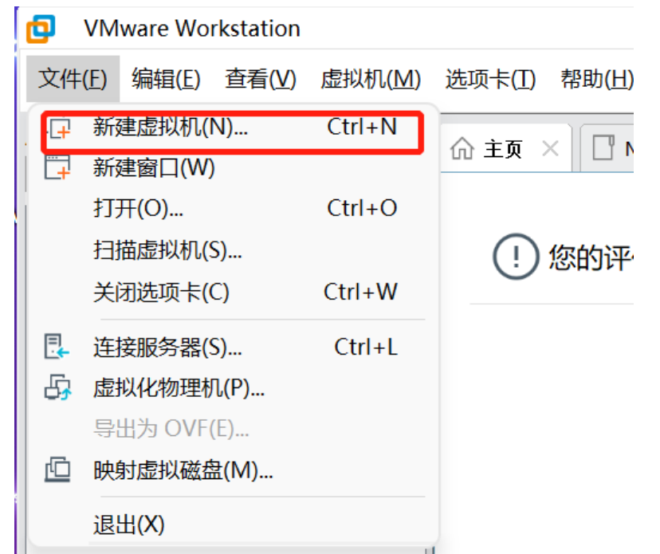

#### 2 选择典型

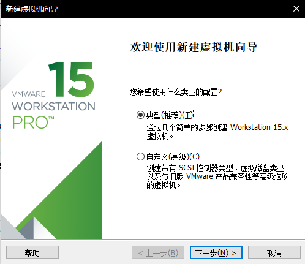

#### 3 选择CentOS镜像

我们在这次学习时使用mini版操作系统镜像，安装速度快，也去除了我们用不到的软件。

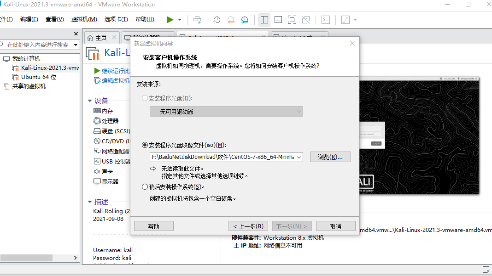

#### 4 存储位置

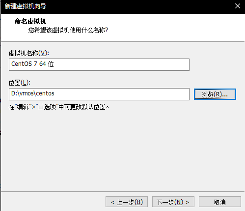

#### 5 虚拟机磁盘配置

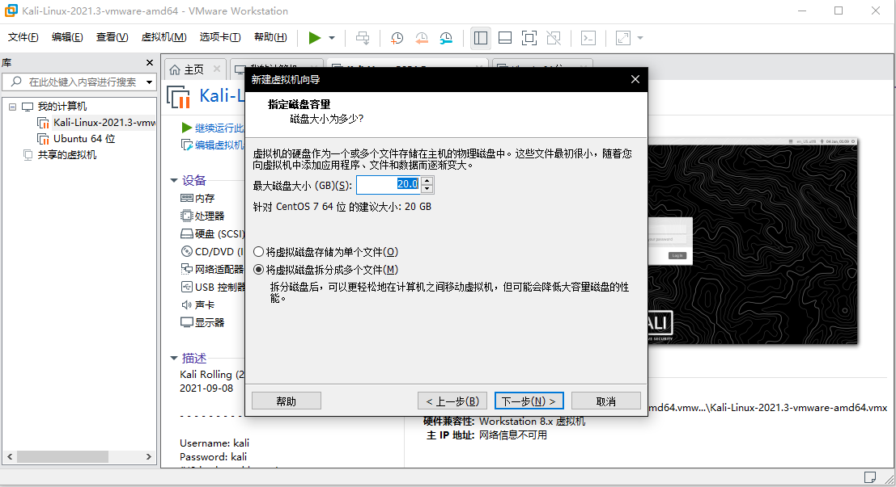

#### 6 自定义其他配置

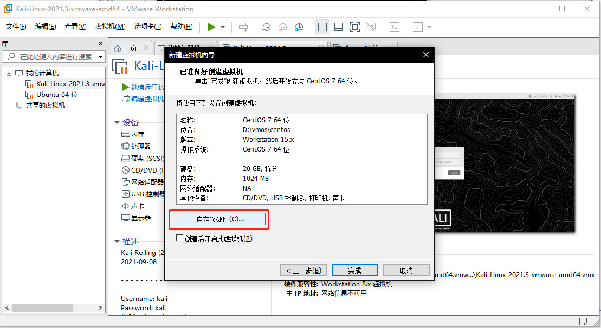

在自定义硬件中，我们可以再次配置虚拟机的内存、cpu等硬件属性：

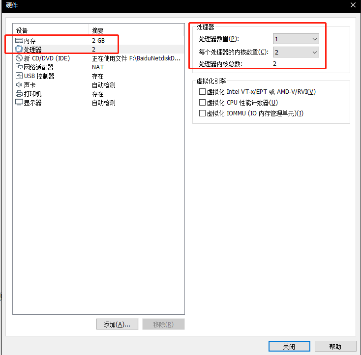

### 电脑配置

内存：建议8G以上

CPU：4核以上主流即可  

### 系统安装

#### 1 虚拟机配置完成之后进入系统安装界面

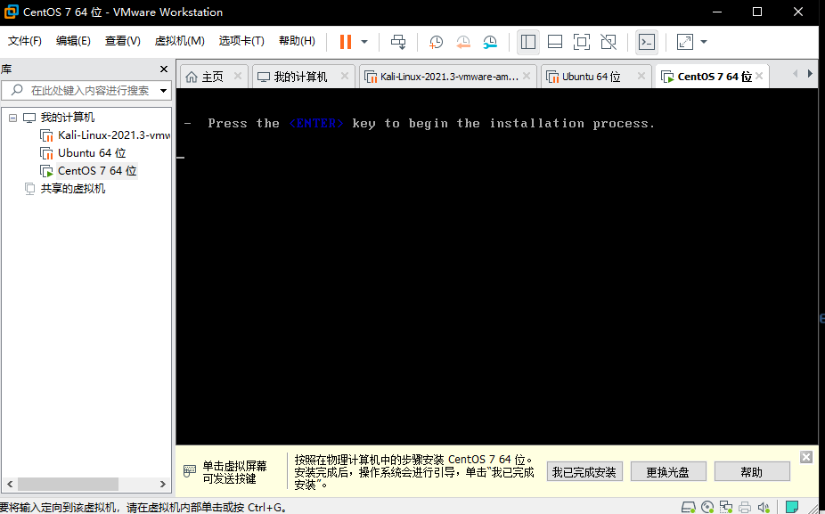

出现此界面后敲“回车”进入安装程序  

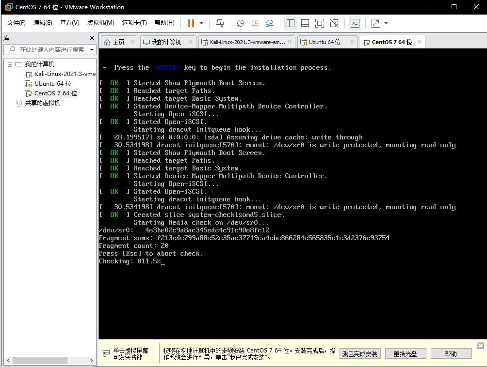

#### 2 选择安装语言

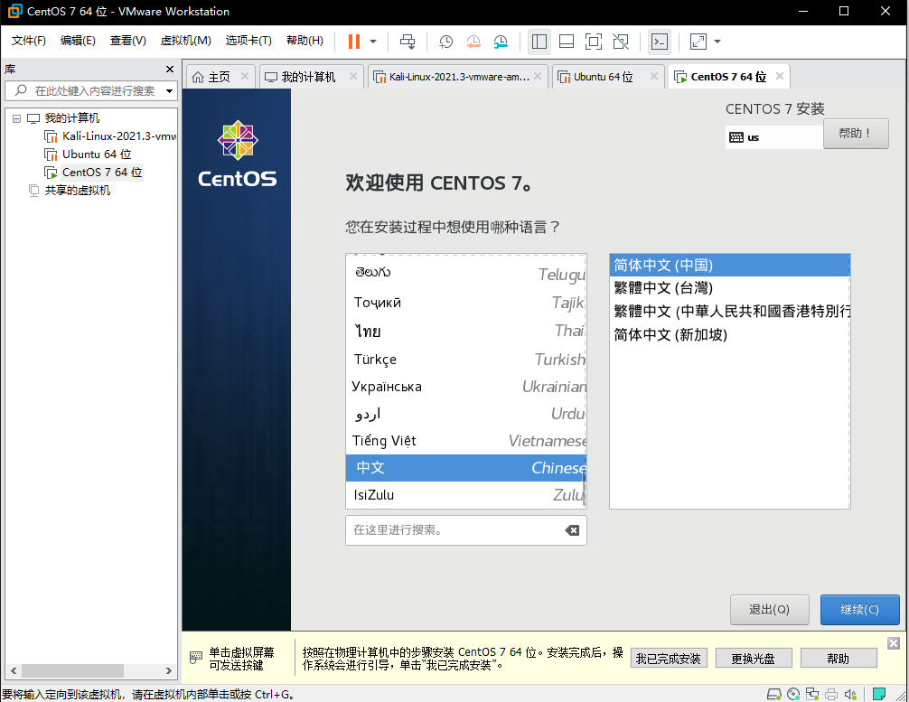

#### 3 分区选择

虽然默认会自动帮我们格式化磁盘，但也需要点击确认一下。

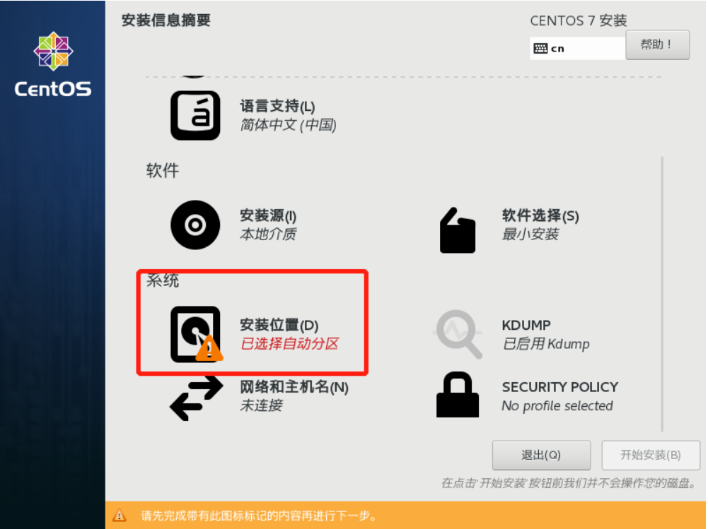

点击左上角完成即可  

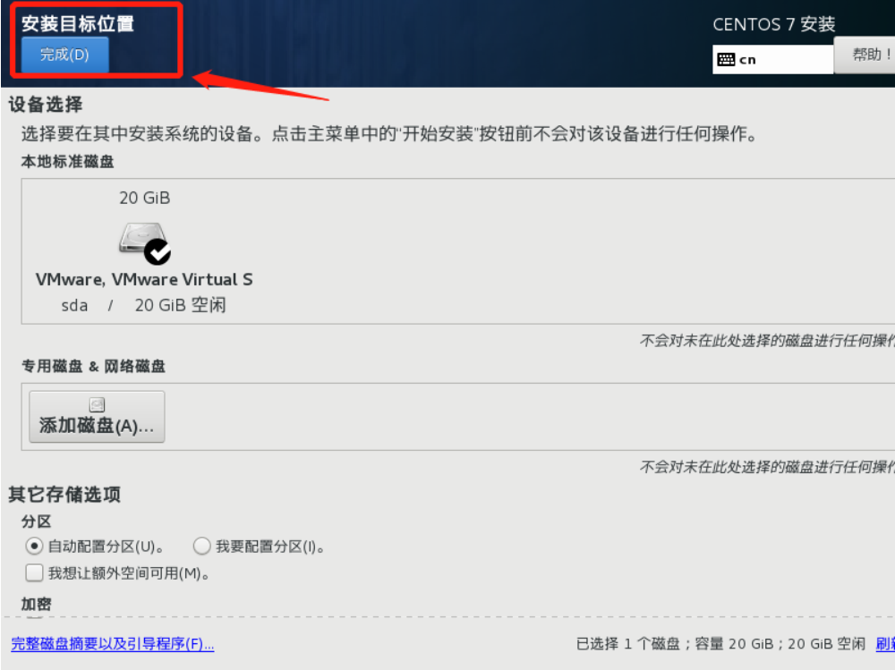

#### 4 开始安装

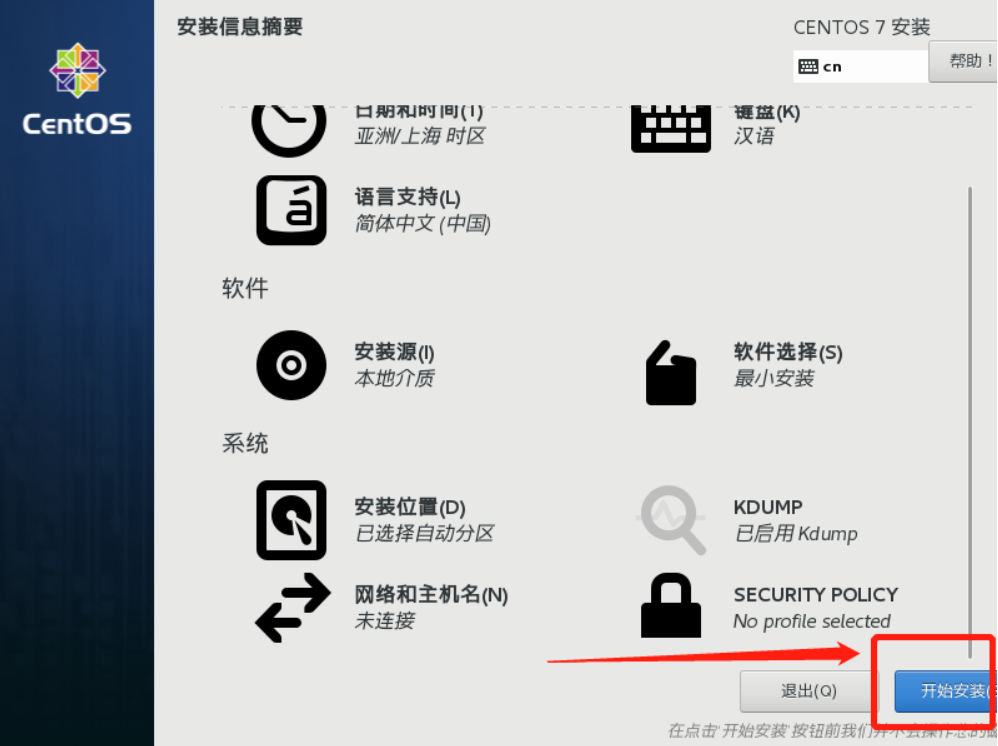

安装过程中我们可以设置密码

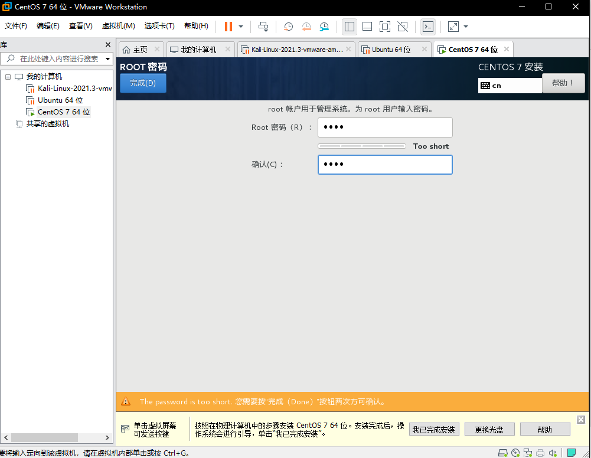

#### 5 安装完成

当出现 重启 按钮时，说明系统已经安装完成

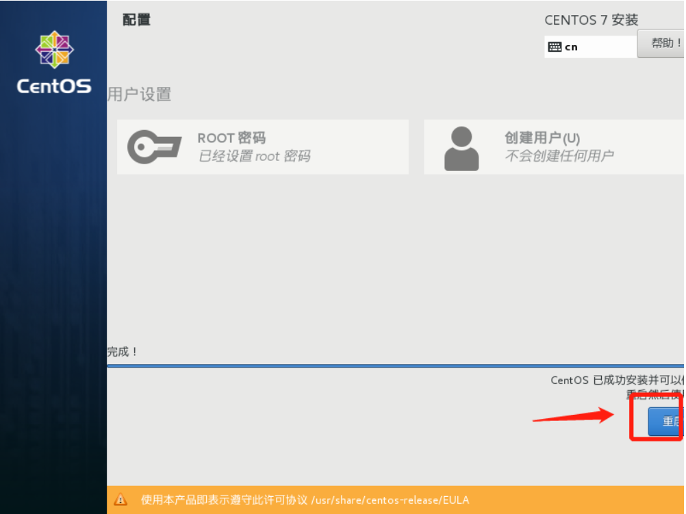

重启后的样子


至此，我们在VMware中对CentOS的基本安装已经完成。

### Linux配置

#### 配置上网

+ 修改配置网卡配置文件  

vi /etc/sysconfig/network-scripts/ifcfg-ens33

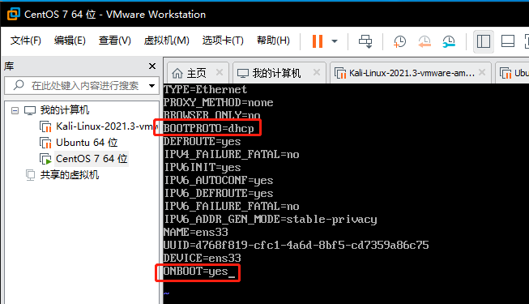

+ 修改ONBOOT=yes

+ 重启网络服务

systemctl restart network

+ 测试

  ping qq.com

  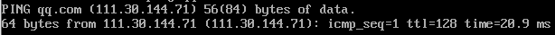

  至此，我们的虚拟机就可以访问互联网了。


#### 配置静态ip

查看本地ip:

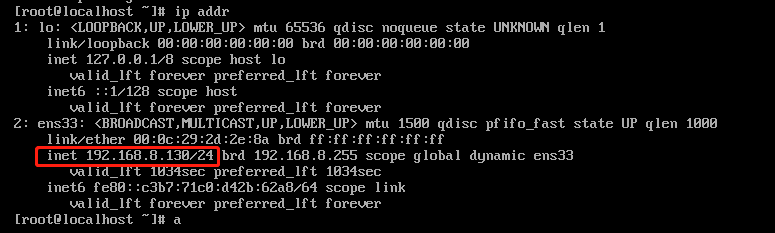

之前的网络配置是使用dhcp方式分配ip地址，这种方式会在系统每次联网的时候分配一个ip给我们用，也就是说有可能系统下次启动的时候ip会变，这样非常不方便我们管理。

网段和网关可以通过以下方式查看：

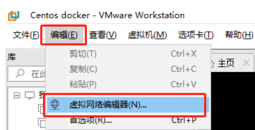

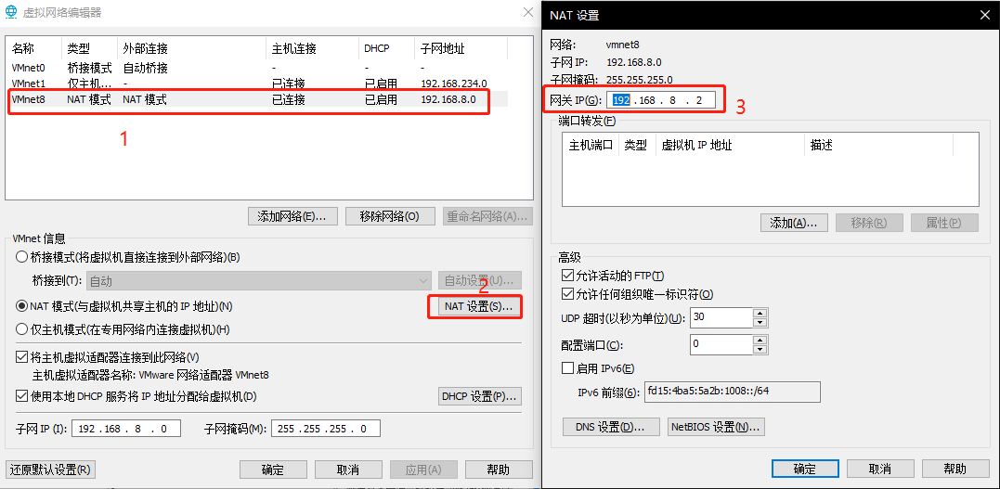

配置静态ip首先需要打开网卡配置文件

```bash
vi /etc/sysconfig/network-scripts/ifcfg-ens33
```

+ 修改启动协议 BOOTPROTO=static
+ 手动配置ip地址  

```properties
TYPE=Ethernet
PROXY_METHOD=none
BROWSER_ONLY=no
BOOTPROTO=static
DEFROUTE=yes
IPV4_FAILURE_FATAL=no
IPV6INIT=yes
IPV6_AUTOCONF=yes
IPV6_DEFROUTE=yes
IPV6_FAILURE_FATAL=no
IPV6_ADDR_GEN_MODE=stable-privacy
NAME=ens33
UUID=d768f819-cfc1-4a6d-8bf5-cd7359a86c75
DEVICE=ens33
ONBOOT=yes
# IP地址 （根据自己的环境修改）
IPADDR=192.168.8.101
# 子网掩码
NETMASK=255.255.255.0
# 网关（根据自己的环境修改）
GATEWAY=192.168.8.2
#DNS
DNS1=223.5.5.5
```

完整配置截图如下：

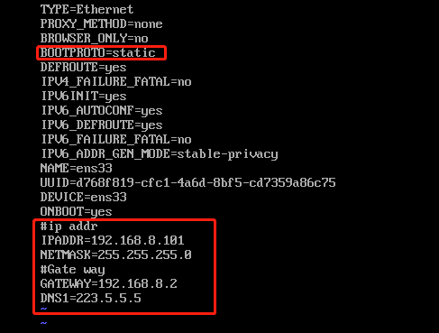

环境不同，ip地址可能不同，所以需要安装自己的ip网段和网关地址进行配置。

+ 接下来重启网络服务

systemctl restart network

查看ip地址，发现ip地址已经变成固定ip 192.168.8.101：

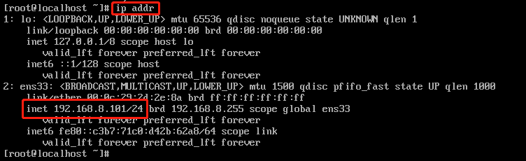

#### 不能上网的错误排查

•vmware中网关是否正确

•直接ping ip是否能通（物理连接排查）

•卸载重装

#### 一些公网DNS服务器

```cmd
#阿里
223.5.5.5
223.6.6.6
#腾讯
119.29.29.29
182.254.118.118
#百度
180.76.76.76
#114 DNS
114.114.114.114
114.114.115.115
#谷歌
8.8.8.8
8.8.4.4
```

### Centos7 防火墙的关闭与开启

CentOS 7.0默认使用的是firewall作为防火墙

查看防火墙状态

```
firewall-cmd --state
```

停止firewall

```
systemctl stop firewalld.service
```

禁止firewall开机启动

```
systemctl disable firewalld.service
```

放行端口

```bash
firewall-cmd --zone=public --add-port=80/tcp --permanent
```

重启防火墙

```bash
firewall-cmd --reload
```

开启防火墙

```bash
systemctl start firewalld
```

开启101的防火墙

```bash
systemctl start firewalld
```

重载规则

```bash
firewall-cmd --reload
```

查看已配置规则

```bash
firewall-cmd --list-all
```

添加指定端口和ip访问(添加之后记得重新启动防火墙)

```bash
firewall-cmd --permanent --add-rich-rule="rule family="ipv4" source address="192.168.8.102" port protocol="tcp" port="8080" accept"
```

移除规则

```bash
firewall-cmd --permanent --remove-rich-rule="rule family="ipv4" source address="192.168.8.102" port protocol="tcp" port="8080" accept"
```

## 宝塔Linux面板安装教程

参考：[https://www.bt.cn/bbs/thread-19376-1-1.html](https://www.bt.cn/bbs/thread-19376-1-1.html)

安装命令：

```bash
yum install -y wget && wget -O install.sh http://download.bt.cn/install/install_6.0.sh && sh install.sh
```

安装成功的截图如下：

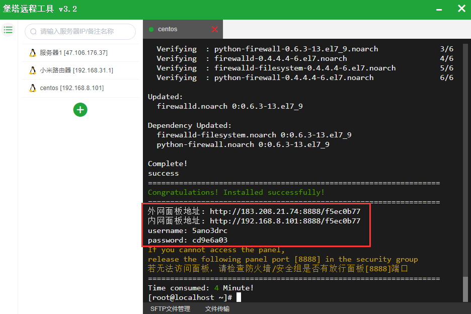

一定要保管好链接和用户名、密码。

```bash
外网面板地址: http://183.208.21.74:8888/f5ec0b77
内网面板地址: http://192.168.8.101:8888/f5ec0b77
username: 5ano3drc
password: cd9e6a03
```

安装好进行访问：

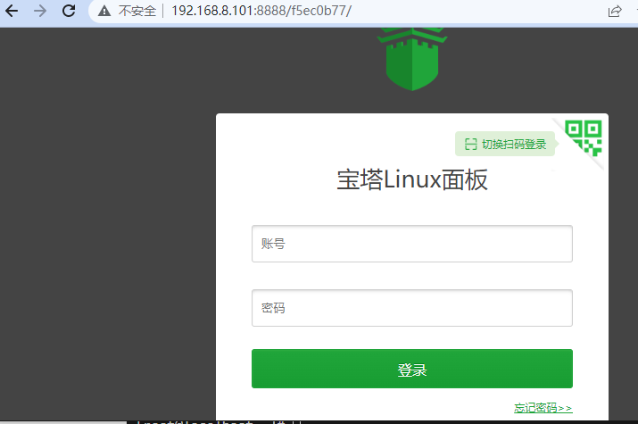

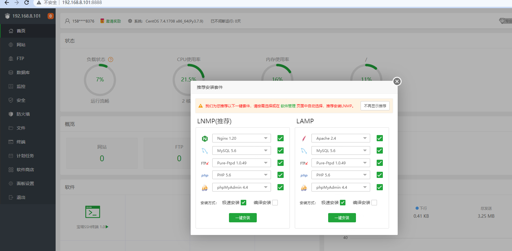

面板卸载：

```bash
/etc/init.d/bt stop && chkconfig --del bt && rm -f /etc/init.d/bt && rm -rf /www/server/panel
```


## Nginx的安装

版本区别

常用版本分为四大阵营

+ Nginx开源版

http://nginx.org/

+ Nginx plus 商业版

https://www.nginx.com

+ openresty

http://openresty.org/cn/

+ Tengine

http://tengine.taobao.org

Nginx的安装可以选择源码编译的方式也可以使用宝塔面板安装，本文采用的是源码编译安装。

### 使用源码编译安装


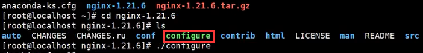

```bash
tar zxvf nginx-1.21.6.tar.gz
cd nginx-1.21.6
./configure --prefix=/usr/local/nginx  # --prefix=/usr/local/nginx 指安装路径是/usr/local/nginx，如果前面安装了宝塔Linux面板，这一步应该不会出现环境问题。

make
make install
```

#### 如果出现警告或报错

提示：

```bash
checking for OS
+ Linux 3.10.0-693.el7.x86_64 x86_64
checking for C compiler ... not found
./configure: error: C compiler cc is not found
```

安装gcc

```bash
yum install -y gcc
```

提示：

```bash
/configure: error: the HTTP rewrite module requires the PCRE library.
You can either disable the module by using --without-http_rewrite_module
option, or install the PCRE library into the system, or build the PCRE library
statically from the source with nginx by using --with-pcre=<path> option.
```

安装perl库

```bash
yum install -y pcre pcre-devel
```

提示：

```bash
./configure: error: the HTTP gzip module requires the zlib library.
You can either disable the module by using --without-http_gzip_module
option, or install the zlib library into the system, or build the zlib library
statically from the source with nginx by using --with-zlib=<path> option.
```

安装zlib库:

```bash
yum install -y zlib zlib-devel
```

接下来执行

```bash
make
make install
```

启动nginx

进入安装好的目录 /usr/local/nginx/sbin

```bash
./nginx					    # 启动
./nginx -s stop			 	#快速停止
./nginx -s quit 			#优雅关闭，在退出前完成已经接受的连接请求
./nginx -s reload 			#重新加载配置
```

安装成功的截图如下：


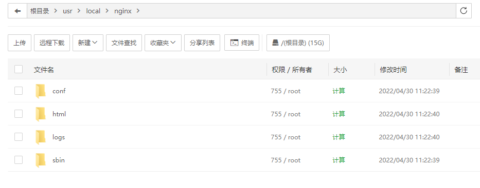

#### 安装成系统服务

在如下位置创建服务脚本nginx.service

```bash
vi /usr/lib/systemd/system/nginx.service
```

服务脚本内容如下(注意路径要对应，这里的路径是/usr/local/nginx/sbin)：

```bash
[Unit]
Description=nginx - web server
After=network.target remote-fs.target nss-lookup.target

[Service]
Type=forking
PIDFile=/usr/local/nginx/logs/nginx.pid
ExecStartPre=/usr/local/nginx/sbin/nginx -t -c /usr/local/nginx/conf/nginx.conf
ExecStart=/usr/local/nginx/sbin/nginx -c /usr/local/nginx/conf/nginx.conf
ExecReload=/usr/local/nginx/sbin/nginx -s reload
ExecStop=/usr/local/nginx/sbin/nginx -s stop
ExecQuit=/usr/local/nginx/sbin/nginx -s quit
PrivateTmp=true

[Install]
WantedBy=multi-user.target
```

重新加载系统服务

```bash
systemctl daemon-reload
```

启动服务

```bash
systemctl start nginx.service
```

开机启动

```bash
systemctl enable nginx.service
```

测试，访问http://192.168.8.101/：

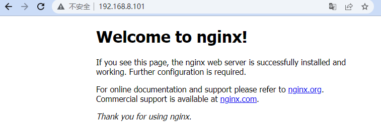

修改102的nginx.cfg

```bash

worker_processes  1;


events {
    worker_connections  1024;
}


http {
    include       mime.types;
    default_type  application/octet-stream;

    sendfile        on;
    keepalive_timeout  65;


    server {
        listen       80;
        server_name  localhost;


        location / {
            proxy_pass http://192.168.8.101:8080;
        }
        
        location /images {
            root   /www/resources;
            index  index.html index.htm;
        }
        #路径为root+/images 

        error_page   500 502 503 504  /50x.html;
        location = /50x.html {
            root   html;
        }

    }


}

```

将images文件夹放入如下位置：

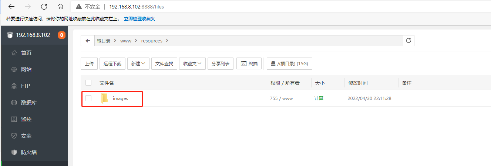

访问http://192.168.8.102/：


### 使用宝塔面板安装

宝塔面板安装的版本不是nginx的开源版本，作为学习，建议使用源码编译安装，熟练了再使用宝塔版的nginx。

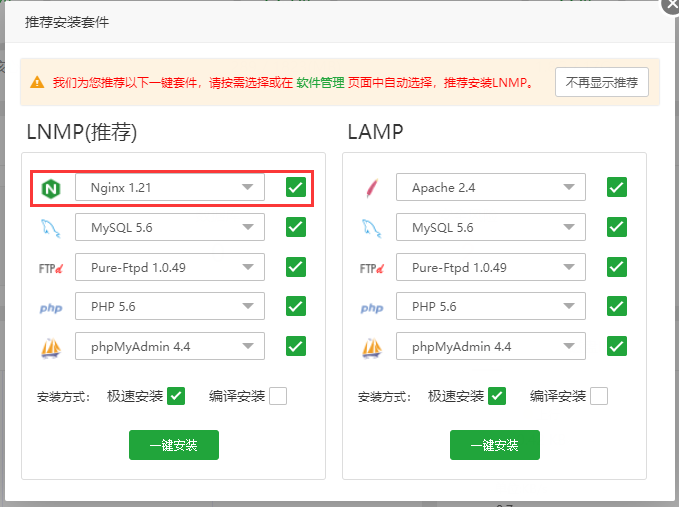

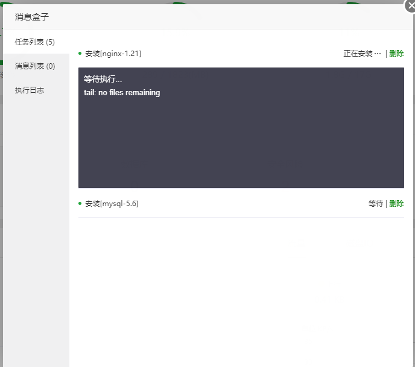


## 参考文档

Nginx参考文档：https://www.w3cschool.cn/nginx/nginx-d1aw28wa.html

