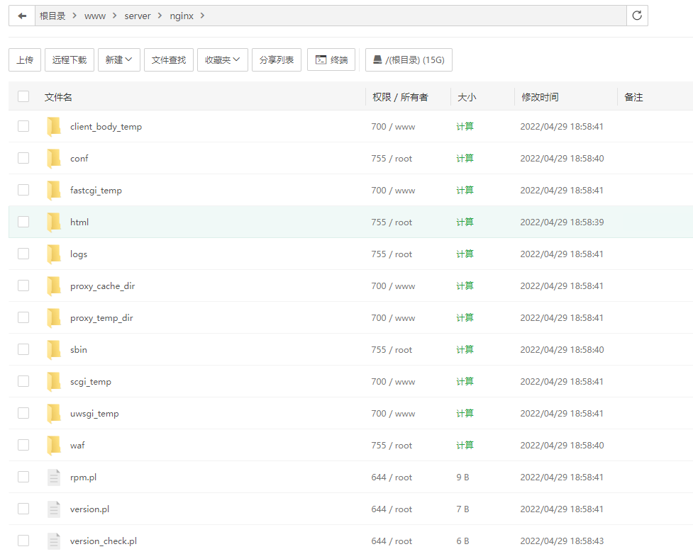
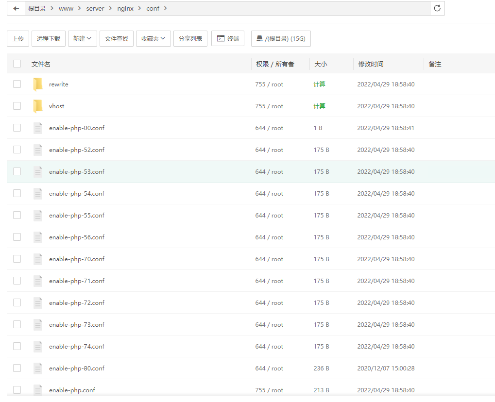

## Nginx目录结构



```bash
[root@localhost ~]# tree /usr/local/nginx
/usr/local/nginx
├── client_body_temp                 # POST 大文件暂存目录
├── conf                             # Nginx所有配置文件的目录
│   ├── fastcgi.conf                 # fastcgi相关参数的配置文件
│   ├── fastcgi.conf.default         # fastcgi.conf的原始备份文件
│   ├── fastcgi_params               # fastcgi的参数文件
│   ├── fastcgi_params.default       
│   ├── koi-utf
│   ├── koi-win
│   ├── mime.types                   # 媒体类型
│   ├── mime.types.default
│   ├── nginx.conf                   #这是Nginx默认的主配置文件，日常使用和修改的文件
│   ├── nginx.conf.default
│   ├── scgi_params                  # scgi相关参数文件
│   ├── scgi_params.default  
│   ├── uwsgi_params                 # uwsgi相关参数文件
│   ├── uwsgi_params.default
│   └── win-utf
├── fastcgi_temp                     # fastcgi临时数据目录
├── html                             # Nginx默认站点目录
│   ├── 50x.html                     # 错误页面优雅替代显示文件，例如出现502错误时会调用此页面
│   └── index.html                   # 默认的首页文件
├── logs                             # Nginx日志目录
│   ├── access.log                   # 访问日志文件
│   ├── error.log                    # 错误日志文件
│   └── nginx.pid                    # pid文件，Nginx进程启动后，会把所有进程的ID号写到此文件
├── proxy_temp                       # 临时目录
├── sbin                             # Nginx 可执行文件目录
│   └── nginx                        # Nginx 二进制可执行程序
├── scgi_temp                        # 临时目录
└── uwsgi_temp                       # 临时目录
```


主要的目录是conf,html,及sbin。

+ conf目录放的是核心配置文件：



+ html目录放的是静态页面：


50x.html是发生错误展示的页面，index.html是默认的访问页面。可以在该目录下新建html，然后在浏览器中访问，例如在该目录下新建hello.html，内容是hello，然后访问：http://192.168.8.101/hello.html，结果如下：


+ logs文件夹用于存放日志信息：


error.log存放出错的信息，nginx.pid存放的是当前nginx的pid。

+ sbin存放的是可执行文件，可以用 ./nginx启动nginx：


## Nginx基本运行原理


Nginx的进程是使用经典的「Master-Worker」模型,Nginx在启动后，会有一个master进程和多个worker进程。master进程主要用来管理worker进程，包含：接收来自外界的信号，向各worker进程发送信号，监控worker进程的运行状态，当worker进程退出后(异常情况下)，会自动重新启动新的worker进程。worker进程主要处理基本的网络事件，多个worker进程之间是对等的，他们同等竞争来自客户端的请求，各进程互相之间是独立的。一个请求，只可能在一个worker进程中处理，一个worker进程，不可能处理其它进程的请求。worker进程的个数是可以设置的，一般会设置与机器cpu核数一致，这里面的原因与nginx的进程模型以及事件处理模型是分不开的。

## Nginx的基本配置文件

Nginx的默认配置文件是nginx.conf


刚安装好的nginx.conf如下：

```bash

#user  nobody;
worker_processes  1;

#error_log  logs/error.log;
#error_log  logs/error.log  notice;
#error_log  logs/error.log  info;

#pid        logs/nginx.pid;


events {
    worker_connections  1024;
}


http {
    include       mime.types;
    default_type  application/octet-stream;

    #log_format  main  '$remote_addr - $remote_user [$time_local] "$request" '
    #                  '$status $body_bytes_sent "$http_referer" '
    #                  '"$http_user_agent" "$http_x_forwarded_for"';

    #access_log  logs/access.log  main;

    sendfile        on;
    #tcp_nopush     on;

    #keepalive_timeout  0;
    keepalive_timeout  65;

    #gzip  on;

    server {
        listen       80;
        server_name  localhost;

        #charset koi8-r;

        #access_log  logs/host.access.log  main;

        location / {
            root   html;
            index  index.html index.htm;
        }

        #error_page  404              /404.html;

        # redirect server error pages to the static page /50x.html
        #
        error_page   500 502 503 504  /50x.html;
        location = /50x.html {
            root   html;
        }

        # proxy the PHP scripts to Apache listening on 127.0.0.1:80
        #
        #location ~ \.php$ {
        #    proxy_pass   http://127.0.0.1;
        #}

        # pass the PHP scripts to FastCGI server listening on 127.0.0.1:9000
        #
        #location ~ \.php$ {
        #    root           html;
        #    fastcgi_pass   127.0.0.1:9000;
        #    fastcgi_index  index.php;
        #    fastcgi_param  SCRIPT_FILENAME  /scripts$fastcgi_script_name;
        #    include        fastcgi_params;
        #}

        # deny access to .htaccess files, if Apache's document root
        # concurs with nginx's one
        #
        #location ~ /\.ht {
        #    deny  all;
        #}
    }


    # another virtual host using mix of IP-, name-, and port-based configuration
    #
    #server {
    #    listen       8000;
    #    listen       somename:8080;
    #    server_name  somename  alias  another.alias;

    #    location / {
    #        root   html;
    #        index  index.html index.htm;
    #    }
    #}


    # HTTPS server
    #
    #server {
    #    listen       443 ssl;
    #    server_name  localhost;

    #    ssl_certificate      cert.pem;
    #    ssl_certificate_key  cert.key;

    #    ssl_session_cache    shared:SSL:1m;
    #    ssl_session_timeout  5m;

    #    ssl_ciphers  HIGH:!aNULL:!MD5;
    #    ssl_prefer_server_ciphers  on;

    #    location / {
    #        root   html;
    #        index  index.html index.htm;
    #    }
    #}

}
```

去掉注释的简单版如下：

```bash

worker_processes  1; #允许进程数量，建议设置为cpu核心数或者auto自动检测，注意Windows服务器上虽然可以启动多个processes，但是实际只会用其中一个

events {
    #单个进程最大连接数（最大连接数=连接数*进程数）
    #根据硬件调整，和前面工作进程配合起来用，尽量大，但是别把cpu跑到100%就行。
    worker_connections  1024;
}


http {
    #文件扩展名与文件类型映射表(是conf目录下的一个文件)
    include       mime.types;
    #默认文件类型，如果mime.types预先定义的类型没匹配上，默认使用二进制流的方式传输
    default_type  application/octet-stream;

    #sendfile指令指定nginx是否调用sendfile 函数（zero copy 方式）来输出文件，对于普通应用，必须设为on。如果用来进行下载等应用磁盘IO重负载应用，可设置为off，以平衡磁盘与网络IO处理速度。
    sendfile        on;
    
     #长连接超时时间，单位是秒
    keepalive_timeout  65;

 #虚拟主机的配置
    server {
    #监听端口
        listen       80;
        #域名，可以有多个，用空格隔开
        server_name  localhost;

	#配置根目录以及默认页面
        location / {
            root   html;
            index  index.html index.htm;
        }

	#出错页面配置
        error_page   500 502 503 504  /50x.html;
        #/50x.html文件所在位置
        location = /50x.html {
            root   html;
        }
        
    }

}
```
