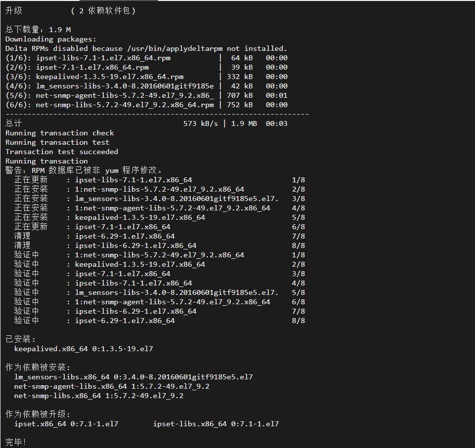
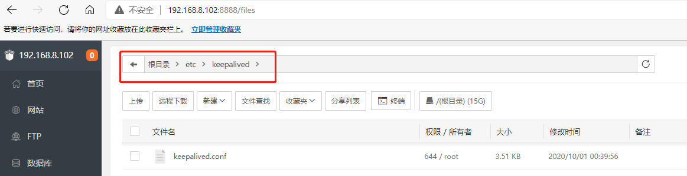
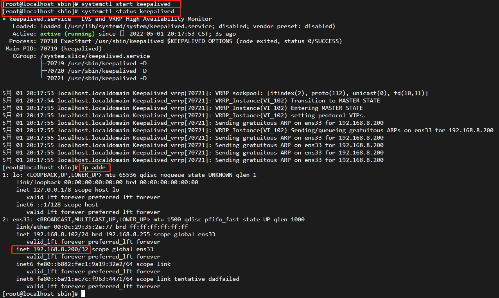
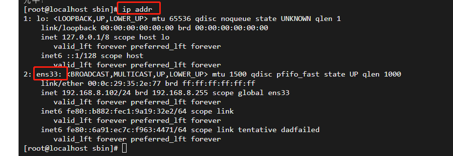
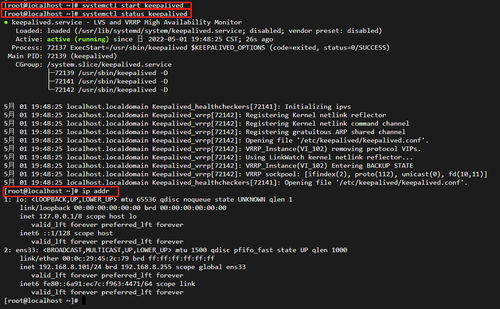
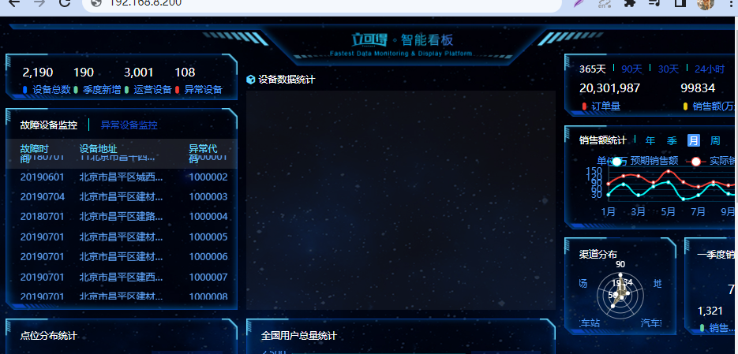

## 高可用配置

### 高可用场景及解决方案

　Keepalived软件起初是专为LVS负载均衡软件设计的，用来管理并监控LVS集群系统中各个服务节点的状态，后来又加入了可以实现高可用的VRRP功能。因此，Keepalived除了能够管理LVS软件外，还可以作为其他服务（例如：Nginx、Haproxy、MySQL等）的高可用解决方案软件。VRRP出现的目的就是为了解决静态路由单点故障问题的，它能够保证当个别节点宕机时，整个网络可以不间断地运行。所以，Keepalived 一方面具有配置管理LVS的功能，同时还具有对LVS下面节点进行健康检查的功能，另一方面也可实现系统网络服务的高可用功能。

keepalived官网[http://www.keepalived.org](http://www.keepalived.org/)

 keepalived服务的三个重要功能：

+ 管理LVS负载均衡软件
+ 实现LVS集群节点的健康检查中
+ 作为系统网络服务的高可用性（failover）

### 安装keepalived

centos安装命令：

```bash
 yum install -y keepalived
```

安装成功的截图如下：



### keepalived实战

keepalived的配置文件在如下位置：



在该实战中，101为主nginx，102为备用机，首先需要修改101和102的keepalived.conf配置

101的keepalived.conf配置

```bash
! Configuration File for keepalived

global_defs {
   router_id LB_102
}

vrrp_instance VI_102 {
    state MASTER
    interface ens33
    virtual_router_id 51
    priority 100
    advert_int 1
    authentication {
        auth_type PASS
        auth_pass 1111
    }
    virtual_ipaddress {
        192.168.8.200
    }
}

```

使用systemctl start keepalived启动keepalived,查看ip发现多了虚拟ip192.168.8.200:



interface ens33这里的ens33需要和以下位置对应:



102的keepalived.conf配置

```bash
! Configuration File for keepalived

global_defs {
   router_id LB_101
}

vrrp_instance VI_102 {
    state BACKUP
    interface ens33
    virtual_router_id 51
    priority 50
    advert_int 1
    authentication {
        auth_type PASS
        auth_pass 1111
    }
    virtual_ipaddress {
        192.168.8.200
    }
}

```

使用systemctl start keepalived启动keepalived



访问 162.168.8.200：



关闭102，再次访问192.168.8.200：


由于图片资源存放在102上，通过192.168.8.200访问到的主机是102，所以背景是空白，没有访问到静态资源，keepalived配置成功。