## 使用阿里云配置https

阿里云免费证书购买在如下位置：

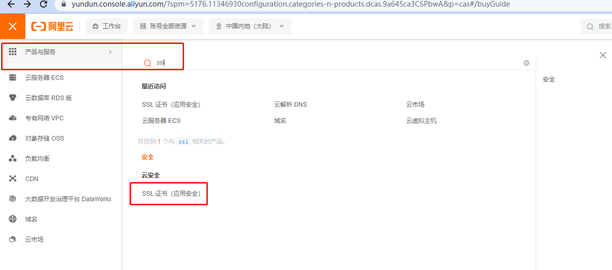


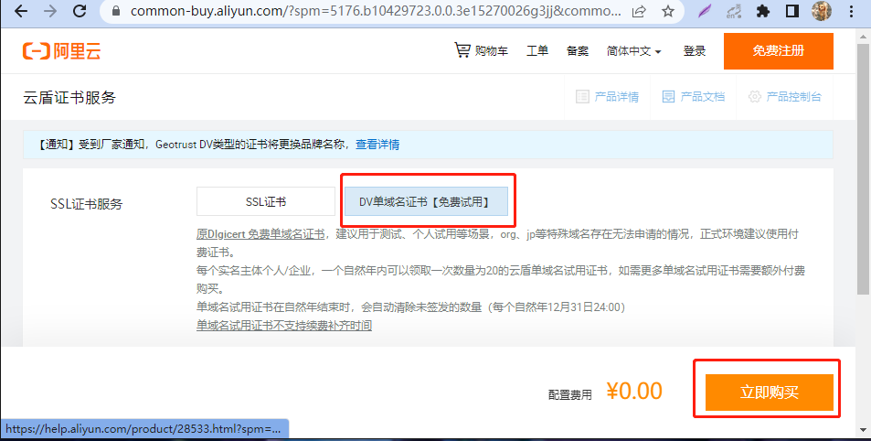

购买完成后在如下位置创建证书并申请证书：

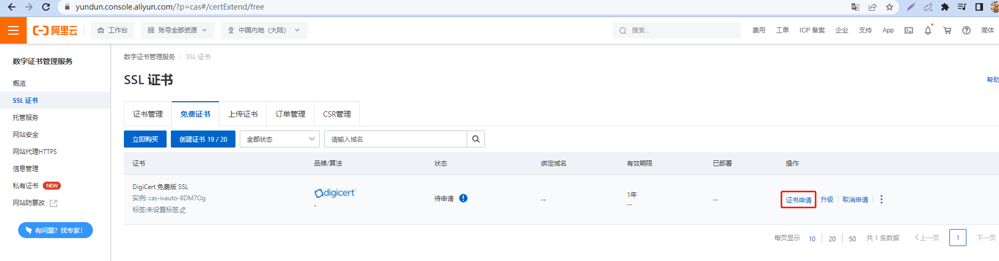

填写验证信息

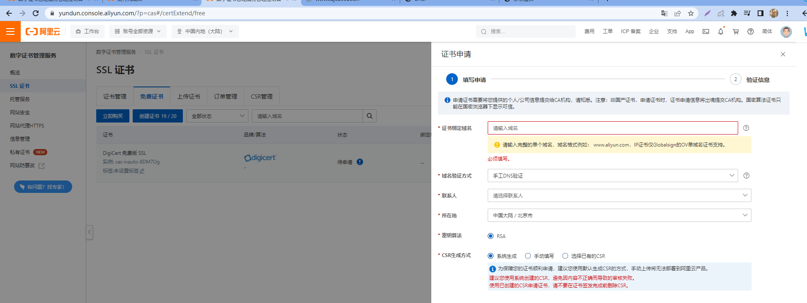

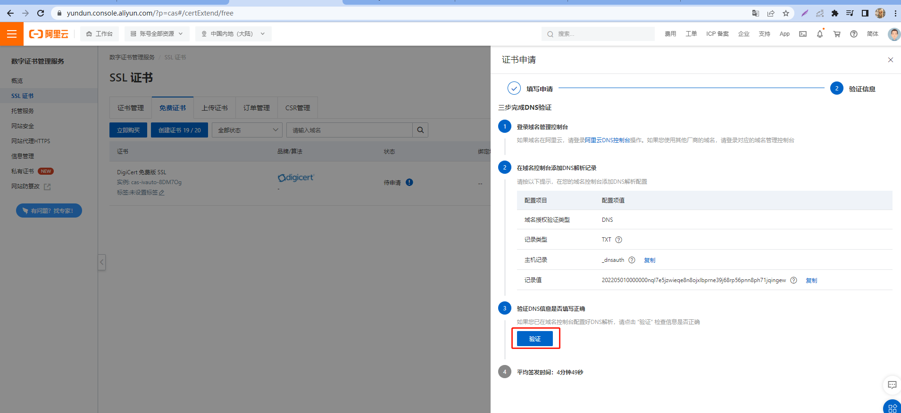

DNS对应的记录在如下页面：

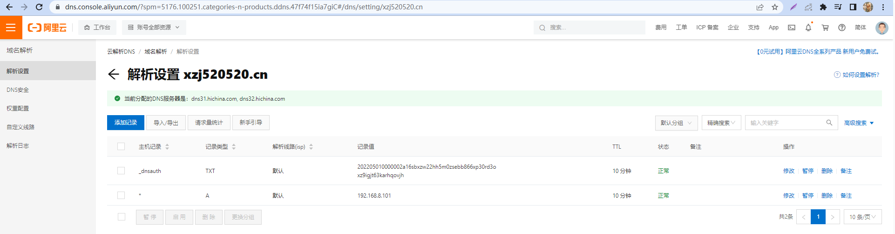

证书签发后，选择下载：

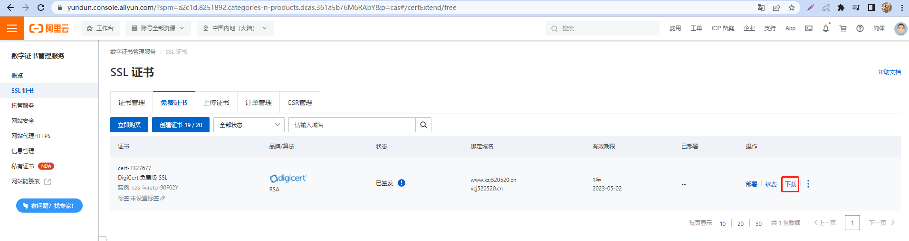

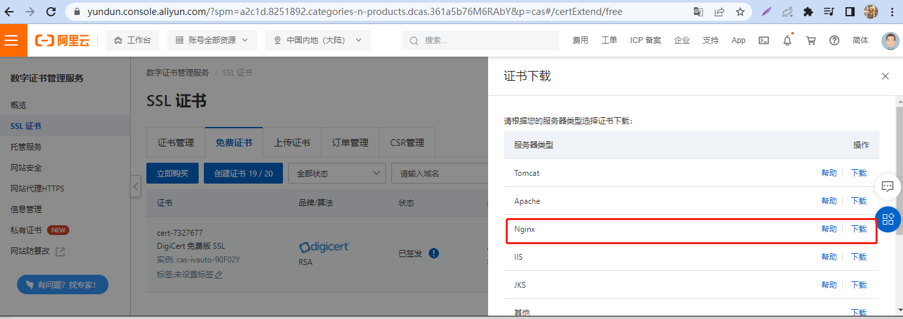

下载后的文件如图所示：

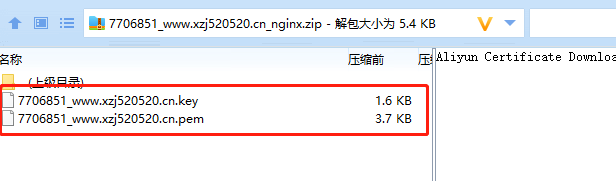

接下来需要将这两个文件上传到nginx目录下的conf目录下：

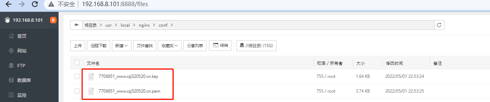

nginx配置证书：

```bash
server {
	listen 443 ssl;
	server_name localhost;  # 接收所有访问443端口的请求
	ssl_certificate 7706851_www.xzj520520.cn.pem;
	ssl_certificate_key 7706851_www.xzj520520.cn.key;
}
```

配置完之后，重启nginx:

```bash
systemctl restart nginx
```

由于http协议默认的端口是80，而https默认的端口是443，如果想让http的访问跳转到https的访问，可以做如下配置：

```bash
server {

	listen 80;
	server_name www.xzj520520.cn xzj520520.cn; # 换成自己的域名
	...

	return 301 https://$server_name$request_uri;	

}
```

至此，已经完成https的配置。

### 实战

配置nginx.cfg

```bash
user  www www;
worker_processes auto;
error_log  /www/wwwlogs/nginx_error.log  crit;
pid        /www/server/nginx/logs/nginx.pid;
worker_rlimit_nofile 51200;

events
    {
        use epoll;
        worker_connections 51200;
        multi_accept on;
    }

http
    {
        include       mime.types;

		include proxy.conf;

        default_type  application/octet-stream;

        server_names_hash_bucket_size 512;
        client_header_buffer_size 32k;
        large_client_header_buffers 4 32k;
        client_max_body_size 50m;

        sendfile   on;
        tcp_nopush on;

        keepalive_timeout 60;

        tcp_nodelay on;

        fastcgi_connect_timeout 300;
        fastcgi_send_timeout 300;
        fastcgi_read_timeout 300;
        fastcgi_buffer_size 64k;
        fastcgi_buffers 4 64k;
        fastcgi_busy_buffers_size 128k;
        fastcgi_temp_file_write_size 256k;
		fastcgi_intercept_errors on;

        gzip on;
        gzip_min_length  1k;
        gzip_buffers     4 16k;
        gzip_http_version 1.1;
        gzip_comp_level 2;
        gzip_types     text/plain application/javascript application/x-javascript text/javascript text/css application/xml;
        gzip_vary on;
        gzip_proxied   expired no-cache no-store private auth;
        gzip_disable   "MSIE [1-6]\.";

        limit_conn_zone $binary_remote_addr zone=perip:10m;
		limit_conn_zone $server_name zone=perserver:10m;

        server_tokens off;
        access_log off;

server {
	listen 443 ssl;
	server_name localhost;  
	ssl_certificate 7706851_www.xzj520520.cn.pem;
	ssl_certificate_key 7706851_www.xzj520520.cn.key;
	
	#配置根目录以及默认页面
        location / {
            root   html;
            index  index.html index.htm index.php;
        }

	#出错页面配置
        error_page   500 502 503 504  /50x.html;
        #/50x.html文件所在位置
        location = /50x.html {
            root   html;
        }
}

server {
	listen 80;
# 	server_name localhost www.xzj520520.cn xzj520520.cn; 
  server_name www.xzj520520.cn xzj520520.cn;

	# 重定向，会显示跳转的地址server_name,如果访问的地址没有匹配会默认使用第一个，即www.xzj520520.cn
	return 301 https://$server_name$request_uri;	
}

}
```

访问http://xzj520520.cn, 发现自动变成https访问：


访问https://a.xzj520520.cn,显示安全提示页面:

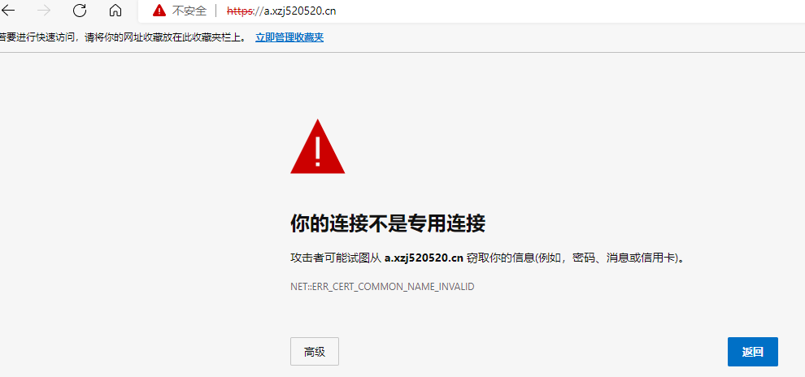

## 在线论坛配置实战

### 使用宝塔面板进行环境安装

本例采用宝塔版进行实战，相应环境如下：

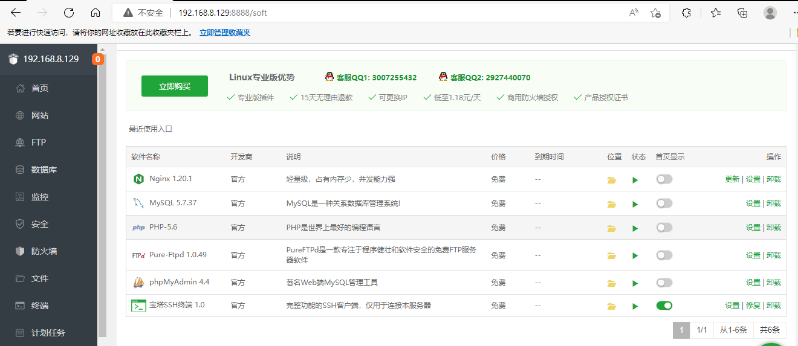

宝塔的nginx.cfg如下：

```bash
user  www www;
worker_processes auto;
error_log  /www/wwwlogs/nginx_error.log  crit;
pid        /www/server/nginx/logs/nginx.pid;
worker_rlimit_nofile 51200;

events
    {
        use epoll;
        worker_connections 51200;
        multi_accept on;
    }

http
    {
        include       mime.types;
		#include luawaf.conf;

		include proxy.conf;

        default_type  application/octet-stream;

        server_names_hash_bucket_size 512;
        client_header_buffer_size 32k;
        large_client_header_buffers 4 32k;
        client_max_body_size 50m;

        sendfile   on;
        tcp_nopush on;

        keepalive_timeout 60;

        tcp_nodelay on;

        fastcgi_connect_timeout 300;
        fastcgi_send_timeout 300;
        fastcgi_read_timeout 300;
        fastcgi_buffer_size 64k;
        fastcgi_buffers 4 64k;
        fastcgi_busy_buffers_size 128k;
        fastcgi_temp_file_write_size 256k;
		fastcgi_intercept_errors on;

        gzip on;
        gzip_min_length  1k;
        gzip_buffers     4 16k;
        gzip_http_version 1.1;
        gzip_comp_level 2;
        gzip_types     text/plain application/javascript application/x-javascript text/javascript text/css application/xml;
        gzip_vary on;
        gzip_proxied   expired no-cache no-store private auth;
        gzip_disable   "MSIE [1-6]\.";

        limit_conn_zone $binary_remote_addr zone=perip:10m;
		limit_conn_zone $server_name zone=perserver:10m;

        server_tokens off;
        access_log off;

server
    {
        listen 888;
        server_name phpmyadmin;
        index index.html index.htm index.php;
        root  /www/server/phpmyadmin;
            location ~ /tmp/ {
                return 403;
            }

        #error_page   404   /404.html;
        include enable-php.conf;

        location ~ .*\.(gif|jpg|jpeg|png|bmp|swf)$
        {
            expires      30d;
        }

        location ~ .*\.(js|css)?$
        {
            expires      12h;
        }

        location ~ /\.
        {
            deny all;
        }

        access_log  /www/wwwlogs/access.log;
    }
    include /www/server/panel/vhost/nginx/*.conf;
}
```

可以看到888端口监听的是php项目，将php项目上传至如下位置：

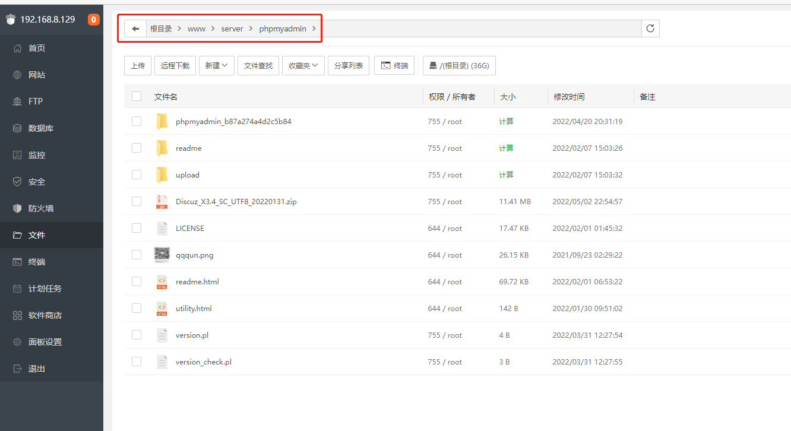

访问http://192.168.8.129:888/upload/install/：

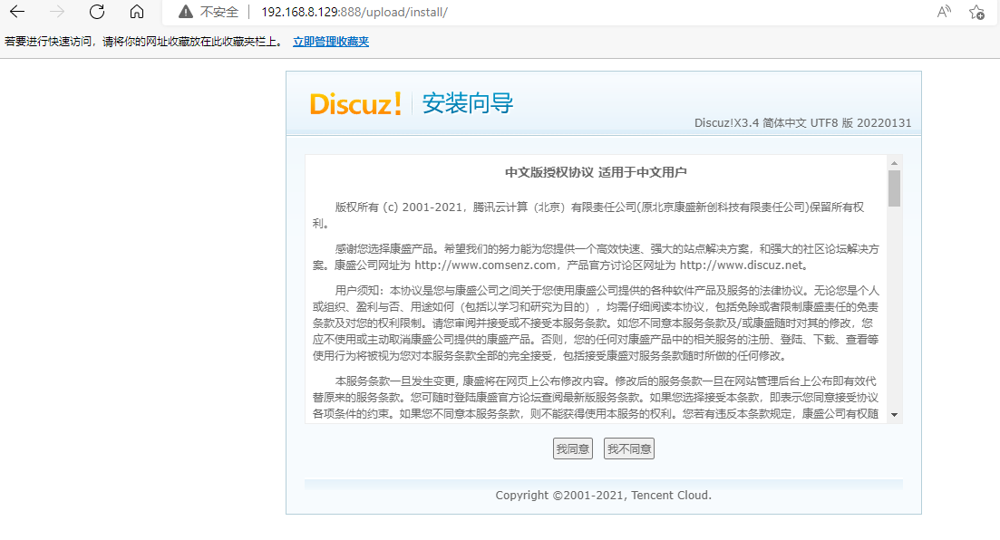

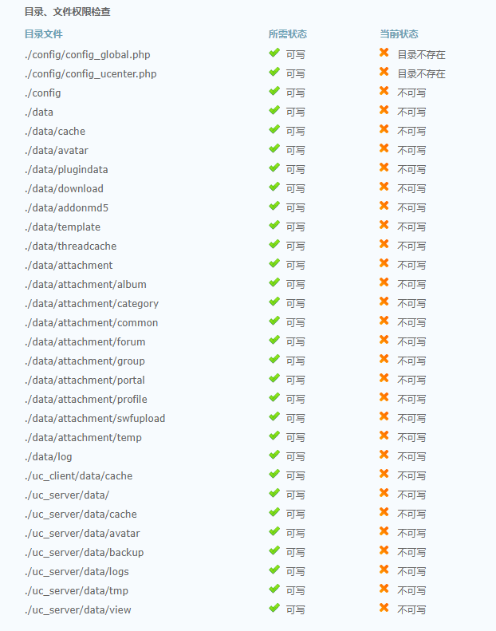

出现这种情况，由于是演示，所以将upload目录的权限改成可读可写，生产环境千万不能这么做。

```bash
chmod -R 777 upload/
```

刷新页面，出现如下页面：

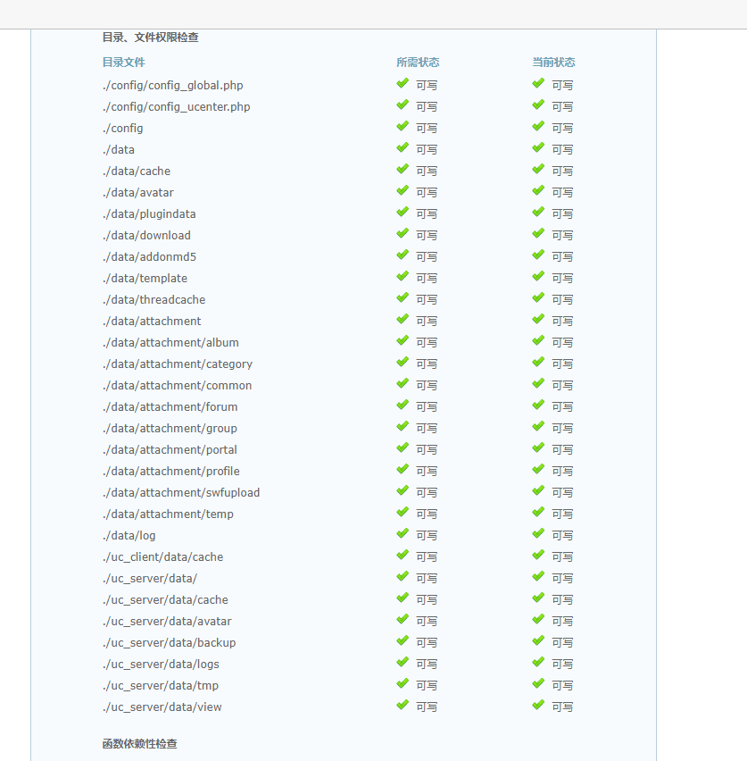

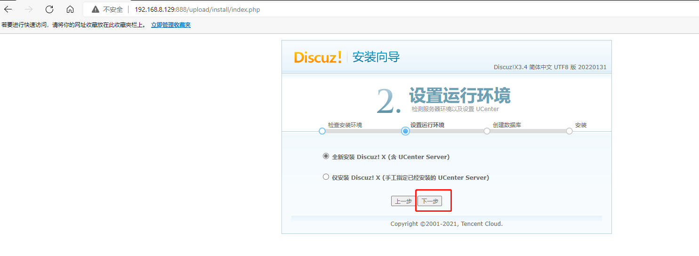

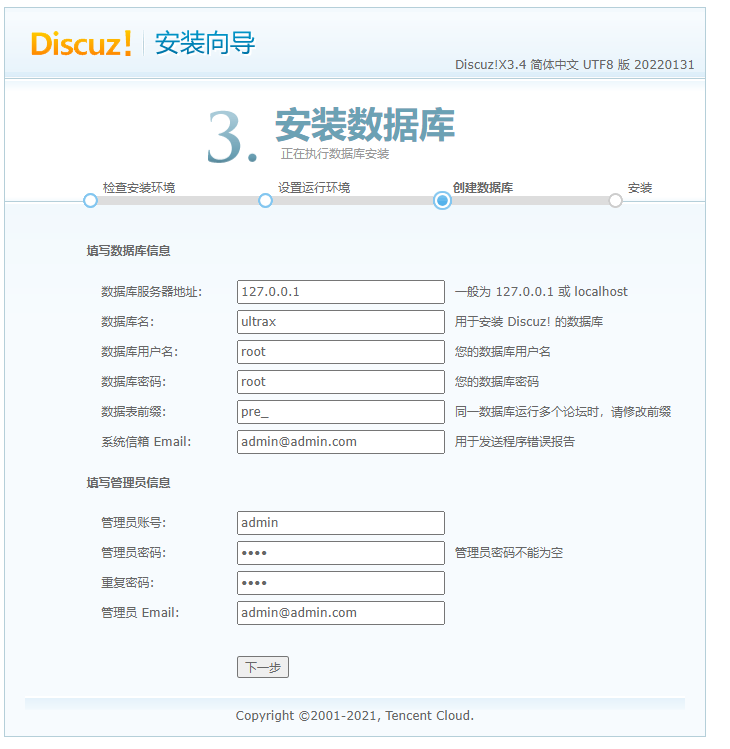

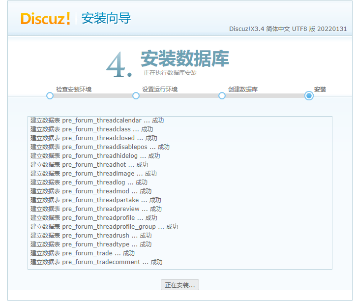


使用ip访问：

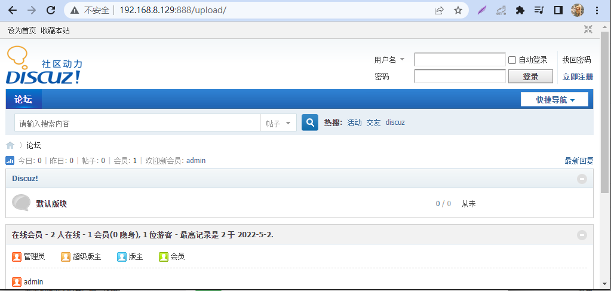

使用域名访问：

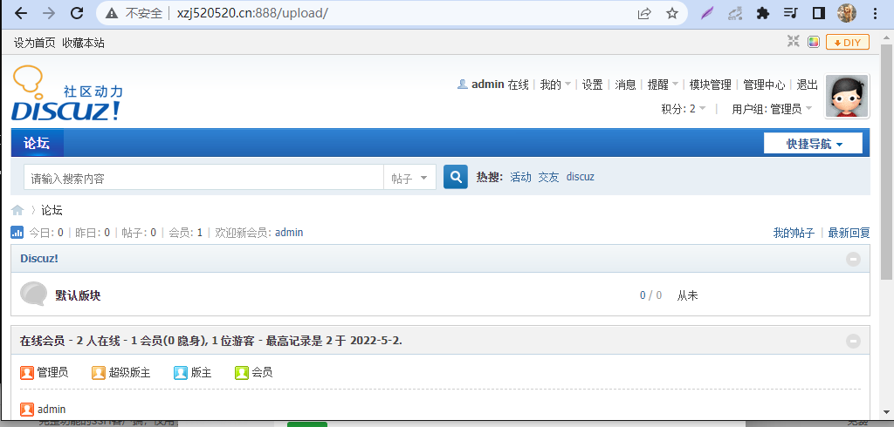

如果不想跳转，可以在443端口下直接配置php访问路径，详细nginx.conf如下:

```bash
user  www www;
worker_processes auto;
error_log  /www/wwwlogs/nginx_error.log  crit;
pid        /www/server/nginx/logs/nginx.pid;
worker_rlimit_nofile 51200;

events
    {
        use epoll;
        worker_connections 51200;
        multi_accept on;
    }

http
    {
        include       mime.types;
		#include luawaf.conf;

		include proxy.conf;

        default_type  application/octet-stream;

        server_names_hash_bucket_size 512;
        client_header_buffer_size 32k;
        large_client_header_buffers 4 32k;
        client_max_body_size 50m;

        sendfile   on;
        tcp_nopush on;

        keepalive_timeout 60;

        tcp_nodelay on;

        fastcgi_connect_timeout 300;
        fastcgi_send_timeout 300;
        fastcgi_read_timeout 300;
        fastcgi_buffer_size 64k;
        fastcgi_buffers 4 64k;
        fastcgi_busy_buffers_size 128k;
        fastcgi_temp_file_write_size 256k;
		fastcgi_intercept_errors on;

        gzip on;
        gzip_min_length  1k;
        gzip_buffers     4 16k;
        gzip_http_version 1.1;
        gzip_comp_level 2;
        gzip_types     text/plain application/javascript application/x-javascript text/javascript text/css application/xml;
        gzip_vary on;
        gzip_proxied   expired no-cache no-store private auth;
        gzip_disable   "MSIE [1-6]\.";

        limit_conn_zone $binary_remote_addr zone=perip:10m;
		limit_conn_zone $server_name zone=perserver:10m;

        server_tokens off;
        access_log off;

server {
	listen 443 ssl;
	server_name localhost;  
	ssl_certificate 7706851_www.xzj520520.cn.pem;
	ssl_certificate_key 7706851_www.xzj520520.cn.key;
	
	index index.html index.htm index.php;
        root  /www/server/phpmyadmin/upload;
            location ~ /tmp/ {
                return 403;
            }

        #error_page   404   /404.html;
        include enable-php.conf;

        location ~ .*\.(gif|jpg|jpeg|png|bmp|swf)$
        {
            expires      30d;
        }

        location ~ .*\.(js|css)?$
        {
            expires      12h;
        }

        location ~ /\.
        {
            deny all;
        }

        access_log  /www/wwwlogs/access.log;
}

server {
	listen 80;
	server_name www.xzj520520.cn xzj520520.cn; 

	return 301 https://$server_name$request_uri;	
}

server
    {
        listen 888;
        server_name phpmyadmin;
        index index.html index.htm index.php;
        root  /www/server/phpmyadmin;
            location ~ /tmp/ {
                return 403;
            }

        #error_page   404   /404.html;
        include enable-php.conf;

        location ~ .*\.(gif|jpg|jpeg|png|bmp|swf)$
        {
            expires      30d;
        }

        location ~ .*\.(js|css)?$
        {
            expires      12h;
        }

        location ~ /\.
        {
            deny all;
        }

        access_log  /www/wwwlogs/access.log;
    }
include /www/server/panel/vhost/nginx/*.conf;
}


```

访问:xzj520520.cn,结果如下：

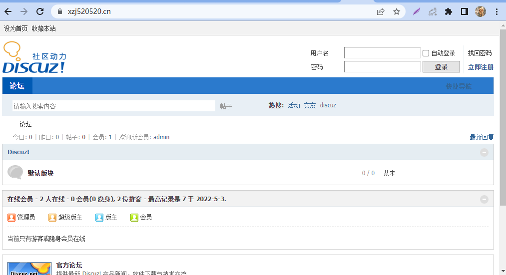

### 使用oneinstack对集成环境进行安装

这里也可以用oneinstack代替宝塔面板对集成环境（包括nginx，tomcat，phpadmin等）进行安装，操作如下：

网址:https://oneinstack.com/

选择自动安装:


选择要安装的软件，一个小tip：修改数据库密码，以防止安装好之后不知道数据库的密码是什么，选择好要按照的软件之后复制安装命令，进行安装:

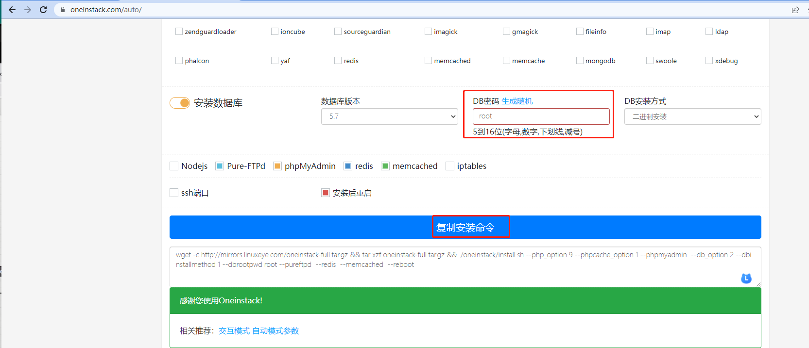


## nginx.cfg配置补充值return,proxy_pass以及rewrite比较

```bash

server {
	listen 80;
 	server_name www.xzj520520.cn xzj520520.cn; 
	
	#1. 重定向,如果值没有匹配则会默认使用第一个server_name,在这里为的值为 www.xzj520520.cn，例：
	 	 return 301 https://$server_name$request_uri;	
 	#      return 301 http://$server_name:888/upload$request_uri;	
	#配置根目录以及默认页面
        location / {
            # 2.使用proxy_pass 
            # 2.1 使用ip(因为这种方式不能传递uri，所以只能通过80访问server_name中存在的域名，否则会出错)（不常用）
            # proxy_pass http://192.168.8.129:888//upload;
            # 2.2 使用域名，这种方式可以传递uri
             proxy_pass https:///www.xzj520520.cn;
            #3.使用rewrite 这种方式可以对传递的参数进行隐藏，会在proxy_pass地址上添加rewrite的内容，如3.1的两行，如果访问xzj52052.cn/admin.php会访问到http://192.168.8.129:888/admin.php，可以传递uri
            # 3.1 使用ip
            # rewrite ^/[\D|\d]*$ /upload/$1 break;
            # proxy_pass http://192.168.8.129:888;
            # 3.2 使用域名
            # rewrite ^/[\D|\d]*$ /$1 break;
            # proxy_pass https://www.xzj520520.cn;
        }

	...
}
```

