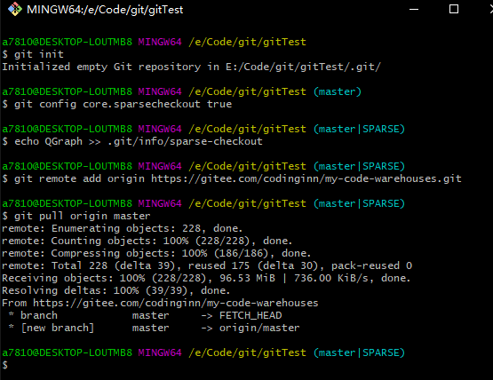
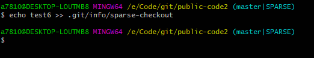
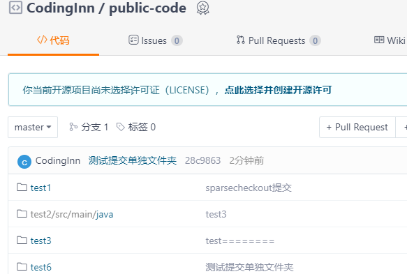

# public-note-storage

## 介绍
## 软件架构
## 克隆或下载仓库中某一个文件夹

```bash
1. 新建文件夹
2. git init
3. git config core.sparsecheckout true
4. echo 要下载的目录名 >> .git/info/sparse-checkout
5. git remote add 别名 远程地址
6. git pull 别名 当前分支名 
（如果使用tortoise，只需要在Git Bash中操作3、4两步,如果要下载多个目录，重复第4步,然后使用 git checkout master）
```

如下图所示,下载的是仓库中的QGraph目录：




## 在项目中上传单个文件夹

​	和2.4节类似, echo "要上传的文件夹" >> .git/info/sparse-checkout,然后提交即可。





## 使用说明

1.  xxxx
2.  xxxx
3.  xxxx

## 参与贡献

1.  Fork 本仓库
2.  新建 Feat_xxx 分支
3.  提交代码
4.  新建 Pull Request


## 特技

1.  使用 Readme\_XXX.md 来支持不同的语言，例如 Readme\_en.md, Readme\_zh.md
2.  Gitee 官方博客 [blog.gitee.com](https://blog.gitee.com)
3.  你可以 [https://gitee.com/explore](https://gitee.com/explore) 这个地址来了解 Gitee 上的优秀开源项目
4.  [GVP](https://gitee.com/gvp) 全称是 Gitee 最有价值开源项目，是综合评定出的优秀开源项目
5.  Gitee 官方提供的使用手册 [https://gitee.com/help](https://gitee.com/help)
6.  Gitee 封面人物是一档用来展示 Gitee 会员风采的栏目 [https://gitee.com/gitee-stars/](https://gitee.com/gitee-stars/)
