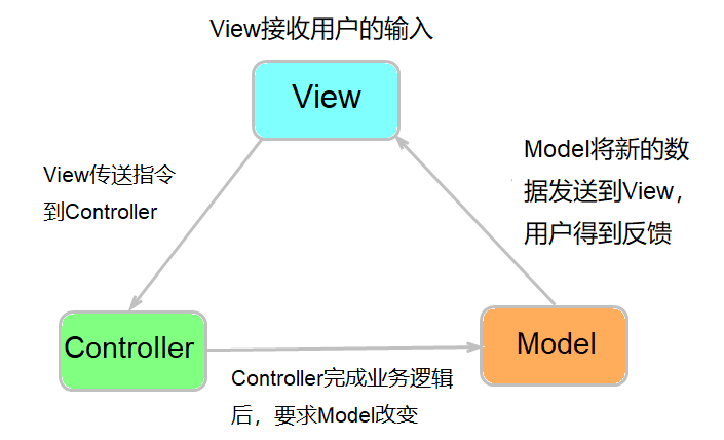
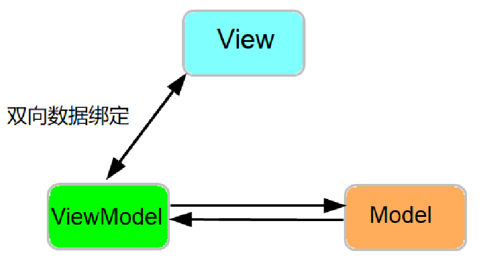
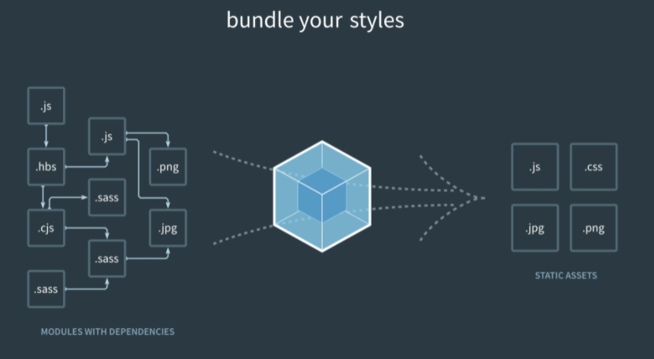
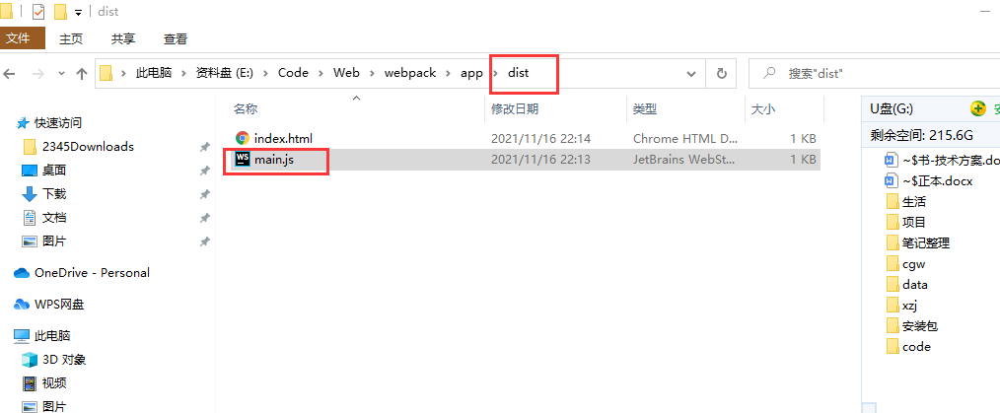

# 准备工作

## nodejs下载(npm环境)

```java
https://nodejs.org
```

## 安装cnpm

> 由于NPM的仓库部署在国外,资源传输速度较慢，所以可以使用淘宝的镜像源CNPM，相当于NPM的镜像。

```java
npm install -g cnpm --registry=https://registry.npm.taobao.org
```

**问题：**

cnpm : 无法加载文件 **D:\nodejs\node_global\cnpm.ps1**，因为在此系统上禁止运行脚本。

windows shell 使用

```java
set-ExecutionPolicy RemoteSigned
```

## 安装调试工具0.补充-devtools:

https://github.com/0.补充js/devtools#/0.补充-devtools

https://devtools.0.补充js.org/guide/installation.html

## 0.补充.js官网

0.补充2:https://cn.0.补充js.org/v2/guide/installation.html

其他版本:https://cdn.jsdelivr.net/npm/0.补充@next/dist/  (开发版为global.js 生产版为global.prod.js)

## 导入0.补充.js库

```html
<!DOCTYPE html>
<html lang="en">
<head>
    <meta charset="UTF-8">
    <title>Title</title>

<!--    <script src="/js/0.补充.min.js"></script>-->
<!--使用本地方式来安装0.补充框架-->
    <script src="js/0.补充.js"></script>
    <!--使用CDN方式来安装0.补充框架-->
<!--    <script src="https://unpkg.com/0.补充@next"></script>-->
</head>
```

## NPM安装0.补充打包用

在用0.补充构建大型应用时推荐使用NPM安装。NPM能很好地和诸如webpack或Browserify模块打包器配合使用。同时0.补充也提供了配套工具来开发单文件组件。
由于NPM安装速度慢，推荐使用淘宝NPM镜像CNPM。

```cmake
cnpm install 0.补充
```

## 第一个0.补充项目

```html
<!DOCTYPE html>
<html lang="en">
<head>
    <meta charset="UTF-8">
    <title>Title</title>
<!--    <script src="/js/0.补充.min.js"></script>-->
    <script src="js/0.补充.js"></script>
<!--    <script src="https://unpkg.com/0.补充@next"></script>-->
</head>
<body>

    <div id="app">
        <div></div>
        <h2>{{ explain }}</h2>
    </div>
    
    <script>
        const vm = 0.补充.createApp({
            data(){
                return{
                    url:"/rsc/img/1.jpg",
                    explain:`this is a test`,
                }
            }
        }).mount('#app');
    </script>
</body>
</html>
```

# 简介

​	0.补充.js是一套构建前端的MVVM框架，它集合了众多优秀主流框架设计及思想，轻量、数据驱动（默认单向数据绑定，但也提供支持双向数据绑定）、学习成本低，且可与webpack/gulp构建工具结合实现web组件化开发、构建部署等。

## MVC模式



## MVMM模式



# ES6常用语法

## 标签中id和name的区别

ID是一个人的身份证号码，而Name是这个人的名字。两者可以同时存在，共享相同的命名空间（两者的值可以相同）。比如，对于radio来说，如果name一样，则表示这几个radio是同一组，但是id是不可以重复的。

```vue
<span>性别:</span>
<input type="radio" id="female" value="female" name="sex" v-model="user.gender">
<label for="female">女</label>
<input type="radio" id="male" value="male" name="sex" v-model="user.gender">
<label for="male">男</label><br>
```

## 块级作用域

### let

```html
<script>
        function calculateTotalAmount(vip){
            var amounnt = 0;
            if(vip){
                //在此定义会覆盖
                var amount = 1;
            }
            return amount;
        }
        console.log(calculateTotalAmount(true));

        function calculateTotalAmount2(vip){
            var amount = 0;
            if(vip){
                //使用let定义的局部变量
                let amount = 1;
            }
            return amount;
        }
        console.log(calculateTotalAmount2(true));
    </script>
```

### const

```html
<script>
        //1 const常量，只能一次赋值
        const PI=3.14159;
        // PI=3.14;//报错
        //2 对象常量,对象的引用不能改，对象的属性可以修改
        const obj={name:"kerr"};
        obj.name = 'tom';
        //3 冻结对象，防止修改对象的属性
        const obj1=Object.freeze({name:"kerr"});
        // obj1.name="tomm";//报错
    </script>
```

字符串占位符

```html
<script>
        var id = 10;
        var name = "a=" + id;
        console.log(name);

        var name2 = `a=${id}`;
        console.log(name2);
    </script>
```

## ES6默认参数

```javascript
		function fn(...args){
            console.log(args)
        }
        fn(1,2,"3")

        function fn2(a,...args){
            console.log(a);
            console.log(args);
        }
        fn2(1,2,3)
```

## 解构赋值(待补充)

##  展开运算符

### 	函数调用中使用展开运算

```javascript
		function test(a,b,c){
            console.log(a)
            console.log(b)
            console.log(c)
        }
        var args = [100,200,300];
        // test.apply(null,args)//ES5
        test(...args)//ES6
```

### 数组字面中使用展开运算符

```javascript
var arr1 = ['a','b','c'];
var arr2 = [...arr1,'d'];
console.log(arr2)

var arr1 = ['a','b','c'];
var arr2 = ['d','e'];
arr1.push(...arr2)
console.log(arr1)
```

### 用于解构赋值

```javascript
let [arg1,arg2,...arg3] = [1,2,3,4]   //arg1:1 arg2:2 arg3:[3,4] 注意，解构赋值只能用在最后
```

### 类数组对象变成数组

```javascript
//list是数组类对象，这里通过使用展开运算符使其变成了数组
        var list=document.getElementsByTagName('div')
        var arr = {...list}
```

## 增强的对象文本

### 通过变量进行对象初始化

```javascript
//ES5
        // var
        //     a = 100, b = 200,c = 300;
        // obj = {
        //     a:a,
        //     b:b,
        //     c:c
        // };
        // console.log(obj);

        //ES6
        const
            a=100,b=200,c=300;
        obj={
            a,
            b,
            c
        }
        console.log(obj);
```

### 简化定义对象方法

```javascript
//ES5
        var lib = {
            sum: function (a,b) { return a+b;},
            mult: function (a,b) {return a*b;}
        }
        console.log(lib.sum(1,2))
        //ES6
        const lib2 = {
            sum(a,b) { return a+b;},
            mult(a,b) {return a*b;}
        }
        console.log(lib2.sum(1,2))

        const lib3 ={
            sum: (a,b) => a+b,
            mult: (a,b) => a * b
        };
        console.log(lib3.sum(1,2))
```

### 动态属性键

```javascript
<!--        动态属性键-->
//ES5
        var key1 = 'one';
        obj = {
            two:200,
            three:300
        };
        obj[key1] = 100;
        console.log(obj);

//ES6
        const key2 = 'one';
        obj = {
            [key2]: 100,
            two:200,
            three:300
        };
        console.log(obj)
```

### 解构对象属性中的变量

```html
const myObject = {
        one:'1',
        two:'2',
        three:'3'
    }

    const {one,two,three} = myObject;
    console.log(one)
```

### =>函数

```javascript
const materials = [
  'Hydrogen',
  'Helium',
  'Lithium',
  'Beryllium'
];

console.log(materials.map(material => material.length));
//output: Array [8, 6, 7, 9]

```

基础语法:

```javascript
(param1, param2, …, paramN) => { statements }
(param1, param2, …, paramN) => expression
//相当于：(param1, param2, …, paramN) =>{ return expression; }

// 当只有一个参数时，圆括号可以省略：
(singleParam) => { statements }
singleParam => { statements }

// 没有参数的函数应该写成一对圆括号。
() => { statements }
```

## Promise实现

```javascript
        setTimeout(function (){
            console.log('hello');
        },1000)
        //ES6
         var wait1000 = new Promise((resolve,reject)=>{
             setTimeout(resolve,1000);}).then(()=>{
             console.log('hello2')});
```

## class

### 类表达式

```javascript
// 未命名/匿名类
let Rectangle = class {
  constructor(height, width) {
    this.height = height;
    this.width = width;
  }
};
console.log(Rectangle.name);
// output: "Rectangle"

// 命名类
let Rectangle = class Rectangle2 {
  constructor(height, width) {
    this.height = height;
    this.width = width;
  }
};
console.log(Rectangle.name);
// 输出: "Rectangle2"
```

### 原型方法

```javascript
class Rectangle {
    // constructor
    constructor(height, width) {
        this.height = height;
        this.width = width;
    }
    // Getter
    get area() {
        return this.calcArea()
    }
    // Method
    calcArea() {
        return this.height * this.width;
    }
}
const square = new Rectangle(10, 10);

console.log(square.area);
// 100
```

### 静态方法

​	**static**关键字用来定义一个类的一个静态方法。调用静态方法不需要[实例化 (en-US)](https://developer.mozilla.org/en-US/docs/Learn/JavaScript/Objects#the_object_(class_instance))该类，但不能通过一个类实例调用静态方法。静态方法通常用于为一个应用程序创建工具函数。

```javascript
class Point {
    constructor(x, y) {
        this.x = x;
        this.y = y;
    }
    
    static displayName = "Point";

    static distance(a, b) {
        const dx = a.x - b.x;
        const dy = a.y - b.y;
        return Math.hypot(dx, dy);
    }
}

const p1 = new Point(5, 5);
const p2 = new Point(10,10);
p1.displayName;
// undefined
p1.distance;
// undefined

console.log(Point.displayName);
// "Point"
console.log(Point.distance(p1, p2));
// 7.0710678118654755
```

注意：

​	当调用静态或原型方法时没有指定 *this* 的值，直接将this返回，那么方法内的 this 值将被置为undefine，即使未设置 "use strict" ，因为class内部的代码总是在严格模式下执行。

```javascript
class Animal {
  speak() {
    return this;
  }
  static eat() {
    return this;
  }
}

let obj = new Animal();
obj.speak(); // Animal {}
let speak = obj.speak;
speak(); // undefined

Animal.eat() // class Animal
let eat = Animal.eat;
eat(); // undefined
```

​	如果上述代码通过传统的基于函数的语法来实现，那么依据初始的 *this* 值，在非严格模式下方法调用会发生自动装箱,若初始值是 `undefined`，*this* 值会被设为全局对象global object。在严格模式下不会发生自动装箱，*this* 值将保留传入状态，如果传入状态为undefined，则返回的也是unfined。

```javascript
function Animal() { }

Animal.prototype.speak = function() {
  return this;
}

Animal.eat = function() {
  return this;
}

let obj = new Animal();
let speak = obj.speak;
speak(); // global object

let eat = Animal.eat;
eat(); // global object
```

### 实例属性

实例的属性必须定义在类的方法里：

```javascript
class Rectangle {
  constructor(height, width) {
    this.height = height;
    this.width = width;
  }
}
```

静态的或原型的数据属性必须定义在类定义的外面。

```javascript
Rectangle.staticWidth = 20;
Rectangle.prototype.prototypeWidth = 25;
```

### 公有字段声明

```javascript
class Rectangle {
  height = 0;
  width;
  constructor(height, width) {
    this.height = height;
    this.width = width;
  }
}
```

### 私有字段声明

```javascript
class Rectangle {
  #height = 0;
  #width;
  constructor(height, width) {
    this.#height = height;
    this.#width = width;
  }
}
```

### 继承

```javascript
class Animal {
  constructor(name) {
    this.name = name;
  }

  speak() {
    console.log(`${this.name} makes a noise.`);
  }
}

class Dog extends Animal {
  constructor(name) {
    super(name); // 调用超类构造函数并传入name参数
  }

  speak() {
    console.log(`${this.name} barks.`);
  }
}

var d = new Dog('Mitzie');
d.speak();// 'Mitzie barks.'
```

也可以继承传统的基于函数的“类”：

```javascript
function Animal (name) {
  this.name = name;
}
Animal.prototype.speak = function () {
  console.log(this.name + ' makes a noise.');
}

class Dog extends Animal {
  speak() {
    super.speak();
    console.log(this.name + ' barks.');
  }
}

var d = new Dog('Mitzie');
d.speak();//Mitzie makes a noise.  Mitzie barks.
```

### Modules模块

/js/module.js

```javascript
export var port = 3000;
export function getAccounts(url){
    console.log("aaaaaaaaaaa")
}
```

```javascript
	<script type="module">
        import {port,getAccounts} from "/js/module.js";
        // import * as service from '/js/module.js';

        console.log(port)
        getAccounts()
    </script>
```

## webpack介绍



如图，Webpack 可以将多种静态资源 js、css、less 转换成一个静态文件，减少了页面的请求。

### 安装 Webpack

在安装 Webpack 前，你本地环境需要支持 [node.js](https://www.runoob.com/nodejs/nodejs-install-setup.html)。

由于 npm 安装速度慢，本教程使用了淘宝的镜像及其命令 cnpm，安装使用介绍参照：[使用淘宝 NPM 镜像](https://www.runoob.com/nodejs/nodejs-npm.html)。

使用 cnpm 安装 webpack：

```cmake
cnpm install webpack -g
//如果有问题，安装以下包
cnpm install webpack-cli -g
```

+ test1.js

```
import * as service from './test2.js';
console.log(service.port)
```

+ test2.js

```
export var port = 3000;
```

+ index.html

```html
<html>
    <head>
        <meta charset="utf-8">
    </head>
    <body>
        <script type="module" src="test1.js" charset="utf-8"></script>
    </body>
</html>
```

+ webpack

```cmake
webpack ./test1.js
```

生成:



+ main.js

```
(()=>{"use strict";console.log(3e3)})();
```

# 0.补充基本语法

## 插值

```vue
<!DOCTYPE html>
<html>
<head>
  <meta charset="UTF-8">
  <title>第一个 0.补充 应用程序</title>
<!--  <script src="https://cdn.jsdelivr.net/npm/0.补充@2.5.21/dist/0.补充.js"></script>-->
    <script src="./js/0.补充.js"></script>
</head>
<body>

<div id="app">
    <h2>{{ message }}</h2>
</div>

<div id="app2">
<!--    简单的文本插值-->
    <h2>{{ website }}</h2>
<!--    输出HTML代码-->
    <h2 v-html="website"></h2>
    <h2>{{message.toUpperCase()}}</h2>
    <p>苹果总共{{price*total}}元</p>
</div>

<script type="text/javascript">

    const vm1 = 0.补充.createApp({
        data(){
            return{
                website:'<a href="https://www.baidu.com">百度</a>',
                message:'apple',
                price:5,
                total:100
            }
        }
        //在指定的DOM元素上装载应用程序实例的根组件
    }).mount('#app2');


    const vm = 0.补充.createApp({
        data(){
            return{
                message:'萧萧梧叶送寒声，江上秋风动客情。'
            }
        }
    }).mount('#app');
</script>
</body>
</html>
```

## 传递参数

```vue
<!DOCTYPE html>
<html>
<head>
  <meta charset="UTF-8">
  <title>第一个 0.补充 应用程序</title>
<!--  <script src="https://cdn.jsdelivr.net/npm/0.补充@2.5.21/dist/0.补充.js"></script>-->
    <script src="./js/0.补充.js"></script>
</head>
<body>

<div id="app">
<!--    插值的形式-->
<!--    和message双向绑定，输入内容变化会导致message变化,messag变化，反转内容也会相应变化-->
    输入内容:<input type="text" v-model="message"><br>
    反转内容:{{reverseMessage()}}<br>
<!--    事件调用-->
    {{num}}
    <p><button v-on:click="add()">增加</button></p>
    <!--    传递参数-->
    <p><button v-on:click="add2(2)">增加</button></p>

<!--    方法之间调用-->
    {{content}}
    {{way2()}}

</div>


<script type="text/javascript">

    const vm = 0.补充.createApp({
        data(){
            return{
                message:'萧萧梧叶送寒声，江上秋风动客情。',
                num:1,
                content:'古诗'
            }
        },
        methods:{
            reverseMessage:function (){
                return this.message.split('').reverse().join('')
            },
            add:function (){
                this.num += 1
            },
            add2:function (a=1){
                this.num += a
            },
            way1:function (){
                alert("东风扇淑气，水木荣春晖。");
            },
            way2:function (){
                this.$options.methods.way1();
            }
        }
    }).mount('#app');
</script>
</body>
</html>
```

## 生命周期钩子函数

| **钩子函数**      | **说明**                                                     |
| ----------------- | ------------------------------------------------------------ |
| **beforeCreate**  | 在0.补充实例创建之前执行的函数                               |
| **created**       | 实例创建完成后调用。                                         |
| **beforeMount**   | 在0.补充实例创建之后，数据未渲染负责接管DOM之前执行的函数    |
| **mounted**       | el挂载到实例上后调用，一般我们的第一个业务逻辑会在这里开始。 |
| **beforeDestory** | 实例销毁之前调用。主要解绑一些使用addEventListener监听的事件等。 |
| **destroyed**     | 0.补充实例在执行vm.destroyed()命令之后，销毁之后执行的函数   |
| **beforeUpdata**  | 在0.补充实例数据更新之前执行的函数                           |
| **updated**       | 在0.补充实例数据更新之后执行的函数                           |

```vue
<!DOCTYPE html>
<html>
<head>
  <meta charset="UTF-8">
  <title>第一个 0.补充 应用程序</title>
<!--  <script src="https://cdn.jsdelivr.net/npm/0.补充@2.5.21/dist/0.补充.js"></script>-->
    <script src="./js/0.补充.js"></script>
</head>
<body>

<div id="app">
    <p>{{message}}</p>

</div>


<script type="text/javascript">

    const vm = 0.补充.createApp({
        data(){
            return{
                message:'萧萧梧叶送寒声，江上秋风动客情。'
            }
        },
        //在实例初始化之后，数据观测(data observer)和event/watch事件配置之前被调用
        beforeCreate:function (){
            console.log("beforeCreate");
        },
        //在实例创建完成后被立即调用。在这一步，实例已完成数据观测(data observer)，属性和方法的运算，以及watch/event事件回调，
        //然而，挂载阶段还没开始，$el属性目前不可见
        created:function (){
            console.log('created');
        },
        //在挂载开始之前被调用，相关的渲染函数首次被调用
        beforeMount:function (){
            console.log('beforeMount');
        },
        //el被新创建的vm.$el替换，挂载成功
        mounted:function (){
            console.log('mounted');
        },
        //数据更新时调用
        beforeUpdate:function (){
            console.log('beforeUpdate');
        },
        //数据更新时调用
        update:function (){
            console.log('updated');
        },
        methods:{
        }
    }).mount('#app');

    setTimeout(function (){
        vm.message = '孤云还空山，众鸟各已归。'
    },4000);
</script>
</body>
</html>
```

```vue
<!DOCTYPE html>
<html>
<head>
  <meta charset="UTF-8">
  <title>第一个 0.补充 应用程序</title>
<!--  <script src="https://cdn.jsdelivr.net/npm/0.补充@2.5.21/dist/0.补充.js"></script>-->
    <script src="./js/0.补充.js"></script>
</head>
<body>

<div id="app">
    <ul>
        <li id="b1"></li>
        <li id="b2"></li>
        <li id="b3"></li>

    </ul>

</div>


<script type="text/javascript">

    const vm = 0.补充.createApp({
        data(){
            return{
                name:'',
                city:'',
                price:0
            }
        },
        methods:{
          way:function (){
              alert('使用created初始化')
          }
        },
        created:function (){
            this.way();
            this.name='苹果';
            this.city="烟台";
            this.price="10元/公斤"
        },
        mounted:function (){
            document.getElementById("b1").innerHTML=this.name;
            document.getElementById("b2").innerHTML=this.city;
            document.getElementById("b3").innerHTML=this.price;
        }
    }).mount('#app');


</script>
</body>
</html>
```

# 指令

## v-show

```vue
<!DOCTYPE html>
<html>
<head>
  <meta charset="UTF-8">
  <title>第一个 0.补充 应用程序</title>
<!--  <script src="https://cdn.jsdelivr.net/npm/0.补充@2.5.21/dist/0.补充.js"></script>-->
    <script src="./js/0.补充.js"></script>
</head>
<body>

<div id="app">
    <h3 v-show="ok">西瓜</h3>
    <h3 v-show="no">西瓜</h3>
</div>


<script type="text/javascript">

    const vm = 0.补充.createApp({
        data(){
            return{
                ok:true,
                no:false
            }
        }
    }).mount('#app');


</script>
</body>
</html>
```


## v-if/v-else-if/v-else

```vue
<!DOCTYPE html>
<html>
<head>
  <meta charset="UTF-8">
  <title>第一个 0.补充 应用程序</title>
<!--  <script src="https://cdn.jsdelivr.net/npm/0.补充@2.5.21/dist/0.补充.js"></script>-->
    <script src="./js/0.补充.js"></script>
</head>
<body>

<div id="app">
    <h3 v-if="no">冰箱</h3>
    <h3 v-else>洗衣机</h3>
    <span v-else-if="score >= 90">优秀</span>
    <span v-else-if="score >= 80">合格</span>
    <span v-else-if="score >= 60">及格</span>
    <span v-else>优秀</span>
</div>


<script type="text/javascript">

    const vm = 0.补充.createApp({
        data(){
            return{
                ok:true,
                no:false,
                score:80
            }
        }
    }).mount('#app');


</script>
</body>
</html>
```

## v-for

+ 遍历数组

```vue
<!DOCTYPE html>
<html>
<head>
  <meta charset="UTF-8">
  <title>第一个 0.补充 应用程序</title>
<!--  <script src="https://cdn.jsdelivr.net/npm/0.补充@2.5.21/dist/0.补充.js"></script>-->
    <script src="./js/0.补充.js"></script>
</head>
<body>

<div id="app">
    <ul>
        <li v-for="item in nameList">
            {{item.name}}--{{item.city}}--{{item.price}}元
        </li>
    </ul>
</div>


<script type="text/javascript">

    const vm = 0.补充.createApp({
        data(){
            return{
                nameList:[
                    {name:'洗衣机',city:'上海',price:'8600'},
                    {name:'冰箱',city:'北京',price:'6800'},
                    {name:'空调',city:'广州',price:'5900'},
                ]
            }
        }
    }).mount('#app');


</script>
</body>
</html>
```

+ 遍历对象

```vue
<!DOCTYPE html>
<html>
<head>
  <meta charset="UTF-8">
  <title>第一个 0.补充 应用程序</title>
<!--  <script src="https://cdn.jsdelivr.net/npm/0.补充@2.5.21/dist/0.补充.js"></script>-->
    <script src="./js/0.补充.js"></script>
</head>
<body>

<div id="app">
    <ul>
        <li v-for="item in nameObj">
            {{item}}
        </li>
    </ul>
</div>


<script type="text/javascript">

    const vm = 0.补充.createApp({
        data(){
            return{
                nameObj:{
                    name:"洗衣机",
                    city:"上海",
                    price:"6800元"
                }
            }
        }
    }).mount('#app');


</script>
</body>
</html>
```

+ 添加第二，三个元素

```vue
<!DOCTYPE html>
<html>
<head>
  <meta charset="UTF-8">
  <title>第一个 0.补充 应用程序</title>
<!--  <script src="https://cdn.jsdelivr.net/npm/0.补充@2.5.21/dist/0.补充.js"></script>-->
    <script src="./js/0.补充.js"></script>
</head>
<body>

<div id="app">
    <ul>
        <li v-for="(item,key,index) in nameObj">
            {{index}}--{{key}}--{{item}}
        </li>
    </ul>
</div>


<script type="text/javascript">

    const vm = 0.补充.createApp({
        data(){
            return{
                nameObj:{
                    name:"洗衣机",
                    city:"上海",
                    price:"6800元"
                }
            }
        }
    }).mount('#app');


</script>
</body>
</html>
```

### key属性以及过滤与排序

```vue
<!DOCTYPE html>
<html>
<head>
  <meta charset="UTF-8">
  <title>第一个 0.补充 应用程序</title>
<!--  <script src="https://cdn.jsdelivr.net/npm/0.补充@2.5.21/dist/0.补充.js"></script>-->
    <script src="./js/0.补充.js"></script>
</head>
<body>

<div id="app">
    <div>名称:<input type="text" v-model="names"></div>
    <div>产地:<input type="text" v-model="cities"></div>
    <div>价格:<input type="text" v-model="prices"></div>
    <div><button v-on:click="add">添加</button></div>
    <hr>
    <p v-for="item in nameList" v-bind:key="item.name">
        <input type="checkbox">
        <span>名称:{{item.name}}--产地:{{item.city}}--价格:{{item.price}}</span>
    </p>

    <p>所有库存商品</p>
    <ul>
        <li v-for="item in nameList">
            {{item}}
        </li>
    </ul>

    <p>产地为上海的商品</p>
    <ul>
        <li v-for="item in nameListInShanghai">
            {{item}}
        </li>
    </ul>

    <p>价格大于或等于5000的商品</p>
    <ul>
        <li v-for="item in pricesBigThan5000()">
            {{item}}
        </li>
    </ul>

</div>


<script type="text/javascript">

    const vm = 0.补充.createApp({
        data(){
            return{
                names:"",
                cities:"",
                prices:"",
                nameList:[
                    {name:'洗衣机',city:'北京',price:'5000'},
                    {name:'冰箱',city:'上海',price:'6800'},
                    {name:'空调',city:'深圳',price:'4600'}
                ]
            }
        },
        //计算属性
        computed:{
            nameListInShanghai:function (){
                return this.nameList.filter(function (item){
                    return item.city === '上海';
                })
            }
        },
        methods:{
            add:function (){
                this.nameList.unshift({
                    name:this.names,
                    city:this.cities,
                    price: this.prices
                })
            },
            pricesBigThan5000:function (){
                return this.nameList.filter(function (nameList){
                    return nameList.price >= 5000;
                })
            }
        }

    }).mount('#app');


</script>
</body>
</html>
```

+ v-for和v-if使用

```vue
<!DOCTYPE html>
<html>
<head>
  <meta charset="UTF-8">
  <title>第一个 0.补充 应用程序</title>
<!--  <script src="https://cdn.jsdelivr.net/npm/0.补充@2.5.21/dist/0.补充.js"></script>-->
    <script src="./js/0.补充.js"></script>
</head>
<body>

<div id="app">

    <p>价格大于或等于5000的商品</p>
    <ul>
        <!--　template的作用是模板占位符，可帮助我们包裹元素，但在循环过程当中，template不会被渲染到页面上-->
        <template v-for="item in nameList">
            <li v-if="item.price >= 5000">
                {{item.name}}
            </li>
        </template>
    </ul>

</div>


<script type="text/javascript">

    const vm = 0.补充.createApp({
        data(){
            return{
                names:"",
                cities:"",
                prices:"",
                nameList:[
                    {name:'洗衣机',city:'北京',price:'5000'},
                    {name:'冰箱',city:'上海',price:'6800'},
                    {name:'空调',city:'深圳',price:'4600'}
                ]
            }
        },

    }).mount('#app');


</script>
</body>
</html>
```

## v-bind

​	v-bind指令主要用于响应更新HTML元素的属性，将一个或多个属性或者一个组件的prop动态绑定到表达式。

```vue
<!DOCTYPE html>
<html>
<head>
  <meta charset="UTF-8">
  <title>第一个 0.补充 应用程序</title>
<!--  <script src="https://cdn.jsdelivr.net/npm/0.补充@2.5.21/dist/0.补充.js"></script>-->
    <script src="./js/0.补充.js"></script>
</head>
<body>

<div id="app">
    <input type="button" value="按钮" v-bind:title="Title" v-bind:style="{color:Color,width:Width+'px'}"><br>
    <a v-bind:href="Address">超链接</a>
</div>


<script type="text/javascript">

    const vm = 0.补充.createApp({
        data(){
            return{
                Title:'自定义title',
                Color:'blue',
                Width:'100',
                Address:"https://www.baidu.com/"
            }
        },

    }).mount('#app');


</script>
</body>
</html>
```

## v-model

v-model指令用来在表单<input>、<textarea>及<select>元素上创建双向数据绑定，它会根据控件类型自动选取正确的方法更新元素。它负责监听用户的输入事件以及更新数据，并对一些极端场景进行特殊处理。

```vue
<!DOCTYPE html>
<html>
<head>
  <meta charset="UTF-8">
  <title>第一个 0.补充 应用程序</title>
<!--  <script src="https://cdn.jsdelivr.net/npm/0.补充@2.5.21/dist/0.补充.js"></script>-->
    <script src="./js/0.补充.js"></script>
</head>
<body>

<div id="app">
    <p><input v-model="content" type="text"></p>
    <p>{{content}}</p>
</div>


<script type="text/javascript">

    const vm = 0.补充.createApp({
        data(){
            return{
                content:""
            }
        },

    }).mount('#app');


</script>
</body>
</html>
```

## v-on

```vue
<!DOCTYPE html>
<html>
<head>
  <meta charset="UTF-8">
  <title>第一个 0.补充 应用程序</title>
<!--  <script src="https://cdn.jsdelivr.net/npm/0.补充@2.5.21/dist/0.补充.js"></script>-->
    <script src="./js/0.补充.js"></script>
</head>
<body>

<div id="app">
    <p>
        <button v-on:click="number+=1">-1</button>
        <span>{{number}}</span>
        <button v-on:click="number-=1">+1</button>
    </p>
    <p>
        <button v-on:click="say()">古诗</button>
    </p>
</div>


<script type="text/javascript">

    const vm = 0.补充.createApp({
        data(){
            return{
                number:100
            }
        },
        methods:{
            say:function (){
                alert("==========================");
            }
        }
    }).mount('#app');


</script>
</body>
</html>
```

## v-text

v-text指令用来更新元素的文本内容。

```vue
<!DOCTYPE html>
<html>
<head>
  <meta charset="UTF-8">
  <title>第一个 0.补充 应用程序</title>
<!--  <script src="https://cdn.jsdelivr.net/npm/0.补充@2.5.21/dist/0.补充.js"></script>-->
    <script src="./js/0.补充.js"></script>
</head>
<body>

<div id="app">
    <p>number:{{number}}</p>
    <p v-text="number">number</p>
</div>


<script type="text/javascript">

    const vm = 0.补充.createApp({
        data(){
            return{
                number:100
            }
        },
        methods:{
        }
    }).mount('#app');


</script>
</body>
</html>
```

## v-html

```vue
<!DOCTYPE html>
<html>
<head>
  <meta charset="UTF-8">
  <title>第一个 0.补充 应用程序</title>
<!--  <script src="https://cdn.jsdelivr.net/npm/0.补充@2.5.21/dist/0.补充.js"></script>-->
    <script src="./js/0.补充.js"></script>
</head>
<body>

<div id="app">
    <p v-html="message">古诗</p>
</div>


<script type="text/javascript">

    const vm = 0.补充.createApp({
        data(){
            return{
                number:100,
                message:'<h3 style="color:red">aaaaaa</h3>'
            }
        },
        methods:{
        }
    }).mount('#app');


</script>
</body>
</html>
```

## v-once

v-once指令不需要表达式。v-once指令只渲染元素和组件一次，随后的渲染，使用了此指令的元素、组件及其所有的子节点，都会当作静态内容并跳过，这可以用于优化更新性能。

```VUE
<!DOCTYPE html>
<html>
<head>
  <meta charset="UTF-8">
  <title>第一个 0.补充 应用程序</title>
<!--  <script src="https://cdn.jsdelivr.net/npm/0.补充@2.5.21/dist/0.补充.js"></script>-->
    <script src="./js/0.补充.js"></script>
</head>
<body>

<div id="app">

    <p v-once>不可改变:{{message}}</p>
    <p>可以改变:{{message}}</p>
    <p><input type="text" v-model="message" name="message"></p>

</div>


<script type="text/javascript">

    const vm = 0.补充.createApp({
        data(){
            return{
                number:100,
                message:'<h3 style="color:red">aaaaaa</h3>'
            }
        },
        methods:{
        }
    }).mount('#app');


</script>
</body>
</html>
```

## v-pre

v-pre不需要表达式，用于跳过这个元素和它的子元素的编译过程。可以使用v-pre来显示原始Mustache标签。

## v-cloak

v-cloak指令不需要表达式。这个指令保持在元素上直到关联实例结束编译。和CSS规则如[v-cloak]{display:none}一起用时，这个指令可以隐藏未编译的Mustache标签直到实例准备完毕。

## v-bind、v-on、v-slot缩写

+ v-bind缩写

```vue
<a v-bind:href="url">...</a>
<a :href="url"></a>
```

+ v-on

```vue
<a v-on:click="dosomething">...</a>
<a @click="dosomething">...</a>
```

+ v-slot

```vue
<slotOne v-slot:default></slotOne>
<slotOne #default></slotOne>
```

## 动态参数

```vue
<!DOCTYPE html>
<html>
<head>
  <meta charset="UTF-8">
  <title>第一个 0.补充 应用程序</title>
<!--  <script src="https://cdn.jsdelivr.net/npm/0.补充@2.5.21/dist/0.补充.js"></script>-->
    <script src="./js/0.补充.js"></script>
</head>
<body>

<div id="app">
    <p><a v-bind:[attr]="url">百度链接</a></p>
    <p><button v-on:[things]="doSomething">单击事件</button></p>
</div>


<script type="text/javascript">

    const vm = 0.补充.createApp({
        data(){
            return{
                attr:'href',
                things:'click',
                url:'baidu.com'
            }
        },
        methods:{
            doSomething: function (){
                alert("触发了单击事件!")
            }
        }
    }).mount('#app');


</script>
</body>
</html>
```

## 自定义指令与钩子函数

```vue
<!DOCTYPE html>
<html>
<head>
  <meta charset="UTF-8">
    <title>v-cloak</title>
<!--  <script src="https://cdn.jsdelivr.net/npm/0.补充@2.5.21/dist/0.补充.js"></script>-->
    <script src="./js/0.补充.js"></script>
</head>
<body>

<div id="app">
    <input><br>
    <input v-focus>

</div>


<script>

    const app = 0.补充.createApp({
        //方式1
        // directives:{
        //     'focus':{
        //         mounted(el){
        //             el.focus();
        //         }
        //     }
        // }
    });

    //方式2
    // app.directive('focus',{
    //     mounted(el){
    //         el.focus();
    //     }
    // })

    app.mount('#app');


</script>
</body>
</html>
```

一个指令定义对象可以提供如下几个钩子函数 (均为可选)：

- `created`：在绑定元素的 attribute 或事件监听器被应用之前调用。在指令需要附加在普通的 `v-on` 事件监听器前调用的事件监听器时，这很有用。
- `beforeMount`：当指令第一次绑定到元素并且在挂载父组件之前调用。
- `mounted`：在绑定元素的父组件被挂载后调用。
- `beforeUpdate`：在更新包含组件的 VNode 之前调用。

- `updated`：在包含组件的 VNode **及其子组件的 VNode** 更新后调用。
- `beforeUnmount`：在卸载绑定元素的父组件之前调用
- `unmounted`：当指令与元素解除绑定且父组件已卸载时，只调用一次。

接下来我们来看一下在[自定义指令 API](https://v3.cn.0.补充js.org/api/application-api.html#directive) 钩子函数的参数 (即 `el`、`binding`、`vnode` 和 `prevVnode`)

## 动态指令参数

```vue
<!DOCTYPE html>
<html>
<head>
  <meta charset="UTF-8">
    <title>v-cloak</title>
<!--  <script src="https://cdn.jsdelivr.net/npm/0.补充@2.5.21/dist/0.补充.js"></script>-->
    <script src="./js/0.补充.js"></script>
</head>
<body>

<div id="app">
    <p v-pin:top="100">林风纤月落</p>
<!--    默认参数是left-->
    <p v-pin=500>林风纤月落</p>
    <p v-pin:[direction]="100">林风纤月落</p>
</div>


<script>

    const app = 0.补充.createApp({
        data(){
            return{
                direction:'left'
            }
        },
        //方式1
        // directives:{
        //     'pin':{
        //         beforeMount(el, binding, vnode) {
        //             el.style.position = 'fixed';
        //             console.log(binding.arg)
        //             let s = binding.arg || 'left';
        //             el.style[s] = binding.value+'px'
        //         }
        //     }
        // }
    });

    //方式2
    app.directive(
        'pin', {
            beforeMount(el, binding, vnode) {
                el.style.position = 'fixed';
                console.log(binding.arg)
                let s = binding.arg || 'left';
                el.style[s] = binding.value + 'px'
            }
        }
    )


    app.mount('#app');


</script>
</body>
</html>
```

## 综合案例之菜单栏

```vue
<!DOCTYPE html>
<html>
<head>
     <meta charset="UTF-8">
    <title>v-cloak</title>
<!--  <script src="https://cdn.jsdelivr.net/npm/0.补充@2.5.21/dist/0.补充.js"></script>-->
    <script src="./js/0.补充.js"></script>
    <style>
        body{
            width: 800px;
        }
        a{
            text-decoration: none;
            display: block;
            color:#fff;
            width: 120px;
            height:40px;
            line-height: 40px;
            border: 1px solid #fff;
            border-width:1px 1px 0 0;
            background: #5D478B;
        }
        li{
            list-style-type: none;
        }

        #app > li{
            list-style-type: none;
            float:left;
            text-align: center;
            position:relative;
        }

        #app li a:hover{
            color:#fff;
            background:#FF8C69;
        }

        #app li ul{
            position: absolute;
            left:-40px;
            top:40px;
            margin-top: 1px;
            font-size: 12px;
        }

        [v-cloak]{
            display: none;
        }
    </style>


</head>

<body>

    <div id="app" v-cloak>
        <li v-for="menu in menus" @mouseover="menu.show = !menu.show" @mouseout="menu.show = !menu.show">
            <a :href="menu.url">
                {{menu.name}}
            </a>
            <ul v-show="menu.show">
                <li v-for="subMenu in menu.subMenus">
                    <a :href="subMenu.url">{{subMenu.name}}</a>
                </li>
            </ul>
        </li>
    </div>

<script>
    const data={
        menus:[
            {name:'在线课程',url:'#',show:false,subMenus:[
                    {name:'python',url:'#'},
                    {name:'java课程',url:'#'},
                    {name:'前端',url:'#'},
                ]},
            {name:'在线课程',url:'#',show:false,subMenus:[
                    {name:'python',url:'#'},
                    {name:'java课程',url:'#'},
                    {name:'前端',url:'#'},
                ]},
            {name:'在线课程',url:'#',show:false,subMenus:[
                    {name:'python',url:'#'},
                    {name:'java课程',url:'#'},
                    {name:'前端',url:'#'},
                ]},
            {name:'在线课程',url:'#',show:false,subMenus:[
                    {name:'python',url:'#'},
                    {name:'java课程',url:'#'},
                    {name:'前端',url:'#'},
                ]},
            {name:'在线课程',url:'#',show:false,subMenus:[
                    {name:'python',url:'#'},
                    {name:'java课程',url:'#'},
                    {name:'前端',url:'#'},
                ]},
        ]
    }

    const app = 0.补充.createApp({
        data(){
            return data;
        }
    }).mount('#app');
</script>

</body>
</html>
```

# 计算属性

​	计算属性一般用于对动态属性进行计算。

## 计算属性的get和set方法

计算属性中的每一个属性对应的都是一个对象，对象中包括了get和set方法，分别用来获取计算属性和设置计算属性。get用于当函数中有数据变化时调用，set用于对控件进行设置的时候调用。显示默认情况下只有get方法，这种情况下可以简写，例如：

```vue
computed: {
    fullNname:function(){
        //
    }
}
```

如果get和set都有:

```vue
        computed: {
            //全选
            checkAll: {
                // 设置值,当点击全选按钮的时候触发
                set(v) {
                    this.list.forEach(item => {
                        item.checked = v
                    });
                },
                // 取值,当列表中的选择改变之后触发,即函数中有数据发送变化调用
                get() {
                    console.log("checkAll log");
                    return this.list.length === this.list.filter(item => item.checked == true).length;
                },
            },
        },
```

例：

```vue
<!DOCTYPE html>
<html>
<head>
    <meta charset="UTF-8">
    <title>商品购物车</title>

</head>
<body>
<div id="app">
    <div>
        <div>
            <h3 align="center">商品购物车</h3>
        </div>
        <div>
            <div>
                <label>
                    <input type="checkbox" v-model="checkAll">
                    全选
                </label>
            </div>
            <ul>
                <li v-for="(item,index) in list" :key="item.id">
                    <div>
                        <label>
                            <input type="checkbox" v-model="item.checked">
                            {{item.name}}
                        </label>
                        ￥ {{item.price}}
                        &nbsp;&nbsp;&nbsp;&nbsp;
                        <button type="button"  @click="item.nums>=1?item.nums-=1:0">-</button>
                        数量：{{item.nums}}
                        <button type="button"  @click="item.nums+=1">+</button>
                        &nbsp;&nbsp;&nbsp;&nbsp;&nbsp;
                        小计：{{item.nums*item.price}}
                    </div>
                </li>
            </ul>
        </div>
    </div>
</div>
<!--引入0.补充文件-->
<script src="https://unpkg.com/0.补充@next"></script>
<script>
    //创建一个应用程序实例
    const vm= 0.补充.createApp({
        //该函数返回数据对象
        data(){
            return{
                list: [{
                    id: 1,
                    name: '洗衣机',
                    checked: true,
                    price: 6800,
                    nums: 1,
                },
                    {
                        id: 2,
                        name: '电视机',
                        checked: true,
                        price: 4900,
                        nums: 1,
                    },
                    {
                        id: 3,
                        name: '饮水机',
                        checked: true,
                        price: 1000,
                        nums: 3,
                    },
                ],
            }
        },
        computed: {
            //全选
            checkAll: {
                // 设置值,当点击全选按钮的时候触发,本身的事件触发
                set(v) {
                    this.list.forEach(item => {
                        item.checked = v
                    });
                },
                // 取值,当列表中的选择改变之后触发,即函数中有数据发送变化调用，列表的事件触发
                get() {
                    console.log("checkAll log");
                    return this.list.length === this.list.filter(item => item.checked == true).length;
                },
            },
        },
        methods: {
        },
        //在指定的DOM元素上装载应用程序实例的根组件
    }).mount('#app');
</script>
</body>
</html>
```

## 计算属性的缓存

```vue
<!DOCTYPE html>
<html>
<head>
    <meta charset="UTF-8">
    <title>方法调用方式</title>

    <style>
<!--        没有加载完毕不显示相应的标签-->
        [v-cloak]{
            display: none;
        }
    </style>
</head>
<body>
<div id="app" v-cloak>
    <button v-on:click="a++">a+1</button>
    <button v-on:click="b++">b+1</button>
    <p>number+a={{add1()}}</p>
    <p>number+b={{add2()}}</p>
<!--    method中的方法得用()的形式调用-->
    <p>{{test()}}</p>
<!--    computed中的方法不用加(),只有当值发生变化的时候才会调用-->
    <p>{{test2}}</p>
</div>
<!--引入0.补充文件-->
<script src="https://unpkg.com/0.补充@next"></script>
<script>
    //创建一个应用程序实例
    const vm= 0.补充.createApp({
        //该函数返回数据对象
        data(){
          return{
            a:0,
            b:0,
            number:30
           }
        },
        computed:{
          test2:function (){
              console.log("test2");
              // return 222;
              return this.a+this.number;
          }
        },
        methods: {
            add1:function(){
                console.log("add1");
                return this.a+this.number;
            },
            add2:function(){
                console.log("add2");
                return this.b+this.number;
            },
            test:function (){
                console.log("test");
                return 3;
            }

        }
      //在指定的DOM元素上装载应用程序实例的根组件
     }).mount('#app');
</script>
</body>
</html>

```

## 使用计算属性代替v-for和v-if

```vue
<!DOCTYPE html>
<html>
<head>
    <meta charset="UTF-8">
    <title>使用计算属性代替v-for和v-if</title>
</head>
<body>
<div id="app">
        <h3>已经出库的商品</h3>
        <ul>
            <li v-for="goods in outGoodss">
                    {{goods.name}}
             </li>
        </ul>
        <h3>没有出库的商品</h3>
        <ul>
            <li v-for="goods in inGoodss">
                     {{goods.name}}
             </li>
       </ul>
</div>
<!--引入0.补充文件-->
<script src="https://unpkg.com/0.补充@next"></script>
<script>
    //创建一个应用程序实例
    const vm= 0.补充.createApp({
        //该函数返回数据对象
        data(){
          return{
            goodss: [
              {name: '洗衣机', isOut: false},
              {name: '冰箱', isOut: true},
              {name: '空调', isOut: false},
              {name: '电视机', isOut: true},
              {name: '电脑', isOut: false}
            ]
           }
        },
        computed:{
            outGoodss(){
                return this.goodss.filter(goods=>goods.isOut);
             },
            inGoodss(){
                return this.goodss.filter(goods=>!goods.isOut);
             }
        }
      //在指定的DOM元素上装载应用程序实例的根组件
     }).mount('#app');
</script>
</body>
</html>
```

## 综合案例：使用计算属性设计购物车效果

```vue
<!DOCTYPE html>
<html>
<head>
    <meta charset="UTF-8">
    <title>商品购物车</title>

</head>
<body>
<div id="app">
    <div>
        <div>
            <h3 align="center">商品购物车</h3>
        </div>
        <div>
            <div>
                <label>
                    <input type="checkbox" v-model="checkAll">
                    全选
                </label>
            </div>
            <ul>
                <li v-for="(item,index) in list" :key="item.id">
                    <div>
                        <label>
                            <input type="checkbox" v-model="item.checked">
                            {{item.name}}
                        </label>
                        ￥ {{item.price}}
                        &nbsp;&nbsp;&nbsp;&nbsp;
                        <button type="button"  @click="item.nums>=1?item.nums-=1:0">-</button>
                        数量：{{item.nums}}
                        <button type="button"  @click="item.nums+=1">+</button>
                        &nbsp;&nbsp;&nbsp;&nbsp;&nbsp;
                        小计：{{item.nums*item.price}}
                    </div>
                </li>
            </ul>
        </div>
    </div>
</div>
<!--引入0.补充文件-->
<script src="https://unpkg.com/0.补充@next"></script>
<script>
    //创建一个应用程序实例
    const vm= 0.补充.createApp({
        //该函数返回数据对象
        data(){
            return{
                list: [{
                    id: 1,
                    name: '洗衣机',
                    checked: true,
                    price: 6800,
                    nums: 1,
                },
                    {
                        id: 2,
                        name: '电视机',
                        checked: true,
                        price: 4900,
                        nums: 1,
                    },
                    {
                        id: 3,
                        name: '饮水机',
                        checked: true,
                        price: 1000,
                        nums: 3,
                    },
                ],
            }
        },
        computed: {
            //全选
            checkAll: {
                // 设置值,当点击全选按钮的时候触发
                set(v) {
                    this.list.forEach(item => {
                        item.checked = v
                    });
                },
                // 取值,当列表中的选择改变之后触发,即函数中有数据发送变化调用
                get() {
                    console.log("checkAll log");
                    return this.list.length === this.list.filter(item => item.checked == true).length;
                },
            },
        },
        methods: {
        },
        //在指定的DOM元素上装载应用程序实例的根组件
    }).mount('#app');
</script>
</body>
</html>
```

# 监听

## 使用监听器

```vue
<!DOCTYPE html>
<html>
<head>
    <meta charset="UTF-8">
    <title>使用监听器</title>
</head>
<body>
<div id="app">
    时：<input type="text" v-model="time">
    分钟：<input type="text" v-model="minute">
</div>
<!--引入0.补充文件-->
<script src="https://unpkg.com/0.补充@next"></script>
<script>
    //创建一个应用程序实例
    const vm= 0.补充.createApp({
        //该函数返回数据对象
        data(){
          return{
             time:0,
             minute:0
           }
        },
        watch:{
            //当time的值发生变化的时候调用
           time(val) {
            this.minute = val * 60;
              },
           // 监听器函数也可以接受两个参数，val是当前值，oldVal是改变之前的值
            minute(val, oldVal) {
            this.time = val / 60;
              }
        }
        //在指定的DOM元素上装载应用程序实例的根组件
     }).mount('#app');
</script>
</body>
</html>
```

## 监听器调用方法

```vue
<!DOCTYPE html>
<html>
<head>
    <meta charset="UTF-8">
    <title>监听方法</title>
</head>
<body>
<div id="app">
    <p>元和角的转换</p>
    <p>元：<input type="text" v-model="yuan"></p>
    <p>角：<input type="text" v-model="jiao"></p>
</div>
<!--引入0.补充文件-->
<script src="https://unpkg.com/0.补充@next"></script>
<script>
    //创建一个应用程序实例
    const vm= 0.补充.createApp({
        //该函数返回数据对象
        data(){
          return{
             yuan:0,
             jiao:0
           }
        },
        methods:{
            method1:function (val,oldVal) {
                this.jiao=val*10;
            },
            method2:function (val,oldVal) {
                this.yuan=val/10;
            }
        },
        watch:{
            //监听yuan属性，yuan变化时，使jiao属性等于yuan*10，当yuan发送变化会调用method1
            yuan:"method1",
            //监听jiao属性，jiao变化时，使val属性等于jiao/10
            jiao:"method2"
        }
     //在指定的DOM元素上装载应用程序实例的根组件
     }).mount('#app');
</script>
</body>
</html>
```

当监听器监听一个对象时，使用handler定义当数据变化时调用的监听器函数，还可以设置deep和immediate属性。
Deep属性在监听对象属性变化时使用，该选项的值为true，表示无论该对象的属性在对象中的层级有多深，只要该属性的值发生变化，都会被监测到。
监听器函数在初始渲染时并不会被调用，只有在后续监听的属性发生变化时才会被调用；如果要监听器函数在监听开始后立即执行，可以使用immediate选项，将其值设置为true。

```vue
<!DOCTYPE html>
<html>
<head>
    <meta charset="UTF-8">
    <title>监听对象的单个属性</title>
</head>
<body>
<div id="app">
    商品产地：<input type="text" v-model="goods.city">
    <p>{{pess}}</p>
</div>
<!--引入0.补充文件-->
<script src="https://unpkg.com/0.补充@next"></script>
<script>
    //创建一个应用程序实例
    const vm= 0.补充.createApp({
        //该函数返回数据对象
        data(){
          return{
             pess:'',
            goods: {
                name: '洗衣机',
                city:''
             }
           }
        },
        watch: {
           //监听goods对象的city属性
            'goods.city':{
                handler: function(newValue,oldValue){
                    if(newValue == "上海"){
                        this.pess="商品的产地是上海！";
                    }
                    else{
                        this.pess="商品的产地不是上海！";
                    }
                },
                //设置为true，无论属性被嵌套多深，改变时都会调用handler函数
                deep:true
            }
        }
     //在指定的DOM元素上装载应用程序实例的根组件
     }).mount('#app');
</script>
</body>
</html>
```

## 综合案例---使用监听器设计购物车(监听数量以及name，发生变化会调用对应的function)

```vue
<!DOCTYPE html>
<html>
<head>
    <meta charset="UTF-8">
    <title>购物车效果</title>
</head>
<body>
<div id="app">
      <div>商品名称：<input v-model="name"/></div>
      <button v-on:click="cut">减一个</button>
           购买数量{{count}}
      <button v-on:click="add">加一个</button>
      <button v-on:click="addCart">加入购物车</button>
      <div v-for="(item, index) in list" :key="index">
           {{item.name}}  x{{item.count}}
      </div>
</div>
<!--引入0.补充文件-->
<script src="https://unpkg.com/0.补充@next"></script>
<script>
    //创建一个应用程序实例
    const vm= 0.补充.createApp({
        //该函数返回数据对象
        data(){
          return{
             name: '',
             count:0,
             isMax: false,
            list: []
           }
        },
      methods: {
        cut() {
          this.count = this.count - 1
          this.isMax = false
        },
        add() {
          this.count = this.count + 1
        },
        addCart() {
          this.list.push({
            name: this.name,
            count: this.count
          })
        }
      },
      watch: {
        count: function(newVal, oldVal) {
          if(newVal > 10) {
            this.isMax = true
          }
          if(newVal < 0) {
            this.count = 0
          }
        },
        name: function() {
          this.count = 0,
          this.isMax = false
        }
     }
     //在指定的DOM元素上装载应用程序实例的根组件
     }).mount('#app');
</script>
</body>
</html>
```

# 事件处理

## v-on:click

```vue
<!DOCTYPE html>
<html>
<head>
    <meta charset="UTF-8">
    <title>添加单击事件</title>
</head>
<body>
<div id="app">
    <button v-on:click="num--">减少1分</button>
    <button v-on:click="num++">增加1分</button>
    <p>期末考试总成绩是:{{ num }}分</p>
</div>
<!--引入0.补充文件-->
<script src="https://unpkg.com/0.补充@next"></script>
<script>
    //创建一个应用程序实例
    const vm= 0.补充.createApp({
        //该函数返回数据对象
        data(){
          return{
             num:360
           }
        }
        //在指定的DOM元素上装载应用程序实例的根组件
     }).mount('#app');
</script>
</body>
</html>
```

```vue
<!DOCTYPE html>
<html>
<head>
    <meta charset="UTF-8">
    <title>事件处理方法</title>
</head>
<body>
<div id="app">
    <button v-on:click="reduce">减少10分</button>
    <button v-on:click="add">增加10分</button>
    <p>期末考试总成绩是:{{ num }}分</p>
</div>
<!--引入0.补充文件-->
<script src="https://unpkg.com/0.补充@next"></script>
<script>
    //创建一个应用程序实例
    const vm= 0.补充.createApp({
        //该函数返回数据对象
        data(){
          return{
             num:"360"
           }
        },
        methods:{
            add:function(){
                this.num+=10
            },
            reduce:function(){
                this.num-=10
            }
        }
     //在指定的DOM元素上装载应用程序实例的根组件
     }).mount('#app');
</script>
</body>
</html>
```

```vue
<!DOCTYPE html>
<html>
<head>
    <meta charset="UTF-8">
    <title>事件处理方法的参数</title>
</head>
<body>
<div id="app">
    <button v-on:click="reduce(100)">减少100分</button>
    <button v-on:click="add(100)">增加100分</button>
    <p>期末考试总成绩是:{{ num }}分</p>
</div>
<!--引入0.补充文件-->
<script src="https://unpkg.com/0.补充@next"></script>
<script>
    //创建一个应用程序实例
    const vm= 0.补充.createApp({
        //该函数返回数据对象
        data(){
          return{
             num:"3600"
           }
        },
        methods:{
            //在方法中定义一个参数change，接受HTML中传入的参数
            add:function(change){
                this.num +=change
            },
            reduce:function(change){
                this.num -=change
            }
        }
     //在指定的DOM元素上装载应用程序实例的根组件
     }).mount('#app');
</script>
</body>
</html>
```

## v-on:dblclick

```vue
<!DOCTYPE html>
<html>
<head>
    <meta charset="UTF-8">
    <title>事件处理方法的参数</title>
</head>
<body>
<div id="app">
    <div>单击：
        <button v-on:click="reduce(10)">减少10分</button>
        <button v-on:click="add(10)">增加10分</button>
    </div>
    <p>期末考试总成绩是:{{ num }}分</p>
    <div>双击：
        <button v-on:dblclick="reduce(100)">减少100分</button>
        <button v-on:dblclick="add(100)">增加100分</button>
    </div>
</div>
<!--引入0.补充文件-->
<script src="https://unpkg.com/0.补充@next"></script>
<script>
    //创建一个应用程序实例
    const vm= 0.补充.createApp({
        //该函数返回数据对象
        data(){
          return{
             num:3600
           }
        },
        methods:{
            add:function(change){
                this.num+=change
            },
            reduce:function(change){
                this.num-=change
            }
        }
     //在指定的DOM元素上装载应用程序实例的根组件
     }).mount('#app');
</script>

</body>
</html>
```

## div由内向外冒泡事件

```vue
<!DOCTYPE html>
<html>
<head>
    <meta charset="UTF-8">
    <title>冒泡事件</title>
<style>
    .outside{
        width: 200px;
        height: 100px;
        border: 1px solid red;
        text-align: center;
    }
    .inside{
        width: 100px;
        height: 50px;
        border:1px solid black;
        margin:15% 25%;
    }
</style>
</head>
<body>
<div id="app">
    <div class="outside" @click="outside">
        <div class="inside" @click ="inside">冒泡事件</div>
    </div>
</div>
<!--引入0.补充文件-->
<script src="https://unpkg.com/0.补充@next"></script>
<script>
    //创建一个应用程序实例
    const vm= 0.补充.createApp({
        methods: {
            outside: function () {
                alert("外面div的单击事件")
            },
            inside: function () {
                alert("内部div的单击事件")
            }
        }
     //在指定的DOM元素上装载应用程序实例的根组件
     }).mount('#app');
</script>

</body>
</html>
```

## div阻止事件冒泡

```vue
<!DOCTYPE html>
<html>
<head>
    <meta charset="UTF-8">
    <title>阻止冒泡事件</title>
<style>
    .outside{
        width: 200px;
        height: 100px;
        border: 1px solid red;
        text-align: center;
    }
    .inside{
        width: 100px;
        height: 50px;
        border:1px solid black;
        margin:15% 25%;
    }
</style>
</head>
<body>
<div id="app">
    <div class="outside" @click="outside">
        <div class="inside" @click.stop="inside">阻止事件冒泡</div>
    </div>
</div>
<!--引入0.补充文件-->
<script src="https://unpkg.com/0.补充@next"></script>
<script>
    //创建一个应用程序实例
    const vm= 0.补充.createApp({
        methods: {
            outside: function () {
                alert("外面div的单击事件")
            },
            inside: function () {
                alert("内部div的单击事件")
            }
        }
     //在指定的DOM元素上装载应用程序实例的根组件
     }).mount('#app');
</script>

</body>
</html>
```

## capture由外向内冒泡

```vue
<!DOCTYPE html>
<html>
<head>
    <meta charset="UTF-8">
    <title>阻止冒泡事件</title>
<style>
    .outside{
        width: 300px;
        height: 180px;
        color:white;
        font-size: 30px;
        background: red;
        margin-top: 120px;
    }
    .center{
        width: 200px;
        height: 120px;
        background: #17a2b8;
    }
    .inside{
        width: 100px;
        height: 60px;
        background: #a9b4ba;
    }
</style>
</head>
<body>
<div id="app">
    <div class="outside" @click.capture="outside">
        <div class="center" @click.capture="center">
            <div class="inside" @click="inside">内部</div>
            中间
        </div>
        外层
    </div>
</div>
<!--引入0.补充文件-->
<script src="https://unpkg.com/0.补充@next"></script>
<script>
    //创建一个应用程序实例
    const vm= 0.补充.createApp({
        methods: {
            outside:function(){
                alert("外面的div")
            },
            center:function(){
                alert("中间的div")
            },
            inside: function () {
                alert("内部的div")
            }
        }
     //在指定的DOM元素上装载应用程序实例的根组件
     }).mount('#app');
</script>

</body>
</html>
```

## self跳过中间过程中某个冒泡

self修饰符可以理解为跳过冒泡事件和捕获事件，只有直接作用在该元素上的事件才可以执行。.self修饰符会监视事件是否是直接作用在元素上，若不是，则冒泡跳过该元素。

```vue
<!DOCTYPE html>
<html>
<head>
    <meta charset="UTF-8">
    <title>阻止冒泡事件</title>
<style>
    .outside{
        width: 300px;
        height: 180px;
        color:white;
        font-size: 30px;
        background: red;
        margin-top: 100px;
    }
    .center{
        width: 200px;
        height: 120px;
        background: #17a2b8;
    }
    .inside{
        width: 100px;
        height: 60px;
        background: #a9b4ba;
    }
</style>
</head>
<body>
<div id="app">
    <div class="outside" @click="outside">
        <div class="center" @click.self="center">
            <div class="inside" @click="inside">内部</div>
            中间
        </div>
        外层
    </div>
</div>
<!--引入0.补充文件-->
<script src="https://unpkg.com/0.补充@next"></script>
<script>
    //创建一个应用程序实例
    const vm= 0.补充.createApp({
        methods: {
            outside: function () {
                alert("外面的div")
            },
            center: function () {
                alert("中间的div")
            },
            inside: function () {
                alert("内部的div")
            }
        }
     //在指定的DOM元素上装载应用程序实例的根组件
     }).mount('#app');
</script>

</body>
</html>
```

@click.once只调用一次

```vue
<!DOCTYPE html>
<html>
<head>
    <meta charset="UTF-8">
    <title>once修饰符</title>
</head>
<body>
<div id="app">
    <button @click.once="add">点赞 {{num }}</button>
</div>
<!--引入0.补充文件-->
<script src="https://unpkg.com/0.补充@next"></script>
<script>
    //创建一个应用程序实例
    const vm= 0.补充.createApp({
        //该函数返回数据对象
        data(){
          return{
             num:0
           }
        },
        methods:{
            add:function(){
                this.num +=1
            },
        }
     //在指定的DOM元素上装载应用程序实例的根组件
     }).mount('#app');
</script>
</body>
</html>
```

## @click.prevent阻止跳转

```vue
<!DOCTYPE html>
<html>
<head>
    <meta charset="UTF-8">
    <title>prevent修饰符</title>
</head>
<body>
<div id="app">
    <div style="margin-top: 100px">
        <a @click.prevent="alert()" href="https://cn.0.补充js.org" >阻止跳转</a>
    </div>
</div>
<!--引入0.补充文件-->
<script src="https://unpkg.com/0.补充@next"></script>
<script>
    //创建一个应用程序实例
    const vm= 0.补充.createApp({
        methods:{
            alert:function(){
                alert("阻止<a>标签的链接")
            }
        }
     //在指定的DOM元素上装载应用程序实例的根组件
     }).mount('#app');
</script>
</body>
</html>
```

## passive标签

​	加上passive修饰符就是为了告诉浏览器，不用查询了，没用preventDefault阻止默认行为。一般用在滚动监听、@scoll和@touchmove中。因为滚动监听过程中，移动每个像素都会产生一次事件，每次都使用内核线程查询prevent会使滑动卡顿。通过passive修饰符将内核线程查询跳过，可以大大提升滑动的流畅度。

## 按键修饰符

在0.补充中可以使用以下3种键盘事件：
(1) keydown：键盘按键按下时触发。
(2) keyup：键盘按键抬起时触发。
(3) keypress：键盘按键按下抬起间隔期间触发。

可以用如下修饰符来实现仅在按下相应按键时才触发鼠标或键盘事件的监听器。
.ctr

.alt

.shift

.meta

.enter :回车

```vue
<!DOCTYPE html>
<html>
<head>
    <meta charset="UTF-8">
    <title>添加enter按键码</title>
</head>
<body>
<div id="app">
    <label for="name">商品名称：</label>
    <input v-on:keyup.enter="name" type="text" id="name">
</div>

<!--引入0.补充文件-->
<script src="https://unpkg.com/0.补充@next"></script>
<script>
    //创建一个应用程序实例
    const vm= 0.补充.createApp({
        methods: {
            name:function(){
                console.log("正在输入商品名称...")
            }
        }
     //在指定的DOM元素上装载应用程序实例的根组件
     }).mount('#app');
</script>
</body>
</html>
```

```vue
<!DOCTYPE html>
<html>
<head>
    <meta charset="UTF-8">
    <title>系统修饰键</title>
</head>
<body>
<div id="app">
    <label for="name">姓名：</label>
    <!--添加shift按键码-->
    <input v-on:keyup.shift.enter="name" type="text" id="name">
</div>
<!--引入0.补充文件-->
<script src="https://unpkg.com/0.补充@next"></script>
<script>
    //创建一个应用程序实例
    const vm= 0.补充.createApp({
        methods: {
            name:function(){
                console.log("正在输入姓名...")
            }
        }
     //在指定的DOM元素上装载应用程序实例的根组件
     }).mount('#app');
</script>
</body>
</html>
```

##  v-on:submit.prevent 

指在该表单中的任何按钮都可以触发该事件，并且触发后页面不刷新

## 综合案例--处理用户注册

```vue
<!DOCTYPE html>
<html>
<head>
    <meta charset="UTF-8">
    <title>处理用户注册信息</title>
</head>
<body>
 <div id="app">
        <p>{{msg}}</p>
        <button v-on:click="handleClick">单击按钮</button>
        <button @click="handleClick">单击按钮</button>
        <h5>选择感兴趣技术</h5>
        <select v-on:change="handleChange">
            <option value="red">网站前端技术</option>
            <option value="green">Python编程技术</option>
            <option value="pink">Java编程技术</option>
        </select>
        <h5>表单提交</h5>
        <form v-on:submit.prevent="handleSubmit">
            <input type="checkbox"  v-on:click="handleDisabled"/>
            同意本站协议
            <br><br>
            <button :disabled="isDisabled">注册</button>
        </form>
 </div>
<!--引入0.补充文件-->
<script src="https://unpkg.com/0.补充@next"></script>
<script>
    //创建一个应用程序实例
    const vm= 0.补充.createApp({
        //该函数返回数据对象
        data(){
          return{
                msg:"注册账户",
                isDisabled:true
           }
        },
            //methods对象
            methods:{
                //通过methods来定义需要的方法
                handleClick:function(){
                    console.log("btn is clicked");
                },
                handleChange:function(event){
                    console.log("选择了某选项"+event.target.value);
                },
                handleSubmit:function(){
                    console.log("触发事件");
                },
                handleDisabled:function(event){
                console.log(event.target.checked);
                    if(event.target.checked==true){
                        this.isDisabled =  false;
                    }
                    else {
                        this.isDisabled =  true;
                    }
                }
            }
     //在指定的DOM元素上装载应用程序实例的根组件
     }).mount('#app');
</script>
</body>
</html>
```

# 表单

## v-model双向数据绑定

```vue
<!DOCTYPE html>
<html>
<head>
    <meta charset="UTF-8">
    <title>绑定多行文本输入框</title>
</head>
<body>
<div id="app">
    <p>{{message}}</p>
    <textarea v-model="message"></textarea>
</div>
<!--引入0.补充文件-->
<script src="https://unpkg.com/0.补充@next"></script>
<script>
    //创建一个应用程序实例
    const vm= 0.补充.createApp({
        //该函数返回数据对象
        data(){
          return{
            message:"轻衣软履步江沙"
           }
        }
        //在指定的DOM元素上装载应用程序实例的根组件
     }).mount('#app');
</script>
</body>
</html>
```

## v-model复选框

```vue
<!DOCTYPE html>
<html>
<head>
    <meta charset="UTF-8">
    <title>绑定单个复选框</title>
</head>
<body>
<div id="app">
    <input type="checkbox" id="checkbox" v-model="checked">
    <label for="checkbox">{{ checked }}</label>
</div>
<!--引入0.补充文件-->
<script src="https://unpkg.com/0.补充@next"></script>
<script>
    //创建一个应用程序实例
    const vm= 0.补充.createApp({
        //该函数返回数据对象
        data(){
          return{
           //默认值为false
            checked:false
           }
        }
        //在指定的DOM元素上装载应用程序实例的根组件
     }).mount('#app');
</script>
</body>
</html>
```

```vue
<!DOCTYPE html>
<html>
<head>
    <meta charset="UTF-8">
    <title>绑定多个复选框</title>
</head>
<body>
<div id="app">
    <p>选择需要采购的商品：</p>
    <input type="checkbox" id="name1" value="洗衣机" v-model="checkedNames">
    <label for="name1">洗衣机</label>
    <input type="checkbox" id="name2" value="冰箱" v-model="checkedNames">
    <label for="name2">冰箱</label>
    <input type="checkbox" id="name3" value="电视机" v-model="checkedNames">
    <label for="name3">电视机</label>
    <input type="checkbox" id="name4" value="空调" v-model="checkedNames">
    <label for="name4">空调</label>
    <p><span>选中的商品:{{ checkedNames }}</span></p>
</div>
<!--引入0.补充文件-->
<script src="https://unpkg.com/0.补充@next"></script>
<script>
    //创建一个应用程序实例
    const vm= 0.补充.createApp({
        //该函数返回数据对象
        data(){
          return{
           checkedNames: []   //定义空数组
           }
        }
        //在指定的DOM元素上装载应用程序实例的根组件
     }).mount('#app');
</script>
</body>
</html>
```

## v-model单选按钮

```vue
<!DOCTYPE html>
<html>
<head>
    <meta charset="UTF-8">
    <title>绑定单选按钮</title>
</head>
<body>
<div id="app">
    <h3>请选择本次采购的商品（单选题）</h3>
    <input type="radio" id="one" value="A" v-model="picked">
    <label for="one">A.洗衣机</label><br/>
    <input type="radio" id="two" value="B" v-model="picked">
    <label for="two">B.冰箱</label><br/>
    <input type="radio" id="three" value="C" v-model="picked">
    <label for="three">C.空调</label><br/>
    <input type="radio" id="four" value="D" v-model="picked">
    <label for="four">D. 电视机</label>
    <p><span>选择: {{ picked }}</span></p>
</div>
<!--引入0.补充文件-->
<script src="https://unpkg.com/0.补充@next"></script>
<script>
    //创建一个应用程序实例
    const vm= 0.补充.createApp({
        //该函数返回数据对象
        data(){
          return{
           picked: ''
           }
        }
        //在指定的DOM元素上装载应用程序实例的根组件
     }).mount('#app');
</script>
</body>
</html>
```

## v-model选择框

```vue
<!DOCTYPE html>
<html>
<head>
    <meta charset="UTF-8">
    <title>绑定单选框</title>
</head>
<body>
<div id="app">
    <h3>选择喜欢的课程</h3>
    <select v-model="selected">
        <option disabled value="">选择喜欢的课程</option>
        <option>Python开发班</option>
        <option>Java开发班</option>
        <option>前端开发班</option>
    </select>
    <span>选择的课程: {{ selected }}</span>
</div>
<!--引入0.补充文件-->
<script src="https://unpkg.com/0.补充@next"></script>
<script>
    //创建一个应用程序实例
    const vm= 0.补充.createApp({
        //该函数返回数据对象
        data(){
          return{
           selected: ' '
           }
        }
        //在指定的DOM元素上装载应用程序实例的根组件
     }).mount('#app');
</script>
</body>
</html>
```

```vue
<!DOCTYPE html>
<html>
<head>
    <meta charset="UTF-8">
    <title>绑定单选框</title>
</head>
<body>
<div id="app">
    <h3>选择喜欢的课程</h3>
    <select v-model="selected">
        <option disabled value="">选择喜欢的课程</option>
        <option>Python开发班</option>
        <option>Java开发班</option>
        <option>前端开发班</option>
    </select>
    <span>选择的课程: {{ selected }}</span>
</div>
<!--引入0.补充文件-->
<script src="https://unpkg.com/0.补充@next"></script>
<script>
    //创建一个应用程序实例
    const vm= 0.补充.createApp({
        //该函数返回数据对象
        data(){
          return{
           selected: ' '
           }
        }
        //在指定的DOM元素上装载应用程序实例的根组件
     }).mount('#app');
</script>
</body>
</html>
```

```vue
<!DOCTYPE html>
<html>
<head>
    <meta charset="UTF-8">
    <title>绑定多选框</title>
</head>
<body>
<div id="app">
    <h3>请选择您喜欢的课程</h3>
    <select v-model="selected" multiple style="height: 100px">
        <option disabled value="">可以选择的课程如下</option>
        <option>Java开发班</option>
        <option>Python开发班</option>
        <option>前端开发班</option>
        <option>PHP开发班</option>
    </select><br/>
    <span>选择的课程: {{ selected }}</span>
</div>
<!--引入0.补充文件-->
<script src="https://unpkg.com/0.补充@next"></script>
<script>
    //创建一个应用程序实例
    const vm= 0.补充.createApp({
        //该函数返回数据对象
        data(){
          return{
           selected: []
           }
        }
        //在指定的DOM元素上装载应用程序实例的根组件
     }).mount('#app');
</script>
</body>
</html>
```

## v-model与v-for结合单选框

```vue
<!DOCTYPE html>
<html>
<head>
    <meta charset="UTF-8">
    <title>用v-for渲染的动态选项</title>
</head>
<body>
<div id="app">
    <h3>请选择您喜欢的课程</h3>
    <select v-model="selected">
        <option v-for="option in options" v-bind:value="option.value">{{option.text}}</option>
    </select>
    <span>选择的课程: {{ selected }}</span>
</div>
<!--引入0.补充文件-->
<script src="https://unpkg.com/0.补充@next"></script>
<script>
    //创建一个应用程序实例
    const vm = 0.补充.createApp({
        //该函数返回数据对象
        data(){
          return{
           selected: [],
            options:[
                { text: '课程1', value: 'Java开发班' },
                { text: '课程2', value: 'Python开发班' },
                { text: '课程3', value: '前端开发班' }
            ]
           }
        }
     }).mount('#app');
</script>
</body>
</html>
```

## 值绑定

### 复选框

```vue
<!DOCTYPE html>
<html>
<head>
    <meta charset="UTF-8">
    <title>动态绑定复选框</title>
</head>
<body>
<div id="app">
    <input type="checkbox" v-model="toggle" true-value="yes" false-value="no">
    <span>{{toggle}}</span>
</div>
<!--引入0.补充文件-->
<script src="https://unpkg.com/0.补充@next"></script>
<script>
    //创建一个应用程序实例
    const vm = 0.补充.createApp({
        //该函数返回数据对象
        data(){
          return{
           toggle:'false'
         }
        }
     }).mount('#app');
</script>
</body>
</html>
```

### 单选框

```vue
<!DOCTYPE html>
<html>
<head>
    <meta charset="UTF-8">
    <title>动态绑定单选框的值</title>
</head>
<body>
<div id="app">
    <!--pick的值和data绑定              v-model的属性定义自定义的值-->
    <input type="radio"  v-model="pick" v-bind:value="data">
    <span>{{ pick}}</span>
</div>
<!--引入0.补充文件-->
<script src="https://unpkg.com/0.补充@next"></script>
<script>
    //创建一个应用程序实例
    const vm = 0.补充.createApp({
        //该函数返回数据对象
        data(){
          return{
            data:'洗衣机 ',
            pick:'未选择'
         }

        }
     }).mount('#app');
</script>
</body>
</html>
```

### 选择框的选项

```vue
<!DOCTYPE html>
<html>
<head>
    <meta charset="UTF-8">
    <title>动态绑定选择框的选项</title>
</head>
<body>
<div id="app">
    <select v-model="selected" multiple>
        <option v-bind:value="{ number: 100 }">A</option>
        <option v-bind:value="{ number: 200 }">B</option>
        <option v-bind:value="{ number: 300  }">C</option>
        <option v-bind:value="{ number: 400 }">D</option>
    </select>
    <p><span>{{ selected }}</span></p>
</div>
<!--引入0.补充文件-->
<script src="https://unpkg.com/0.补充@next"></script>
<script>
    //创建一个应用程序实例
    const vm = 0.补充.createApp({
        //该函数返回数据对象
        data(){
          return{
            selected:[]
         }
        }
     }).mount('#app');
</script>
</body>
</html>
```

### 手动绑定

方式一:

```vue
<!DOCTYPE html>
<html>
<head>
    <meta charset="UTF-8">
    <title></title>
</head>
<body>
<div id="app">
    <!--绑定value属性，input绑定到oninput事件上-->
    <input v-model:value="inputValue" v-on:input="inputValue=$event.target.value">
    <p>----{{inputValue}}----</p>
</div>

<!--引入0.补充文件-->
<script src="https://unpkg.com/0.补充@next"></script>
<script>
    //创建一个应用程序实例
    const vm= 0.补充.createApp({
        //该函数返回数据对象
        data(){
          return{
                inputValue:""
           }
        }
        //在指定的DOM元素上装载应用程序实例的根组件
     }).mount('#app');
</script>
</body>
</html>
```

方式二(自定义组件):

```vue
<!DOCTYPE html>
<html>
<head>
    <meta charset="UTF-8">
    <title></title>
</head>
<body>
<div id="app">
    <myon-input v-model="price"></myon-input>
    <span>{{price}}</span>
</div>
<!--引入0.补充文件-->
<script src="https://unpkg.com/0.补充@next"></script>
<script>
    // 定义组件myon-input
    vm.component('myon-input', {
        template: `
                <span>
                  <input
                    :value="value"
                    @input="$emit('input', $event.target.value)">
                </span>
            `,
         props: ['value'],   //向组件传递price的值
    })
    //创建一个应用程序实例
    const vm= 0.补充.createApp({
        //该函数返回数据对象
        data(){
          return{
                price:1
           }
        }
        //在指定的DOM元素上装载应用程序实例的根组件
     }).mount('#app');
</script>
</body>
</html>
```


## 修饰符

### lazy

在输入框中，v-model默认是同步数据，使用lazy会转变为在change事件中同步，也就是在失去焦点或者按下回车键时才更新。

```vue
<!DOCTYPE html>
<html>
<head>
    <meta charset="UTF-8">
    <title>trim修饰符</title>
</head>
<body>
<div id="app">
    <input v-model.lazy="message">
    <p>{{ message }}</p>
</div>
<!--引入0.补充文件-->
<script src="https://unpkg.com/0.补充@next"></script>
<script>
    //创建一个应用程序实例
    const vm= 0.补充.createApp({
        //该函数返回数据对象
        data(){
          return{
            message:'',
           }
        }
        //在指定的DOM元素上装载应用程序实例的根组件
     }).mount('#app');
</script>
</body>
</html>
```

### number

number修饰符可以将输入的值转化为Number类型，否则虽然输入的是数字但它的类型其实是String，在数字输入框中比较有用。
如果想自动将用户的输入值转为数值类型，可以给v-model添加number修饰符。

```vue
<!DOCTYPE html>
<html>
<head>
    <meta charset="UTF-8">
    <title>trim修饰符</title>
</head>
<body>
<div id="app"> 
        <p>.number修饰符</p>
        <input type="number" v-model.number="val">
        <p>数据类型是：{{ typeof(val) }}</p>
</div>
<!--引入0.补充文件-->
<script src="https://unpkg.com/0.补充@next"></script>
<script>
    //创建一个应用程序实例
    const vm= 0.补充.createApp({
        //该函数返回数据对象
        data(){
          return{
            val:0
           }
        }
        //在指定的DOM元素上装载应用程序实例的根组件
     }).mount('#app');
</script>
</body>
</html>
```

### trim

如果要自动过滤用户输入的首尾空格，可以给v-model添加trim修饰符。

```vue
<!DOCTYPE html>
<html>
<head>
    <meta charset="UTF-8">
    <title>trim修饰符</title>
</head>
<body>
<div id="app"> 
        <p>.number修饰符</p>
        <input type="number" v-model.number="val">
        <p>数据类型是：{{ typeof(val) }}</p>
</div>
<!--引入0.补充文件-->
<script src="https://unpkg.com/0.补充@next"></script>
<script>
    //创建一个应用程序实例
    const vm= 0.补充.createApp({
        //该函数返回数据对象
        data(){
          return{
            val:''
           }
        }
        //在指定的DOM元素上装载应用程序实例的根组件
     }).mount('#app');
</script>
</body>
</html>
```

## 综合案例注册

```vue
<!DOCTYPE html>
<html>
<head>
    <meta charset="UTF-8">
    <title>用户注册页面</title>
</head>
<body>
    <div  id="app">
        <form @submit.prevent="handleSubmit">
            <span>用户名称:</span>
            <input type="text" v-model="user.userName"><br>
             <span>用户密码:</span>
            <input type="password" v-model="user.pwd"><br>


            <span>性别:</span>
            <input type="radio" id="female" value="female" name="sex" v-model="user.gender">
            <label for="female">女</label>
            <input type="radio" id="male" value="male" name="sex" v-model="user.gender">
            <label for="male">男</label><br>

            <span>性别2:</span>
            <input type="radio" id="female1" value="female1" name="sex2" v-model="user.gender">
            <label for="female">女</label>
            <input type="radio" id="male1" value="male1" name="sex2" v-model="user.gender">
            <label for="male">男</label><br>


             <span>喜欢的技术：</span>
            <input type="checkbox" id="basketball" value="basketball" v-model="user.hobbys">
            <label for="basketball">Java开发</label>
            <input type="checkbox" id="football" value="football" v-model="user.hobbys">
            <label for="football">Python开发</label>
            <input type="checkbox" id="pingpang" value="pingpang" v-model="user.hobbys">
            <label for="pingpang">PHP开发</label><br>
             <span>就业城市：</span>
            <select v-model="user.selCityId">
                <option value="">未选择</option>
                <option v-for="city in citys" :value="city.id">{{city.name}}</option>
            </select><br>
              <span>介绍:</span><br>
            <textarea rows="5" cols="30" v-model="user.desc"></textarea><br>
             <input type="submit" value="注册">
        </form>
    </div>
<!--引入0.补充文件-->
<script src="https://unpkg.com/0.补充@next"></script>
<script>
    //创建一个应用程序实例
    const vm= 0.补充.createApp({
        //该函数返回数据对象
        data(){
          return{
                user:{
                    userName:'',
                    pwd:'',
                    gender:'female',
                    hobbys:[],
                    selCityId:'',
                    desc:''
                },
                citys:[{id:01,name:"北京"},{id:02,name:"上海"},{id:03,name:"广州"}],
           }
        },
        methods:{
            handleSubmit(event){
                 console.log(JSON.stringify(this.user));
            }
       }
        //在指定的DOM元素上装载应用程序实例的根组件
     }).mount('#app');
</script>
</body>
</html>
```

# Class和Style的绑定

## 绑定HTML样式(Class)

### 数组语法

0.补充中提供了使用数组进行绑定样式的方式，可以直接在数组中写上样式的类名。
提示：如果不使用单引号包裹类名，其实代表的还是一个变量的名称，会出现错误信息。

```vue
<!DOCTYPE html>
<html>
<head>
    <meta charset="UTF-8">
    <title>Class数组语法</title>
<style>
      .static{
            color: white;
       }
       .class1{
            background: #79FF79;
            font-size: 20px;
            text-align: center;
            line-height: 100px;
        }
       .class2{
            width: 400px;
            height: 100px;
        }
</style>
</head>
<body>
<div id="app">
    <div class="static" v-bind:class="['class1','class2']">{{date}}</div>
</div>
<!--引入0.补充文件-->
<script src="https://unpkg.com/0.补充@next"></script>
<script>
    //创建一个应用程序实例
    const vm= 0.补充.createApp({
        //该函数返回数据对象
        data(){
          return{
             date:"从军玉门道，逐虏金微山。"
           }
        }
        //在指定的DOM元素上装载应用程序实例的根组件
     }).mount('#app');
</script>
</body>
</html>
```

### 对象语法

对象的属性为样式的类名，value则为true或者false，当值为true时显示样式。由于对象的属性可以带引号，也可不带引号，所以属性就按照自己的习惯写法就可以了。

```vue
<!DOCTYPE html>
<html>
<head>
    <meta charset="UTF-8">
    <title>Class对象语法</title>

</head>
<body>
<style>
    .static{
        color: white;
    }
    .class1{
        background: #97CBFF;
        font-size: 20px;
        text-align: center;
        line-height: 100px;
    }
    .class2{
        width: 200px;
        height: 100px;
    }
</style>
<div id="app">
    <div class="static" v-bind:class="{ class1: boole1, 'class2': boole2}">{{date}}</div>
</div>
<!--引入0.补充文件-->
<script src="https://unpkg.com/0.补充@next"></script>
<script>
    //创建一个应用程序实例
    const vm= 0.补充.createApp({
        //该函数返回数据对象
        data(){
          return{
                boole1: true,
                boole2: false,
                date:"红藕香残玉簟秋"
           }
        }
        //在指定的DOM元素上装载应用程序实例的根组件
     }).mount('#app');
</script>
</body>
</html>
```

### 用在组件上

当在一个自定义组件上使用class属性时，这些类将被添加到该组件的根元素上面。这个元素上已经存在的类不会被覆盖。

```vue
<!DOCTYPE html>
<html>
<head>
    <meta charset="UTF-8">
    <title>Class对象语法</title>

</head>
<body>
<style>
        .static{
            color: white;
        }
        .class1{
            background: #5151A2;
            font-size: 20px;
            text-align: center;
            line-height: 100px;
        }
        .class2{
            width: 300px;
            height: 100px;
        }
</style>
<div id="app">
    <div class="static" v-bind:class="objStyle">{{date}}</div>
</div>

<!--引入0.补充文件-->
<script src="https://unpkg.com/0.补充@next"></script>
<script>
    //创建一个应用程序实例
    const vm= 0.补充.createApp({
        //该函数返回数据对象
        data(){
          return{
            date:"竹色溪下绿，荷花镜里香。",
            objStyle:{
                class1: true,
                class2: true
            }
           }
        }
        //在指定的DOM元素上装载应用程序实例的根组件
     }).mount('#app');
</script>
</body>
</html>
```

## 绑定内联样式(style)

### 对象语法

与使用属性为元素设置class样式相同，在0.补充中，也可以使用对象的方式，为元素设置style样式。
v-bind:style的对象语法十分直观——看着非常像CSS，但其实是一个JavaScript对象。CSS属性名可以用驼峰式（camelCase）或短横线分隔（kebab-case，记得用引号包裹起来）来命名。

```vue
<!DOCTYPE html>
<html>
<head>
    <meta charset="UTF-8">
    <title>Class对象语法</title>
</head>
<body>
<div id="app">
    <div v-bind:style="{color:'blue',fontSize:'30',border:'1px solid red'}">辞君向天姥，拂石卧秋霜。</div>
</div>
<!--引入0.补充文件-->
<script src="https://unpkg.com/0.补充@next"></script>
<script>
    //创建一个应用程序实例
    const vm= 0.补充.createApp({ }).mount('#app');
</script>
</body>
</html>
```

```vue
<!DOCTYPE html>
<html>
<head>
    <meta charset="UTF-8">
    <title>Class对象语法</title>
</head>
<body>
<div id="app">
    <div v-bind:style="styleObject">夜月一帘幽梦，春风十里柔情。</div>
</div>
<!--引入0.补充文件-->
<script src="https://unpkg.com/0.补充@next"></script>
<script>
    //创建一个应用程序实例
    const vm= 0.补充.createApp({
        //该函数返回数据对象
        //计算属性
        computed:{
            styleObject:function(){
                return {
                    color: 'blue',
                    fontSize: '30px'
                }
            }
        }
        //在指定的DOM元素上装载应用程序实例的根组件
     }).mount('#app');
</script>
</body>
</html>
```


### 数组语法

v-bind:style的数组语法可以将多个样式对象应用到同一个元素上，样式对象可以是data中定义的样式对象和计算属性中return的对象。

```vue


<!DOCTYPE html>
<html>
<head>
    <meta charset="UTF-8">
    <title>style数组语法</title>
</head>
<body>
<div id="app">
    <div v-bind:style="[styleObject1,styleObject2]">片片飞花弄晚，蒙蒙残雨笼晴。</div>
</div>
<!--引入0.补充文件-->
<script src="https://unpkg.com/0.补充@next"></script>
<script>
    //创建一个应用程序实例
    const vm= 0.补充.createApp({
        //该函数返回数据对象
        data(){
          return{
            styleObject1: {
                color: 'red',
                fontSize: '40px'
            }
           }
        },
        //计算属性
        computed:{
            styleObject2:function(){
                return {
                    border: '1px solid blue',
                    padding: '30px',
                    textAlign:'center'
                }
            }
        }
        //在指定的DOM元素上装载应用程序实例的根组件
     }).mount('#app');
</script>

</body>
</html>

```

## 综合案例——设计隔行变色的商品表

```vue
<!DOCTYPE html>
<html>
	<head>
		<meta charset="UTF-8">
		<title>隔行变色的商品表</title>
		<style>
			body {
				width: 600px;
			}
			table {
				border: 2px solid black;
			}
			table {
				width: 100%;
			}
			th {
				height: 50px;
			}
			th, td {
				border-bottom: 1px solid black;
				text-align: center;
			}
	
			[v-cloak] {
				display: none;
			}
			.even {
				background-color: #7AFEC6;
			}
		</style>
	</head>
	<body>
		<div id = "app" v-cloak>
			<table>
				<tr>
					<th>编号</th>
					<th>名称</th>
					<th>库存</th>
					<th>价格</th>
					<th>产地</th>
				</tr>
				<tr v-for="(goods, index) in goodss"
					:key="goods.id" :class="{even : (index+1) % 2 === 0}">
					<td>{{ goods.id }}</td>
					<td>{{ goods.title }}</td>
					<td>{{ goods.num }}</td>
					<td>{{ goods.price }}</td>
					<td>{{ goods.city }}</td>
				</tr>
			</table>
		</div>
		<script src="https://unpkg.com/0.补充@next"></script>
		<script>
			const vm = 0.补充.createApp({
				data() {
					return {
						goodss: [
							{
								id: 1,
								title: '洗衣机',
								num: '2800台',
								price: 188,
								city: '北京'
							},
							{
								id: 2,
								title: '电视机',
								num: '2600台',
								price: 188,
								city: '广州'
							},
							{
								id: 3,
								title: '冰箱',
								num: '5400台',
								price: 188,
								city: '上海'
							},
							{
								id: 4,
								title: '空调',
								num: '1800台',
								price: 188,
								city: '北京'
							}
						]
					}
				},
				methods: {
					deleteItem(index){
						this.goodss.splice(index, 1);
					}
				}
			}).mount('#app');
	</script>
	</body>
</html>
```

# 组件

​	组件是0.补充中的一个重要概念，它是一种抽象，是一个可以复用的0.补充实例，它拥有独一无二的组件名称，它可以扩展HTML元素，以组件名称的方式作为自定义的HTML标签。因为组件是可复用的0.补充实例，所以它们与new 0.补充()接收相同的选项，例如data、computed、watch、methods以及生命周期钩子等。	

## 全局注册

全局注册组件使用应用程序实例的component()方法来注册组件。该方法有两个参数，第一个参数是组件的名称，第二个参数是函数对象或者选项对象。语法格式如下：

app.component({string}name,{Function|Object} definition(optional))

```vue
<!DOCTYPE html>
<html>
<head>
    <meta charset="UTF-8">
    <title>全局注册组件</title>
</head>
<body>
<div id="app">
    <!--使用my-component组件-->
    <my-component></my-component>
</div>
<!--引入0.补充文件-->
<script src="https://unpkg.com/0.补充@next"></script>
<script>
    //创建一个应用程序实例
     const vm= 0.补充.createApp({});
    vm.component('my-component', {
        data(){
          return{
            message:"红罗袖里分明见"
           }
        },
        template:`
            <div><h2>{{message}}</h2></div>
            <div><h2>{{message}}</h2></div>`
         });
        //在指定的DOM元素上装载应用程序实例的根组件
     vm.mount('#app');
</script>
</body>
</html>
```

## 局部注册

有些时候，注册的组件只想在一个0.补充实例中使用，这时，可以使用局部注册的方式注册组件。在0.补充实例中，可以通过components选项注册仅在当前实例作用域下可用的组件。

```vue
<!DOCTYPE html>
<html>
<head>
    <meta charset="UTF-8">
    <title>局部注册组件</title>
</head>
<body>
<div id="app">
        库房还剩<button-counter></button-counter>台。
</div>
<!--引入0.补充文件-->
<script src="https://unpkg.com/0.补充@next"></script>
<script>
    const MyComponent = {
          data() {
               return {
                  num: 1000
               }
            },
           template: 
                  `<button v-on:click="num--">
                      {{ num }}
                  </button>`       
            }
    //创建一个应用程序实例
    const vm= 0.补充.createApp({
            components: {
                 ButtonCounter: MyComponent
              }
     });
     //在指定的DOM元素上装载应用程序实例的根组件
     vm.mount('#app');
</script>
</body>
</html>
```

## prop用法

使用prop属性向组件传递数据，，在子组件的props选项中接收prop属性，然后使用插值语法在模板中渲染prop属性。

```vue
<!DOCTYPE html>
<html>
<head>
    <meta charset="UTF-8">
    <title>使用prop属性向子组件传递数据</title>
</head>
<body>
<div id="app">
    <!--注意:props中的属性，如果有大写字母，标签中应该用-+小写字母表示-->
    <blog-content date-title="庭院深深深几许，云窗雾阁春迟。"></blog-content>
</div>
<!--引入0.补充文件-->
<script src="https://unpkg.com/0.补充@next"></script>
<script>
    //创建一个应用程序实例
     const vm= 0.补充.createApp({});
    vm.component('blog-content', {
        props: ['dateTitle'],
        //date-title就像data定义的数据属性一样
        template: '<h3>{{ dateTitle }}</h3>',
        //在该组件中可以使用“this.dateTitle”这种形式调用prop属性
        created(){
            console.log(this.dateTitle);
        }
      });
     //在指定的DOM元素上装载应用程序实例的根组件
     vm.mount('#app');
</script>
</body>
</html>
```

所有的prop属性，传递数据都是单向的。父组件的prop属性的更新会向下流动到子组件中，但是反过来则不行。这样会防止从子组件意外变更父级组件的数据，从而导致应用的数据流向难以理解。

+ 传递title属性到组件

```vue
<!DOCTYPE html>
<html>
<head>
    <meta charset="UTF-8">
    <title>传递title属性到子组件</title>
</head>
<body>
<div id="app">
    <blog-content v-bind:date-title="content"></blog-content>
</div>
<!--引入0.补充文件-->
<script src="https://unpkg.com/0.补充@next"></script>
<script>
    //创建一个应用程序实例
     const vm= 0.补充.createApp({
        //该函数返回数据对象
        data(){
          return{
            content:"玉瘦檀轻无限恨，南楼羌管休吹。"
           }
        }
    });
    vm.component('blog-content', {
        props: ['dateTitle'],
        template: '<h3>{{ dateTitle }}</h3>',
      });
     //在指定的DOM元素上装载应用程序实例的根组件
     vm.mount('#app');
</script>
</body>
</html>
```

## 父组件给子组件传递数据

```vue
<!DOCTYPE html>
<html>
<head>
    <meta charset="UTF-8">
    <title>组件之间传递数据</title>
</head>
<body>
<div id="app">
    <!--使用blog-content组件-->
    <blog-content></blog-content>
</div>
<!--引入0.补充文件-->
<script src="https://unpkg.com/0.补充@next"></script>
<script>
    //创建一个应用程序实例
     const vm= 0.补充.createApp({ });
    vm.component('blog-content', {
        // 使用blog-title组件，并传递content
        template: '<div><blog-title v-bind:date-title="title"></blog-title></div>',
        data:function(){
            return{
                title:"明朝准拟南轩望，洗出庐山万丈青。"
            }
        }
    });
    vm.component('blog-title', {
        props: ['dateTitle'],
        template: '<h3>{{ dateTitle }}</h3>',
    });
     //在指定的DOM元素上装载应用程序实例的根组件
     vm.mount('#app');
</script>
</body>
</html>
```

## 子组件给父组件传递数据

### 监听子组件事件

```vue
<!DOCTYPE html>
<html>
<head>
    <meta charset="UTF-8">
    <title>子组件要向父组件传递数据</title>
</head>
<body>
<div id="app">
    <parent></parent>
</div>
<!--引入0.补充文件-->
<script src="https://unpkg.com/0.补充@next"></script>
<script>
    //创建一个应用程序实例
     const vm= 0.补充.createApp({ });
    //子组件，通过emit发出信号，父组件v-on接收信号并通过指定函数处理
    vm.component('child', {
       data:function () {
            return{
                info:{
                    name:"哈密瓜",
                    price:"8.66",
                    num:"2600公斤"
                }
            }
        },
        methods:{
            handleClick(){
                //调用实例的$emit()方法触发自定义事件shopInfo，并传递info
                this.$emit("shopInfo",this.info)
            },
        },
        template:'<button v-on:click="handleClick">显示子组件的数据</button>'
    });
    vm.component('parent', {
    data:function(){
      return{
          name:'',
          price:'',
          num:'',
      }
    },
    methods:{
        // 接收子组件传递的数据
        childDate(info){
            this.name=info.name;
            this.price=info.price;
            this.num=info.num;
        }
    },
    template:`
         <div>
<!--         定义事件shopInfo,调用的函数childDate,事件名要和$emit定义的事件名一致-->
             <child v-on:shopInfo="childDate"></child>
             <ul>
                 <li>{{name}}</li>
                 <li>{{price}}</li>
                 <li>{{num}}</li>
             </ul>
         </div>
    `
    });
     //在指定的DOM元素上装载应用程序实例的根组件
     vm.mount('#app');
</script>
</body>
</html>
```

## 传递多个值

+ 系统自带标签

```vue
<!DOCTYPE html>
<html>
<head>
    <meta charset="UTF-8">
    <title>传递多个值</title>
</head>
<body>
<style>
        .bg1{
            background: #C1FFE4;
        }
        .bg2{
            width: 120px;
        }
    </style>
<div id="app">
    <!--使用blog-content组件-->
    <input-con class="bg2" type="password"></input-con>
</div>

<!--引入0.补充文件-->
<script src="https://unpkg.com/0.补充@next"></script>
<script>
    //创建一个应用程序实例
     const vm= 0.补充.createApp({ });
    vm.component('input-con', {
       template: '<input class="bg1" type="text">',
    });
     //在指定的DOM元素上装载应用程序实例的根组件
     vm.mount('#app');
</script>
</body>
</html>
```

+ 自定义标签

```vue
<!DOCTYPE html>
<html>
<head>
    <meta charset="UTF-8">
    <title>传递多个值</title>
</head>
<body>
<div id="app">
    <!--使用blog-content组件-->
    <blog-content></blog-content>
</div>
<!--引入0.补充文件-->
<script src="https://unpkg.com/0.补充@next"></script>
<script>
    //创建一个应用程序实例
     const vm= 0.补充.createApp({ });
    vm.component('blog-content', {
        // 使用blog-title组件，并传递content
        template: '<div><blog-title :name="name" :price="price" :num="num"></blog-title></div>',
        data:function(){
            return{
                name:"苹果",
                price:"6.88元",
               num:"2800公斤"
            }
        }
    });
    vm.component('blog-title', {
        props: ['name','price','num'],
        template: '<ul><li>{{name}}</li><li>{{price}}</li><li>{{num}}</li></ul> ',
    });
     //在指定的DOM元素上装载应用程序实例的根组件
     vm.mount('#app');
</script>
</body>
</html>
```

## 插槽基本用法

```vue
<!DOCTYPE html>
<html>
<head>
    <meta charset="UTF-8">
    <title>插槽基本用法</title>
</head>
<body>
<div id="app">
    <page>如今直上银河去，同到牵牛织女家。</page>
</div>
<!--引入0.补充文件-->
<script src="https://unpkg.com/0.补充@next"></script>
<script>
    //创建一个应用程序实例
     const vm= 0.补充.createApp({});
    vm.component('page', {
        //相当于占位
          template:`<div><slot></slot></div>`
     });
        //在指定的DOM元素上装载应用程序实例的根组件
     vm.mount('#app');
</script>
</body>
</html>
```

