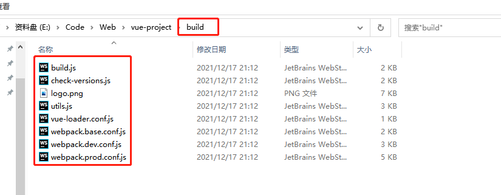

# 1. 准备工作

## 1.1 nodejs下载(npm环境)

> 注意：node版本必须大于8.9

下载地址：

```java
https://nodejs.org
```

## 1.2 安装cnpm

> 由于NPM的仓库部署在国外,资源传输速度较慢，所以可以使用淘宝的镜像源CNPM，相当于NPM的镜像。

以下命令需要在管理员终端运行：

```java
npm install -g cnpm --registry=https://registry.npm.taobao.org
```

**问题：**

如果cnpm 出现：**无法加载文件 D:\nodejs\node_global\cnpm.ps1**

可以在 windows shell 使用如下命令：

```java
set-ExecutionPolicy RemoteSigned
```

## 1.3 安装调试工具vue-devtools:

下载地址：https://github.com/vuejs/devtools#/vue-devtools

安装说明：https://devtools.vuejs.org/guide/installation.html

## 1.4 vue.js官网

vue2:https://cn.vuejs.org/v2/guide/installation.html

其他版本:https://cdn.jsdelivr.net/npm/vue@next/dist/  (开发版为global.js 生产版为global.prod.js)

## 1.5 导入vue.js库

```html
<!DOCTYPE html>
<html lang="en">
<head>
    <meta charset="UTF-8">
    <title>Title</title>

<!--    <script src="/js/vue.min.js"></script>-->
<!--使用本地方式来使用Vue框架-->
    <script src="js/vue.js"></script>
    <!--使用CDN方式来使用Vue框架-->
<!--    <script src="https://unpkg.com/vue@next"></script>-->
</head>
```

## 1.6 NPM安装vue用于打包

在用Vue构建大型应用时推荐使用NPM安装。NPM能很好地和诸如webpack或Browserify模块打包器配合使用。同时Vue也提供了配套工具来开发单文件组件。
由于NPM安装速度慢，推荐使用淘宝NPM镜像CNPM。

```cmake
cnpm install vue
```

## 1.7 命令行工具CLI的安装

​	Vue-cli是用Node编写的命令行工具，需要进行全局安装，如果**不安装Vue-cli不能通过WebStorm创建Vue项目**。

```shell
cnpm install -g vue-cli
```

安装完成如下图所示：


## 1.8 第一个Vue项目 

### 1.8.1 在单个html中使用vue

```html
<!DOCTYPE html>
<html lang="en">
<head>
    <meta charset="UTF-8">
    <title>Title</title>
<!--    <script src="/js/vue.min.js"></script>-->
    <script src="js/vue.js"></script>
<!--    <script src="https://unpkg.com/vue@next"></script>-->
</head>
<body>

    <div id="app">
        <div></div>
        <h2>{{ explain }}</h2>
    </div>
    
    <script>
        const vm = Vue.createApp({
            data(){
                return{
                    url:"/rsc/img/1.jpg",
                    explain:`this is a test`,
                }
            }
        }).mount('#app');
    </script>
</body>
</html>
```

### 1.8.2 使用命令行创建vue项目

```cmd
1. vue init webpack my-project
2. 进入项目文件夹my-project，然后使用：cnpm install
注意：安装依赖的时候，选择最后一个就是自己安装，用cnpm安装速度快
具体流程如下图所示
```


依赖安装完成后的目录如下所示：

```java
｜－－ build					//项目构建（Webpack)相关代码
｜	｜--build.js				//生产环境构建代码
｜	｜－－check-version.js		//检查 Node、NPM等版本
｜	｜－－dev-client.js			//热重载相关
｜	｜－－dev-server.js			//构建本地服务器
｜	｜－－utils.js				//构建工具相关
｜	｜－－webpack.base.conf.js	//Webpack 基础配置
｜	｜－－webpack.dev.conf.js	//Webpack 开发环境配置
｜	｜－－webpack.prod.conf.js	//Webpack 生产环境配置
｜－－config					//项目开发环境配置
｜	｜－－dev.env.js			//开发环境变量
｜	｜－－index.js				//项目一些配置变量
｜	｜－－prod.env.js			//生产环境变量
｜	｜－－test.env.js			//测试环境变量
｜－－node_modules				//所需要依赖资源
｜－－src						//源码目录
｜	｜－－assets				//存放资产文件
｜	｜－－components			//Vue 公共组件
｜	｜－－router				//存放路由JS文件，用于页面的跳转
｜	｜－－ App.vue				//页面入口文件
｜	｜－－main.js				//程序入口文件，加载各种公共组件
｜－－ static					//静态文件，例如一些图片、JSON数据等
｜－－.babelrc					//ES6语法编译配置
｜－－.editorconfig				//定义代码格式
｜－－.gitignore				//git上传需要忽略的文件格式
｜－－README.md					//项目说明
｜－－favicon.ico
｜－－index.html				//入口页面
｜－－package.json				//项目基本信息
```

> 注意：main.js、App.vue、index.js都是由2.x版本生成

main.js文件解释

```js
/*在main.js中导人Vue对象*/
import Vue from 'vue'
/*导入App.vue组件，并且命名为App*/
import App from './App'
/*导入 router 路由*/
import router from './router'
Vue.config.productionTip = false
/*所有导入成功后，创建Vue对象，设置被绑定的节点为＇＃app','#app'是index.html文件中的个div*/
new Vue({
el: '# app',
/*将 router 设置到Vue对象中＊／
    router,
/*声明一个组件App,App这个组件在一开始已经导入项目中了，但是无法直接使用，必须声明*/
components: { App },
/*template中定义了页面模板，即在App组件中的内容渲染到＇＃app'这个div中*/
template:'<App/>'
｝）

```

App.vue解释

​	App.Vue包含三部分组成：页面模板、页面脚本、页面样式。

```html
<!--页面模板-->
＜template>
    ＜div id = "app">
    <!--页面模板中定义了一张图片-->
        ＜img src = "./assets/logo.png">
        <!--router-view简单理解为路由占位符，用来挂载所有的路由组件-->
        ＜router-view/>
    ＜/div>
＜/template>
<!--页面脚本：面脚本用来实现数据初始化、事件处理等-->
＜script>
    export default {
    	name: 'App'
     }
＜/script>.
<!--页面样式-->
＜style>
    #app {
        font-family: 'Avenir', Helvetica, Arial, sans - serif;
        －webkit-font-smoothing:antialiased;
        －moz-osx-font-smoothing: grayscale;
        text-align: center;
        color: #2c3e50;
        margin-top: 60px;
    }
＜／style>
```

index.js解释

```js
import Vue from 'vue'
import Router from 'vue - router'
import HelloWor1d from'@/components/HelloWorld'
Vue.use(Router)
export default new Router({
/*路由文件，path路径，对应的组件为HelloWorld,即在浏览器地址为／时，在router-view 位置显示HelloWorld组件*/
    routes:[
        {
            path: '/',
            name: 'HelloWorld',
            component:HelloWorld
        }
    ]
})
```

#### 1.8.2.1 项目运行

```shell
cnpn run dev
```


#### 1.8.2.2 项目打包

```shell
cnpm run build
```

打包完会生成一个dist的打包文件：



### 1.8.3 使用Webstorm创建vue项目


如果出现**npm ERR! or that you lack permissions to access it.**问题，删除C:\Users\{账户}\下的.npmrc文件，新建项目即可。

### 1.8.4 命令行创建，然后使用web storm打开项目

**注意：**使用Webstorm创建vue项目可能会比较慢，所以可以用命令行创建项目然后再用Webstorm打开，步骤如下图所示：


打开项目：


编辑Configuration


