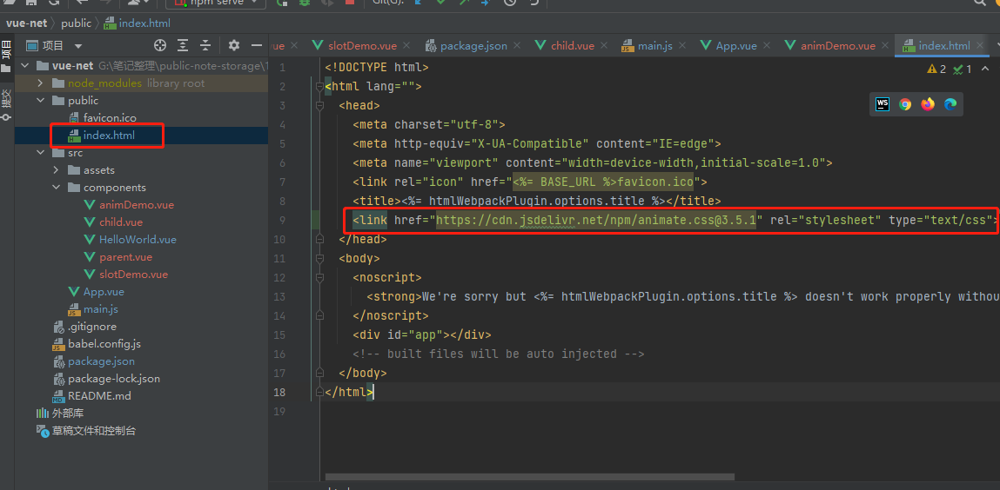

[TOC]

# 1. Vue基础

## 1.1 基本指令

### 1.1.1  {{变量}}

```vue
只能存放单行语句
例如不能使用:
 {{ if(true){'YES'}}}
使用示例:
<!--    字符串-->
    {{"哈哈"}}
<!--    数字-->
    {{1 + 1}}
<!--    三目运算法-->
    {{ 1 + 1 > 2 ? "YES" : "NO"}}
<!--    函数-->
    {{"hello".split('').reverse().join('')}}
<!--    使用变量-->
    {{msg}}
```

### 1.1.2 v-once

```vue
<!--    v-once只能渲染一次-->
<!--    当msg变化不会被渲染-->
    <p v-once>{{msg}}</p>
```

### 1.1.3 v-html

```vue
<div v-html = "hello"></div>
```

### 1.1.4 v-bind(简写为:)

```vue
<!--解析属性中的对象,把某一个属性和成员变量绑定,只要是在标签中的属性,v-bind都可以绑定-->
```


**注意**:

v-bind的**简写**为**':'**

v-bind中也可以组合

```vue
<div :class="divClass + '-1'">容器1</div>
```

### 1.1.5 v-if条件渲染


### 1.1.6 v-show条件渲染


**注意**

​	v-show和v-if的区别在于,v-if只有当第一次满足条件的时候才会渲染,涉及到组件的销毁重建,而v-show只要属性是true就会渲染,因此,如果需要非常频繁的切换,使用v-show,如果条件很少改变,则使用v-if较好。

### 1.1.7 v-for列表循环

```vue
<ul>
	<!--        直接遍历list,list中每一个参数是字符串-->
        <li v-for="name in names" :key="name"> {{name}} </li>
        <!--遍历list,最后一个参数为索引,list中每一个参数是字符串-->
        <li v-for="(name,index)  in names" :key="index"> {{name}} </li>
        <!--遍历list,list中每一个参数是一个对象-->
        <li v-for="item in names2" :key="item"> {{item.name + ' ' + item.age}} </li>
        <!--遍历list,,最后一个参数为索引,item是list中的对象-->
        <li v-for="(item,index)  in names2" :key="index"> {{index + ' ' + item.name + ' ' + item.age}} </li>
	<!--        取出names2中每一个对象-->
        <li v-for="item in names2" :key="item">
	<!--遍历对象,第一个参数是值,第二个参数是键,第三个参数是索引,只能使用在对象上,不能在list上使用-->
		<div class="liofli" v-for = "(value,key,index) in item" :key="index">{{ index+ '-' + key + '-' + value }}</div>
        </li>
</ul>
export default {
  name: 'HelloWorld',
  props: {
    msg: String
  },

  data(){
    return{
      names:["name1","name2","name3"],
      names2:[
        {
          name:"name1",
          age:20
        },
        {
          name:"name1",
          age:20
        }
      ]
    }
  }

}
```
效果如下图所示:


## 1.2 事件处理

### 1.2.1 v-on(简写为@)

#### 	1.2.1.1 无参事件

​	事件改变data数据,data数据改变会引起视图的变化。

```vue
<!--事件处理-->
<template>
  <div class="HelloWorldStyle">
    <div v-if="flag">true</div>
    <div v-else>false</div>
      <button type="button" name="button" v-on:click = clickHandler>按钮</button>
  </div>
</template>

<script>
export default {
  name: 'HelloWorld',
  props: {
    msg: String
  },
  data(){
    return{
      flag:true,
    }
  },
  methods:{
    clickHandler(){
      //改变data中的数据\
      this.flag = !this.flag
    }
  }
}
</script>
```

#### 1.2.1.2 传参事件

```vue
<!--事件处理-->
<template>
  <div class="HelloWorldStyle">
    <div v-if="flag">true</div>
    <div v-else>false</div>
    <!--template begin-->
      <button type="button" name="button" v-on:click = "clickHandler('hello1','hello2')">按钮</button>
    <!--template end-->
    <!--template begin-->

    <!--template end-->
  </div>
</template>

<script>
export default {
  name: 'HelloWorld',
  props: {
    msg: String
  },
  data(){
    return{
      flag:true,
    }
  },
  methods:{
    clickHandler(data1,data2){
      //改变data中的数据\
      this.flag = !this.flag
      console.log(data1)
      console.log(data2)
    }
  }
}
</script>
```

#### 1.2.1.3 数组更新检测

​	未改变原数组的方法不能引起页面的变化,例如concat,filter返回的是一个新数组

```vue
addItem(){
      this.helloArr.push('he')
      this.helloArr.unshift('hb')
      //未改变原数组的方法不能引起页面的变化,例如concat,filter返回的是一个新数组,但可以通过给原数组赋值的方式更新页面
      this.helloArr.concat(['hh'])
    }
```


## 1.3 计算属性

为了防止太乱,新建立一个vue组件


编写组件CalcDemo.vue

```vue
<template>
  <div class="">
    vuedemo
  </div>
</template>

<script>
export default {
  name: "ClacDemo",
  data(){
    return{

    }
  }
}
</script>

<style scoped>

</style>
```

修改App.vue显示新组件


为了防止重复计算,定义计算属性:

```vue
<template>
  <div>
    {{getMsg}}
    {{getMsg}}
    {{getMsg}}
  </div>
</template>

<script>
export default {
  name: "ClacDemo",
  //计算属性,只有当内部调用的变量发生变化,才会调用computed中的函数,注意,这里不是判断返回值中的计算中是否有变量变化来判断是否需要调用
  computed:{
    getMsg(){
      console.log('-------')
      return this.msg.split('').reverse().join('')
    }
  },
  data(){
    return{
      msg:"hello"
    }
  }
}
</script>

<style scoped>

</style>
```

**注意**:调用计算属性的时候不需要加括号,可以看到只调用了一次:


​	以下所示的代码中,虽然computed的getMsg函数中变量testNum的变化对最后返回的结果没有影响,但是只要其发生变化,getMsg函数就会调用:

```vue
<template>
  <div>
    {{getMsg}}
    {{getMsg}}
    {{getMsg}}
    <input type="button" value="testNum加1" name="button" @click="clickHandler">
  </div>
</template>

<script>
export default {
  name: "ClacDemo",
  //计算属性
  computed:{
    getMsg(){
      console.log('-------')
      console.log(this.testNum)
      return this.msg.split('').reverse().join('')
    }
  },
  methods:{
    clickHandler() {
      this.testNum += 1
    }
  },
  data(){
    return{
      msg:"hello",
      testNum:1
    }
  }
}
</script>

<style scoped>

</style>
```


## 1.4 Class和Style绑定

​	假设有如下样式:

```css
.active{
  color: red;
}

.txt{
  font-size: 30px;
}

.txt2{
  font-size: 50px;
}

.c1{
  color: red;
}

.c2{
  font-size: 30px;
}
```

### 1.4.1 直接使用样式

​	直接使用

```vue
<div :class="classDemo">
      css
</div>
data():{
	classDemo:"txt",
}
```

### 1.4.2 根据条件判断是否使用样式

​	**注意**:动态绑定的属性和本身的属性不冲突

```vue
 <div :class="{'active':classFlag,'txt':classFlag}">
      css
</div>
 data(){
    return{
      classFlag:true,
    }
  },
```

### 1.4.3 根据条件使用css样式

```vue
<div :class="[classFlag?classDemo : '' , 'txt2']">
  css
</div>
data(){
    return{
      classDemo:"txt",
    }
  },
```

### 1.4.4 根据计算属性切换css样式

```vue
<div :class="cssObj">
  css2
</div>
<button type="button" @click="changeCss">改变css2样式</button>

  data(){
    return{
      c1:true,
      c2:false,
    }
  },
  computed:{
    cssObj(){
      return {'c1':this.c1, 'c2':this.c2}
    }
  },
  methods:{
    changeCss(){
      this.c1 = !this.c1
      this.c2 = !this.c2
    }
  }
```

### 1.4.5 开发中常用的样式

+ 增量式组合css

```vue
<div class="old" :class="[classFlag ? classDemo : 'notactive',{'active':activeFlag}]">
  应用中常用样式
</div>

  data(){
    return{
      classDemo:"txt",
      activeFlag:true,
      classFlag:true,
    }
  },
```

**注意**:对象中的键只能接受字符串,在数组中可以接收对象

+ 内联样式

```vue
<!--    固定值-->
<div :style="{color:'red',font}">
<!--    动态绑定-->
<div :style="{color:this.color,font}">
      内联样式
</div>

data(){
    return{
      color:'green',
    }
  },
```

## 1.5 表单和侦听器

### 1.5.1 输入绑定v-model

​	**v-model**会忽略所有表单元素的 **value**、**checked**、**selected attribute** 的初始值而总是将 **Vue** 实例的数据作为数据来源。

#### 1.5.1.1 单值绑定

##### 1.5.1.1 .1 单行文本框输入绑定

```vue
<!--    单行文本输入框-->
<input v-model="inputmsg" type="text" name="" value="">
data(){
    return{
      inputmsg:"",
    }
}
```

+ lazy模式,转为change事件之后才会响应

```vue
<input v-model.lazy="inputmsg" type="text" name="" value="">
```

+ number:自动转化为数值类型

```vue
<input v-model.number="number" type="text" name="" value="">
```

+ trim:自动过滤用户输入的首尾空白字符

```vue
<input v-model.trim="inputmsg" type="text" name="" value="">
```

##### 1.5.1.1.2 多行文本框输入绑定

```vue
<textarea v-model="message" placeholder="add multiple lines"></textarea>
data(){
    return{
      message:``,
    }
}
```

##### 1.5.1.1.3 单个复选框绑定

​	复选框绑定单值类型,则选中为true,没有选中为false,如果是数组类型,数组中的元素对应选择的checkbox的value

```vue
<input type="checkbox" id="checkbox" v-model="checked" id="checkbox1">
<!--    for的作用是使标签和radio绑定,点击文字相当于点击radio-->
<span for="checkbox1">checkbox</span>
```

​	如果需要指定选中和没有选中的值:

```vue
<input type="checkbox"  v-model="toggle" true-value="yes" false-value="no">
<!--    值可以是对象-->
 <input type="checkbox"  v-model="toggle" true-value="{number:123}" false-value="no">
```

##### 1.5.1.1.4 radio的绑定

```vue
<!--    指定选中后picked的值 当值不一样时可以单选,当值一样时一样的名字的会全选-->
<!-- 当选中时，`picked` 为字符串 "one" -->
<input type="radio" v-model="picked" value="one" id="radio2">
<label for="one">One</label>
<!-- 当选中时，`picked` 为字符串 "two" -->
<input type="radio" v-model="picked"  value="two" id="radio3">
<label for="two">Two</label>
```

##### 1.5.1.1.5 单选框的绑定

​	当选中第一个选项时，**selected**为value属性**"a"**,没有value属性则对应标签名**A**

```vue
<select v-model="selected">
	<option disabled value="">请选择</option>
	<option value='a'>A</option>
	<option>B</option>
	<option>C</option>
</select>
```

#### 1.5.1.2 数组绑定

##### 1.5.1.2.1 多个复选框绑定到同一个数组

```vue
<input type="checkbox" id="item1" value="itme1" v-model="checkedNames">
<label for="item1">itme1</label>
<input type="checkbox" id="item2" value="item2" v-model="checkedNames">
<label for="item2">item2</label>
<input type="checkbox" id="item3" value="item3" v-model="checkedNames">
<label for="item3">item3</label>
<br>
<span>Checked names: {{ checkedNames }}</span>

data(){
    return{
      checkedNames: [],
    }
  }
```

##### 1.5.1.2.2 多个选择框绑定到同一个数组

```vue
<select v-model="selects" multiple style="width: 50px;">
  <option>A</option>
  <option>B</option>
  <option>C</option>
</select>
<br>
<span>Selects: {{ selects }}</span>
data(){
    return{
      selects: [],
    }
  }
```

### 1.5.2 动态方式渲染选择框

```vue
<select v-model="selected">
  <option v-for="option in options" :key="option" :value="option.value" >
    {{ option.text }}
  </option>
</select>
<span>Selected: {{ selected }}</span>
data(){
    return{
	selects:[],
      options:[
        { text: 'One', value: 'A' },
        { text: 'Two', value: 'B' },
        { text: 'Three', value: 'C' }
      ],
    }
  }
```

### 1.5.3 侦听器

​	 使用watch监听事件可以实时监听数据变化,watch的函数名必须为要监听的变量的名字,但是能用computed属性就用computed,尽量少使用computed.

### 1.5.4 补充,去掉eslint规范

​	添加如下图所示代码,保存并重启项目.


代码如下:

```vue
"rules": {
      "generator-star-spacing": "off",
      "no-tabs":"off",
      "no-unused-vars":"off",
      "no-console":"off",
      "no-irregular-whitespace":"off",
      "no-debugger": "off"
    }
```

## 1.6 组件

### 1.6.1 组建的创建

1. 新建组件


2. 编写组件代码


3. 使用组件


### 1.6.2 组件之间传递数据

#### 1.6.2.1 通过props,父组件向子组件传递数据

+ ###### 传递基本数据

父组件:

```vue
<vueTemplate mytitle="123"/>
```

子组件vueTemplate:

```vue
<template>
<!--只能存在一个根容器-->
  <div class="container">
    组件名:{{mytitle}}
  </div>
</template>

<script>
export default {
  name: "Demo005_基本组件创建",
  //props中的双引号不能少
  props:["mytitle"],
}
</script>
```

+ ###### 传递基本对象

父组件:

```js
    <vueTemplate :mytitle="mytitle"/>
data(){
    return{
      mytitle:{name:"父组件名称"}
    }
}
```

子组件vueTemplate:

```vue
<template>
<!--只能存在一个根容器-->
  <div class="container">
    组件名:{{mytitle}}
  </div>
</template>

<script>
export default {
  name: "Demo005_基本组件创建",
  //props中的双引号不能少
  props:["mytitle"],
}
</script>
```

+ 传递多个属性,并设置属性默认值以及验证

父组件:

```vue
<template>
  <div class="parent">
    父组件
<!--    指定类型-->
<!--    输入与number类型绑定-->
    <input type="number" v-model.number="price"/>
    <!--    没有冒号:,传入的数据都是字符串类型,有冒号传递的是对象类型-->
    <child title="来自父组件数据title" author="来自父组件数据author"  :chapers="[1,2,3]" />
    {{msgFromChild}}
  </div>
</template>

<script>
import child from "./child";

export default {
  name: "parent",
  components: {
    child
  },
  methods:{
    getChildMsg(data){
      this.msgFromChild = data;
    }
  },
  data(){
    return{
      msgFromChild:"",
      price:0,
    }
  }

}
</script>
<style scoped>
.parent{
  background-color: aqua;
}
</style>
```

子组件:

```vue
<template>
  <div class="child">
    子组件:<br/>
    title:{{title}}<br/>
    author:{{author}}<br/>
    price:{{price}}<br/>
    chapters:{{chapers}}<br/>
    <input v-model="childMsg">
    <button @click = "sendMsg" type="button" name="button">子组件发送数据</button>
  </div>
</template>

<script>
export default {
  name: "child",
  //不指定类型
  // props:["title","author"],
  //指定类型,开发中一般都要指定类型
  props:{
    //表示title是必选项
    title:{
      type:String,
      required:true
    },
    author:String,
    //设置price的默认值
    price:{
      type:Number,
      default:100
    },
    //注意,默认值如果是数组或者对象,必须返回一个function
    chapers:{
      type:Array,
      default: function (){
        //如果是对象则返回{}
        return ['1','2']
      }
    }
  },
  methods:{
    sendMsg(){
      this.$emit("msg_sig",this.childMsg);
    }
  },
  data(){
    return{
      childMsg:"来自子组件的数据"
    }
  }
}
</script>

<style scoped>
.child{
  background-color: darkgray;
}
</style>
```

#### 1.6.2.2 通过emit信号,子组件向父组件传递数据

+ **子组件**

```js
<template>
<!--只能存在一个根容器-->
  <div class="container">
<!--    vmodel动态传递数据-->
    <input v-model="searchText">
    <button @click = "sendMsg" type="button" name="button">给父组件传递数据</button>
  </div>
</template>

export default {
  name: "Demo005_基本组件创建",
//  所有的初始化状态全部放入data中,data必须是一个函数
  data(){
    return{
      searchText:""
    }
  },
  methods:{
    sendMsg(){
      //第一个参数相当于信号名,第二个参数是发送的参数
      // this.$emit("getMsg","来自子组件的数据")
      //传递动态数据
      this.$emit("getMsg",this.searchText)
    }
  }
}
```

+ **父组件**

```js
<template>
  <div id="app">
    
    {{msgOfSon}}
<!--    接收子组件的信号,将子组件发出的信号getMsg与父组件的函数getSonMsg绑定-->
    <vueTemplate @getMsg="getSonMsg" :mytitle="mytitle"/>
  </div>
</template>

<script>
import Demo005_基本组件创建 from "./components/Demo005_基本组件创建";

export default {
  name: 'App',
  components: {
    vueTemplate:Demo005_基本组件创建
  },
  methods:{
    getSonMsg(msg){
      this.msgOfSon = msg;
    }
  },
  data(){
    return{
      msgOfSon:"",
    }
  }
}
</script>
```

运行结果如下图所示:


### 1.6.3 使用component加载组件与keep-alive

非keep-alive演示如下图所示,可以看到切换回来时,状态没有保持:


keep-alive演示如下,可以看到切换回来时,状态是保持的:


+ 创建A组件

```js
<template>
<div>
  A
  <input/>
</div>
</template>

<script>
export default {
  name: "Demo006_A"
}
</script>

<style scoped>

</style>
```

+ 创建B组件

```vue
<template>
<div>
  B
</div>
</template>

<script>
export default {
  name: "Demo006_B"
}
</script>

<style scoped>

</style>
```

+ 加载

```js
<template>
  <div id="app">
    
<!--    <ClassStyle/>-->
<!--    <ClacDemo/>-->
<!--    <FormDemo/>-->
<!--    基本数据-->
<!--    <vueTemplate mytitle="123"/>-->
<!--    复杂数据,数据可以是动态的-->
<!--    <vueTemplate :mytitle="mytitle"/>-->
<!--    {{msgOfSon}}-->
<!--    接收子组件的信号,将子组件发出的信号getMsg与父组件的函数getSonMsg绑定-->
<!--    <vueTemplate @getMsg="getSonMsg" :mytitle="mytitle"/>-->

<!--    keep-alive保证组件不重复渲染-->
    <keep-alive>
      <component v-bind:is="mycomponent"/>
    </keep-alive>

    <button @click = "changeComponent" type="button" name="button">改变组件</button>

  </div>
</template>

<script>
import Demo006_A from "./components/Demo006_A";
import Demo006_B from "./components/Demo006_B";

export default {
  name: 'App',
  components: {
  },
  methods:{
    changeComponent(){
      if(this.mycomponent == Demo006_A){
        this.mycomponent = Demo006_B
      }else{
        this.mycomponent = Demo006_A
      }
    }
  },
  data(){
    //注意:使用v-bind:is,组件应该放在data中
    return{
      //mycomponent,默认为Demo006_A
      mycomponent:Demo006_A,
    }
  }
}
</script>

```

### 1.6.4 组件深入

#### 1.6.4.1 通过main.js添加全局变量


使用全局变量

```js
//全局属性访问得从computed计算属性中读取
  computed:{
    getGData1(){
      return this.$root.g_data1
    }
  },
      
<br>
    全局变量:{{getGData1}}
<br>
```

#### 1.6.4.2 通过ref标签操作原生HTML

```js
<!--    通过ref获取原生dom-->
<p ref="p1">原生p标签</p>


mounted() {
    this.$refs.p1.innerHTML = "改变原生p标签"
  }
```

### 1.6.5 插槽

#### 1.6.5.1 简单插槽

+ 父组件

```vue
<template>
<div>
  fu
  <ZiElement>
      来自父组件的数据
  </ZiElement>
</div>
</template>

<script>
import ZiElement from "./ZiElement";
export default {
  name: "FuElement",
  components:{
    ZiElement
  }
}
</script>

<style scoped>

</style>

```

+ 子组件

```vue
<template>
<div>
  zi,来自父组件:<slot></slot>
</div>
</template>

<script>
export default {
  name: "ZiElement"
}
</script>

<style scoped>

</style>

```

运行截图:


#### 1.6.5.2 具名插槽

+ 父组件

```vue
<slot-demo>

      <!--  具名插槽,如果带有slot=""属性,则在子组件中需要使用<slot name="">的方式才可以使用该组件-->
      <template slot="slot1">
        <div>
          父组件div,slot="slot1"
        </div>
      </template>

    </slot-demo>
```

+ 子组件

```vue
<template>
<div>
<!--  具名插槽-->
  <slot name="slot1"></slot>

  <slot name="slot2" >
    没有传递slot2,显示默认值
  </slot>

</div>
</template>
```

#### 1.6.5.3 子组件插槽传递数据给父组件,通过父组件改变样式

+ 父组件

```vue
<template>
  <div id="app">
    <slot-demo>
<!--      使用子组件传递过来的数据   2.1.0版本后 slot-scope可以在template以外的标签上使用-->
      <div slot-scope="slotProps">
        <h1>{{slotProps.ct}}</h1>
      </div>
    </slot-demo>
  </div>
</template>
```

+ 子组件

```js
<template>
<div>
<!--  传递数据给父组件,这样做的好处是显示的效果可以由父组件决定-->
  <slot ct="来自子组件的数据"></slot>
</div>
</template>
```

### 1.6.6 组件案例1 Tabs标签组件的实现

案例效果：


#### 1.6.6.1 编写tabs组件

代码如下：

```js
<template>
<div class="tabs">
  <div class="tabs-bar">
<!--    标签页标题，通过v-for实现循环 :class 动态渲染每一个item的label-->
<!--    :key="item.name"  以item.name为键进行遍历,item.name不能有重复的元素-->
    <div :class="tabCls(item)"
         v-for="(item,index) in navList"
         @click = "handleChange(index)" :key="item.name">
<!--      显示label标签-->
      {{item.label}}
    </div>
  </div>

  <div class="tabs-content">
<!--    slot放置pane组件内容-->
    <slot></slot>
  </div>
</div>

</template>

<script>
export default {
  name: "tabs",
  props: {
    value: [String, Number],
    required: true
  },
  data () {
    return {
      currentValue: this.value,
      navList: []
    }
  },
  methods: {
    //样式
    tabCls(item){
      return [
        'tabs-tab',
        {
          'tabs-tab-active': item.name === this.currentValue
        }
      ]
    },
    //获取tabs标签下的所有pane标签
    getTabs(){
      // this.$children.forEach((value, index, array) => {
      //   console.log(value.$options.name)
      // })
      return this.$children.filter(function (item) {
        return item.$options.name === 'pane'
      })
    },
    //把嵌套的组件放入父组件的navList中
    updateNav(){
      console.log("updateNav()")
      //嵌套的组件调用上一级组件，this指向的是嵌套的组件，所以要想使用上一级组件中的变量，需要使用let _this = this
      //_this表示该组件的this
      let _this = this
      //获取标题，并放置到navList数组中
      _this.navList = []
      //获取tabs标签下的所有pane标签
      _this.getTabs().forEach(function (pane, index) {
        //获取标签pane的label与name属性
        _this.navList.push({
          label: pane.label,
          //如果name的值为null则用index代替name
          name: pane.name || index
        })
        if (!pane.name) pane.name = index
        //如果currentValue的值为null则赋值为第一个pane
        if (index === 0) {
          if (!_this.currentValue) {
            _this.currentValue = pane.name || index
          }
        }
      })
      _this.updateStatus()
    },
    //根据currentValue值来确定哪个嵌套组件pane显示
    updateStatus () {
      let _this = this
      _this.getTabs().forEach(function (tab) {
        //改变嵌套组件pane的show
        tab.show = tab.name === _this.currentValue
      })
    },
    handleChange (index) {
      let nav = this.navList[index]
      let name = nav.name
      this.currentValue = name
      this.$emit('input', name)
      this.$emit('on-click', name)
    }
  },
  watch: {
    value: function (val) {
      this.currentValue = val
    },
    currentValue () {
      this.updateStatus()
    }
  }
}
</script>

<style scoped>

.tabs{
  font-size: 14px;
  color: #657180;
}
.tabs-bar:after{
  content: '';
  display: block;
  width: 100%;
  height: 1px;
  background: #d7dde4;
  margin-top:-1px;
}
.tabs-tab{
  display: inline-block;
  padding: 4px 16px;
  margin-right: 6px;
  background: #fff;
  border: 1px solid #d7dde4;
  cursor: pointer;
  position: relative;
}
.tabs-tab-active{
  color: #3399ff;
  border-top: 1px solid #3399ff;
  border-bottom: 1px solid #3399ff;
}
.tabs-tab-active:before{
  content: '';
  display: block;
  height: 1px;
  background: #3399ff;
  position: absolute;
  top: 0;
  left: 0;
  right: 0;
}
.tabs-content{
  padding: 8px 0;
}
</style>
```

关键点：

1. 通过this.$children.filter(function (item) { return item.$options.name === 'pane'})，可以获得当前组件下所有类型为pane的子组件
2.  updateNav()用于把嵌套的pane组件放入父组件的navList中
3.  updateStatus ()根据currentValue值来确定哪个嵌套组件pane显示
4. :class="tabCls(item)"为动态渲染，渲染满足条件的item

#### 1.6.6.1 编写pane组件（每个tab显示的内容）

```js
<template>
<!--  根据show的值判断是否显示该<slot>-->
  <div class="pane" v-show="show">
    <slot></slot>
  </div>
</template>

<script>
export default {
  name: "pane",
  props: {
    name: {
      type: String
    },
    label: {
      type: String,
      default: ''
    }
  },
  data () {
    return {
      show: true
    }
  },
  methods: {
    updateNav () {
      //调用父组件的updateNav函数
      this.$parent.updateNav()
    }
  },
  watch: {
    label () {
      this.updateNav()
    }
  },
  mounted () {
    this.updateNav()
  },
  computed: {
    active () {
      return false
    }
  }
}
</script>

<style scoped>

</style>
```

#### 1.6.6.2 测试组件

```js
<template>
  <div class="tabDemo">
<!--    v-model是双向绑定，tabs标签中的value变化会导致父组件的value变化-->
<!--    v-model="value"的写法相当于v-model:value="value"-->
<!--    <tabs v-model="value">-->
<!--    v-bind是单向数据绑定，父组件会影响到子组件，子组件不能影响到父组件-->
    <tabs :value="value">
      <pane label="标签一" name="1">
        标签一内容
      </pane>
      <pane label="标签二" name="2">
        标签二内容
      </pane>
      <pane label="标签三" name="3">
        标签三内容
      </pane>
    </tabs>

    <tabs :value="value">
      <pane label="标签一" name="1">
        标签一内容
      </pane>

      <pane label="标签二" name="2">
        标签二内容
      </pane>
      <pane label="标签三" name="3">
        标签三内容
      </pane>
    </tabs>

  </div>
</template>

<script>
import Tabs from '../components/tabs/tabs'
import pane from '../components/tabs/pane'

export default {
  name: "tabDemo",
  components: {
    Tabs,
    pane,
  },
  data () {
    return {
      value: "1",
      value2: "2",
    }
  },
  methods:{
  }
}
</script>

<style scoped>

</style>
```

## 1.7 生命周期

下图所示,Vue一共有八个生命周期函数,分别是创建之前,创建之后,渲染之前,渲染之后,更新之前,更新之后,销毁之前,销毁之后。


## 1.8 过渡与动画

### 1.8.1 自定义动画

在进入/离开的过渡中，会有 6 个 class 切换。

1. v-enter：定义进入过渡的开始状态。
2. v-enter-active：定义进入过渡生效时的状态。这个类可以被用来定义进入过渡的过程时间，延迟和曲线函数。
3. v-enter-to：定义进入过渡的结束状态。
4. v-leave：定义离开过渡的开始状态。在离开过渡被触发时立刻生效，下一帧被移除。
5. v-leave-active：定义离开过渡生效时的状态。这个类可以被用来定义离开过渡的过程时间，延迟和曲线函数。
6. v-leave-to：定义离开过渡的结束状态。

其中v是定义的transition标签的名字,具体的动画过程如下图所示,其中**Opacity**是透明度的意思:


+ 使用示例:

```vue
<template>
  <div class="anim">
    <button v-on:click="show = !show">Button</button>
<!--    淡入淡出-->
    <transition name="myFade">
      <h1 v-if="show">hello</h1>
    </transition>
<!--    变大变小-->
    <transition name="trans">
      <h1 class="big" v-if="show">hello</h1>
    </transition>
<!--    动画-->
    <transition name="myAni">
      <h1 class="big" v-if="show">hello</h1>
    </transition>

  </div>
</template>

<script>
export default {
  name: "animDemo",
  data(){
    return{
      show:true
    }
  }
}
</script>

<style scoped>

/*淡入淡出效果*/
/*Opacity为0的状态*/
.myFade-enter,.myFade-leave-to{
  opacity: 0;
}

    /*淡入淡出效果*/
/*Opacity为1的状态*/
.myFade-enter-to,.myFade-leave{
  opacity: 1;
}

    /*淡入淡出效果*/
/*过渡*/
.myFade-enter-active,.myFade-leave-active{
  transition: opacity 3s;
}

.big{
  width: 100px;
  height: 100px;
  background: aquamarine;
}

/*变大变小*/
/*Opacity为0的状态*/
.trans-enter,.trans-leave-to{
  opacity: 0;
  width: 0;
  height: 0;
}

    /*变大变小*/
/*Opacity为1的状态*/
.trans-enter-to,.trans-leave{
  opacity: 1;
  width: 100px;
  height: 100px;
}

    /*变大变小*/
/*过渡*/
.trans-enter-active,.trans-leave-active{
  transition: all 3s;
}

/*动画*/
/*Opacity为0的状态*/
.myAni-enter,.myAni-leave-to{

}

    /*动画*/
/*Opacity为1的状态*/
.myAni-enter-to,.myAni-leave{

}

    /*动画*/
/*过渡*/
.myAni-enter-active{
  animation: bounce-in 1s;
}

.myAni-leave-active{
  animation: bounce-out 1s;
}

/*关键帧动画,show=true*/
@keyframes bounce-in {
  0%{
    transform: scale(0);
  }
  50%{
    transform: scale(1.5);
  }
  100%{
    transform: scale(1);
  }
}

/*关键帧动画,show=false*/
@keyframes bounce-out {
  0%{
    transform: scale(1);
  }
  50%{
    transform: scale(1.5);
  }
  100%{
    transform: scale(0);
  }
}

</style>
```

### 1.8.2 使用第三方动画

+ 引入第三方动画js

```js
<link href="https://cdn.jsdelivr.net/npm/animate.css@3.5.1" rel="stylesheet" type="text/css">
```

如下图所示:



+ 从以下网址选取想要的样式:

https://www.swiper.com.cn/usage/animate/index.html

+ 使用样式:


代码如下图:

```vue
<transition
  name="custom-classes-transition"
  enter-active-class="animated rotateIn"
  leave-active-class="animated zoomOutDown"
>
  <h1 class="big" v-if="show">hello</h1>
</transition>
```

需要注意的是,如果不脱离文档流,页面会发生抖动,如下图右边栏所示:


所以需要通过div把动画脱离文档流,代码如下所示:

```js
<transition
      name="custom-classes-transition"
      enter-active-class="animated rotateIn"
      leave-active-class="animated zoomOutDown"
>
.big{
  width: 100px;
  height: 100px;
  background: aquamarine;
  /*脱离文档流*/
  position:fixed;
}
```

## 1.9 自定义指令

### 1.9.1 钩子函数

一个指令定义对象可以提供如下几个钩子函数 (均为可选)：

- bind：只调用一次，指令第一次绑定到元素时调用。在这里可以进行一次性的初始化设置。
- inserted：被绑定元素插入父节点时调用 (仅保证父节点存在，但不一定已被插入文档中)。
- update：所在组件对象中数据或函数更新时调用

- componentUpdated：指令所在组件**及其子组件** 全部更新后调用。
- unbind：只调用一次，指令与元素解绑时调用。

### 1.9.2 钩子函数参数

+ el：指令所绑定的元素，可以用来直接操作 DOM。
+ binding：一个对象，包含以下 property：
  + name：指令名，不包括 v- 前缀。
  + value：指令的绑定值，例如：v-my-directive="1 + 1" 中，绑定值为 2。
  + oldValue：指令绑定的前一个值，仅在 update 和 componentUpdated 钩子中可用。无论值是否改变都可用。
  + expression：字符串形式的指令表达式。例如 v-my-directive="1 + 1" 中，表达式为 "1 + 1"。
  + arg：传给指令的参数，可选。例如 v-my-directive:foo 中，参数为 "foo"。
  + modifiers：一个包含修饰符的对象。例如：v-my-directive.foo.bar 中，修饰符对象为 { foo: true, bar: true }。
  + vnode：Vue 编译生成的虚拟节点。移步 VNode API 来了解更多详情。
  + oldVnode：上一个虚拟节点，仅在 update 和 componentUpdated 钩子中可用。

#### 1.9.2.1 全局绑定

+ main.js

```js
//全局指令
Vue.directive("focus",{
  //当前指令的生命周期,el:HtmlElement
  bind:function(el,binding){
    console.log("初始化...")
    console.log(binding)
  },
  inserted:function(el){
    console.log("插入父节点调用...")
    el.focus();
  },
  update:function(el){
    console.log("更新时调用...")
    el.focus();
  }
})
```

+ 组件中

```js
<!--  大写字母要用-加小写字母代替-->
  <input type="text" v-my-style name="" value=""/>
```

#### 1.9.2.2 局部绑定

```js
export default {
  name: "customised-components",
  data(){
    return{

    }
  },
  //局部指令
  directives: {
    "focus": {
      //当前指令的生命周期,el:HtmlElement
      bind: function (el, binding) {
        console.log("初始化...")
        console.log(binding)
      },
      inserted: function (el) {
        console.log("插入父节点调用...")
        el.focus();
      },
      update: function (el) {
        console.log("对象中数据或函数更新时调用...")
        el.focus();
      }
    },
    myStyle:{
      inserted:function (el){
        el.style.fontSize = "50px";
      }
    }
  }
}
```

## 1.10 过滤器

使用如下图所示

```js
<template>
 <div>
   {{ money | rmb | author}}
 </div>
</template>

<script>
export default {
  name: "filterDemo",
  data(){
    return{
      money:100
    }
  },
  filters:{
    rmb:function (value){
      if(!value) return;
      value = value.toString()
      return "￥" + value;
    },
    author:function (value){
      if(!value) return;
      return  value+"----------来自author";
    }
  }
}
</script>

<style scoped>

</style>
```
