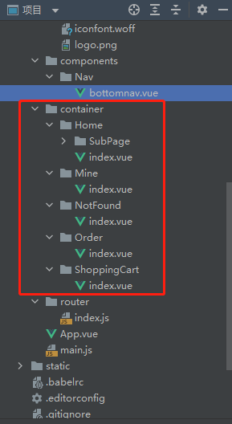

[TOC]


# 1.路由的使用

## 1.1 路由的安装

使用如下指令:

```vue
  cnpm install vue-router --save
```

路由的官方教程:https://router.vuejs.org/zh/guide/

## 1.2 工程中使用路由

一般在项目开发中会新建一个js用于存储路由信息,如下图所示:


在该js中创建路由:

```js
// The Vue build version to load with the `import` command
// (runtime-only or standalone) has been set in webpack.base.conf with an alias.
import Vue from 'vue'
import VueRouter from 'vue-router'
//@表示根目录
import AxiosDemo from "@/components/AxiosDemo";
import HelloWorld from "../components/HelloWorld";
import Base from "../components/Base";
import Http from "../components/Http";
import Learn from "../components/Learn";
import NotFound from "../components/NotFound"

Vue.use(VueRouter)
//创建路由
export default new VueRouter({
  routes:[
    {
      //1.访问hello的时候才会加载HelloWorld组件
      path:"/hello",
      name:"HelloWorld",
      component:HelloWorld
    },
  ]
})

```

然后在main.js中import即可:

```js
import router from "./router"
```

## 1.3 动态路由传参

1. 在routes中配置路由:

```js
{
  //1.访问hello/..的时候才会加载
  path:"/hello/:helloParam",
  name:"HelloWorld",
  component:HelloWorld
},
```

2.1 方式1,使用url传递的方式

```js
<!--      参数传递-->
      <router-link tag="li" to="/axiosDemo/1">axios</router-link>

<router-view/>
```

2.2 方式2,使用具名路由的方式

```js
//<router-link>是跳转操作,点击后url会变成http://localhost:8080/to,只有当前路径对应的组件以及父组件会生效,其他的组件不显示,生效的组件会在<router-view/>中显示
<router-link tag="li" :to="{name:'HelloWorld',params:{helloParam:helloParam}}">具名路由,跳转到HelloWorld组件</router-link>
//router-view 将匹配到的组件将渲染在这里,相当于一个特定的容器,<router-link>只能对应一个<router-view/>,如果使用多个<router-view>,需要在路由文件中使用components配置组件对象,然后使用<router-view name=""/>的形式使用具名路由
<router-view/>
```

**注:使用这种方法不需要在index.js中配置需要传递的参数**

具名路由的使用如下图所示:


3. 在组件中使用

```js
this.$route.params.helloParam
```

如下图所示:


## 1.4 嵌套路由

1. 创建嵌套路由

```js
{
  path:"/learn",
  name:"Learn",
  component:Learn,
  children:[{
    path:"base",
    component:Base
    //如果还有路由,继续添加children
  },
    {
      path:"http",
      component:Http
    }]
},
```

2. 使用嵌套路由

```js
<ul>
  <router-link to="/learn/base">基础</router-link>
  <router-link to="/learn/http">进阶</router-link>
</ul>

<router-view/>
```

## 1.5 编程式的导航

```js
//4.1 直接跳转
this.$router.push("/learn")
  //4.2 使用对象
this.$router.push({path:"/learn"})
  //4.3 使用replace不会向history添加记录,也就是说后退不到上一次的页面
this.$router.replace({path:"/learn"})
  //4.4 go 回到上一次路径
this.$router.go(-1)
//  4.5 push的时候也可以传参
//使用这种方法需要在index.js中配置需要传递的参数，跳转到name为HelloWorld对应的路由，如果提供了 path，params 会被忽略
this.$router.push({name:'HelloWorld',params:{helloParam:this.helloParam}})
  //4.6 带参查询,路径会变成 http://localhost:8080/#/HelloWorld?helloParam=test
  this.$router.push({path:'HelloWorld',query:{helloParam:'test'}})
```

## 1.6 路由高亮

### 1.6.1 直接配置

在App.vue中配置


### 1.6.2 指定样式


效果如下图所示:


## 1.6 杂项

### 1.6.1 获取路由对象属性

```js
computed:{
  getCurrentUrl(){
    // return this.$route.path
    return this.$route.fullPath
  }
}
```

详见:https://router.vuejs.org/zh/api/#%E8%B7%AF%E7%94%B1%E5%AF%B9%E8%B1%A1

## 1.7 案例

案例截图:


图标库:https://www.iconfont.cn/

1. 将下载的图标css文件和字体放入assets文件夹


2. 为了便于管理,新建container文件夹,并创建四个容器对应下方的四个按钮,如下图所示



3. 配置路由

```js
// The Vue build version to load with the `import` command
// (runtime-only or standalone) has been set in webpack.base.conf with an alias.
import Vue from 'vue'
import VueRouter from 'vue-router'
import Home from "@/container/Home"
import Mine from "@/container/Mine"
import Order from "@/container/Order"
import ShoppingCart from "@/container/ShoppingCart"
import NotFound from "@/container/NotFound"
import Hot from "../container/Home/SubPage/Hot";
import Recommend from "../container/Home/SubPage/Recommend";

Vue.use(VueRouter)
//创建路由
export default new VueRouter({
  linkActiveClass:"active",
  routes:[
    {
      path:'*',
      component:NotFound
    },
    {
      path:'/',
      redirect:"/home"
    },
    {
      path:'/home',
      redirect:"/home/hot",
      name:'Home',
      component:Home,
      children:[
        {
          path:'hot',
          component:Hot
        },
        {
          path:'recommend',
          component:Recommend
        }
      ]
    },
    {
      path:'/mine',
      name:'Mine',
      component:Mine
    },
    {
      path:'/order',
      name:'Order',
      component:Order
    },
    {
      path:'/shoppingCart',
      name:'ShoppingCart',
      component:ShoppingCart
    }
  ]
})
```

4. App.vue添加<router-view/>,以及初始化样式,初始化样式参考地址:https://segmentfault.com/a/1190000009369872

```js
<template>
  <div id="app">
    <router-view/>
  </div>
</template>

<script>

export default {
  name: 'App',
  components: {
  },
  methods:{

  },
  data(){
    return{

    }
  }
}
</script>

<style>
/*添加初始化样式*/
* {
  -webkit-box-sizing: border-box;
  -moz-box-sizing: border-box;
  box-sizing: border-box;
}
*:before,
*:after {
  -webkit-box-sizing: border-box;
  -moz-box-sizing: border-box;
  box-sizing: border-box;
}
body, div, dl, dt, dd, ul, ol, li, h1, h2, h3, h4, h5, h6, pre, code, form, fieldset, legend, input, button, textarea, p, blockquote, th, td {
  margin: 0;
  padding: 0;
}
body {
  background: #fff;
  color: #555;
  font-size: 14px;
  font-family: "Arial", "Microsoft YaHei", "黑体", "宋体", sans-serif;
}
td, th, caption {
  font-size: 14px;
}
h1, h2, h3, h4, h5, h6 {
  font-weight: normal;
  font-size: 100%;
}
address, caption, cite, code, dfn, em, strong, th, var {
  font-style: normal;
  font-weight: normal;
}
a {
  color: #555;
  text-decoration: none;
}
a:hover {
  text-decoration: underline;
}
img {
  border: none;
  vertical-align: middle;
}
ol, ul, li {
  list-style: none;
}
input, textarea, select, button {
  font: 14px "Arial", "Microsoft YaHei", "黑体", "宋体", sans-serif;
}
table {
  border-collapse: collapse;
}
html {
  overflow-y: scroll;
}
.clearfix:before,
.clearfix:after {
  content: " ";
  display: inline-block;
  height: 0;
  clear: both;
  visibility: hidden;
}
.clearfix {
  *zoom: 1;
}

/*公共类*/
.fl {
  float: left
}
.fr {
  float: right
}
.al {
  text-align: left
}
.ac {
  text-align: center
}
.ar {
  text-align: right
}
.hide {
  display: none
}


</style>
```

5. 编写下边栏bottomnav组件


```js
<template>
  <div class="nav">
    <ul>
      <router-link to="/home">
        <i class="iconfont icon-shouye"/>
        <span class="title">首页</span>
      </router-link>
      <router-link to="/order">
        <i class="iconfont icon-wodedingdan"/>
        <span class="title">订单</span>
      </router-link>
      <router-link to="/shoppingCart">
        <i class="iconfont icon-gouwuche"/>
        <span class="title">购物车</span>
      </router-link>
      <router-link to="/mine">
        <i class="iconfont icon-wodejuhuasuan"/>
        <span class="title">我的</span>
      </router-link>
    </ul>
  </div>
</template>

<script>
import "@/assets/iconfont.css"
export default {
  name: "bottomnav",
  data(){
    return{

    }
  }
}
</script>

<style scoped>
  .nav{
    position: fixed;
    left: 0;
    right:0;
    bottom: 0;
    height: 70px;
    padding: 10px;

  }
  .nav ul{
    height: 40px;
    width: 100%;
    display: flex;
  }

  .nav ul a{
    text-align: center;
    flex: 1;
  }

  .nav ul a i{
    font-size: 25px;
    margin-top: 5px;
  }

  .title{
    display: block;
  }

  .active{
    color:#39ac69;
  }
</style>
```

6. 在四个容器中添加组件,以下以Home目录为例,其他的容器类似

```js
<template>
<div class="home">
  <ul>
    <router-link tag="li" to="/home/hot">热门</router-link>
    <router-link tag="li" to="/home/recommend">推荐</router-link>
  </ul>
  <router-view></router-view>
  <bottomnav/>
</div>
</template>

<script>

import bottomnav from "../../components/Nav/bottomnav";

export default {
  name: "index",
  components:{
    bottomnav
  }
}
</script>

<style scoped>
  ul{
    width: 100%;
    text-align: center;
    margin-top: 20px;
  }
  ul li{
    display: inline-block;
  }

  .active{
    color:#39ac69;
  }
</style>
```

详细代码:https://gitee.com/codinginn/public-code-storage/tree/master/axiosDemo

# 2.axios的使用

## 2.1. axios基础使用

axios中文说明地址:https://www.kancloud.cn/yunye/axios/234845

axios安装:

```bash
cnpm install --save axios
```

引入axios:

```vue
Vue.prototype.$axios = Axios
Vue.config.productionTip = false
```

## 2.2. axios get请求

### 2.2.1 不带参数的get请求

+ 方式1

```js
this.$axios.get(this.HOSTMyTest +  'customer?id=10')
.then(res => {
  console.log(res);
})
.catch(error => {
  console.log(error);
})
```

+ 方式2

```js
this.$axios({
        method:this.HOSTMyTest + 'customer?id=10',
        url:url
    })
    .then(res => {
      console.log(res)
    })
    .catch(error => {
      console.log(res)
    })
```

### 2.2.2 带参数的get请求

> 注意:params是添加到url的请求字符串中的，用于get请求。
>
> 而data是添加到请求体（body）中的， 用于post请求。

+ 方式1

```js
    this.$axios.get(this.HOSTMyTest + 'customer' , {
      params:{
        id:10
      }
    })
    .then(res => {
      console.log(res);
    })
    .catch(error => {
      console.log(error);
    })
```

+ 方式2

```js
  this.$axios({
        method:'get',
        url:this.HOSTMyTest + 'customer',
        params:{
		id:10
        }
    })
    .then(res => {
      console.log(res)
    })
    .catch(error => {
      console.log(res)
    })
```

## 2.3 axios post请求

> 注意:params是添加到url的请求字符串中的，用于get请求。
>
> 而data是添加到请求体（body）中的， 用于post请求。

+ 方式1

```js
//解决参数格式转码问题 ?name=aaa&password=123 <=> {name:aaa,password:123}
import qs from "qs";   

var url = this.HOSTMyTest;

    this.$axios.post(url,qs.stringify({
      user_id:'user_id',
      password:'password',
      verification_code:'aaaa'
    }))
      .then(res => {
        console.log(res)
      })
      .catch(error => {
        console.log(error)
      });
```


+ 方式2

```js
var url = this.HOSTMyTest;

this.$axios({
      method:'post',
      url:url,
    //通过data传递信息
      data:{
        user_id:'user_id',
        password:'password',
        verification_code:'aaaa'
      }
    })
      .then(res => {
        console.log(res)
      })
      .catch(error => {
        console.log(error)
      });
```

如下图所示,直接在data中使用对象,传递的是对象的字符串形式.


因此需要转成Ajax的data形式,有两种转化方式.

**第一种:使用qs**

```js
//post请求
 var url = this.HOSTMyTest;
this.$axios({
    method:'post',
    url:url,
    data:qs.stringify({
      user_id:'user_id',
      password:'password',
      verification_code:'aaaa'
    })
  })
    .then(res => {
      console.log(res)
    })
    .catch(error => {
      console.log(error)
    });
},
```

**第二种:使用URLSearchParams**

```js
//post请求
  var url = this.HOSTMyTest;
  var params = new URLSearchParams();
  params.append('user_id','user_id')
  params.append('password','password')
  params.append('verification_code','aaaa')

  this.$axios({
    method:'post',
    url:url,
    data:params
  })
    .then(res => {
      console.log(res)
    })
    .catch(error => {
      console.log(error)
    });
},
```

**第三种:使用拦截器**

在main.js中配置拦截器:


请求如下图:


代码如下:

```js
//请求的代码:
    this.$axios({
      method:'post',
      url:url,
      data:{
        user_id:'user_id',
        password:'password',
        verification_code:'aaaa'
      }
    })
      .then(res => {
        console.log(res)
      })
      .catch(error => {
        console.log(error)
      });
//main.js中拦截器的代码:
Axios.interceptors.request.use(function (config) {
  if(config.method === "post"){
    config.data = qs.stringify(config.data)
  }
  console.log(config)
  // 在发送请求之前做些什么
  return config;
}, function (error) {
  // 对请求错误做些什么
  return Promise.reject(error);
});
```

以上三种方法的效果都如下图所示:


## 2.4. Axios配置

### 2.4.1 全局axios默认值

```js
Axios.defaults.baseURL = 'https://api.example.com';
//Axios.defaults.headers.common['Authorization'] = AUTH_TOKEN;
Axios.defaults.headers.post['Content-Type'] = 'application/x-www-form-urlencoded';
```

详见:https://www.kancloud.cn/yunye/axios/234845的请求配置小节

### 2.4.2 拦截器

```js
// 添加请求拦截器
Axios.interceptors.request.use(function (config) {
    // 在发送请求之前做些什么
    return config;
  }, function (error) {
    // 对请求错误做些什么
    return Promise.reject(error);
  });

// 添加响应拦截器
Axios.interceptors.response.use(function (response) {
    // 对响应数据做点什么
    return response;
  }, function (error) {
    // 对响应错误做点什么
    return Promise.reject(error);
  });
```

**案例:**配置post请求的处理,以及响应的处理:

```js
// 添加请求拦截器
Axios.interceptors.request.use(function (config) {
  if(config.method === "post"){
    config.data = qs.stringify(config.data)
  }
  console.log(config)
  // 在发送请求之前做些什么
  return config;
}, function (error) {
  // 对请求错误做些什么
  return Promise.reject(error);
});

// 添加响应拦截器
Axios.interceptors.response.use(function (response) {
  if(!response.data){
    return{
      msg:"数据返回不合理"
    }
  }
  // 对响应数据做点什么
  return response;
}, function (error) {
  // 对响应错误做点什么
  return Promise.reject(error);
});
```

## 2.5 跨域处理

可以看到图1所示的Vue框架中,webpack.dev.conf.js这里配置了代理,对应于config目录下的dev.proxylable类,如图2所示.

图1 webpack.dev.conf.js:


图2 配置index.js中的proxyTable:


代码如下:

```js
proxyTable: {
  '/myTest_api': {
    target:'http://localhost:8081/test/',
    pathRewrite: {
      '^/myTest_api': ''
    },
    changeOrigin: true
  }
}
```

配置main.js


跨域访问的代码如下所示

```js
<template>
<div>
  AxiosDemo
</div>
</template>

<script>
export default {
  data(){
    return {

    }
  },
  mounted() {
    var url = this.HOSTMyTest + 'customer/10';
    this.$axios({
        method:'get',
        url:url
    })
    .then(res => {
      console.log(res)
    })
    .catch(error => {
      console.log(res)
    })
  }
}
</script>

<style scoped>

</style>
```

# 3. Vuex的使用

## 3.1 安装与使用

Vuex是专为Vue.js应用程序开发的状态管理工具。采用集中式存储并管理应用的所有组件的状态，并以相应的规则保证状态以一种可预测的方式发生变化。Vuex可以保存需要管理的状态值，只需要把值定义在Vuex中，即可在整个Vue项目的组件中使用，值一旦被修改，所有引用该值的地方都会自动更新,Vuex类似于一套管理全局变量的组件。

1. 安装Vuex

```bash
cnpm install vuex --save
```

2. 一般不把vuex的配置放在main.js中，常用做法是在main.js同级目录新建文件夹store，并在store文件夹下新建index.js，然后再main.js中使用import store from "./store",并挂载到Vue实例中。配置如下：

+ store.js

```js
import Vue from 'vue'
import Vuex from 'vuex'

//挂载Vuex
Vue.use(Vuex)

//创建Vuex对象
const store = new Vuex.Store({
  state:{
    //存放的键值对就是所要管理的状态
    name:"这是Vuex的第一个数据"
  }
})

//导出store
export default store;

```

+ main.js

```js
// The Vue build version to load with the `import` command
// (runtime-only or standalone) has been set in webpack.base.conf with an alias.
import Vue from 'vue'
import App from './App'
import router from './router'
import store from "./store";
Vue.config.productionTip = false

/* eslint-disable no-new */
new Vue({
  el: '#app',
  router,
  store,//将创建的Vuex实例挂载到Vue实例中
  components: { App },
  template: '<App/>'
})
```

+ 在组件中使用

```js
 <h1>{{$store.state.name}}</h1>
//或在组件方法中使用:
this.$store.state.name
```

## 3.2 Vuex中的核心内容

在Vuex中，不止有state还有用来操作state中数据的方法集，成员列表如下:

+ state:数据源存放状态
+ mutations:成员操作
+ getters:加工state成员给外界
+ actions:异步操作
+ modules：模块化状态管理

### 3.2.1 mutations的基本使用

其中mutations是操作state数据方法的集合，例如对数据的修改、增加、删除等，mutations方法有默认的形参([state],[payload]),state是当前Vuex对象中的state，payload在该方法在被调用时传递参数使用，例如，编写一个方法，在被执行时，把state中管理的name值修改为HelloCodinn,代码如下：

```js
//创建Vuex对象
const store = new Vuex.Store({
  state:{
    //存放的键值对就是所要管理的状态
    name:"这是Vuex的第一个数据"
  },
  mutations:{
    edit(state){
      state.name = "HelloInn"
    }
  }
})
```

然后可以在任何地方调用，例如在组件的mounted中使用，代码如下：

```js
mounted() {
  this.$store.commit('edit')
}
```

带参数的调用方式，修改Vuex：

```js
//创建Vuex对象
const store = new Vuex.Store({
  state:{
    //存放的键值对就是所要管理的状态
    name:"这是Vuex的第一个数据"
  },
  mutations:{
    //当需要提交多个参数是，推荐把它们放在一个对象中提交
    edit(state,payload){
      state.name = "HelloInn"
    }
  }
})
```

调用如下：

```js
this.$store.commit('edit',{age:18,sex:'男'})
```

### 3.2.2 mutations的增加和删除函数

相当于对字典的操作，Vue.set为某个对象成员设置值，若不存在则新增,例如对state对象添加一个age成员，代码如下:

```js
Vue.set(state,"age",18)
```

Vue.delete删除成员，将刚刚添加的age成员删除，代码如下:

```js
Vue.delete(state,'age')
```

### 3.2.3 getters函数

getters函数相当于Vue中的computed计算属性，getter的返回值会根据它的依赖被缓存起来，且只有当它的依赖发生了改变才会被重新计算，getters可以用于监听state中值的变化，返回计算后的结果。

例如如下代码:

```js
import Vue from 'vue'
import Vuex from 'vuex'

//挂载Vuex
Vue.use(Vuex)

//创建Vuex对象
const store = new Vuex.Store({
  state:{
    //存放的键值对就是所要管理的状态
    name:"这是Vuex的第一个数据",
    age:18
  },
  mutations:{
    //当需要提交多个参数是，推荐把它们放在一个对象中提交
    edit(state,payload){
      state.name = "HelloInn"
    }
  },
  getters:{
    infoName(state){
      return "姓名:" + state.name
    },
    infoFull(state,getters){
      return getters.infoName + '年龄:' + state.age
    }

  }
})

//导出store
export default store;


//使用如下
  <h1>{{$store.getters.infoFull}}</h1>
```

### 3.2.4 actions函数

由于直接在mutation方法中进行异步操作会引起数据失效,所以提供了action函数，用来专门进行异步操作，actions中的方法有两个默认参数，context：上下文对象（相当于this），payload：传递的参数。

例如在两秒后执行mutations中的edit方法，由于setTimeout是异步操作，所以需要使用actions,代码如下：

```js
import Vue from 'vue'
import Vuex from 'vuex'

//挂载Vuex
Vue.use(Vuex)

//创建Vuex对象
const store = new Vuex.Store({
  state:{
    //存放的键值对就是所要管理的状态
    name:"这是Vuex的第一个数据",
    age:18
  },
  mutations:{
    //当需要提交多个参数是，推荐把它们放在一个对象中提交
    edit(state,payload){
      state.name = "HelloInn" + payload.age
    }
  },
  getters:{
    infoName(state){
      return "姓名:" + state.name
    },
    infoFull(state,getters){
      return getters.infoName + '年龄:' + state.age
    }
  },
  actions:{
    //payload是调用的时候传递的参数
    delayEdit(context,payload){
      //由于是异步操作，所以将异步操作封装为一个Promise对象
      return new Promise((resolve, reject) => {
        setTimeout(()=>{
          //edit是需要调用的函数
          context.commit('edit',payload)
        },2000)
      })

    }
  }
})

//导出store
export default store;
```

调用如下：

```js
<button @click="delayEdit">异步获取数据</button>
```

```js
delayEdit(){
  this.$store.dispatch('delayEdit',{age:20})
}
```

## 3.2 模块组

当项目庞大，可以采用模块化管理模式。Vuex可以将store分割成模块，每个模块拥有自己的state、mutation、action、getters。

首先在store/index.js文件夹中新建结果模块，然后在store/index.js中配置路由，代码如下：

```js
import Vue from 'vue'
import Vuex from 'vuex'

//挂载Vuex
Vue.use(Vuex)

const moduleA = {
  state:{
    //存放的键值对就是所要管理的状态
    name:"这是Vuex的第一个数据A",
    age:18
  },
}

const moduleB = {
  state:{
    //存放的键值对就是所要管理的状态
    name:"这是Vuex的第一个数据B",
    age:18
  },
}

export default new Vuex.Store({
  modules:{
    a:moduleA,
    b:moduleB
  }
})
```

使用如下：

```js
<h1>{{$store.state.b.name}}</h1>
```

# 4. 框架篇

## 4.1 ElementUI

官方地址:https://element.eleme.io/#/zh-CN

### 4.1.1 安装

```bash
cnpm i element-ui -S
```

### 4.1.2 使用

+ 完整引入

```js
import ElementUI from 'element-ui';
import 'element-ui/lib/theme-chalk/index.css';
Vue.use(ElementUI)
```


+ 按需引入(一般使用这种方式)

1. 首先，安装 babel-plugin-component：

```bash
cnpm install babel-plugin-component -D
```

2. 然后，将 .babelrc 修改为：

```js
{
  "presets": [
    ["env", {
      "modules": false,
      "targets": {
        "browsers": ["> 1%", "last 2 versions", "not ie <= 8"]
      }
    }],
    "stage-2"
  ],
  "plugins": ["transform-vue-jsx", "transform-runtime",[
    "component",
    {
      "libraryName": "element-ui",
      "styleLibraryName": "theme-chalk"
    }
  ]]
}

```

对main.js做如下修改,然后需要用什么组件就import哪个组件


## 4.2 iView

官方地址:https://iview.github.io/

## 4.3 swiper滑动组件

github:https://github.com/surmon-china/vue-awesome-swiper

swiper中文:https://www.swiper.com.cn/demo/web/index.html

1. 安装:

```bash
//swiper版本换为 5.4.5 , 5.4.5版本较之其他更加稳定
cnpm install swiper@5.4.5 --save
cnpm install vue-awesome-swiper --save
```

2. 引入并使用

+ 全局注册

```js
import Vue from 'vue'
import VueAwesomeSwiper from 'vue-awesome-swiper'

// import style (>= Swiper 6.x)
//import 'swiper/swiper-bundle.css'

// import style (<= Swiper 5.x)
import 'swiper/css/swiper.css'

Vue.use(VueAwesomeSwiper, /* { default options with global component } */)
```


+ 局部注册

```js
import { Swiper, SwiperSlide, directive } from 'vue-awesome-swiper'

// import style (>= Swiper 6.x)
import 'swiper/swiper-bundle.css'

// import style (<= Swiper 5.x)
import 'swiper/css/swiper.css'

export default {
  components: {
    Swiper,
    SwiperSlide
  },
  directives: {
    swiper: directive
  }
}
```

3. 使用

```vue
<template>

  <div class="fu" >
    <swiper class="mySwiper" ref="mySwiper" :options="swiperOptions">
      <swiper-slide>Slide 1</swiper-slide>
      <swiper-slide>Slide 2</swiper-slide>
      <swiper-slide>Slide 3</swiper-slide>
      <swiper-slide>Slide 4</swiper-slide>
      <swiper-slide>Slide 5</swiper-slide>
      <div class="swiper-pagination" slot="pagination"></div>
    </swiper>
  </div>
</template>

<script>
import ZiElement from "./ZiElement";
import HelloWorld from "./HelloWorld";


export default {
  name: "FuElement",
  components:{
    HelloWorld,
    ZiElement,
  },
  data(){
    return {
      swiperOptions: {
        pagination: {
          el: '.swiper-pagination',
          // Some Swiper option/callback...
          clickable:true,
        },
        autoplay: {
          disableOnInteraction: false,
          delay: 2000,
        },
      }
    }
  },
  computed: {
    swiper() {
      return this.$refs.mySwiper.$swiper
    }
  },
  mounted() {
    this.swiper.slideTo(3, 1000, false)
  },

}
</script>

<style scoped>
.mySwiper{
  height: 50px;
  background-color: aquamarine;
}

</style>

```

效果如下：


### 4.3.1 swiper滑动图片案例

效果如下:


代码如下:

```js
<template>

  <div class="fu" >
    <swiper ref="mySwiper" :options="swiperOptions">
      <swiper-slide v-for="(slide,index) in imgs" :key="index">
        
      </swiper-slide>
      <div class="swiper-pagination" slot="pagination"></div>
    </swiper>
  </div>
</template>

<script>
import ZiElement from "./ZiElement";
import HelloWorld from "./HelloWorld";


export default {
  name: "FuElement",
  components:{
    HelloWorld,
    ZiElement,
  },
  data(){
    return {
      swiperOptions: {
        pagination: {
          el: '.swiper-pagination',
          // Some Swiper option/callback...
          clickable:true,
        },
        autoplay: {
          disableOnInteraction: false,
          delay: 2000,
        },
      },
      imgs:[
        {
          desc:'aaa',
          image:"https://cdn.stocksnap.io/img-thumbs/960w/autumn-lake_QQTVFKZ1WR.jpg",
        },
        {
          desc:'bbb',
          image:"https://cdn.stocksnap.io/img-thumbs/960w/fall-leaves_MKRJKUSIPC.jpg"
        }
      ]
    }
  },
  computed: {
    swiper() {
      return this.$refs.mySwiper.$swiper
    }
  },
  // mounted() {
  //   this.swiper.slideTo(3, 1000, false)
  // },

}
</script>

<style scoped>

img{
  width: 100%;
  height: 400px;
}
</style>

```

## 4.4 vue常用组件

组件入口地址:官网https://cn.vuejs.org/

![Vue网络请求.assets/image-20220101102507760.png)

使用:

1. 选择想用的组件,然后安装,这里以echart为例作为示范

https://github.com/ambit-tsai/echarts-for-vue


```js
cnpm i -S echarts-for-vue
```

2. 添加组件

官方文档:


项目中使用:


3. 组件中使用

   官方文档:


项目中使用:


详细代码如下:

```js
<template>

  <div class="fu" >
    <ECharts class= "chart" ref="chart" :option="option" />
  </div>
</template>

<script>
import { createComponent } from 'echarts-for-vue';
import * as echarts from 'echarts';
import { Option1, Option2 } from './options';

export default {
  name: "FuElement",
  components:{
    ECharts: createComponent({ echarts }),
  },
  data(){
    return {
      option:Option1,
    }
  },
  computed: {
    swiper() {
      return this.$refs.mySwiper.$swiper
    }
  }
}
</script>

<style scoped>

img{
  width: 100%;
  height: 200px;
}

.chart{
  height: 200px;
  overflow: hidden;
  -webkit-tap-highlight-color: transparent;
  user-select: none;
  position: relative;
}

.fu{
  height: 300px;
}
</style>
```

option结构:

```js
export const Option1 = Object.freeze({
  title: {
    text: 'Example'
  },
  tooltip: {
    trigger: 'axis',
    axisPointer: {
      type: 'cross',
      label: {
        backgroundColor: '#6a7985'
      }
    }
  },
  legend: {
    data: ['邮件营销', '联盟广告', '视频广告', '直接访问', '搜索引擎']
  },
  toolbox: {
    feature: {
      saveAsImage: {}
    }
  },
  grid: {
    left: '3%',
    right: '4%',
    bottom: '3%',
    containLabel: true
  },
  xAxis: [
    {
      type: 'category',
      boundaryGap: false,
      data: ['周一', '周二', '周三', '周四', '周五', '周六', '周日']
    }
  ],
  yAxis: [
    {
      type: 'value'
    }
  ],
  series: [
    {
      name: '邮件营销',
      type: 'line',
      stack: '总量',
      areaStyle: {},
      data: [120, 132, 101, 134, 90, 230, 210]
    },
    {
      name: '联盟广告',
      type: 'line',
      stack: '总量',
      areaStyle: {},
      data: [220, 182, 191, 234, 290, 330, 310]
    },
    {
      name: '视频广告',
      type: 'line',
      stack: '总量',
      areaStyle: {},
      data: [150, 232, 201, 154, 190, 330, 410]
    },
    {
      name: '直接访问',
      type: 'line',
      stack: '总量',
      areaStyle: {},
      data: [320, 332, 301, 334, 390, 330, 320]
    },
    {
      name: '搜索引擎',
      type: 'line',
      stack: '总量',
      label: {
        show: true,
        position: 'top',
      },
      areaStyle: {},
      data: [820, 932, 901, 934, 1290, 1330, 1320]
    }
  ]
});


export const Option2 = Object.freeze({
  tooltip: {
    trigger: 'axis',
    axisPointer: {
      type: 'cross',
      crossStyle: {
        color: '#999'
      }
    }
  },
  toolbox: {
    feature: {
      dataView: {show: true, readOnly: false},
      magicType: {show: true, type: ['line', 'bar']},
      restore: {show: true},
      saveAsImage: {show: true}
    }
  },
  legend: {
    data: ['蒸发量', '降水量', '平均温度']
  },
  xAxis: [
    {
      type: 'category',
      data: ['1月', '2月', '3月', '4月', '5月', '6月', '7月', '8月', '9月', '10月', '11月', '12月'],
      axisPointer: {
        type: 'shadow'
      }
    }
  ],
  yAxis: [
    {
      type: 'value',
      name: '水量',
      min: 0,
      max: 250,
      interval: 50,
      axisLabel: {
        formatter: '{value} ml'
      }
    },
    {
      type: 'value',
      name: '温度',
      min: 0,
      max: 25,
      interval: 5,
      axisLabel: {
        formatter: '{value} °C'
      }
    }
  ],
  series: [
    {
      name: '蒸发量',
      type: 'bar',
      data: [2.0, 4.9, 7.0, 23.2, 25.6, 76.7, 135.6, 162.2, 32.6, 20.0, 6.4, 3.3]
    },
    {
      name: '降水量',
      type: 'bar',
      data: [2.6, 5.9, 9.0, 26.4, 28.7, 70.7, 175.6, 182.2, 48.7, 18.8, 6.0, 2.3]
    },
    {
      name: '平均温度',
      type: 'line',
      yAxisIndex: 1,
      data: [2.0, 2.2, 3.3, 4.5, 6.3, 10.2, 20.3, 23.4, 23.0, 16.5, 12.0, 6.2]
    }
  ]
});
```

结果展示:


详细代码地址:https://gitee.com/codinginn/public-code-storage/tree/master/testelemntui 
