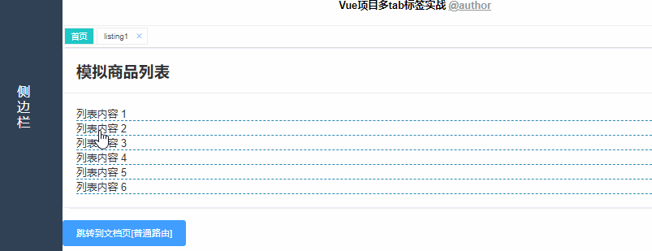
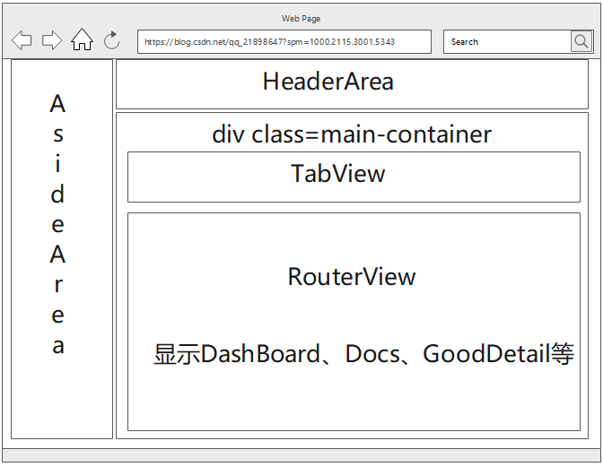

## 介绍

> 该工程是基于vue的动态路由案例，复用一个组件，打开多个tab标签页，实现商品类组件复用，可以多tab打开

## TODO

- [x]  base on vue-cli3 2019.9.21

## 特性

- [x] 复用组件多tab打开
- [x] 刷新动态路由页面不丢失
- [x] 支持路由传参
- [x] 修复刷新时，动态路由参数丢失
- [x] 删除tab页签(包含注入的动态路由)
- [x] 功能实现文档编写
- [ ] 代码优化，整合，方便快速部署该功能
- [ ] 代码Eslint 规则修改，消除warning

## 预览



代码地址：https://gitee.com/codinginn/public-code-storage/tree/master/vue-multiple-tabs-master

## 代码详细说明

### 设计vuex的存储结构并编写相关工具函数

安装Vuex,然后再src下新建store.js文件，并在store.js中添加pageOpendList数组，用来存储导航栏的路由信息，同时定义操作pageOpendList的函数，分别是用于初始化设置值tab的setOpenedList函数、路由调用后的钩子函数用于更新pageOpendList参数的函数setPageOpendList、路由调用后的钩子函数用于给pageOpendList动态新增路由的函数increateTag以及关闭标签页调用的closeOpendList函数，具体代码如下：

```js
import Vue from "vue";
import Vuex from "vuex";
import { storeSetting } from "./utils/config";

Vue.use(Vuex);

// 本地存储sessionStorage键值
const { storeName } = storeSetting

const state = {
  /**
   * 默认tabview 首页
   */
  pageOpendList: [
    {
      path: "/dashboard",
      name: "dashboard_index",
      component: () => import("@views/DashBoard"),
      meta: {
        title: "首页",
        isTabView: true
      }
    }
  ]
};
const mutations = {
  /**
   * 初始化设置tab 一般默认首页,页面加载时调用
   * @method tabOpendListInit
   */
  setOpenedList(state) {
    const local =
      sessionStorage[storeName] &&
      JSON.parse(sessionStorage[storeName]).length > 0;
    if (local) {
      state.pageOpendList = JSON.parse(sessionStorage[storeName]);
    }
  },
  /**
   * 路由调用前的钩子函数，用于更新参数
   * @method setPageOpendList
   */
  setPageOpendList(state, res) {
    const { index, query, params, meta, path } = res;
    let opendPage = state.pageOpendList[index];
    if (params) {
      opendPage.params = params;
    }
    if (query) {
      opendPage.query = query;
    }
    if (meta) {
      opendPage.meta = meta;
    }
    if (path) {
      opendPage.path = path;
    }
    state.pageOpendList.splice(index, 1, opendPage);
    sessionStorage[storeName] = JSON.stringify(state.pageOpendList);
  },
  //tabview中新增打开的页面
  increateTag(state, tag) {
    state.pageOpendList.push(tag);
  },
  /**
   * @param {*} state
   * @param {当前页签信息} obj
   * @param { 当前实例 } obj.vm
   * @param { 路由name} obj.name
   */
  closeOpendList(state, obj) {
    // 临时解决方案 后续再完善
    const lists = state.pageOpendList;
    if (obj.name === "dashboard_index") {
      return;
    }
    for (let i = 0; i < lists.length; i++) {
      if (lists[i].name === obj.name) {
        const lastName = state.pageOpendList[i - 1].name;
        state.pageOpendList.splice(i, 1);
        sessionStorage.setItem(
          storeName,  
          JSON.stringify(state.pageOpendList)
        );
        obj.vm.$router.push({
          name: lastName
        });
      }
    }
  }
};

const store = new Vuex.Store({
  state,
  mutations
});

export default store;
```

其中utils目录存放的是项目的工具函数，包括动态插入路由insertRouter、动态移除路由removeRouter以及刷新路由refreshRouterSync等。config.js中配置了本地存储sessionStorage的键。base.js中编写了路由完成后的回调函数addOpendPage，用于给store.js中的变量pageOpendList更新或添加路由。index.js中配置了给外部使用的工具函数。具体代码分别如下：

+ utils/dynamic-router/delete-local-router.js

```js
import { storeSetting } from "../config";

/**
 * @param {name} 动态路由编号，提交后删除本地存储的路由
 */
export const deleteLocalRouter = name => {
  const { dynamicName } = storeSetting;
  const localRoutes =
    sessionStorage.getItem(dynamicName) &&
    JSON.parse(sessionStorage.getItem(dynamicName));
  if (localRoutes && localRoutes.length > 0) {
    for (let i = 0; i < localRoutes.length; i++) {
      if (localRoutes[i].name === name) {
        //splic删除一个元素
        localRoutes.splice(i, 1);
        sessionStorage.setItem(dynamicName, JSON.stringify(localRoutes));
        break;
      }
    }
  }
};
```

+ utils/dynamic-router/insert-router.js

```js
import Main from "@views/Main.vue";
//引入如果没有定义则会作export default的对象使用
import configMapping from "../config";

import { storeSetting } from "../config";

const { dynamicName } = storeSetting;
// const { storeName } = storeSetting;
//log
const addRouter = param => {
  const vm = param.vm;
  const com = param.com;
  const name = param.name;
  const params = param.params;
  const query = param.query;
  const component = param.component;
  //新的路由
  const tab = {
    name: name,
    path: "/" + name,
    component: component,
    //meta存储当前路由下可用的信息，访问方式为：$route.meta.xxxx
    meta: {
      component: com,
      title: name,
      isTabView: true,
      params,
      query
    }
  };
  /**
   * 动态路由
   */
  // 判断是否已经存在该路由
  let flag = false;
  const routes = [];
  //对应路径的动态路由，增量式，不会覆盖"/"之前的内容
  const routerItem = {
    path: "/",
    name: dynamicName,
    component: Main,
    children: []
  };
  // Stroage.setitem(key,value)保存数据；
  // sessionStroage.getitem(key)获取数据；
  //JSON.parse()可以把JSON规则的字符串转换为JSONObject
  //() && () 如果前面为ture，赋值为后面的变量
  //() || () 如果前面为false 赋值为后面的变量
  const dynamic =
    (sessionStorage.getItem(dynamicName) &&
      JSON.parse(sessionStorage.getItem(dynamicName))) ||
    [];
  if (dynamic.length > 0) {
    const len = dynamic.length;
    for (let i = 0; i < len; i++) {
      if (dynamic[i].name === name) {
        flag = true;
        break;
      }
    }
  }
  /**
   * 如果未打开，则新增路由
   */
  if (!flag) {
    routerItem.children.push(tab);
    routes.push(routerItem);
    dynamic.push(tab);
    //JSON.stringify 对象转成JSON字符串
    sessionStorage.setItem(dynamicName, JSON.stringify(dynamic));
    //增量式添加路由
    vm.$router.addRoutes(routes);
  }
  /**
   * 跳转路由
   */
  vm.$router.push({
    name: name,
    params,
    query
  });
};

/**
 * 这里只是针对一个组件进行复用，可根据业务进行动态传入组件name
 * 具体请看@/pages/DashBoard/index.vue 具体用法
 * @param {路由信息对象} message
 */
export const insertRouter = (message) => {
  var obj = {
    vm: message.vm,
    //组件的名字为GoodDetail，需要写详细的组件地址
    component: configMapping[message.component],
    com: message.com,
    name: message.name,
    params: message.params,
    query: message.query
  };
  //增量式添加路由
  addRouter(obj);
};
```

+ utils/dynamic-router/refresh-router.js

```js
import Main from "@views/Main.vue";
import configMapping from "../config";
import { storeSetting } from "../config";

const { dynamicName } = storeSetting;

/**
 * 防止页面刷新时， 路由丢失问题
 * @param { routerMap } 动态路由模板映射
 * @param { routes } 空数组，因为addRoutes只支持数组
 * @param { childrens } children 不多解释
 * @param {当前实例} vm
 */
export const refreshRouterSync = vm => {
  // 此处正则提取的是路由的文件夹名，请注意，是为了map映射取key, 会得到GoodDetail
  // GoodDetail: () => import('@views/GoodDetail/GoodDetail.vue')
  const dynamic =
    (sessionStorage.getItem(dynamicName) &&
      JSON.parse(sessionStorage.getItem(dynamicName))) ||
    [];
  const routes = [];
  const routerItem = {
    path: "/",
    name: dynamicName,
    component: Main,
    children: []
  };
  if (dynamic.length > 0) {
    for (let i = 0; i < dynamic.length; i++) {
      //组件的全路径
      const FullPath = dynamic[i].meta.component;
      const mapName = FullPath.substring(
        FullPath.lastIndexOf("/") + 1,
        FullPath.lastIndexOf(".")
      );
      dynamic[i].component = configMapping[mapName];
      routerItem.children.push(dynamic[i]);
    }
    routes.push(routerItem);
    //动态添加路由
    vm.$router.addRoutes(routes);
  }
};
```

+ utils/dynamic-router/remove-router.js

```js
import { resetRouter } from "./reset-router";
import { deleteLocalRouter } from "./delete-local-router";
import { refreshRouterSync } from "./refresh-router";
import store from "@/store";

export function removeRouter(vm, name) {
  deleteLocalRouter(name);
  //重新设置路由表
  //设置为@/router/routes.js中配置的路由
  resetRouter(vm);
  //添加动态路由
  refreshRouterSync(vm);
  store.commit("closeOpendList", {
    vm,
    name
  });
}
```

+ utils/dynamic-router/reset-router.js

```js
import VueRouter from "vue-router";
//相当于export default对应的对象
import mainRoutes from "@/router/routes";

export const resetRouter = vm => {
  //获取@/router/routes中所有的路由信息
  const routes = [...mainRoutes];
  let newRouter = new VueRouter({
    // mode: "hash",
    routes
  });

  //重新初始化静态路由表
  vm.$router.matcher = newRouter.matcher;
};
```

+ utils/base.js

```js
import store from "@/store";
export default {
  /**
   * @method addOpendPage
   * @param vm 当前实例
   * @param name 当前路由name
   * @param query 查询参数
   * @param param 查询参数
   * 一般放在router BeforeAfter(BeforeEach) 执行
   */
  addOpendPage: (vm, name, params = "", query = "", meta = "", path = "") => {

    let pageOpendList = store.state.pageOpendList;
    let opendLen = pageOpendList.length;
    let i = 0;
    let tagHasOpened = false;
    if (opendLen > 0) {
      for (; i < opendLen; i++) {
        if (name === pageOpendList[i].name) {
          vm.$store.commit("setPageOpendList", {
            index: i,
            params,
            query,
            meta
          });
          tagHasOpened = true;
          break;
        }
      }
    }
    /**
     * 注入参数
     */
    if (!tagHasOpened && name) {
      let tag = {
        name: name
      };
      if (params) {
        tag.params = params;
      }
      if (query) {
        tag.query = query;
      }
      if (meta && meta.isTabView) {
        tag.meta = meta;
      } else if (meta && !meta.isTabView) {
        return;
      }
      if (path) {
        tag.path = path;
      }
      store.commit("increateTag", tag);
    }
  }
};
```

+ utils/config.js

```js
/**
 * @storeSetting
 * 本地存储sessionStorage的键
 * @param {storeName} String 打开tab的本地存储name
 * @param {dynamicName} String 打开tab的动态路由存储name
 */
export const storeSetting = {
  storeName: "tab-view-router-list",
  dynamicName: "dynamic-router-list"
};

/**
 * @description
 * 动态路由配置在此处
 * 可以全局使用
 */
export default {
  GoodDetail: () => import("@views/GoodDetail/GoodDetail.vue")
};
```

+ utils/index.js

```js
import { removeRouter } from "./dynamic-router/remove-router";
import { insertRouter } from "./dynamic-router/insert-router";
import { refreshRouterSync } from "./dynamic-router/refresh-router";

export default {
  removeRouter,
  insertRouter,
  refreshRouterSync
};
```

### 设置路由文件

在src目录下新建文件夹router用于存放路由信息，并在router文件夹中新建index.js以及routes.js文件，index.js用于配置路由信息，包括路由前以及路由后调用的钩子函数，routes.js中配置具体的路由信息，代码如下：

+ router/index.js

```js
import Vue from "vue";
import VueRouter from "vue-router";
import utils from "@/utils/base";
import routes from "./routes";

Vue.use(VueRouter);

const router = new VueRouter({
  mode: "hash",
  routes
});

//路由前调用
//to是跳转到的路由，from是跳转前的路由，next是表示的是路由是否放行，常用的有next(true)和next(false)
router.beforeEach((to, from, next) => {
  next();
});

//路由完成后调用
router.afterEach((to, from, next) => {
  utils.addOpendPage(
    router.app,
    to.name,
    to.params,
    to.query,
    to.meta,
    to.path
  );
});

export default router;
```

+ router/routes.js

```js
/**
 * @param isTabView 是否放入Tabs管理
 */
export default [
  {
    path: "/",
    // name: "home_index",
    name: "home_index",
    //对应的主页面是Main.vue,在Main.vue默认显示/dashboard
    component: () => import("@views/Main.vue"),
    redirect: "/dashboard",
    children: [
      {
        path: "dashboard",
        name: "dashboard_index",
        component: () => import("@views/DashBoard/index.vue"),
        meta: {
          isTabView: true,
          title: "首页"
        }
      },
      {
        path: "docs",
        name: "docs_index",
        component: () => import("@views/Docs/index.vue"),
        meta: {
          isTabView: true,
          title: "文档使用"
        }
      }
    ]
  }
];
```

### 编写容器页面

分别编写DashBoard、HeaderArea、AsideArea、TabView、GoodDetail、Docs等页面组件，页面布局如下图所示：



+ App.vue

```js
<template>
  <div id="app">
    <router-view></router-view>
  </div>
</template>

<script>
import utils from "./utils";
export default {
  name: "app",
  data() {
    return {};
  },
  beforeCreate() {
    utils.refreshRouterSync(this);
    //setTimeout(f,0)为了手动调配优先级不高的代码靠后执行,将该语句添加到运行队列的队尾
    setTimeout(() => {
      this.$store.commit("setOpenedList");
    }, 0);
  }
};
</script>

<style lang="scss">
* {
  margin: 0;
  padding: 0;
  box-sizing: border-box;
}
html,
body {
  width: 100%;
  height: 100%;
}

#app {
  font-family: "Avenir", Helvetica, Arial, sans-serif;
  -webkit-font-smoothing: antialiased;
  -moz-osx-font-smoothing: grayscale;
  width: 100%;
  height: 100%;
}
</style>
```

+ Main.vue

```js
<template>
  <div class="main-wrapper">
    <header-area></header-area>
    <aside-area></aside-area>
    <div class="main-container">
<!--      tabview栏区域-->
      <tab-view></tab-view>
<!--      右下角的路由区域-->
      <router-view></router-view>
    </div>
  </div>
</template>
<script>
import HeaderArea from "./HeaderArea";
import AsideArea from "./AsideArea";
import TabView from "./TabView";
export default {
  data() {
    return {};
  },
  components: {
    HeaderArea,
    AsideArea,
    TabView
  },
  methods:{
  }
};
</script>
<style lang="scss">
.main-wrapper {
  width: 100%;
  height: 100%;
  .main-container {
    margin-left: 120px;
  }
  @media screen and (max-width: 800px) {
    .main-container {
      margin-left: 0;
    }
  }
}
</style>
```

+ HeaderArea

```js
<template>
  <div class="header-container">
    Vue项目多tab标签实战
    <a href="https://gitee.com/codinginn" target="_blank"
      >@author</a
    >
  </div>
</template>

<style lang="scss" scoped>
.header-container {
  height: 60px;
  line-height: 60px;
  text-align: center;
  margin-left: 120px;
  background-color: #fff;
  color: #000;
  font-weight: bold;
  box-shadow: 0 1px 3px 0 rgba(0, 0, 0, 0.12), 0 0 3px 0 rgba(0, 0, 0, 0.04);
  a {
    color: #999;

    &:hover {
      color: #1fc7c7;
    }
  }

  @media screen and (max-width: 800px) {
    margin-left: 0;
  }
}
</style>
```

+ AsideArea

```js
<template>
  <div class="aside-container">
    <div class="aside-container__text">侧边栏</div>
  </div>
</template>

<style lang="scss" scoped>
.aside-container {
  position: fixed;
  top: 0;
  left: 0;
  width: 120px;
  height: 100%;
  color: #fff;
  background-color: #304156;
  text-align: center;
  padding-top: 150px;

  &__text {
    width: 20px;
    margin: 0 auto;
    line-height: 24px;
    font-size: 20px;
  }
}
@media screen and (max-width: 800px) {
  .aside-container {
    display: none;
  }
}
</style>
```

+ TabView

```js
<template>
  <div class="tag-view-wrap">
    <el-tag
      class="tag-view"
      v-for="item in tagList"
      :key="item.id"
      :class="{ active: item.name === $route.name }"
      @click.native="jump(item)"
      @close="close(item.name)"
      :closable="item.name !== 'dashboard_index'"
    >
      {{ item.meta.title }}
    </el-tag>
  </div>
</template>

<script>
import utils from "@/utils";
export default {
  computed: {
    tagList() {
      return this.$store.state.pageOpendList;
    }
  },
  methods: {
    jump(item) {
      const { params, query } = item;
      /**
       * @description
       * 下面四种情况考虑到参数传递的问题，所以单独处理
       */
      if (params) {
        this.$router.push({
          name: item.name,
          params: params
        });
        return;
      }
      if (query) {
        this.$router.push({
          name: item.name,
          query: query
        });
        return;
      }
      if (query && params) {
        this.$router.push({
          name: item.name,
          params: params,
          query: query
        });
        return;
      }
      this.$router.push({
        name: item.name
      });
    },
    close(name) {
      utils.removeRouter(this, name);
    }
  }
};
</script>

<style lang="scss">
.tag-view-wrap {
  padding: 4px 0;
  border-bottom: 1px solid rgb(230, 230, 230);
  .tag-view {
    border-radius: 0;
    margin: 0 2px;
    border: 1px solid #eee;
    color: #495060;
    height: 26px;
    line-height: 26px;
    background-color: #fff;
    transition: all 0.2s;
    cursor: pointer;
    &.active {
      background-color: #1fc7c7;
      color: #fff;
      .el-tag__close {
        color: #fff;
      }
    }
  }
}
</style>
```

+ DashBoard

```js
<template>
  <div class="dash-board">
    <el-card class="box-card">
      <div slot="header" class="clearfix">
        <h2>模拟商品列表</h2>
      </div>
      <div v-for="o in 6" :key="o" class="text-item" @click="jump(o)">
        {{ "列表内容 " + o }}
      </div>
    </el-card>
    <br />
    <el-button type="primary" @click="goToDocs">跳转到文档页[普通路由]</el-button>
  </div>
</template>

<script>
import utils from "@/utils";
export default {
  data() {
    return {};
  },
  methods: {
    jump(o) {
      const name = "listing" + o;
      /**
       * @param { 当前实例 } vm
       * @param { 当前动态路由模板名字 } component
       * @param { 临时缓存组件地址 } com
       * @param { 路由name } name
       * @param { 具体传参数 } params
       * @param { 查询参数 } query
       */
      var obj = {
        vm: this,
        component: "GoodDetail",
        com: "@views/GoodDetail/GoodDetail.vue",/*存储在meta中，表示主键的详细地址*/
        name: name,//tab标签名
        params: {
          id: o
        },
        query: {}
      };
      //插入路由
      utils.insertRouter(obj);
    },
    goToDocs() {
      this.$router.push({
        name: "docs_index"
      });
    }
  }
};
</script>

<style lang="scss" scoped>
.text-item {
  border-bottom: 1px dashed rgb(44, 136, 179);
  cursor: pointer;
}
</style>
```

+ GoodDetail

```js
<template>
  <div class="good-detail">
    <h2>我是组件GoodDetail.vue</h2>
    <h3>商品编号 {{ $route.meta.params.id }}</h3>
  </div>
</template>

<script>
export default {
  mounted() {
  }
};
</script>

<style scoped>
.good-detail {
  padding: 20px;
}
</style>
```

+ Docs

```js
<template>
  <div class="docs-container">
    <el-card class="box-card">
      <div slot="header" class="clearfix">
        <span>普通路由</span>
      </div>
      <div>
        常规（未复用的组件）路由直接在路由表配置
      </div>
    </el-card>
    <el-card class="box-card">
      <div slot="header" class="clearfix">
        <span>动态路由</span>
      </div>
      <div>
        动态路由(需要复用的组件)，路由需要在utils/config配置,使用utils(utils/dunamic-router)导出的方法进行跳转，删除.具体请看Dashboard/ 组件 有两种使用方式
      </div>
    </el-card>
  </div>
</template>

<style lang="scss" scoped>
.docs-container {
  display: flex;
  justify-content: space-between;
  padding: 20px;

  .box-card {
    width: 50%;
    margin: 0 10px;
  }
}
</style>
```

